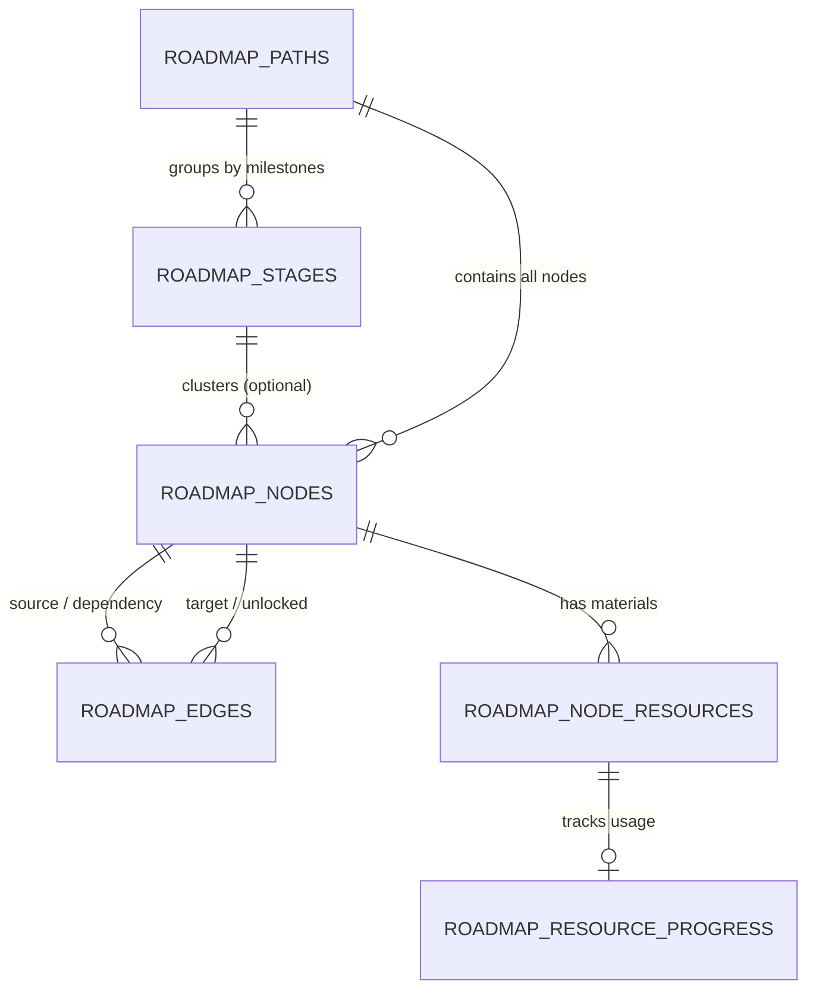
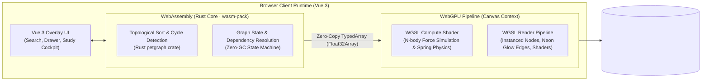
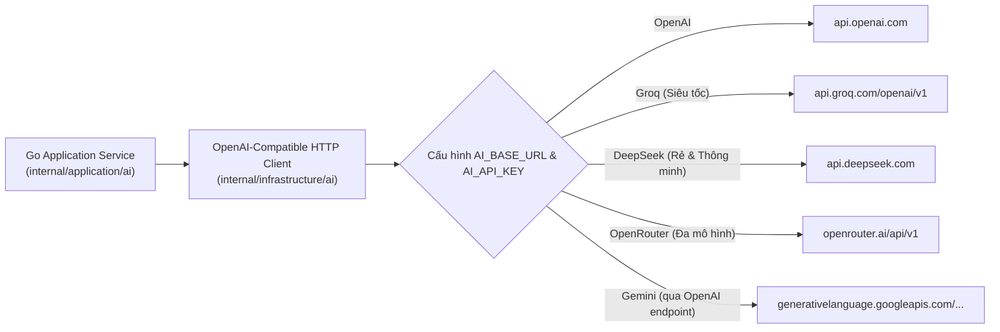
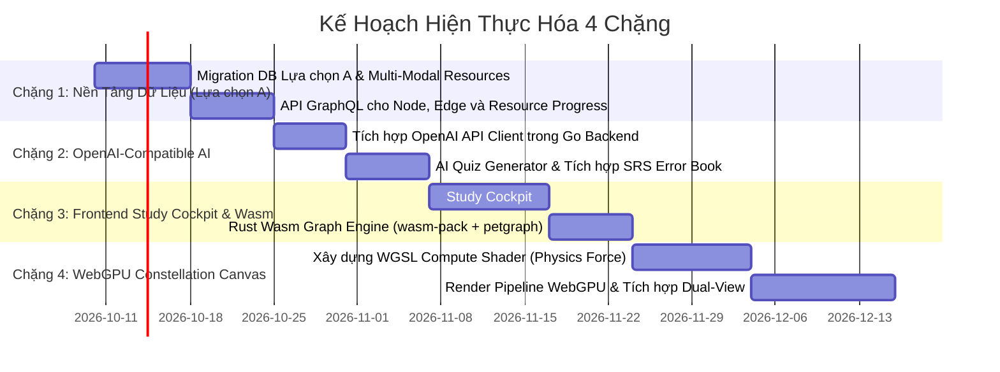

# Universal Knowledge Graph & AI-Driven Learning Platform
## Architectural Evolution Blueprint: From Language App to Domain-Agnostic Learning Ecosystem

> **Document Type:** Architectural Review, Brainstorming Blueprint & Technical Strategy  
> **Target System:** `roadmap-learning` (`langapp` core)  
> **Status:** Confirmed Architecture & Technical Roadmap  
> **Key Decisions:** Data Model Choice A (Hybrid Stage + DAG), WebGPU/Wasm High-Perf Graph Canvas, OpenAI-Compatible LLM Gateway  

---

## 1. Hiện Trạng & Đánh Giá Kiến Trúc Hiện Tại (System Audit)

### 1.1 Những Điểm Mạnh Cần Kế Thừa (Core Strengths to Retain)
Kiến trúc hiện tại của dự án sở hữu nền tảng công nghệ rất vững vàng, tuân thủ Clean Architecture và Domain-Driven Design (DDD):
1. **Clean Architecture 4 tầng phân lập rõ ràng:**
   - `Transport` (Gin HTTP, gqlgen GraphQL, dataloadgen batching).
   - `Platform` (DI wiring, `txtx` Unit of Work, PostgreSQL + GORM/pgx pool).
   - `Application` & `Domain` (Pure business invariants: FSRS, status policies, layout geometry).
   - `Infrastructure` (Repository patterns, GORM persistence, gRPC client sidecars).
2. **Thuật toán Spaced Repetition (SRS) FSRS mạnh mẽ:**
   - Hệ thống thẻ nhớ (`cards`), lượt ôn (`reviews`), độ ổn định (`stability`), độ khó (`difficulty`) hoàn toàn **không bị trói buộc vào ngôn ngữ**. Nó dùng hoàn hảo cho công thức tài chính, phím tắt IDE, cú pháp Go/Rust, kiến trúc hệ thống, v.v.
3. **Mô hình Đồng Bộ Dữ Liệu Local-First (LWW Sync):**
   - Hợp đồng toàn bộ bảng mutable đều có `guid`, `created_at`, `updated_at`, `deleted` cùng cơ chế trigger PostgreSQL tự động cập nhật timestamp UTC, hỗ trợ snapshot JSON export/import offline.
4. **Bản Đồ Canvas Trực Quan Hóa (Roadmap Map):**
   - Thuật toán tính toán toạ độ hình sin (`ComputeLayout`), phân chia biomes/terrains (`meadow`, `desert`, `volcano`...), trạng thái mở khóa (`DONE`, `CURRENT`, `LOCKED`) mang lại trải nghiệm gamified học tập trực quan hiếm có.

### 1.2 Những Nút Thắt Khi Mở Rộng Ra Mọi Lĩnh Vực (Architectural Bottlenecks)

| Thành phần | Hiện trạng trong codebase | Định hướng nâng cấp đã chốt |
|---|---|---|
| **Mô hình Dữ liệu Roadmap** | Tuyến tính 5 tầng (`Path` $\to$ `Stage` $\to$ `Topic` $\to$ `Resource`). | **Lựa chọn A:** Giữ nguyên `Path` & `Stage` làm đơn vị gom cụm (Milestone Clusters), bổ sung bảng `roadmap_edges` hỗ trợ quan hệ Directed Acyclic Graph (DAG). |
| **Hệ thống Tài Nguyên (Resources)** | Bảng `roadmap_resources` chỉ lưu `url`, `title`, `kind`, `note` cơ bản. | Mở rộng thành **Multi-Modal Resource Center**: PDF (theo dõi số trang), Video (timestamp notes), Markdown notebook, Code links kèm tiến độ chi tiết. |
| **Giao Diện Đồ Thị** | Render SVG tĩnh trên DOM, giới hạn hiển thị tuyến tính. | **Dual Canvas:** Giữ SVG Winding Map cho lộ trình tuần tự, bổ sung **WebGPU & WebAssembly (Wasm)** đồ thị mạng nhện cho đồ thị tri thức quy mô lớn. |
| **Hạ Tầng AI** | Chưa có tầng LLM. | Tích hợp **OpenAI-Compatible LLM Gateway** (hỗ trợ OpenAI, Groq, DeepSeek, Gemini, OpenRouter) sinh roadmap, quiz và socratic tutor. |

---

## 2. Mô Hình Dữ Liệu Lựa Chọn A: Đồ Thị Tri Thức Kết Hợp Cụm Giai Đoạn (Hybrid Stage + DAG)

Lựa chọn A đảm bảo **tính tương thích ngược 100%** với các lộ trình cũ (English, Chinese) đồng thời mở rộng không giới hạn cho mọi ngành học (Coding, Finance, Science).



### 2.1 Ý Nghĩa Của Kiến Trúc Lai (Hybrid Architecture)
- **`roadmap_stages` đóng vai trò là "Chương / Milestone Cluster / Biome":**
  - Không còn là "chiếc lồng cứng ép tuần tự", mà đóng vai trò là vùng bao (Boundary/Cluster) nhóm các kiến thức liên quan lại với nhau (ví dụ: Stage 1 = *Cơ sở dữ liệu*, Stage 2 = *Lập trình đồng thời*).
  - Giữ lại trường `terrain` (`meadow`, `desert`...) để phục vụ giao diện Journey Map.
- **`roadmap_edges` giải quyết logic mở khóa thực tế (Graph Dependencies):**
  - Một Node trong Stage 2 có thể phụ thuộc vào 1 Node trong Stage 1 và 1 Node độc lập khác.
  - Các loại quan hệ:
    - `REQUIRES` (Bắt buộc tiên quyết: Hoàn thành Node A mới mở khóa Node B).
    - `RECOMMENDS` (Khuyến nghị: Hữu ích nhưng không chặn tiến độ).
    - `BRANCHES_TO` (Phân nhánh tự chọn: Ví dụ chọn học *SQL* hoặc *NoSQL*).
    - `RELATES_TO` (Liên kết khái niệm chéo giữa các lĩnh vực).

---

## 3. Ứng Dụng WebGPU & WebAssembly (Wasm) Cho Frontend Graph Visualization

Bạn hoàn toàn có cơ hội và đây là **trường hợp ứng dụng kinh điển (Ideal Use Case)** để áp dụng WebGPU và WebAssembly:



### 3.1 WebAssembly (Rust $\to$ Wasm): Engine Đồ Thị Hiệu Năng Cao
Lựa chọn **Rust $\to$ Wasm (`wasm-pack` / `wasm-bindgen`)** vượt trội hoàn toàn so với Go $\to$ Wasm trong use-case này:
- **Dung lượng siêu nhẹ (Ultra-compact Binary):** Go Wasm kèm theo GC runtime nặng ~5–10MB, trong khi Rust không có GC, binary Wasm sau khi tối ưu qua `wasm-opt` chỉ nặng **~80–150KB**, tải tức thì trên trình duyệt.
- **Không có độ trễ Garbage Collection (Zero GC Pauses):** Đảm bảo duy trì ổn định 60–120 FPS khi tương tác kéo thả đồ thị mà không bao giờ bị giật lag (frame drop) do GC dọn dẹp bộ nhớ.
- **Tận dụng Crate Hệ Sinh Thái Rust:** Sử dụng thư viện đồ thị chuẩn mực [`petgraph`](https://crates.io/crates/petgraph) (xử lý DAG, Cycle Detection, Kahn's Topological Sort, Condensation) và [`glam`](https://crates.io/crates/glam) (tính toán vector ma trận siêu tốc).
- **Zero-Copy Memory Bridge sang WebGPU:** Rust Wasm ghi trực tiếp toạ độ node vào bộ nhớ tuyến tính (Linear Memory), JavaScript chỉ việc ánh xạ ra `Float32Array` và đẩy thẳng vào WebGPU Uniform/Storage Buffer mà không qua bước sao chép dữ liệu tốn kém.

### 3.2 WebGPU: Mô Phỏng Vật Lý & Render Đồ Thị Vượt Trội So Với SVG/Canvas 2D
- **Vấn đề của SVG / DOM truyền thống:**
  - Khi đồ thị tri thức có hàng trăm node và hàng nghìn cạnh kết nối, DOM bị nghẽn (CPU-bound bottleneck), kéo/zoom/pan bị giật lag (<20 FPS).
- **Giải pháp WebGPU:**
  1. **WGSL Compute Shader (Mô phỏng lực vật lý song song):**
     - Đồ thị tri thức dạng mạng nhện cần tự động dàn trang (Force-Directed Graph: lực đẩy Coulomb giữa các node và lực kéo lò xo Hooke giữa các cạnh).
     - Trên CPU, thuật toán $O(N^2)$ sẽ nghẽn khi $N > 300$.
     - Với WebGPU Compute Shader, GPU tính toán song song hàng nghìn vị trí node cùng lúc ở **60-120 FPS**.
  2. **WGSL Render Pipeline (Instanced Rendering & Hiệu Ứng Thẩm Mỹ):**
     - Render hàng nghìn node chỉ bằng **1 draw call** duy nhất (`drawIndexedInstanced`).
     - Vẽ đường cong Bézier phát sáng (Glow/Neon effect), hiệu ứng hạt chuyển động biểu thị "dòng chảy tri thức" (knowledge flow), tạo cảm giác như một vũ trụ tri thức (Constellation Map) cực kỳ ấn tượng.

---

## 4. Hạ Tầng AI Agent: OpenAI-Compatible Gateway

Toàn bộ backend Go sẽ giao tiếp với các mô hình ngôn ngữ lớn thông qua **một interface tiêu chuẩn tương thích chuẩn OpenAI (`/v1/chat/completions`)**.



### 4.1 Cấu Hình Đơn Giản Trong `internal/platform/config.go`
```go
type AIConfig struct {
    BaseURL string `env:"AI_BASE_URL" envDefault:"https://api.openai.com/v1"`
    APIKey  string `env:"AI_API_KEY"`
    Model   string `env:"AI_MODEL" envDefault:"gpt-4o-mini"`
    Timeout time.Duration `env:"AI_TIMEOUT" envDefault:"60s"`
}
```

### 4.2 Các Use-Case Cốt Lõi Của AI Trong Ứng Dụng
1. **Auto-Generate Roadmap (Curriculum Synthesizer):**
   - Prompt gửi yêu cầu + JSON Schema trả về danh sách `nodes` và `edges` có cấu trúc nghiêm ngặt.
   - Go backend kiểm tra tính hợp lệ bằng Wasm/Go Cycle Detector trước khi nạp vào DB.
2. **AI Socratic Quiz Engine:**
   - Đọc tiêu đề, tài liệu và ghi chú của Node $\to$ sinh 3 câu hỏi trắc nghiệm/tự luận ngắn.
   - Tự động chuyển câu làm sai thành thẻ nhớ **FSRS Flashcard** vào Error Book.
3. **Contextual Copilot & Explanation:**
   - Trả lời thắc mắc, tóm tắt tài liệu PDF/Video của node qua Streaming Server-Sent Events (SSE).

---

## 5. Thiết Kế Cơ Sở Dữ Liệu Chi Tiết (PostgreSQL Migration Script)

```sql
-- 1. Bảng Domain / Lĩnh vực (Coding, Finance, Languages, v.v.)
CREATE TABLE IF NOT EXISTS roadmap_domains (
    id BIGSERIAL PRIMARY KEY,
    guid TEXT NOT NULL UNIQUE DEFAULT '',
    slug TEXT NOT NULL UNIQUE,
    name TEXT NOT NULL,
    icon TEXT NOT NULL DEFAULT 'book',
    description TEXT NOT NULL DEFAULT '',
    created_at TEXT NOT NULL,
    updated_at TEXT NOT NULL DEFAULT '',
    deleted INTEGER NOT NULL DEFAULT 0
);

-- 2. Bổ sung domain cho roadmap_paths (Vẫn giữ stages)
ALTER TABLE roadmap_paths 
    ADD COLUMN IF NOT EXISTS domain_id BIGINT REFERENCES roadmap_domains(id) ON DELETE SET NULL,
    ADD COLUMN IF NOT EXISTS difficulty_level TEXT NOT NULL DEFAULT 'beginner';

-- 3. Bảng Node Tri Thức (Tương thích với topic cũ)
CREATE TABLE IF NOT EXISTS roadmap_nodes (
    id BIGSERIAL PRIMARY KEY,
    guid TEXT NOT NULL UNIQUE DEFAULT '',
    path_id BIGINT NOT NULL REFERENCES roadmap_paths(id) ON DELETE CASCADE,
    stage_id BIGINT REFERENCES roadmap_stages(id) ON DELETE SET NULL,
    slug TEXT NOT NULL,
    title TEXT NOT NULL,
    description TEXT NOT NULL DEFAULT '',
    status TEXT NOT NULL DEFAULT 'not_started' CHECK (status IN ('not_started', 'in_progress', 'done', 'skipped')),
    status_note TEXT NOT NULL DEFAULT '',
    estimated_minutes INTEGER NOT NULL DEFAULT 30,
    is_optional INTEGER NOT NULL DEFAULT 0,
    map_x REAL,
    map_y REAL,
    completed_at TEXT,
    created_at TEXT NOT NULL,
    updated_at TEXT NOT NULL DEFAULT '',
    deleted INTEGER NOT NULL DEFAULT 0,
    CONSTRAINT ux_roadmap_nodes_path_slug UNIQUE (path_id, slug)
);

-- 4. Bảng Cạnh Đồ Thị (DAG Dependencies)
CREATE TABLE IF NOT EXISTS roadmap_edges (
    id BIGSERIAL PRIMARY KEY,
    guid TEXT NOT NULL UNIQUE DEFAULT '',
    path_id BIGINT NOT NULL REFERENCES roadmap_paths(id) ON DELETE CASCADE,
    source_node_id BIGINT NOT NULL REFERENCES roadmap_nodes(id) ON DELETE CASCADE,
    target_node_id BIGINT NOT NULL REFERENCES roadmap_nodes(id) ON DELETE CASCADE,
    edge_type TEXT NOT NULL DEFAULT 'requires' CHECK (edge_type IN ('requires', 'recommends', 'branches_to', 'relates_to')),
    condition_rule TEXT NOT NULL DEFAULT '',
    created_at TEXT NOT NULL,
    updated_at TEXT NOT NULL DEFAULT '',
    deleted INTEGER NOT NULL DEFAULT 0,
    CONSTRAINT ux_roadmap_edges_nodes UNIQUE (source_node_id, target_node_id, edge_type),
    CONSTRAINT ck_no_self_loop CHECK (source_node_id <> target_node_id)
);
CREATE INDEX IF NOT EXISTS idx_roadmap_edges_target ON roadmap_edges(target_node_id) WHERE deleted = 0;
CREATE INDEX IF NOT EXISTS idx_roadmap_edges_source ON roadmap_edges(source_node_id) WHERE deleted = 0;

-- 5. Bảng Tài Nguyên Đa Thể Loại & Tiến Độ
CREATE TABLE IF NOT EXISTS roadmap_node_resources (
    id BIGSERIAL PRIMARY KEY,
    guid TEXT NOT NULL UNIQUE DEFAULT '',
    node_id BIGINT NOT NULL REFERENCES roadmap_nodes(id) ON DELETE CASCADE,
    title TEXT NOT NULL,
    resource_type TEXT NOT NULL CHECK (resource_type IN ('url', 'video', 'pdf', 'markdown', 'code_repo', 'quiz', 'srs_deck')),
    uri TEXT,
    content_payload TEXT,
    metadata JSONB NOT NULL DEFAULT '{}'::jsonb,
    is_required INTEGER NOT NULL DEFAULT 1,
    position INTEGER NOT NULL DEFAULT 0,
    created_at TEXT NOT NULL,
    updated_at TEXT NOT NULL DEFAULT '',
    deleted INTEGER NOT NULL DEFAULT 0
);

CREATE TABLE IF NOT EXISTS roadmap_resource_progress (
    id BIGSERIAL PRIMARY KEY,
    guid TEXT NOT NULL UNIQUE DEFAULT '',
    resource_id BIGINT NOT NULL REFERENCES roadmap_node_resources(id) ON DELETE CASCADE,
    status TEXT NOT NULL DEFAULT 'not_started' CHECK (status IN ('not_started', 'in_progress', 'completed')),
    progress_percent REAL NOT NULL DEFAULT 0.0 CHECK (progress_percent >= 0.0 AND progress_percent <= 100.0),
    current_position_seconds INTEGER NOT NULL DEFAULT 0,
    current_page INTEGER NOT NULL DEFAULT 0,
    time_spent_seconds INTEGER NOT NULL DEFAULT 0,
    completed_at TEXT,
    created_at TEXT NOT NULL,
    updated_at TEXT NOT NULL DEFAULT '',
    deleted INTEGER NOT NULL DEFAULT 0,
    CONSTRAINT ux_resource_progress UNIQUE (resource_id)
);
```

---

## 6. Kế Hoạch Triển Khai Nâng Cấp (Execution Roadmap)


