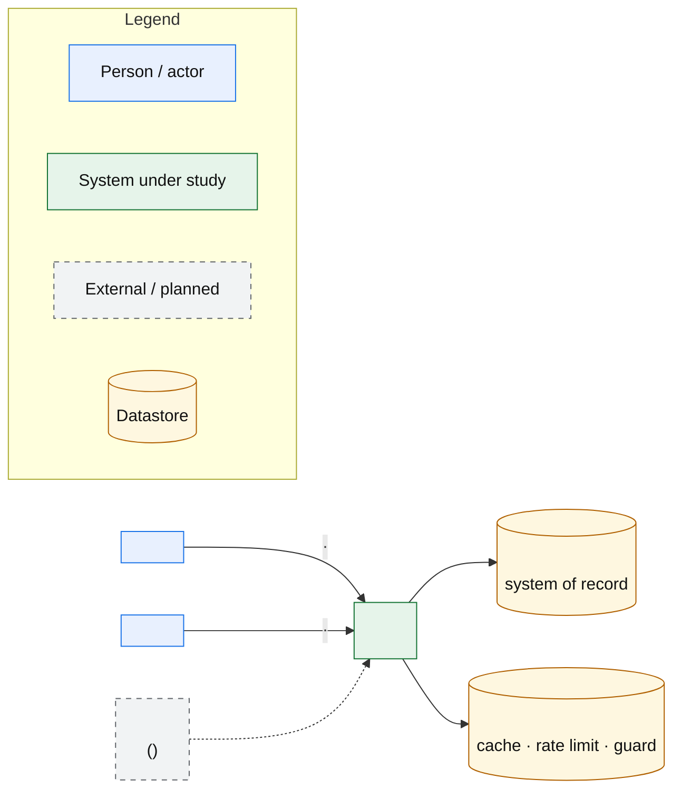

# System Context

> One-sentence description of the system, the surfaces it exposes, and the external systems it depends on.

## 1. Narrative

> Summarize the system in prose: what it is, the surfaces it exposes to each actor, and its trust and authentication model. Name the system of record and every non-authoritative shared store, and say what degrades when each is unavailable.

\<Prose overview of the system: what it is, the surfaces it exposes to each actor, and how it authenticates them. Name the system of record and any non-authoritative shared store, and state what degrades when each is unavailable.>

## 2. System context diagram

> Show the system as a single box with its actors, external systems, and datastores. Keep the Legend subgraph and the `classDef` color classes so the diagram reads the same as the other chapters.

## 3. Responsibilities

> List each element from the diagram, say exactly what it owns, and name the interface through which it is reached.

| Element     | Kind                                     | Responsibility   | Interface                  |
| ----------- | ---------------------------------------- | ---------------- | -------------------------- |
| `<Element>` | `<Person / System / External datastore>` | `<what it owns>` | `<interface / entrypoint>` |

## 4. Key properties

> State the load-bearing invariants a reader must not violate: trust boundaries, data ownership, and fail-open/fail-closed behavior. Cite the source for each.

- **\<Property>** — \<one line, with a source citation when the claim is load-bearing>.
- **\<Property>** — \<one line>.
- **\<Property>** — \<one line>.

## 5. References

> Link the entrypoints and the sibling chapters this chapter builds on.

- Entrypoints: `<path/to/source>`
- Related docs: [02 — Containers](02-containers.md), [03 — Components](03-components.md), [05 — Data Model](05-data-model.md)
