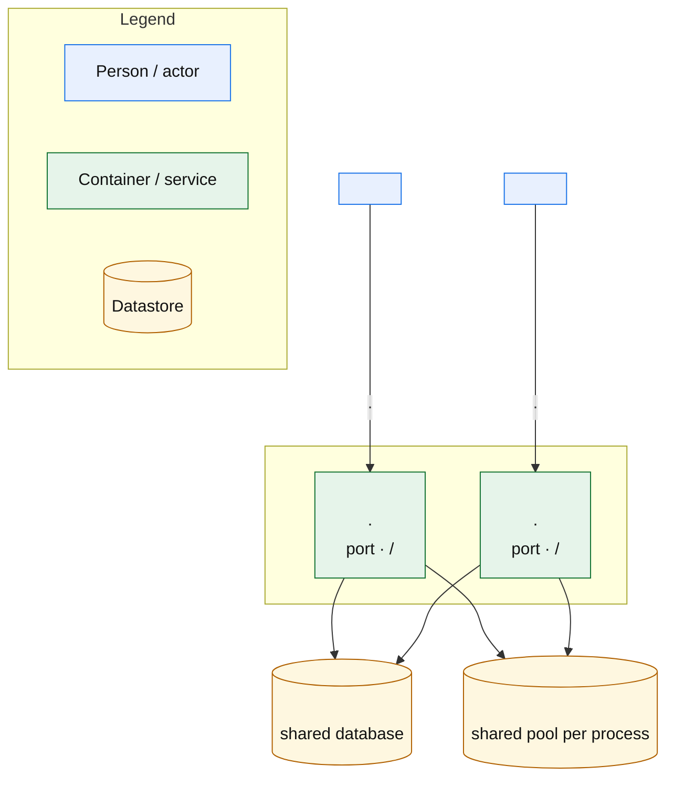

# Containers

> One-sentence description of the deployable processes, the ports and surfaces they expose, and the shared stores they use.

## 1. Container diagram

> Show each deployable process as its own box, with its actors, its mount segment, and the stores it shares. Keep the Legend subgraph and the `classDef` color classes.

## 2. Container inventory

> One row per deployable process: give its entrypoint, port, plane segment, mount prefix, and health route, then say where those facts come from.

| Container     | Entrypoint         | Port     | Plane segment | Mount prefix     | Health route                      |
| ------------- | ------------------ | -------- | ------------- | ---------------- | --------------------------------- |
| `<Container>` | `<path/to/source>` | `<port>` | `<segment>`   | `<mount prefix>` | `<mount prefix>/<segment>/health` |

\<State where ports, entrypoints, and mount prefixes come from: the deployment file and the plane registry.>

### Per-plane documentation routes

> Describe which documentation and health routes every process serves, and how a process that mounts one plane still answers for the others.

| Route                              | Path                                                | Served by                             |
| ---------------------------------- | --------------------------------------------------- | ------------------------------------- |
| Health                             | `<mount>/<segment>/health`                          | `<process(es)>`                       |
| Plane OpenAPI                      | `/<docs prefix>/<plane>.json`                       | `<process(es) when docs are enabled>` |
| Plane Swagger UI                   | `/<docs prefix>/<plane>`                            | `<process(es) when docs are enabled>` |
| Built-in OpenAPI / Swagger / ReDoc | `/<docs prefix>.json`, `/<docs prefix>`, `/<redoc>` | `<process(es) when docs are enabled>` |

> **Production caveat.** \<State when documentation routes are hidden entirely — for example when the environment disables built-in docs — and note that this removes the plane routes too, not just the built-in ones.>

## 3. Shared \<Datastore>

> Describe the engine and session model: how the pool is built, how one unit of work is scoped per request, and that each participating process maps the same schema. Cite the source.

- **\<One engine per process>.** \<how the engine is created, pooled, and recycled>.
- **\<One session per request>.** \<what owns the request transaction and how consumers bind it>.
- **\<Shared schema>.** \<each participating process maps the same tables; link to the data chapter>.

## 4. Shared \<Cache/Pool>

> Describe the shared non-authoritative pool: what installs it, which riders own no connections, and what brings it up. Cite the source.

\<Prose: what wraps the lifespan and exposes the pool, which riders borrow it without owning connections, and which settings enable it.>

### Disjoint keyspaces

> Namespace every concern that shares the pool so keys cannot collide; one row per keyspace.

| Keyspace              | Owner     | Representative keys             |
| --------------------- | --------- | ------------------------------- |
| `<keyspace prefix>:*` | `<owner>` | `<representative key patterns>` |

> \<Note which namespace is deliberately shared per path rather than per caller, and where per-principal attempts live instead.>

## 5. Out of scope: `<excluded component>`

> Name the component that never ships with the runtime and say why it is outside the deployment topology.

\<Prose: what the excluded component is, what it does, and why it is not a runtime container.>

## 6. References

> Link the app factory, the plane registry, the session/engine module, the deployment files, and the sibling chapters.

- App factory: `<path/to/source>`
- Plane registry: `<path/to/source>`
- Session/engine: `<path/to/source>`
- Deployment: `<path/to/source>`
- Related docs: [01 — Context](01-context.md), [03 — Components](03-components.md), [06 — Conventions](06-conventions.md)
