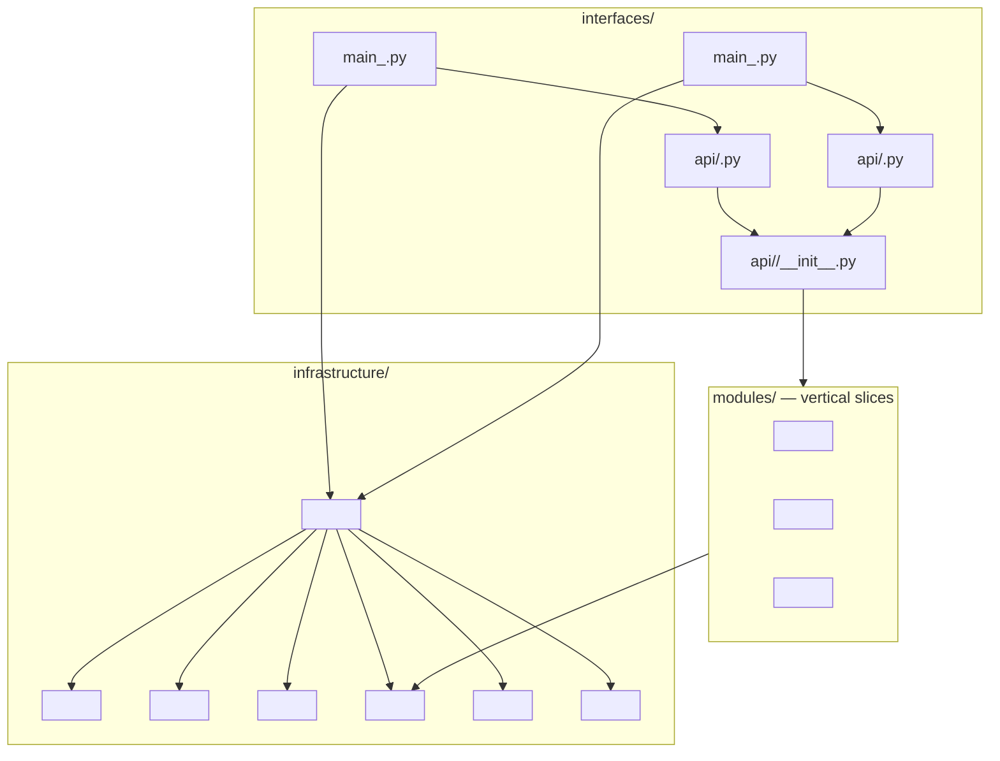
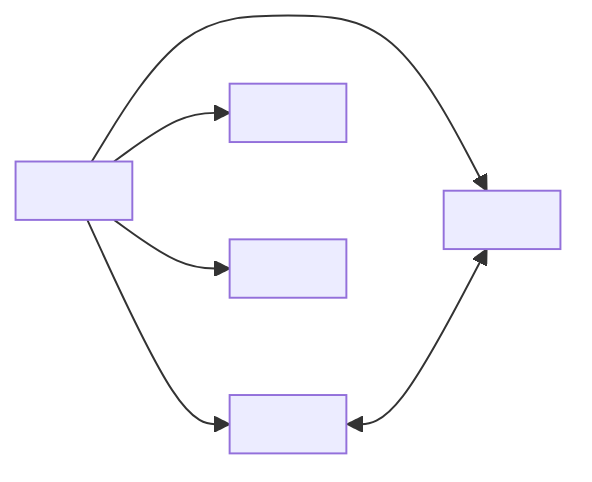

# Components and Modules

> One-sentence description of how the application is composed from its roots and how its modules couple.

## 1. Component diagram

> Show the three roots — interfaces, infrastructure, and modules — as subgraphs, and draw the composition edges. Use placeholder node labels.

## 2. `interfaces/` — entrypoints and router composition

> One row per file in the entrypoint root: what it builds and what it composes.

| File               | Role                          |
| ------------------ | ----------------------------- |
| `<path/to/source>` | `<what it builds / composes>` |

\<State where the entrypoints delegate to build the application and what they share.>

### Router composition

> Show how the single composition root mounts each plane and which module routers each mount includes.

| Mount               | Plane     | Module routers              |
| ------------------- | --------- | --------------------------- |
| `<mount>/<segment>` | `<plane>` | `<module routers included>` |

## 3. `infrastructure/` — cross-cutting roots

> One row per cross-cutting root: its responsibility and its key source file.

| Root     | Responsibility     | Key source         |
| -------- | ------------------ | ------------------ |
| `<root>` | `<responsibility>` | `<path/to/source>` |

## 4. `modules/` — \<N> top-level modules

> One row per top-level module: its file shape and what it owns. Add a note when the count differs from the number of rows.

| Module     | Shape                          | Owns             |
| ---------- | ------------------------------ | ---------------- |
| `<module>` | `<comma-separated file roles>` | `<what it owns>` |

\<Explain any mismatch between the number of top-level packages and the number of rows.>

## 5. Cross-module coupling

> Draw only the load-bearing edges a reader must know before changing a module, label each edge with the contract or reason it exists, then explain each edge below. Use a two-way edge only where an intentional package cycle exists.

### Edge-by-edge

> One row per edge in the diagram: what the edge is and the source that proves it.

| #   | Edge                                | Evidence           |
| --- | ----------------------------------- | ------------------ |
| 1   | `<from> → <to>: <what the edge is>` | `<path/to/source>` |

> **Known cycle.** \<Describe any intentional package cycle: what it is and what a change must update on both sides.>

> **Known limitation.** \<Describe any known gap or inconsistency a reader should not mistake for a bug.>

## 6. References

> Link the entrypoints, the app factory and middleware, the modules root, and the sibling chapters.

- Entrypoints: `<path/to/source>`
- App factory & middleware: `<path/to/source>`
- Modules root: `<path/to/source>`
- Related docs: [02 — Containers](02-containers.md), [04 — Request Lifecycle](04-request-lifecycle.md), [06 — Conventions](06-conventions.md)
