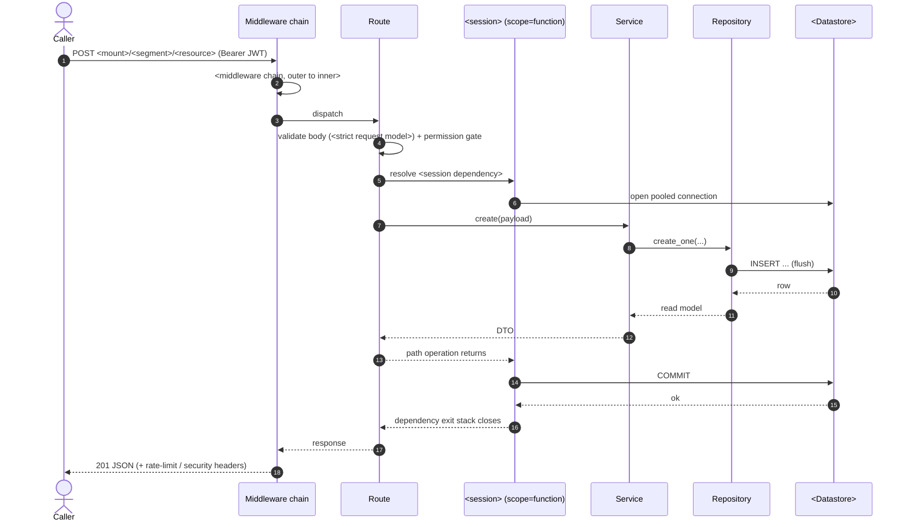
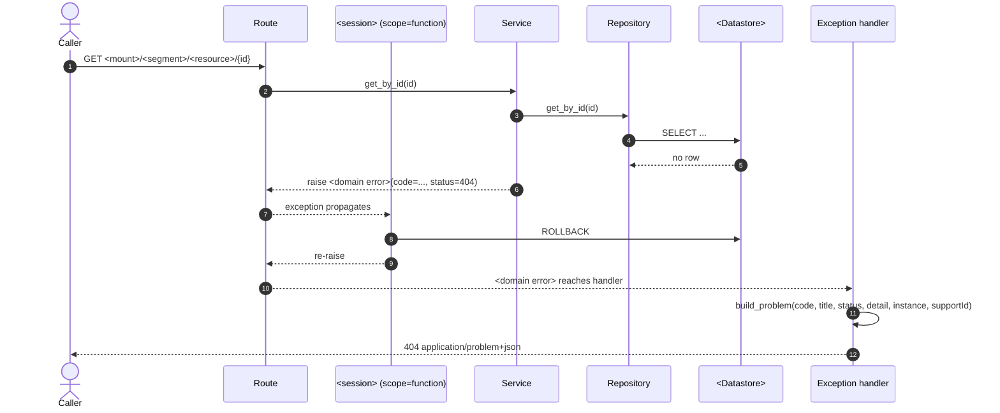

# Request Lifecycle

> One-sentence description of how a request flows through middleware, dependencies, and the transaction, and how failures are normalized.

## 1. Middleware execution order

> Explain how middleware is inserted relative to execution order, then list execution order outermost to innermost. Add the add-order line and any conditional adds so a reader can reconcile the two.

\<Prose: state that adding middleware inserts at the front, so the last middleware added is the outermost executed, and the add order is the reverse of the runtime order.>

| #   | Middleware     | Kind                  | Responsibility     | Source             |
| --- | -------------- | --------------------- | ------------------ | ------------------ |
| 1   | `<Middleware>` | `<built-in / custom>` | `<responsibility>` | `<path/to/source>` |

**Add order:** `<from first-added (innermost) to last-added (outermost)>`.

Conditional adds: `<which middleware are added only when a setting is enabled>`.

## 2. Dependency resolution

> List the parameters the framework resolves before the path operation runs — security dependencies, permission gates, then the session — in resolution order.

1. `<Step: what is resolved and where>`.
1. `<Step>`.
1. `<Step>`.

### `<Session>`, `scope="function"`, and commit-before-response

> Explain which object owns the request transaction and when it commits relative to the response, then show the exit-stack skeleton. Note any deliberate local commits.

```text
async with session:
    try:
        yield session          # route, service, repository run here
    except BaseException:
        await session.rollback()
        raise
    else:
        await session.commit() # runs after the path operation, before the response
```

\<Explain that declaring the session with `scope="function"` makes the commit run after the path operation returns and before the response is sent, that repositories flush, and which writes are the deliberate local-commit exception.>

## 3. Successful write request

> Trace one clean write end-to-end through the middleware chain, route, dependencies, service, and repository, and show the commit on the dependency exit stack.



## 4. Failed request / domain error

> Show how a domain error rolls back and is normalized into one problem body, then tabulate every registered handler and its detail policy.

\<Prose: describe how domain errors carry a machine-readable code and status, propagate through the dependency exit stack, and are rendered by the registered handlers.>



| Exception     | Status     | `code`   | Detail policy     |
| ------------- | ---------- | -------- | ----------------- |
| `<Exception>` | `<status>` | `<code>` | `<detail policy>` |

> **Short-circuit paths.** \<Name the middleware that render their own problem responses because they run outside the exception middleware and never reach the handlers.>

## 5. References

> Link the app factory, middleware, session/unit of work, error handlers, problem body, OpenAPI error model, and the sibling chapters.

- App factory: `<path/to/source>`
- Middleware: `<path/to/source>`
- Session/unit of work: `<path/to/source>`
- Error handlers: `<path/to/source>`
- Problem body: `<path/to/source>`
- OpenAPI error model: `<path/to/source>`
- Related docs: [03 — Components](03-components.md), [06 — Conventions](06-conventions.md)
