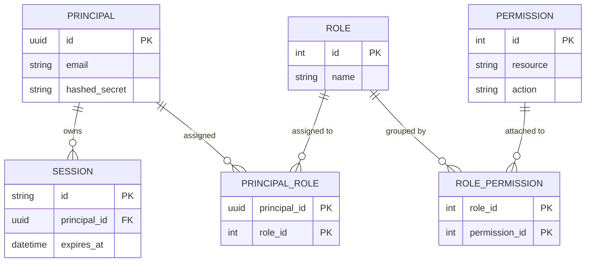
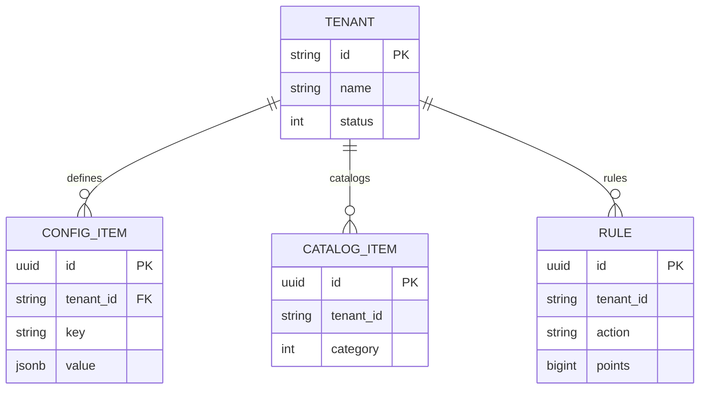
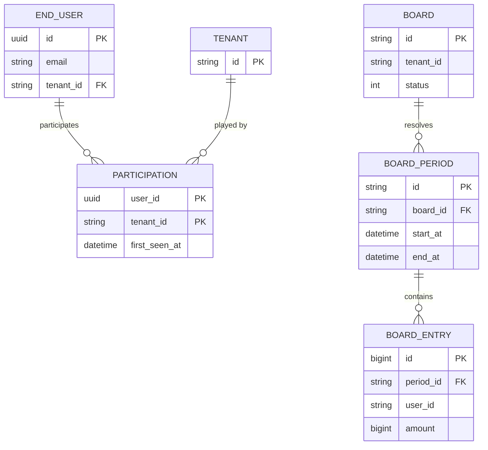

# Data Model (ERD)

> One-sentence description of the persisted schema, its shared mixins, and the areas the entities fall into.

## 1. Shared mixins

> One row per mixin every entity may compose: the columns it contributes and where it is defined.

| Mixin     | Columns                    | Source             |
| --------- | -------------------------- | ------------------ |
| `<Mixin>` | `<columns it contributes>` | `<path/to/source>` |

\<State the shared base all entities subclass and any exceptions to the mixin defaults — for example non-UUID primary keys.>

## 2. Identity & access context

> One `erDiagram` for the identity, credential, and grant entities, then cite the source of each entity and call out any missing foreign keys or partial indexes.

Sources: `<path/to/source>` (`<entity>`), `<path/to/source>` (`<entity>`).

> \<Call out any column that looks like a foreign key but is not constrained, and any partial or conditional index.>

## 3. \<Area> configuration context

> One `erDiagram` for the tenant and its per-tenant configuration entities, then cite the sources and call out unconstrained references or cascade behavior.

Sources: `<path/to/source>` (`<entity>`).

> \<Call out any unconstrained tenant reference and any cascade or logical-link behavior.>

## 4. \<Area> & \<Area> context

> One `erDiagram` for the end-user, participation, and ranking entities, then cite the sources and call out unconstrained references or uniqueness constraints.

Sources: `<path/to/source>` (`<entity>`).

> \<Call out any unconstrained reference and any uniqueness constraint.>

## 5. Table index

> One row per persisted table: its owning module and its purpose.

| Table     | Owning module     | Purpose     |
| --------- | ----------------- | ----------- |
| `<table>` | `<owning module>` | `<purpose>` |

## 6. Verification note

> State how the entity and table names above were verified against the code, and how registration is forced, so a later reader can re-check.

\<Prose: describe the check performed and its result, and how models are registered.>

## 7. References

> Link the mixins/base and the sibling chapters.

- Mixins/base: `<path/to/source>`
- Related docs: [03 — Components](03-components.md), [06 — Conventions](06-conventions.md)
