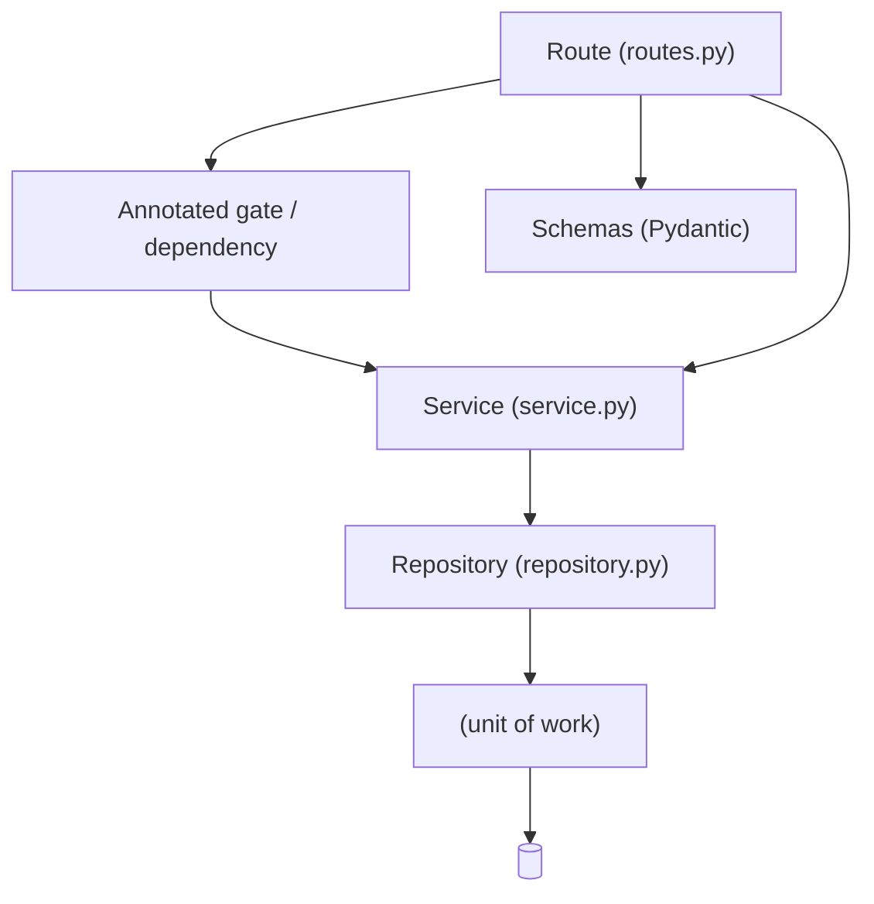

# Engineering Conventions

> One-sentence list of the house rules a change must respect.

## 1. Imports

> State the import rule for the application package and where relative imports are permitted, then name the cross-slice import boundary.

- Application code uses **absolute `<package>.*` imports** everywhere. Relative imports are only allowed within `<tool package>.*`.
- Each `<module root>/<name>/` package is a bounded slice. Cross-slice imports go through the target's public surface (`schemas`, `service`, `constants`, `dependencies`), never into another slice's internals; name the one documented exception.

## 2. Vertical-slice file convention

> One row per file role, which modules carry it, and any per-module variation worth knowing.

| File role     | Present in        | Notes                       |
| ------------- | ----------------- | --------------------------- |
| `<file role>` | `<which modules>` | `<variation worth knowing>` |

\<Note any extra files that are allowed when earned.>

## 3. Layering

> Draw the dependency direction, then tabulate each layering rule against how it is enforced.



| Rule     | Enforcement            |
| -------- | ---------------------- |
| `<rule>` | `<how it is enforced>` |

> **Invariant note.** \<State the single enforced invariant in bold, and note any divergence between the written project rule and where the code actually lives.>

## 4. Permission gates

> Show how authorization is declared as an `Annotated` alias built by a gate factory, then list the rules a gate resolves.

\<Prose: name the gate factory and how a gate alias is built.>

```python
<Resource>CreateGate = Annotated[<Principal>, <GateFactory>(<RESOURCE>, <CREATE>)]
<Resource>ReadGate = Annotated[<Principal>, <GateFactory>(<RESOURCE>, <READ>)]
```

Rules:

- The gate resolves the principal (401 when unauthenticated), then calls the bound service, which bypasses for a privileged principal and otherwise denies by default (403).
- Tenant-scoped modules additionally enforce per-scope tenancy with a scope check on top of the gate.
- A `None` scope means unrestricted; an empty scope denies everything — never collapse the two.

## 5. Wire format (camelCase)

> Two rows: the response base and the request base. Then state how snake_case input is accepted and whether error bodies follow the same rule.

| Base                   | Use       | Behavior                                                                |
| ---------------------- | --------- | ----------------------------------------------------------------------- |
| `<ResponseModel>`      | Responses | `<camelCase aliases; undeclared fields dropped>`                        |
| `<StrictRequestModel>` | Requests  | `<camelCase aliases plus extra="forbid"; an undeclared field is a 422>` |

\<State that both bases populate by name, that Python attributes stay snake_case, and how the error body follows the same rule.>

## 6. Pagination & filtering

> One row per DTO: its role in the pagination and filtering contract.

| DTO              | Role                                                                    |
| ---------------- | ----------------------------------------------------------------------- |
| `<PageQueryDto>` | `<request body for POST /filter: page, limit, order, orderBy, filters>` |
| `<QueryParams>`  | `<internal query parameters produced from the DTO>`                     |
| `<Page[T]>`      | `<wire envelope fields>`                                                |
| `<FilterConfig>` | `<allowlist of public keys to column, allowed operators, sortable>`     |

\<State where the DTOs are defined, that each filterable module declares its allowlist, and what happens on an unknown or non-sortable order field.>

### List filtering via `POST /filter`

> State which list endpoints expose structured filtering and that they use a POST body rather than query strings.

\<Prose: list the endpoints that expose `POST /filter` and where one is registered.>

## 7. Error contract (RFC 9457)

> Describe the single problem body every failure produces, then tabulate each member.

\<Prose: name the problem builder and state that every failure is one `application/problem+json` envelope.>

| Member      | Meaning                                                   |
| ----------- | --------------------------------------------------------- |
| `type`      | `<problem type URI>`                                      |
| `title`     | `<short summary for the status>`                          |
| `status`    | `<HTTP status, mirrors the response>`                     |
| `code`      | `<machine-readable problem type code>`                    |
| `detail`    | `<safe occurrence-specific message>`                      |
| `instance`  | `<request path>`                                          |
| `errors[]`  | `<per-field failures, request validation only>`           |
| `supportId` | `<short id correlating a client report with server logs>` |

\<Describe how domain errors carry `code` and `status_code`, how the generic 500 is rendered, and any exception that keeps its message.>

## 8. Transaction contract

> Bullets: how the session is scoped, who commits, when relative to the response, and the cache TTL rule.

- One `<Session>` per request, declared `Depends(<session dependency>, scope="function")`.
- Repositories `flush`; the session dependency owns the request transaction and is the committer, except the documented security writes that commit locally so they survive a failed request.
- A clean request commits **after** the path operation and **before** the response is sent; any exception rolls back before propagating.
- Every cache write must carry a positive, capped TTL; never flush the cache in production.

## 9. Testing conventions

> One row per convention: how tests are built and run.

| Convention     | Detail     |
| -------------- | ---------- |
| `<Convention>` | `<detail>` |

## 10. References

> Link the wire/DTOs, errors, layering, and gates, plus the sibling chapters.

- Wire/DTOs: `<path/to/source>`
- Errors: `<path/to/source>`
- Layering: `<path/to/source>`
- Gates: `<path/to/source>`
- Related docs: [03 — Components](03-components.md), [04 — Request Lifecycle](04-request-lifecycle.md)
