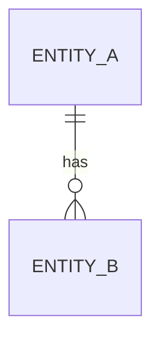
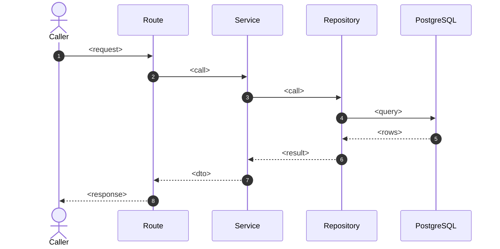
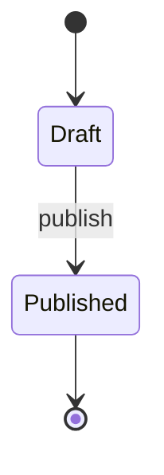
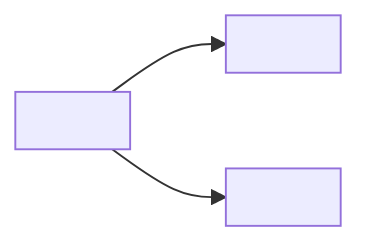

# \<Feature / Module Name>

> One-sentence description of what this module owns and why it exists.

## 1. Purpose & Scope

|                    |                                                     |
| ------------------ | --------------------------------------------------- |
| **Responsibility** | <what this module owns>                             |
| **In scope**       | <bullet list>                                       |
| **Out of scope**   | \<bullet list, with a pointer to the owning module> |
| **Primary actors** | \<admin plane / client plane / other modules>       |

## 2. Responsibilities & Capabilities

- **<Capability>** — <one line>.
- **<Capability>** — <one line>.

## 3. Domain Model

\<Entities, value objects, enums, and their relationships. Use an `erDiagram`
for persisted relationships or a `classDiagram` for in-memory/domain types.>

| Entity     | Table          | Purpose   |
| ---------- | -------------- | --------- |
| `<Entity>` | `<table_name>` | <purpose> |

## 4. Persistence

\<Columns, indexes, constraints, and any notable query behavior.>

| Column | Type | Nullable | Notes |
| ------ | ---- | -------- | ----- |

Indexes & constraints:

- `<index/constraint>` — <why it exists>.

## 5. API Surface

### Admin plane — `/<mount-prefix>/internal/<module>`

| Method | Path | Permission | Description |
| ------ | ---- | ---------- | ----------- |

### Client plane — `/<mount-prefix>/client/<module>`

| Method | Path | Auth | Description |
| ------ | ---- | ---- | ----------- |

\<For the highest-value endpoints, show request/response shapes and the error
matrix. Link to `reference/api-index.md` for the full catalog.>

## 6. Key Flows

\<Show 1–2 `sequenceDiagram`s for the highest-value flows (create/update/read/
delete, state transition, external interaction); name the remaining flows in
prose. Name participants after the real layers: Router → Dependency → Service →
Repository → Database, plus cache/scheduler.>

## 7. Lifecycle & State

\<Use `stateDiagram-v2` only when the module has an explicit state machine. When
it does not, keep this section: either state that in one line — e.g. "No
explicit state machine; `GameStatus` is a freely-settable ordinal flag." — or
fold the lifecycle notes into §3 and say so here. Never delete the section,
because that leaves a gap in the section numbering.>

## 8. Permissions & Security

- **RBAC resource** — `<resource>` with actions `<create|read|update|delete>`.
- **Game scope** — \<how game-scoped access is enforced, if applicable>.
- **Plane** — \<admin-only / client / both>.
- **Sensitive data** — \<secrets, PII, masking>.

## 9. Validation & Error Taxonomy

| Error code | HTTP | Raised when | Where |
| ---------- | ---- | ----------- | ----- |

\<Reference `modules/common/exceptions.py`, `problem.py`, and the module's
`exceptions.py`.>

## 10. Configuration

| Setting | Default | Purpose |
| ------- | ------- | ------- |

## 11. Observability

- **Logs** — <key structured events>.
- **Metrics** — <if any>.
- **Tracing** — <correlation id propagation>.

## 12. Dependencies & Coupling

- **Depends on** — \<modules/infra>.
- **Depended on by** — <consumers>.
- **Cross-module contracts** — \<protocols / shared enums>.

## 13. Testing

- **Unit** — `<tests/unit/...>`: <what is covered>.
- **Integration** — `<tests/integration/...>`: <what is covered>.
- **Notable cases** — <edge cases the tests pin down>.

> **Citations.** Prefer file-level citations for stable facts and reserve line
> numbers for load-bearing or non-obvious claims. In this section, use
> file/dir-level citations — test line numbers decay as the suite grows.

## 14. Known Limitations & Edge Cases

- \<limitation or fail-open/fail-closed behavior>.

## 15. References

- Source: `<backend/src/modules/<module>/...>`
- Related docs: <links>
