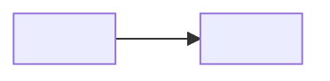
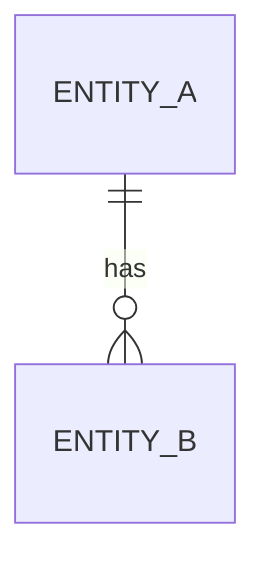
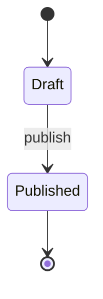

# \<NN>. Requirements — \<Feature Name>

> **Navigation:** [← Requirements Index](../requirements/README.md)
>
> _Status: draft for review — implementation requirements for v1 of \<feature>._

\<One paragraph: what this feature delivers, who it serves, and why it exists.
This is a **requirements** document: it specifies *what to build*, not *how the
current code works*. Keep it self-contained — do not depend on other design docs.>

## 1. Goals

1. **\<Goal>** — \<one line>.
1. **\<Goal>** — \<one line>.

> Keep goals outcome-oriented and testable. Every goal should map to at least one
> acceptance criterion in §12.

## 2. Scope

### 2.1 In-scope

- \<capability / component>.
- \<capability / component>.

### 2.2 Out-of-scope (explicit)

- **\<Item>** — \<why it is excluded, or which feature owns it>.
- **\<Item>** — \<deferred to a later stage>.

> Be explicit. "Out of scope" prevents scope creep and duplicated requirements.

## 3. Glossary / Terminology

| Term        | Definition                               |
| ----------- | ---------------------------------------- |
| **\<term>** | \<precise meaning used in this document> |
| **\<term>** | \<...>                                   |

> Define any term that is ambiguous, overloaded, or reused with a different
> meaning elsewhere (e.g. "scope" as OAuth scope vs. project scope).

## 4. Architecture & Data Model

\<Describe the components/topology and the persisted entities this feature
introduces or changes. Use a `flowchart` for topology and an `erDiagram` for
persisted relationships.>

| Entity      | Table           | Purpose    |
| ----------- | --------------- | ---------- |
| `\<Entity>` | `\<table_name>` | \<purpose> |

### 4.x \<Entity> columns

| Column      | Type    | Nullable  | Default    | Notes    |
| ----------- | ------- | --------- | ---------- | -------- |
| `\<column>` | \<type> | \<yes/no> | \<default> | \<notes> |

Indexes & constraints:

- `<index / constraint>` — \<why it exists>.

> Cite the concrete code/schema location for any fact taken from the current
> codebase, e.g. `backend/src/modules/<module>/models.py:NN`.

## 5. \<Domain model / Behavior>

\<Feature-specific section(s). Rename and repeat as needed: field
classification, token design, registry, secret handling, catalog, etc. Delete
sections that do not apply — but never delete a numbered section without
renumbering the rest.>

## 6. State machine

> Keep this section even when there is no state machine: state that in one line
> (e.g. "No explicit state machine; `<Flag>` is a freely-settable ordinal.")
> so the section numbering stays contiguous.

| State      | Meaning    |
| ---------- | ---------- |
| `\<STATE>` | \<meaning> |

## 7. Operation specification

| Operation    | Behavior               |
| ------------ | ---------------------- |
| \<operation> | \<effect, in one line> |

For each operation, specify:

- **Preconditions** — \<required state / inputs>.
- **Effects** — \<state changes, side-effects>.
- **Permission** — \<RBAC permission / scope>.
- **Audit** — \<event written>.
- **Errors** — \<error codes>.
- **Concurrency** — \<locking / optimistic checks>.

## 8. API contract

### 8.1 Endpoints

| Method      | Path      | Description    | Permission    | Status (new/changed)         |
| ----------- | --------- | -------------- | ------------- | ---------------------------- |
| `\<METHOD>` | `\<path>` | \<description> | \<permission> | \<new / changed / unchanged> |

### 8.2 Headers

| Header      | Direction          | Meaning    |
| ----------- | ------------------ | ---------- |
| `\<Header>` | Request / Response | \<meaning> |

### 8.3 Example requests / responses

\<Show the highest-value request/response shapes. State the wire format
(camelCase) and any deliberate exception.>

### 8.4 Error catalog (RFC 9457 problem+json)

| `code`          | HTTP   | When         |
| --------------- | ------ | ------------ |
| `\<ERROR_CODE>` | \<int> | \<condition> |

> Reference the shared error contract (`backend/src/modules/common/exceptions.py`,
> problem+json schemas) and note any HTTP status semantics (e.g. `422 Unprocessable Content`, not "Unprocessable Entity").

## 9. Permissions & Security

- **RBAC resource** — `\<resource>` with actions `<...>`.
- **Scopes / auth** — \<token type, audience, scope model>.
- **Game scope** — \<how game-scoped access is enforced, if applicable>.
- **Plane** — \<admin / client / service / both>.
- **Sensitive data** — \<secrets, PII, redaction, storage>.

## 10. Audit

- **Action catalog** — `\<action.namespace>` | `\<...>`.
- **Recorded fields** — \<actor, entity, outcome, reason, hashes, metadata>.
- **Retention** — \<duration; prune policy>.
- **Redaction** — \<what must never be logged/persisted>.

## 11. Non-functional

| Group         | Requirement                      |
| ------------- | -------------------------------- |
| Concurrency   | \<locking / idempotency>         |
| Performance   | \<hot paths, indexes>            |
| Security      | \<fail-closed behavior, secrets> |
| Retention     | \<data lifecycle>                |
| Observability | \<logs / metrics / tracing>      |
| Configuration | \<settings, env vars, defaults>  |

## 12. Acceptance criteria

1. \<Observable, testable statement.>
1. \<Observable, testable statement.>

> Number every item. Each goal in §1 should be covered by at least one item.

## 13. Testing mandates

- **Unit** — `<tests/unit/...>`: \<what is covered>.
- **Integration** — `<tests/integration/...>`: \<what is covered>.
- **Notable cases** — \<edge cases the tests must pin down>.
- Name tests `test_<unit>_<scenario>_<expected>`.

## 14. CLI / Operations requirements

> Optional. Keep the section (state "None.") if the feature has no CLI/ops
> surface, to preserve numbering.

| Command      | Description    |
| ------------ | -------------- |
| `\<command>` | \<description> |

## 15. References

- Source: `backend/src/modules/<module>/...`
- Related requirements: `<NN>_<name>.md`
- Standards / external: \<RFC numbers, docs>
