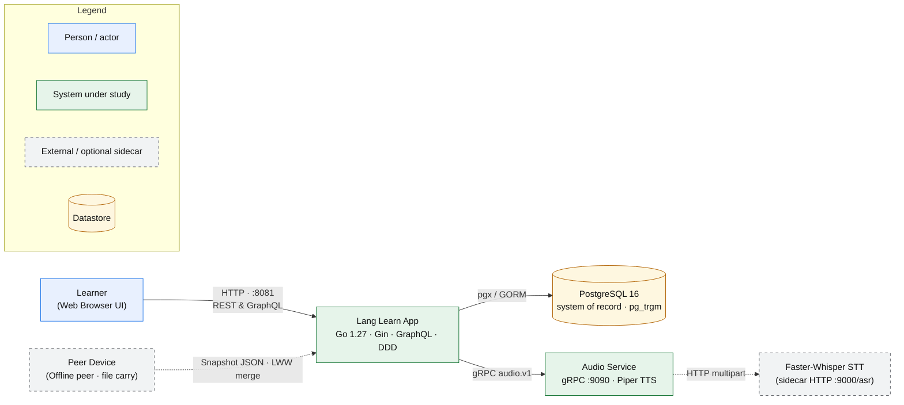

# System Context

> Single-user bilingual English and Chinese language learning web application with a Go backend (Gin + GraphQL + DDD), PostgreSQL database, and gRPC audio microservice (Piper TTS and Faster-Whisper STT).

## 1. Narrative

**Lang Learn App** (`langapp`) is a self-directed language learning platform centered around two core learning tracks: Simplified Chinese (Pinyin pronunciation, four tones, Hanzi stroke order, HSK 1–4 curriculum) and English (word stress patterns, chunking rhythm, PVO/TMRND sentence patterns, 8-axis THIEU rubric, and Shadowing practice).

The system directly serves a single learner (**Learner**) through a responsive SPA web frontend (Vue 3 + Vite) and supports exchanging learning state with peer devices (**Peer Device**) via offline snapshot file import/export. Its security model is **single-user local-first / zero-trust boundary**: the application does not implement authentication (no login sessions, no JWT tokens), relying instead on Docker private network isolation and environment configuration (`GIN_MODE=release` disables GraphQL schema introspection and playground).

**PostgreSQL 16** serves as the authoritative System of Record (SoR). Speech synthesis and recognition are delegated to an out-of-process **Audio Service** over gRPC; if the audio service is unreachable or unconfigured, the application runs in **degraded mode** using an in-memory sine wave stub without failing HTTP/GraphQL requests.

## 2. System context diagram

## 3. Responsibilities

| Element | Kind | Responsibility | Interface |
| --- | --- | --- | --- |
| `Learner` | Person | Navigates learning roadmaps, reviews SRS flashcards, practices shadowing, records audio, and tracks error logs | Web Browser (`http://localhost:8081`) |
| `Peer Device` | External System | Exchanges learning progress across devices via snapshot file-carry | Export / Import Snapshot JSON (`/query` GraphQL `sync`) |
| `Lang Learn App` | System | Executes core business logic (Roadmap, SRS, Content, Practice, Insight, Sync), exposes GraphQL and REST APIs, serves static assets | HTTP REST (`/api/*`), GraphQL (`/query`, `/playground`) |
| `PostgreSQL 16` | Datastore | Persists user cards, reviews, notes, roadmaps, dictionaries, and sync conflict metadata | TCP `:5432` / `:5433` via `pgx/v5` and GORM |
| `Audio Service` | Internal Service | Synthesizes neural speech (Piper) and proxies speech recognition requests out of process | gRPC `:9090` (`audio.v1.Audio`) |
| `Faster-Whisper STT` | External / Optional | Automatic speech recognition from audio recordings (Python sidecar) | HTTP POST `:9000/asr` |

## 4. Key properties

- **Single Datastore as System of Record (SoR)** — All user data, learning progress, cards, and dictionaries reside in PostgreSQL; there are no external caches or separate databases ([di.go](file:///home/hung1/personal/roadmap-learning/api/internal/platform/di.go#L58-L84)).
- **Fail-Degraded Audio Architecture** — If `audio-service` is absent or unconfigured, `/api/health` returns status `degraded` (HTTP 200) and synthesis falls back to a generated sine-wave audio stub instead of failing ([health.go](file:///home/hung1/personal/roadmap-learning/api/internal/transport/http/health.go#L20-L45)).
- **Single-User Security & Trust Boundary** — No authentication tokens or passwords are required; production safety relies on `GIN_MODE=release` to disable GraphQL schema introspection and the Playground IDE ([main.go](file:///home/hung1/personal/roadmap-learning/api/cmd/langapp/main.go#L98-L107)).
- **Last-Write-Wins (LWW) Synchronization Contract** — Every mutable table includes canonical columns `guid`, `created_at`, `updated_at`, `deleted`, with database triggers automatically updating UTC timestamps to resolve peer conflicts ([00001_init.sql](file:///home/hung1/personal/roadmap-learning/api/migrations/00001_init.sql#L209-L234)).

## 5. References

- Entrypoints:
  - Main application server: [api/cmd/langapp/main.go](file:///home/hung1/personal/roadmap-learning/api/cmd/langapp/main.go)
  - Audio service: [api/services/audio-service/main.go](file:///home/hung1/personal/roadmap-learning/api/services/audio-service/main.go)
  - Audio health probe: [api/cmd/audio-health-probe/main.go](file:///home/hung1/personal/roadmap-learning/api/cmd/audio-health-probe/main.go)
- Sibling architecture chapters:
  - [02 — Containers](02-containers.md)
  - [03 — Components](03-components.md)
  - [04 — Request Lifecycle](04-request-lifecycle.md)
  - [05 — Data Model](05-data-model.md)
  - [06 — Conventions](06-conventions.md)
