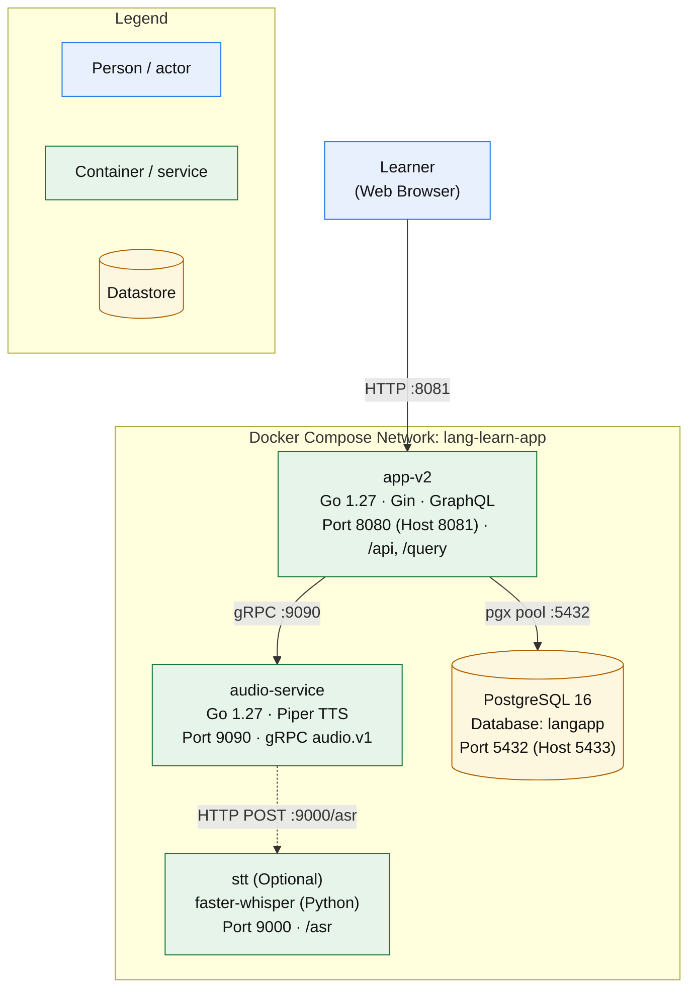

# Containers

> Process-level deployment topology of Lang Learn App comprising the core API application (`app-v2`), out-of-process audio microservice (`audio-service`), PostgreSQL datastore, and optional Faster-Whisper STT sidecar.

## 1. Container diagram

## 2. Container inventory

| Container | Entrypoint | Port | Plane segment | Mount prefix | Health route |
| --- | --- | --- | --- | --- | --- |
| `app-v2` | `/app/langapp-server` ([main.go](file:///home/hung1/personal/roadmap-learning/api/cmd/langapp/main.go)) | `8080` (mapped `8081`) | Core API & Web | `/api`, `/query`, `/` | `/api/health` |
| `audio-service` | `/app/audio-service` ([main.go](file:///home/hung1/personal/roadmap-learning/api/services/audio-service/main.go)) | `9090` | Audio Engine | `audio.v1.Audio` | `grpc_health_v1` via `/app/audio-health-probe` |
| `postgres` | `postgres:16-alpine` | `5432` (mapped `5433`) | Storage | RDBMS | `pg_isready -U langapp` |
| `stt` *(optional)* | `faster-whisper-server` | `9000` | Speech Recognition | `/asr` | `GET /health` |

Host ports, entrypoints, and container boundaries are defined in [docker-compose.yml](file:///home/hung1/personal/roadmap-learning/docker-compose.yml) and documented in [DEPLOY.md](file:///home/hung1/personal/roadmap-learning/DEPLOY.md).

### Documentation & Diagnostic Routes

| Route | Path | Served by | Notes |
| --- | --- | --- | --- |
| Health Check | `GET /api/health` | `app-v2` | Returns `{"status":"ok"}` or `{"status":"degraded"}` (HTTP 200). Returns HTTP 503 if DB is unreachable. |
| TTS Binary Stream | `GET /api/tts?text=&lang=` | `app-v2` | Streams WAV audio synthesized by `audio-service` over gRPC. |
| STT Multipart Upload | `POST /api/stt` | `app-v2` | Accepts audio multipart upload, forwards to `audio-service` for transcription. |
| GraphQL Endpoint | `POST /query`, `GET /query` | `app-v2` | Serves queries and mutations for all 6 domain contexts. |
| GraphQL Playground | `GET /playground` | `app-v2` | Served when `GIN_MODE != release` (dev mode). |
| Static SPA Assets | `GET /*` | `app-v2` | Serves built HTML/JS/CSS assets from `WEB_DIST` (`/app/dist`). |

> **Production caveat.** When running with `GIN_MODE=release`, GraphQL Schema Introspection is disabled and `/playground` is not registered ([main.go](file:///home/hung1/personal/roadmap-learning/api/cmd/langapp/main.go#L98-L107)), securing the application against schema inspection in production.

## 3. Shared Datastore (PostgreSQL 16)

The application maintains one pooled PostgreSQL connection per process:

- **Per-process Connection Pool:** Configured in [api/internal/platform/db.go](file:///home/hung1/personal/roadmap-learning/api/internal/platform/db.go), defaulting to `MaxOpenConns=10`, `MaxIdleConns=10`, `ConnMaxLifetime=1h` via environment variables.
- **Unit of Work Transaction Boundary:** Handled by [api/internal/platform/txtx](file:///home/hung1/personal/roadmap-learning/api/internal/platform/txtx/txtx.go). `txtx.Do` wraps multi-step domain mutations within a single database transaction, ensuring atomic commit or rollback.
- **Automated Versioned Migrations:** Handled by Goose on server startup in [api/internal/platform/migrate.go](file:///home/hung1/personal/roadmap-learning/api/internal/platform/migrate.go) using migration files embedded from [api/migrations](file:///home/hung1/personal/roadmap-learning/api/migrations).
- **Boot Seeding:** Automatically seeds curriculum roadmap trees from embedded JSON files in [api/roadmap_seed](file:///home/hung1/personal/roadmap-learning/api/roadmap_seed) with a 2-minute safety timeout ([di.go](file:///home/hung1/personal/roadmap-learning/api/internal/platform/di.go#L196-L206)).

## 4. Audio Subsystem & Sidecars

The dedicated `audio-service` container isolates heavy dependencies and CPU-intensive operations:

- **gRPC Protocol `audio.v1.Audio`:** Defined in [api/proto/audio/v1/audio.proto](file:///home/hung1/personal/roadmap-learning/api/proto/audio/v1/audio.proto), featuring `Synthesize`, `Transcribe`, and `StreamSynthesize` RPCs.
- **Bundled Piper Neural TTS:** Pre-baked with Chinese and English neural voice models (~752MB) residing at `/models` inside the container image.
- **Lightweight Static Health Probe:** [api/cmd/audio-health-probe](file:///home/hung1/personal/roadmap-learning/api/cmd/audio-health-probe/main.go) is a static Go binary (<2MB) implementing `grpc_health_v1`, preventing false unhealthy states caused by mismatching HTTP container health checks.
- **STT Delegation:** When `WHISPER_URL` is configured, `audio-service` proxies requests to the `faster-whisper-server` sidecar and returns token timestamps (`WordTimestamp`).

## 5. Out of scope: Excluded Components

- **Legacy SQLite v1 Engine & net/http API:** Fully removed in Milestone M7c. Root `api/*.go` files and the `langapp-data` volume were deleted.
- **Desktop Packaging (Wails / Tauri):** Retired in favor of a modern web SPA distributed via Docker.
- **In-App Backup/Restore Endpoints (`/api/backup`, `/api/restore`):** Removed because PostgreSQL requires external `pg_dump`/`pg_restore` tooling not bundled in the lightweight runtime image ([DEPLOY.md](file:///home/hung1/personal/roadmap-learning/DEPLOY.md#L75-L99)). Database backups are handled via standard host-level `pg_dump`.

## 6. References

- Docker Compose configuration: [docker-compose.yml](file:///home/hung1/personal/roadmap-learning/docker-compose.yml)
- Deployment guide: [DEPLOY.md](file:///home/hung1/personal/roadmap-learning/DEPLOY.md)
- Dependency injection container: [api/internal/platform/di.go](file:///home/hung1/personal/roadmap-learning/api/internal/platform/di.go)
- Audio gRPC service: [api/services/audio-service/server.go](file:///home/hung1/personal/roadmap-learning/api/services/audio-service/server.go)
- Sibling architecture chapters:
  - [01 — Context](01-context.md)
  - [03 — Components](03-components.md)
  - [04 — Request Lifecycle](04-request-lifecycle.md)
  - [05 — Data Model](05-data-model.md)
