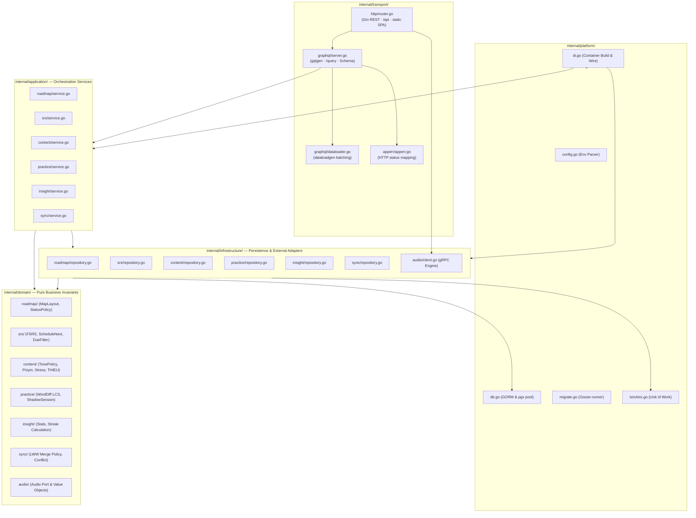
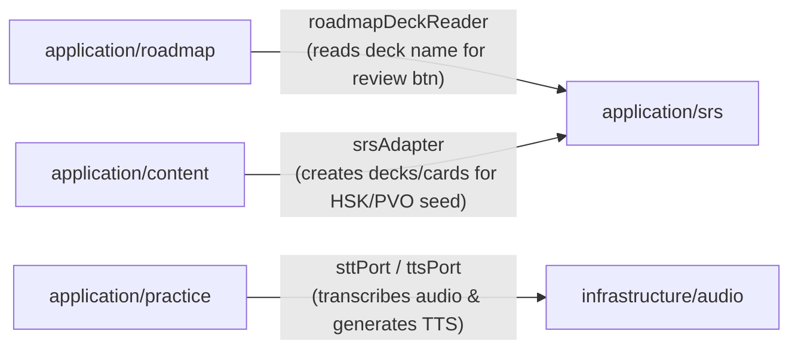

# Components and Modules

> Architectural decomposition of the Go backend across transport interfaces, platform infrastructure, and bounded domain contexts following Clean Architecture and Domain-Driven Design (DDD).

## 1. Component diagram

## 2. Transport Layer (`internal/transport/`)

The transport layer adapts external HTTP and GraphQL protocols into typed domain invocations:

| File | Role |
| --- | --- |
| [api/cmd/langapp/main.go](file:///home/hung1/personal/roadmap-learning/api/cmd/langapp/main.go) | Main server process entrypoint; calls `platform.Build`, runs migrations, seeds data, builds HTTP/GraphQL server |
| [api/internal/transport/http/router.go](file:///home/hung1/personal/roadmap-learning/api/internal/transport/http/router.go) | Constructs Gin router, attaches CORS, recovery, logging, `/api` REST endpoints, and `/query` GraphQL route |
| [api/internal/transport/http/routes.go](file:///home/hung1/personal/roadmap-learning/api/internal/transport/http/routes.go) | Registers `/api/health`, `/api/tts`, and `/api/stt` REST endpoints |
| [api/internal/transport/graphql/server.go](file:///home/hung1/personal/roadmap-learning/api/internal/transport/graphql/server.go) | Creates `gqlgen` GraphQL handler with per-request dataloaders and error presentation hooks |
| [api/internal/transport/graphql/dataloader.go](file:///home/hung1/personal/roadmap-learning/api/internal/transport/graphql/dataloader.go) | Batches SQL queries for Roadmap tree relations (`Stage.topics`, `Stage.milestones`, `Topic.resources`, `Stage.deck`) |
| [api/internal/transport/apperr/apperr.go](file:///home/hung1/personal/roadmap-learning/api/internal/transport/apperr/apperr.go) | Resolves status code from errors implementing `StatusCode() int` |

### Route & Plane Composition

| Mount | Handler / Target | Purpose |
| --- | --- | --- |
| `/api/health` | `healthHandler` | Probes database ping and audio engine readiness |
| `/api/tts` | `ttsHandler` | Streams raw binary audio generated by `audio.TTSSynthesizer` |
| `/api/stt` | `sttHandler` | Multipart upload handler forwarding to `audio.STTTranscriber` |
| `/query` | `gqltransport.NewServer` | Single GraphQL endpoint serving all 6 domain modules |
| `/playground` | `gqltransport.PlaygroundHandler` | Interactive GraphQL Playground (disabled when `GIN_MODE=release`) |
| `/*` (NoRoute) | `staticSPA` | Serves SPA assets or falls back to `index.html` for client routing |

## 3. Infrastructure Layer (`internal/infrastructure/` & `internal/platform/`)

The infrastructure layer implements data persistence and external integrations:

| Root / Package | Responsibility | Key Source |
| --- | --- | --- |
| `platform` | Runtime config, DB pool initialization, Goose migrations, DI wiring | [api/internal/platform/di.go](file:///home/hung1/personal/roadmap-learning/api/internal/platform/di.go) |
| `platform/txtx` | Transaction boundary manager wrapping GORM transactions | [api/internal/platform/txtx/txtx.go](file:///home/hung1/personal/roadmap-learning/api/internal/platform/txtx/txtx.go) |
| `infrastructure/roadmap` | Roadmap SQL repositories, tree batch loading, and seed loader | [api/internal/infrastructure/roadmap/repository.go](file:///home/hung1/personal/roadmap-learning/api/internal/infrastructure/roadmap/repository.go) |
| `infrastructure/srs` | Card, deck, note, and review repositories | [api/internal/infrastructure/srs/repository.go](file:///home/hung1/personal/roadmap-learning/api/internal/infrastructure/srs/repository.go) |
| `infrastructure/content` | Dictionaries, HSK / English seed imports, and FTS full-text search | [api/internal/infrastructure/content/repository.go](file:///home/hung1/personal/roadmap-learning/api/internal/infrastructure/content/repository.go) |
| `infrastructure/practice` | Shadow progress, error notes, and suggestion persistence | [api/internal/infrastructure/practice/repository.go](file:///home/hung1/personal/roadmap-learning/api/internal/infrastructure/practice/repository.go) |
| `infrastructure/insight` | Review aggregations, streak date calculation, and error counts | [api/internal/infrastructure/insight/repository.go](file:///home/hung1/personal/roadmap-learning/api/internal/infrastructure/insight/repository.go) |
| `infrastructure/sync` | Peer snapshot export, LWW table merges, and conflict records | [api/internal/infrastructure/sync/repository.go](file:///home/hung1/personal/roadmap-learning/api/internal/infrastructure/sync/repository.go) |
| `infrastructure/audio` | gRPC client connecting to `audio-service` with sine-stub fallback | [api/internal/infrastructure/audio/client.go](file:///home/hung1/personal/roadmap-learning/api/internal/infrastructure/audio/client.go) |

## 4. Domain Slices (`internal/domain/` & `internal/application/`)

The application is structured into vertical bounded contexts:

| Module / Context | Domain Model & Rules | Application Service | Owns |
| --- | --- | --- | --- |
| `roadmap` | [domain/roadmap](file:///home/hung1/personal/roadmap-learning/api/internal/domain/roadmap) | [application/roadmap](file:///home/hung1/personal/roadmap-learning/api/internal/application/roadmap/service.go) | 5-level roadmap hierarchy (`Path` -> `Stage` -> `Milestones`/`Topics` -> `Resources`), Map layout coordinates, Bookmarks |
| `srs` | [domain/srs](file:///home/hung1/personal/roadmap-learning/api/internal/domain/srs) | [application/srs](file:///home/hung1/personal/roadmap-learning/api/internal/application/srs/service.go) | Spaced repetition memory scheduling, FSRS algorithm with fallback intervals (1-3-7-14-30), Decks, Cards, Reviews, Notes |
| `content` | [domain/content](file:///home/hung1/personal/roadmap-learning/api/internal/domain/content) | [application/content](file:///home/hung1/personal/roadmap-learning/api/internal/application/content/service.go) | Chinese/English dictionaries, Pinyin parsing, Tone grading, English stress rules, Chunking tokenizer, THIEU rubric, Graded reader |
| `practice` | [domain/practice](file:///home/hung1/personal/roadmap-learning/api/internal/domain/practice) | [application/practice](file:///home/hung1/personal/roadmap-learning/api/internal/application/practice/service.go) | Shadowing audio playback loops, WordDiff LCS alignment, ErrorBook entries and resolution |
| `insight` | [domain/insight](file:///home/hung1/personal/roadmap-learning/api/internal/domain/insight) | [application/insight](file:///home/hung1/personal/roadmap-learning/api/internal/application/insight/service.go) | Learning analytics, weekly/monthly review dashboards, consecutive UTC day streak counter, aggregate error frequencies |
| `sync` | [domain/sync](file:///home/hung1/personal/roadmap-learning/api/internal/domain/sync) | [application/sync](file:///home/hung1/personal/roadmap-learning/api/internal/application/sync/service.go) | Peer snapshot serialization, Last-Write-Wins (LWW) conflict resolution policy, tombstone propagation |
| `audio` | [domain/audio](file:///home/hung1/personal/roadmap-learning/api/internal/domain/audio) | — | Out-of-process gRPC audio synthesis & transcription port definitions |

## 5. Cross-Module Coupling & Adapters

Cross-context interaction is strictly orchestrated via dedicated adapters wired in [api/internal/platform/di.go](file:///home/hung1/personal/roadmap-learning/api/internal/platform/di.go), preventing direct domain-to-domain dependencies:

- **`roadmapDeckReader`:** Implements `roadmapapp.DeckReader` to allow the Roadmap service to fetch attached deck names for navigation buttons without exposing SRS internal entities ([di.go](file:///home/hung1/personal/roadmap-learning/api/internal/platform/di.go#L128-L137)).
- **`srsAdapter`:** Implements Content service ports (`CardCreator`, `DeckCreator`) so vocabulary seed imports can populate SRS decks and cards without Content importing SRS models ([di.go](file:///home/hung1/personal/roadmap-learning/api/internal/platform/di.go#L116)).
- **`sttPort` & `ttsPort`:** Adapter structs forwarding Practice audio analysis requests to the `audioinfra.Engine` ([di.go](file:///home/hung1/personal/roadmap-learning/api/internal/platform/di.go#L139-L159)).

## 6. References

- DI wiring container: [api/internal/platform/di.go](file:///home/hung1/personal/roadmap-learning/api/internal/platform/di.go)
- GraphQL schema definition: [api/graph/schema/root.graphqls](file:///home/hung1/personal/roadmap-learning/api/graph/schema/root.graphqls)
- HTTP router setup: [api/internal/transport/http/router.go](file:///home/hung1/personal/roadmap-learning/api/internal/transport/http/router.go)
- Sibling architecture chapters:
  - [01 — Context](01-context.md)
  - [02 — Containers](02-containers.md)
  - [04 — Request Lifecycle](04-request-lifecycle.md)
  - [05 — Data Model](05-data-model.md)
  - [06 — Conventions](06-conventions.md)
