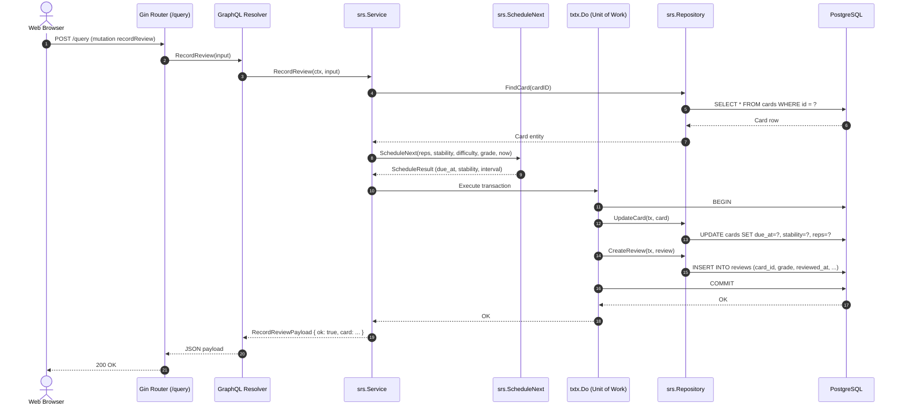
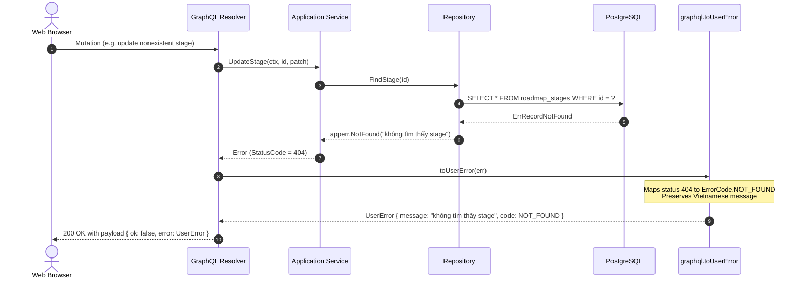

# Request Lifecycle

> End-to-end execution flow of HTTP and GraphQL requests through Gin middleware, per-request dataloaders, transactional Units of Work (`txtx`), and standardized error response mapping.

## 1. Middleware execution order

Requests entering the Gin engine pass through global middleware before reaching route handlers:

```text
Request ---> corsMiddleware ---> gin.Recovery ---> gin.LoggerWithConfig ---> Route Handler / GraphQL Handler
```

| # | Middleware | Kind | Responsibility | Source |
| --- | --- | --- | --- | --- |
| 1 | `corsMiddleware` | Custom | Configures `Access-Control-Allow-*` headers; allows permissive CORS in development | [api/internal/transport/http/router.go](file:///home/hung1/personal/roadmap-learning/api/internal/transport/http/router.go#L71) |
| 2 | `gin.Recovery()` | Built-in | Catches runtime panics, logs stack traces, and returns HTTP 500 | [api/internal/transport/http/router.go](file:///home/hung1/personal/roadmap-learning/api/internal/transport/http/router.go#L72) |
| 3 | `gin.LoggerWithConfig` | Built-in | Formats structured request logs into `slog` writer, skipping `/favicon.ico` | [api/internal/transport/http/router.go](file:///home/hung1/personal/roadmap-learning/api/internal/transport/http/router.go#L73-L77) |

**Add order:** `corsMiddleware` -> `gin.Recovery()` -> `gin.LoggerWithConfig`. Because Gin executes middleware in registration order, the first registered middleware executes outermost.

## 2. Dependency & Context Resolution

When a request reaches the GraphQL endpoint (`/query`):

1. **Root Context Injection** — The HTTP server base context (`context.Context`) is propagated into Gin's request lifecycle.
2. **Dataloader Attachment** — [api/internal/transport/graphql/server.go](file:///home/hung1/personal/roadmap-learning/api/internal/transport/graphql/server.go) wraps the request context with a fresh `Loaders` instance via `NewLoaders(roadmap, srs)` using `dataloadgen`. All nested resolvers within the request share this loader instance to batch N+1 queries.
3. **Resolver Invocation** — `gqlgen` parses the GraphQL AST, validates variables, and dispatches to generated resolver methods.

### Unit of Work Transaction Boundary (`txtx.Do`)

Write operations requiring multi-table atomicity execute within a scoped transaction managed by [api/internal/platform/txtx/txtx.go](file:///home/hung1/personal/roadmap-learning/api/internal/platform/txtx/txtx.go):

```go
err := txtx.Do(ctx, db, func(tx any) error {
    if err := repoA.Save(ctx, tx, entityA); err != nil {
        return err // Triggers automatic rollback
    }
    return repoB.Save(ctx, tx, entityB)
}) // Commits automatically if err == nil
```

Repositories extract the transaction handle via `txtx.Of(db, tx)`. If `tx` is `nil`, the repository executes against the standard connection pool. If an error is returned inside `txtx.Do`, GORM automatically issues a `ROLLBACK`.

## 3. Successful Write Request (e.g. `recordReview`)

A card review mutation records user grading, recomputes SRS stability and interval via FSRS, and persists both card updates and review history atomically:



## 4. Failed Request & Error Normalization

Domain errors carry semantic HTTP status codes (`apperr.StatusCode()`). When a GraphQL resolver receives an error, it maps the error to a typed `UserError` object containing the original Vietnamese message, while unexpected internal panics or unhandled errors are masked as generic `INTERNAL` errors to prevent information leakage:



### Error Code Mapping

[api/internal/transport/graphql/errors.go](file:///home/hung1/personal/roadmap-learning/api/internal/transport/graphql/errors.go) governs the error response taxonomy:

| HTTP Status | GraphQL `ErrorCode` | Application Condition |
| --- | --- | --- |
| `400 Bad Request` | `BAD_REQUEST` | Validation failure (e.g. invalid date format, invalid rating score) |
| `404 Not Found` | `NOT_FOUND` | Missing entity (e.g. nonexistent card, stage, or topic) |
| `409 Conflict` | `CONFLICT` | Unique key collision (e.g. duplicate path slug, duplicate deck name) |
| `501 Not Implemented` | `NOT_IMPLEMENTED` | Unconfigured capability (e.g. peer sync without remote endpoint) |
| `500 Internal Error` | `INTERNAL` | Unexpected database/system failure (masked as `"lỗi hệ thống"`) |

## 5. References

- HTTP middleware setup: [api/internal/transport/http/router.go](file:///home/hung1/personal/roadmap-learning/api/internal/transport/http/router.go)
- GraphQL error handling: [api/internal/transport/graphql/errors.go](file:///home/hung1/personal/roadmap-learning/api/internal/transport/graphql/errors.go)
- Unit of Work manager: [api/internal/platform/txtx/txtx.go](file:///home/hung1/personal/roadmap-learning/api/internal/platform/txtx/txtx.go)
- Dataloader implementation: [api/internal/transport/graphql/dataloader.go](file:///home/hung1/personal/roadmap-learning/api/internal/transport/graphql/dataloader.go)
- Sibling architecture chapters:
  - [01 — Context](01-context.md)
  - [02 — Containers](02-containers.md)
  - [03 — Components](03-components.md)
  - [06 — Conventions](06-conventions.md)
