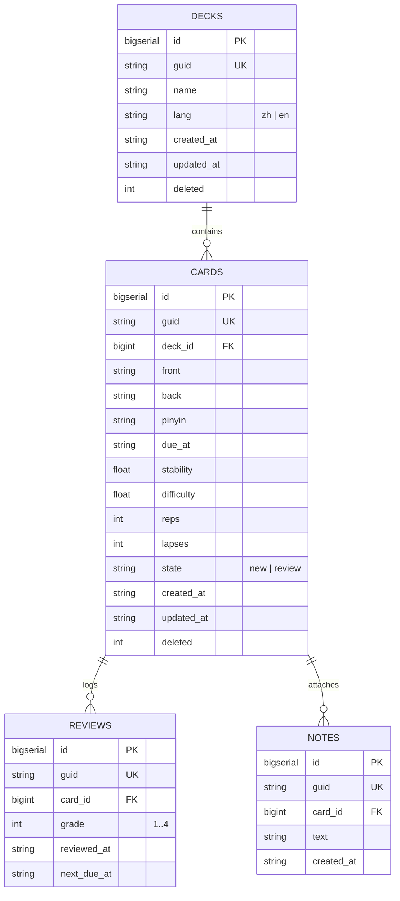
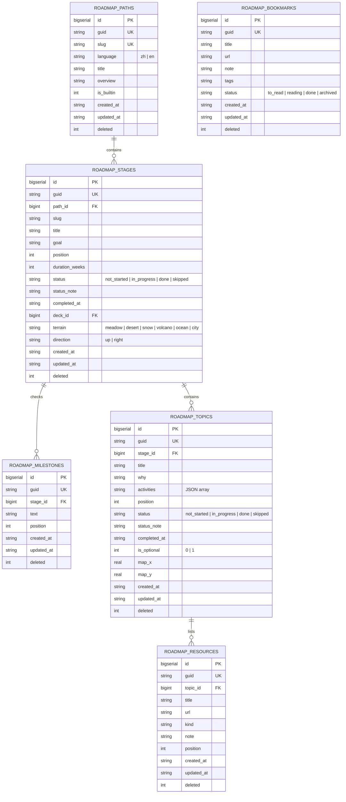
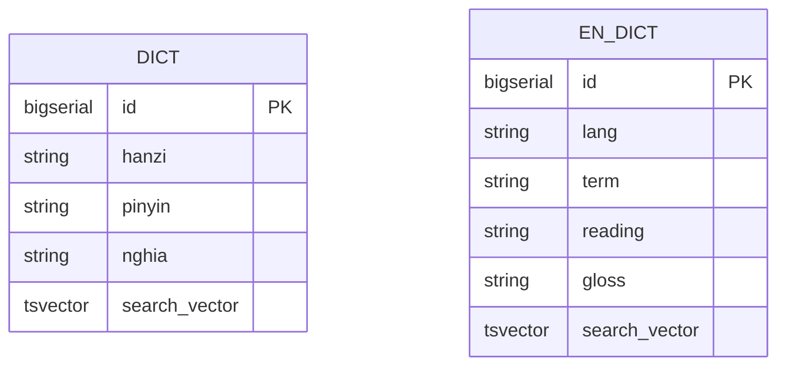

# Data Model (ERD)

> PostgreSQL schema definitions, relational constraints, entity relationships, and indexing strategies supporting spaced repetition, curriculum roadmaps, and offline sync.

## 1. Shared Schema Conventions & Columns

All mutable entities in the database follow a uniform synchronization-ready schema contract established in migration [00001_init.sql](file:///home/hung1/personal/roadmap-learning/api/migrations/00001_init.sql):

| Field | Type | Default | Responsibility | Source |
| --- | --- | --- | --- | --- |
| `id` | `BIGSERIAL` | Auto | Local surrogate primary key | All tables |
| `guid` | `TEXT` | `''` | Global unique UUID string for cross-device sync identification | Mutable tables |
| `created_at` | `TEXT` | — | UTC timestamp formatted as ISO 8601 (`YYYY-MM-DD"T"HH24:MI:SS"Z"`) | Mutable tables |
| `updated_at` | `TEXT` | `''` | UTC timestamp touched automatically on row modification | Mutable tables |
| `deleted` | `INTEGER` | `0` | Soft-delete flag (`0` = active, `1` = deleted/tombstone) | Mutable tables |

### Automatic `updated_at` Touch Trigger

A PostgreSQL trigger function `langapp_touch_updated_at()` ensures that any `UPDATE` touching row data advances `updated_at` to the current UTC timestamp unless explicitly specified:

```sql
CREATE OR REPLACE FUNCTION langapp_touch_updated_at() RETURNS trigger
LANGUAGE plpgsql AS $$
BEGIN
  IF NEW.updated_at IS NOT DISTINCT FROM OLD.updated_at THEN
    NEW.updated_at := to_char(now() AT TIME ZONE 'UTC', 'YYYY-MM-DD"T"HH24:MI:SS"Z"');
  END IF;
  RETURN NEW;
END;
$$;
```

This trigger is bound to `decks`, `cards`, `roadmap_paths`, `roadmap_stages`, `roadmap_milestones`, `roadmap_topics`, `roadmap_resources`, and `roadmap_bookmarks`.

## 2. Spaced Repetition (SRS) Context

The SRS domain encompasses flashcard decks, individual cards with memory stability metrics, review logs, and error notes:



### Key Indexes & Constraints:
- `ux_cards_deck_front` (`deck_id`, `front`) `WHERE deleted = 0` — Partial unique index ensuring unique front text within an active deck while permitting recreating previously deleted cards ([00001_init.sql](file:///home/hung1/personal/roadmap-learning/api/migrations/00001_init.sql#L54)).
- `idx_cards_deck_due` (`deck_id`, `due_at`) — Accelerates queue retrieval for due reviews.
- `idx_reviews_reviewed_at` (`reviewed_at`) — Accelerates dashboard aggregate statistics ([00005_insight_index.sql](file:///home/hung1/personal/roadmap-learning/api/migrations/00005_insight_index.sql#L14)).
- `idx_reviews_reviewed_day` (`substr(reviewed_at, 1, 10)`) — Expression index powering consecutive day streak calculations ([00005_insight_index.sql](file:///home/hung1/personal/roadmap-learning/api/migrations/00005_insight_index.sql#L21)).
- `idx_notes_err` (`id DESC`) `WHERE text LIKE 'ERR|%'` — Partial index optimizing ErrorBook queries ([00005_insight_index.sql](file:///home/hung1/personal/roadmap-learning/api/migrations/00005_insight_index.sql#L31)).

## 3. Curriculum Roadmap & Interactive Map Context

The roadmap system models hierarchical learning paths and gamified interactive world maps:



### Key Roadmap Features:
- **Loose Deck Coupling:** `roadmap_stages.deck_id` references `decks(id) ON DELETE SET NULL` ([00003_roadmap_a1.sql](file:///home/hung1/personal/roadmap-learning/api/migrations/00003_roadmap_a1.sql#L14)), enabling direct navigation from stage to review without cascade deletion.
- **Horizontal Map Navigation:** `roadmap_stages.direction` defaults to `'right'` for roadmap.sh-style landscape scrolling ([00006_roadmap_map_horizontal.sql](file:///home/hung1/personal/roadmap-learning/api/migrations/00006_roadmap_map_horizontal.sql#L27)).
- **Optional Topic Omission:** `roadmap_topics.is_optional` excludes reference materials from progress completion percentages ([00003_roadmap_a1.sql](file:///home/hung1/personal/roadmap-learning/api/migrations/00003_roadmap_a1.sql#L20)).

## 4. Dictionaries & Full-Text Search (FTS)



- **PostgreSQL Full-Text Search:** Weighted `tsvector` columns updated automatically via triggers `trg_dict_search_vector` and `trg_en_dict_search_vector` with GIN indexes ([00002_fts.sql](file:///home/hung1/personal/roadmap-learning/api/migrations/00002_fts.sql#L25-L30)).
- **Trigram Similarity:** Utilizes `pg_trgm` GIN indexes (`idx_dict_hanzi_trgm`, `idx_dict_pinyin_trgm`, `idx_en_dict_term_trgm`) to provide fuzzy matching for multi-character Chinese words and English variations ([00002_fts.sql](file:///home/hung1/personal/roadmap-learning/api/migrations/00002_fts.sql#L31-L33)).
- **Case-Insensitive Exact Term Lookup:** B-tree index `idx_en_dict_term_lower` on `lower(term)` ([00002_fts.sql](file:///home/hung1/personal/roadmap-learning/api/migrations/00002_fts.sql#L58)).

## 5. Synchronization & Conflict Tracking

- **`sync_meta`** (`k TEXT PRIMARY KEY, v TEXT NOT NULL`) — Stores local instance metadata including last successful sync timestamps and peer IDs.
- **`sync_conflicts`** (`id BIGSERIAL PK, table_name TEXT, guid TEXT, winner TEXT, detail TEXT, created_at TEXT`) — Historical conflict audit log recorded whenever an incoming snapshot row collides with a local row and is resolved via Last-Write-Wins (LWW) ([00001_init.sql](file:///home/hung1/personal/roadmap-learning/api/migrations/00001_init.sql#L102-L110)).
- **`schema_migrations`** (`version INTEGER PK, applied_at TEXT`) — Preserved compatibility table holding schema version `4` for backward compatibility checks with legacy export formats.

## 6. References

- Initial migration: [api/migrations/00001_init.sql](file:///home/hung1/personal/roadmap-learning/api/migrations/00001_init.sql)
- Full-text search migration: [api/migrations/00002_fts.sql](file:///home/hung1/personal/roadmap-learning/api/migrations/00002_fts.sql)
- Roadmap amendment A1: [api/migrations/00003_roadmap_a1.sql](file:///home/hung1/personal/roadmap-learning/api/migrations/00003_roadmap_a1.sql)
- Map layout schema: [api/migrations/00004_roadmap_map.sql](file:///home/hung1/personal/roadmap-learning/api/migrations/00004_roadmap_map.sql)
- Insight indexes: [api/migrations/00005_insight_index.sql](file:///home/hung1/personal/roadmap-learning/api/migrations/00005_insight_index.sql)
- Map horizontal update: [api/migrations/00006_roadmap_map_horizontal.sql](file:///home/hung1/personal/roadmap-learning/api/migrations/00006_roadmap_map_horizontal.sql)
- Sibling architecture chapters:
  - [01 — Context](01-context.md)
  - [03 — Components](03-components.md)
  - [04 — Request Lifecycle](04-request-lifecycle.md)
