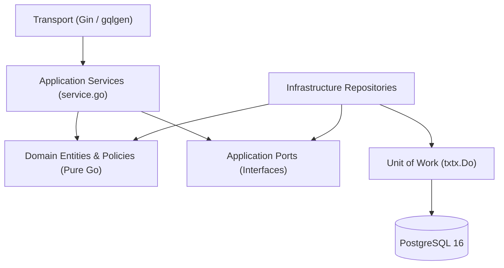

# Engineering Conventions

> Architectural invariants, Clean Architecture boundary enforcement, file conventions, testing isolation, and wire format contracts governing the Lang Learn App codebase.

## 1. Imports

The Go codebase adheres to strict import ordering and boundary conventions:

- **Grouped Import Blocks** — Standard library packages first, followed by third-party external dependencies, followed by internal application packages (`langapp/internal/...`), separated by blank lines.
- **Unidirectional Layer Boundaries** — Packages in `internal/domain` must NEVER import `internal/application`, `internal/infrastructure`, `internal/transport`, or `gorm.io/*`. Domain packages contain pure Go logic without framework or database dependencies.
- **Cross-Context Encapsulation** — Application services do not import repository implementations from another context. Inter-context operations must communicate via domain ports and adapters wired in [api/internal/platform/di.go](file:///home/hung1/personal/roadmap-learning/api/internal/platform/di.go).

## 2. Vertical-Slice File Conventions

Each bounded context under `internal/domain/`, `internal/application/`, and `internal/infrastructure/` follows a standardized internal file layout:

| File Role | Location | Responsibility | Example |
| --- | --- | --- | --- |
| Entity & Value Objects | `internal/domain/<ctx>/` | Pure domain models, validation, and domain math | [domain/srs/entity.go](file:///home/hung1/personal/roadmap-learning/api/internal/domain/srs/entity.go) |
| Domain Policy | `internal/domain/<ctx>/` | Algorithms and scheduling rules | [domain/srs/policy.go](file:///home/hung1/personal/roadmap-learning/api/internal/domain/srs/policy.go) |
| Ports | `internal/application/<ctx>/ports.go` | Outbound repository and adapter interfaces | [application/srs/ports.go](file:///home/hung1/personal/roadmap-learning/api/internal/application/srs/ports.go) |
| Service | `internal/application/<ctx>/service.go` | Use case orchestration and transaction coordination | [application/srs/service.go](file:///home/hung1/personal/roadmap-learning/api/internal/application/srs/service.go) |
| Repository | `internal/infrastructure/<ctx>/repository.go` | GORM and SQL persistence implementation | [infrastructure/srs/repository.go](file:///home/hung1/personal/roadmap-learning/api/internal/infrastructure/srs/repository.go) |
| Resolver | `internal/transport/graphql/` | GraphQL root/field query and mutation resolution | [graphql/root.resolvers.go](file:///home/hung1/personal/roadmap-learning/api/internal/transport/graphql/root.resolvers.go) |

## 3. Clean Architecture Layering

| Rule | Enforcement |
| --- | --- |
| Pure Domain Core | `internal/domain` has zero database/transport dependencies. Verified by compiler build tags. |
| Inversion of Control | Application layer depends on interfaces (`ports.go`); Infrastructure implements those interfaces. |
| Transaction Scoping | Transactions are managed at the application service boundary via `txtx.Do`, not inside controllers or resolvers. |
| Typed Nil Safety | Any interface conversion or nil-checking uses [api/internal/typednil/typednil.go](file:///home/hung1/personal/roadmap-learning/api/internal/typednil/typednil.go) to avoid `(*T)(nil) != nil` bugs. |

## 4. Wire Format & GraphQL Contracts

- **Field Naming (camelCase)** — All GraphQL schema fields use `camelCase` (e.g. `cardId`, `dueAt`, `nextDueAt`), mapped automatically to Go struct fields by `gqlgen`.
- **String RFC3339 Timestamps** — All temporal columns and fields are encoded as ISO 8601 / RFC 3339 strings (e.g. `2026-10-07T03:34:37Z`). They are stored as PostgreSQL `TEXT` columns to preserve portable sync semantics.
- **Tombstones & Soft Deletes** — Deletions on mutable tables set `deleted = 1` and update `updated_at`. Hard deletes (`DELETE FROM`) are strictly forbidden on synced entities.
- **Error Payloads** — GraphQL mutations do not throw transport-level GraphQL errors for normal domain failures. They return payloads with `ok: Boolean!` and an optional `error: UserError { message, code }` preserving verbatim Vietnamese error messages.

## 5. Testing Invariants & Database Isolation

Testing is orchestrated exclusively via the project [Makefile](file:///home/hung1/personal/roadmap-learning/Makefile) (`make check`):

- **Dedicated Isolated Test Database (`langapp_test`)** — Integration tests never run against the application's active `langapp` database. Running tests against production connection strings causes instant failure via `testdb.requireIsolatedDB` ([open.go](file:///home/hung1/personal/roadmap-learning/api/internal/platform/testdb/open.go)).
- **Dedicated Extension Schema (`testext`)** — To prevent accidental data pollution into `public` during test schema initialization, extensions (`pg_trgm`) are loaded into `testext` while per-test schemas are dynamically mounted and destroyed.
- **No Silently Skipped Tests** — Test suites must not hide missing database configurations by silently skipping test execution. `make check` guarantees all database and unit suites run to completion.

## 6. References

- Test harness and rules: [Makefile](file:///home/hung1/personal/roadmap-learning/Makefile)
- Typed nil checker: [api/internal/typednil/typednil.go](file:///home/hung1/personal/roadmap-learning/api/internal/typednil/typednil.go)
- Isolated test DB utilities: [api/internal/platform/testdb/open.go](file:///home/hung1/personal/roadmap-learning/api/internal/platform/testdb/open.go)
- Sibling architecture chapters:
  - [01 — Context](01-context.md)
  - [02 — Containers](02-containers.md)
  - [03 — Components](03-components.md)
  - [04 — Request Lifecycle](04-request-lifecycle.md)
  - [05 — Data Model](05-data-model.md)
