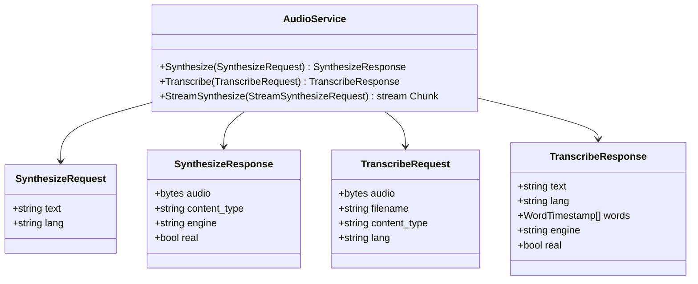
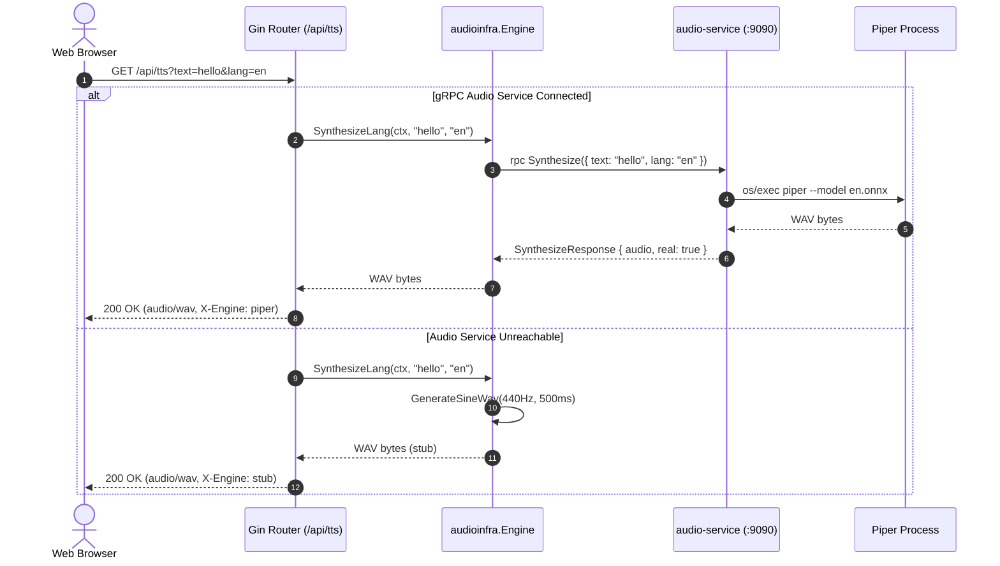
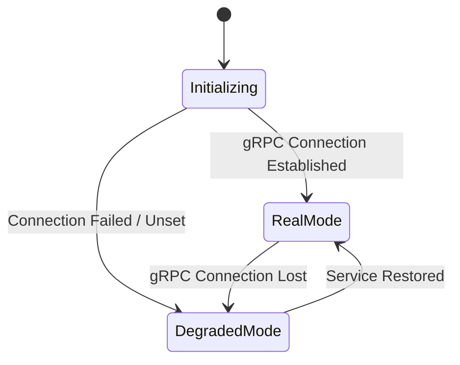
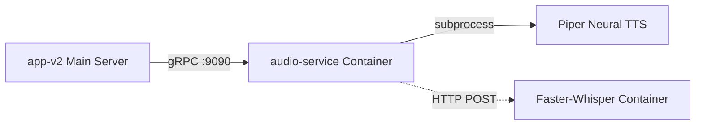

# Audio Subsystem & Speech Services

> Out-of-process gRPC audio microservice delivering Piper neural text-to-speech synthesis, Faster-Whisper transcription forwarding, and fail-degraded sine stub fallbacks.

## 1. Purpose & Scope

| Category | Specification |
| --- | --- |
| **Responsibility** | Generates neural speech audio, processes microphone speech recordings, and manages audio fallbacks |
| **In scope** | Local neural TTS via Piper, gRPC audio protocol (`audio.v1`), streaming WAV delivery, STT forwarding to Faster-Whisper, sine wave stub generator |
| **Out of scope** | Transcript alignment and scoring (owned by `practice`), card audio storage (owned by `srs`) |
| **Primary actors** | Web UI Player & Recorder, internal services via gRPC |

## 2. Responsibilities & Capabilities

- **Out-of-Process Isolation** — Runs Piper neural TTS and voice weights (~752MB) in a dedicated container (`audio-service`) to prevent Python/C++ crashes from terminating the web server ([server.go](file:///home/hung1/personal/roadmap-learning/api/services/audio-service/server.go)).
- **Dual-Language Neural Synthesis** — Generates natural WAV audio for Chinese (`zh`) and English (`en`) using pre-baked ONNX models.
- **Fail-Degraded Stub Mode** — If the gRPC audio service is unreachable or unconfigured, the application transparently falls back to an in-memory 440Hz sine wave tone generator, marking responses with header `X-Engine: stub` ([stub.go](file:///home/hung1/personal/roadmap-learning/api/internal/infrastructure/audio/stub.go)).
- **Speech Recognition Proxy** — Forwards multipart audio uploads to Faster-Whisper and returns transcribed text with optional per-token timestamps.
- **Binary Streaming Delivery** — Streams raw binary WAV chunks directly over HTTP at `GET /api/tts` rather than encoding audio in Base64 over GraphQL.

## 3. Domain Model & Protocol

Defined in [api/proto/audio/v1/audio.proto](file:///home/hung1/personal/roadmap-learning/api/proto/audio/v1/audio.proto):

## 4. Persistence

The audio subsystem is stateless; it does not persist audio files or transcripts directly to PostgreSQL. Audio playback is generated on-demand and streamed to the client browser.

## 5. API Surface

### REST Endpoints (Gin Router)
- `GET /api/tts?text=<text>&lang=<zh|en>` — Streams audio as `audio/wav`. Response headers include `X-Engine: piper` or `X-Engine: stub`.
- `POST /api/stt` — Accepts multipart form file upload (`audio`), returning JSON `{"text": "...", "lang": "..."}`.
- `GET /api/health` — Reports status `"ok"` (Postgres OK, real audio engine) or `"degraded"` (Postgres OK, stub audio engine).

### gRPC Service (`:9090`)
- `audio.v1.Audio/Synthesize` — Synchronous audio synthesis.
- `audio.v1.Audio/Transcribe` — Speech-to-text transcription.
- `audio.v1.Audio/StreamSynthesize` — Chunked audio streaming.

## 6. Key Flows

## 7. Lifecycle & State

The audio engine operates statelessly on a request-response lifecycle:

## 8. Permissions & Security

- Internal gRPC service is bound to private Docker network (`audio-service:9090`).
- No public exposure of port 9090 is configured in production.

## 9. Validation & Error Taxonomy

| Error Code | Source | Condition |
| --- | --- | --- |
| `InvalidArgument` | gRPC | Empty text or empty audio buffer submitted |
| `Unavailable` | gRPC | Downstream Whisper server unreachable (falls back to stub transcription) |

## 10. Configuration

- `AUDIO_GRPC_ADDR` — Host and port for gRPC client connection (default `:9090`).
- `WHISPER_URL` — External endpoint for Faster-Whisper sidecar (e.g. `http://stt:9000/asr`).
- `PIPER_BIN` / `PIPER_MODEL_ZH` / `PIPER_MODEL_EN` — Paths to Piper binary and voice models.

## 11. Observability

- Health check probe: [api/cmd/audio-health-probe](file:///home/hung1/personal/roadmap-learning/api/cmd/audio-health-probe/main.go) queries `grpc_health_v1.Check`.
- Synthesis duration and engine selection are logged at `info` level.

## 12. Dependencies & Coupling

## 13. Testing

- Engine tests: [api/internal/infrastructure/audio/client_test.go](file:///home/hung1/personal/roadmap-learning/api/internal/infrastructure/audio/client_test.go).
- Service integration tests: [api/services/audio-service/audio_test.go](file:///home/hung1/personal/roadmap-learning/api/services/audio-service/audio_test.go).
- HTTP health engine tests: [api/internal/transport/http/health_engine_test.go](file:///home/hung1/personal/roadmap-learning/api/internal/transport/http/health_engine_test.go).

## 14. Known Limitations & Edge Cases

- **Memory Footprint:** Loading neural voice models requires approximately 750MB of RAM.
- **Stub Notice:** In development environments without Piper models, synthesis returns a short pure-tone audio clip to allow UI validation without installing machine learning weights.

## 15. References

- Protocol buffer definition: [api/proto/audio/v1/audio.proto](file:///home/hung1/personal/roadmap-learning/api/proto/audio/v1/audio.proto)
- Audio service entrypoint: [api/services/audio-service/main.go](file:///home/hung1/personal/roadmap-learning/api/services/audio-service/main.go)
- HTTP audio endpoints: [api/internal/transport/http/audio.go](file:///home/hung1/personal/roadmap-learning/api/internal/transport/http/audio.go)
