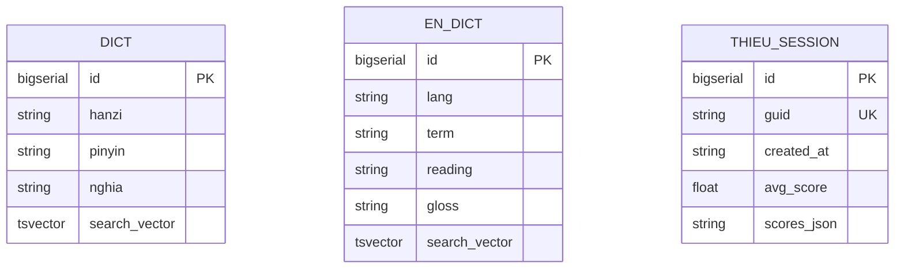
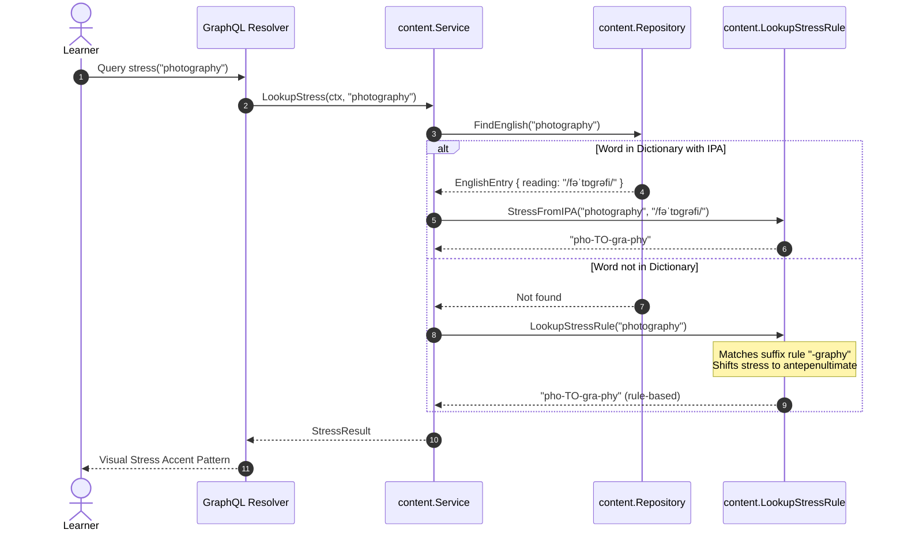
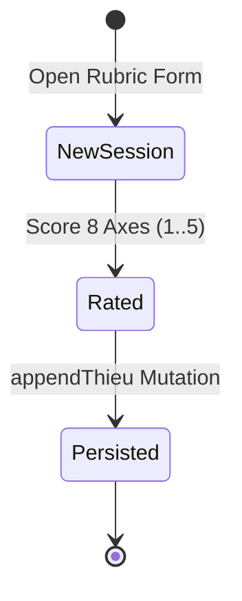
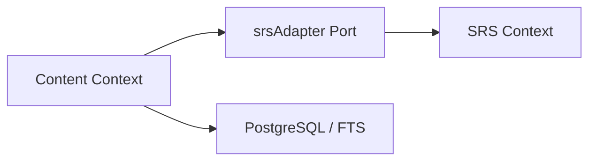

# Language Content & Curated Assets

> Linguistic resources, bilingual dictionaries, phonetic analysis rules, Chinese stroke order lookups, English stress detection, and the 8-axis THIEU self-evaluation rubric.

## 1. Purpose & Scope

| Category | Specification |
| --- | --- |
| **Responsibility** | Owns lexical dictionaries, phonetic rule evaluators, stroke data, and curated reading materials |
| **In scope** | Chinese dictionary (`dict`), English dictionary (`en_dict`), HSK seed import, Pinyin tone grading, English stress detection, sentence chunking, THIEU evaluation, Graded reader |
| **Out of scope** | Card scheduling algorithms (owned by `srs`), audio synthesis processes (owned by `audio`) |
| **Primary actors** | Learner (via dictionary lookups, Pinyin drills, and reading views) |

## 2. Responsibilities & Capabilities

- **Bilingual Full-Text Search** — Search via PostgreSQL GIN `tsvector` and `pg_trgm` similarity across Chinese Hanzi/Pinyin and English terms ([00002_fts.sql](file:///home/hung1/personal/roadmap-learning/api/migrations/00002_fts.sql)).
- **Tone Drill Evaluator** — Compares user-entered Pinyin tone numbers (1..4) against target characters and computes accuracy scores ([tone_policy.go](file:///home/hung1/personal/roadmap-learning/api/internal/domain/content/tone_policy.go)).
- **English Stress Engine** — Extracts primary stress from IPA notation or infers stress placement from suffix shift rules ([stress.go](file:///home/hung1/personal/roadmap-learning/api/internal/domain/content/stress.go)).
- **Sentence Chunking Tokenizer** — Classifies words as Content Words vs. Function Words to guide natural English speaking rhythm ([chunk.go](file:///home/hung1/personal/roadmap-learning/api/internal/domain/content/chunk.go)).
- **8-Axis THIEU Rubric** — Evaluates spoken English quality across 8 axes (A: Word Stress, B: Chunking, C: Connected Speech, D: Intonation, E: Phonetics, F: PVO Collocations, G: Fluency, H: Study Habit) on a 1–5 scale ([thieu.go](file:///home/hung1/personal/roadmap-learning/api/internal/domain/content/thieu.go)).

## 3. Domain Model

| Entity | Table / Source | Purpose |
| --- | --- | --- |
| `DictEntry` | `dict` | Chinese character/word definition with Pinyin and Vietnamese translation |
| `EnglishEntry` | `en_dict` | English headword with IPA pronunciation and gloss |
| `THIEUAxis` | In-memory | 8-axis evaluation criteria definitions (A through H) |
| `ReaderArticle` | In-memory seed | Graded bilingual short reading articles |

## 4. Persistence

Key tables: `dict`, `en_dict`, `thieu_sessions`.

| Column | Type | Nullable | Notes |
| --- | --- | --- | --- |
| `dict.hanzi` | `TEXT` | No | Chinese characters |
| `dict.search_vector` | `tsvector` | Yes | GIN indexed for text search |
| `en_dict.term` | `TEXT` | No | English word |
| `en_dict.reading` | `TEXT` | No | IPA phonetic notation |

Indexes & constraints:
- `idx_dict_search` — GIN index on `dict.search_vector`.
- `idx_dict_hanzi_trgm`, `idx_dict_pinyin_trgm` — Trigram GIN indexes for fuzzy Chinese substring search.
- `idx_en_dict_term_lower` — B-tree index on `lower(term)` for case-insensitive exact matching.

## 5. API Surface

Exposed via GraphQL at `/query`:

### Queries
- `dictSearch(q: String!, limit: Int): [DictEntry!]!` — Chinese dictionary search.
- `englishSearch(q: String!, limit: Int): [EnglishEntry!]!` — English dictionary search.
- `stress(word: String!): StressLookup!` — Syllabic stress breakdown.
- `strokes(level: String!, hanzi: String): StrokePayload!` — Character stroke order SVG/JSON.
- `chunk(sentence: String!): ChunkPayload!` — Categorizes words as content or function.
- `gradeTone(expected: String!, answered: String!): GradeTonePayload!` — Evaluates tone quiz answer.
- `thieuAxes: [THIEUAxis!]!` — Returns the 8 assessment axes.
- `thieuSessions: [THIEUSession!]!` — Historical self-evaluation sessions.
- `readerArticles(level: String, id: String): [ReaderArticle!]!` — Graded reader articles.

### Mutations
- `importHSK(input: ImportHSKInput): ImportHSKPayload!` — Seeds HSK vocabulary into deck and dictionary.
- `seedEnglish: SeedEnglishPayload!` — Seeds English vocabulary and PVO/TMRND decks.
- `upsertDictEntry(input: DictEntryInput!): UpsertDictPayload!` — Manually adds dictionary entries.
- `setTone(cardId: ID!, tone: String!): SetTonePayload!` — Evaluates and attaches tone to card.
- `appendThieu(input: ThieuInput!): AppendThieuPayload!` — Records a THIEU assessment session.

## 6. Key Flows

## 7. Lifecycle & State

Linguistic content is largely static reference data. The THIEU rubric session lifecycle follows an append-only audit pattern:

## 8. Permissions & Security

- Single-user local scope.
- Dictionary queries are read-only; mutation imports are idempotent.

## 9. Validation & Error Taxonomy

| Error Code | HTTP Status | Condition |
| --- | --- | --- |
| `BAD_REQUEST` | 400 | Syllable count mismatch in tone grading or invalid axis score (< 1 or > 5) |
| `NOT_FOUND` | 404 | Word not found in dictionary when strict lookup requested |

## 10. Configuration

- Suffix stress shift rules: Defined in [stress.go](file:///home/hung1/personal/roadmap-learning/api/internal/domain/content/stress.go).
- Function word dictionary: Defined in [chunk.go](file:///home/hung1/personal/roadmap-learning/api/internal/domain/content/chunk.go).

## 11. Observability

- Seeding imports log total imported cards and elapsed time.

## 12. Dependencies & Coupling

## 13. Testing

- Unit tests: [api/internal/domain/content/policy_test.go](file:///home/hung1/personal/roadmap-learning/api/internal/domain/content/policy_test.go).
- Service tests: [api/internal/application/content/service_test.go](file:///home/hung1/personal/roadmap-learning/api/internal/application/content/service_test.go).
- Repository tests: [api/internal/infrastructure/content/repository_test.go](file:///home/hung1/personal/roadmap-learning/api/internal/infrastructure/content/repository_test.go).

## 14. Known Limitations & Edge Cases

- **Chinese Word Tokenization:** Standard PostgreSQL `to_tsvector('simple')` treats contiguous Chinese ideographs as single tokens. Therefore, multi-character Hanzi searches rely on `pg_trgm` trigram ILIKE filters ([00002_fts.sql](file:///home/hung1/personal/roadmap-learning/api/migrations/00002_fts.sql#L5-L9)).

## 15. References

- Domain rules: [api/internal/domain/content](file:///home/hung1/personal/roadmap-learning/api/internal/domain/content)
- Schema definitions: [api/graph/schema/content.graphqls](file:///home/hung1/personal/roadmap-learning/api/graph/schema/content.graphqls)
