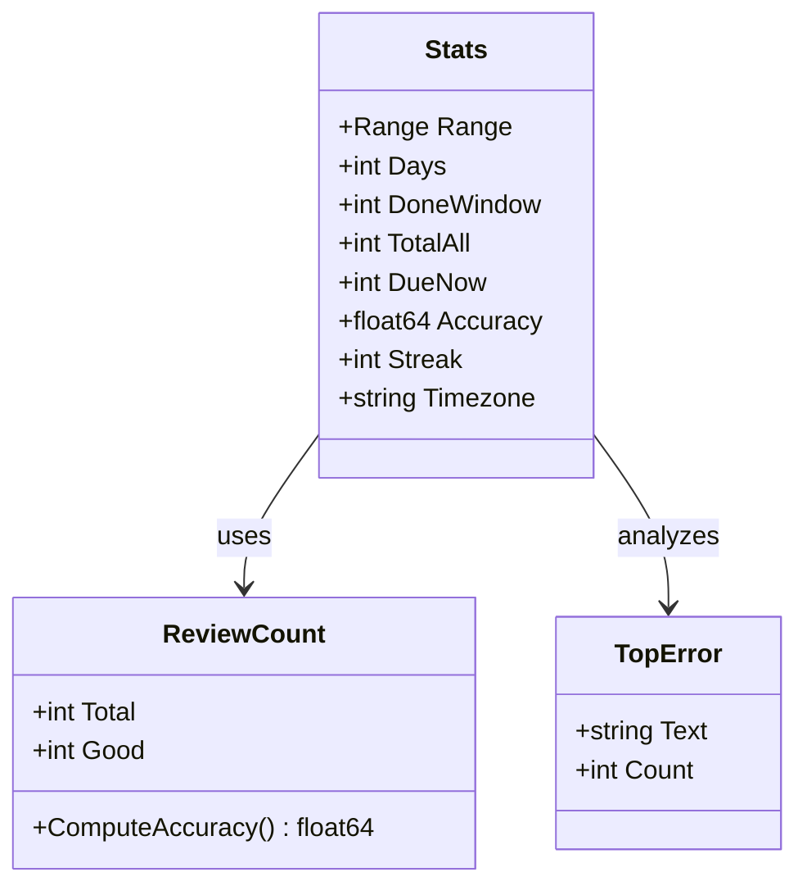
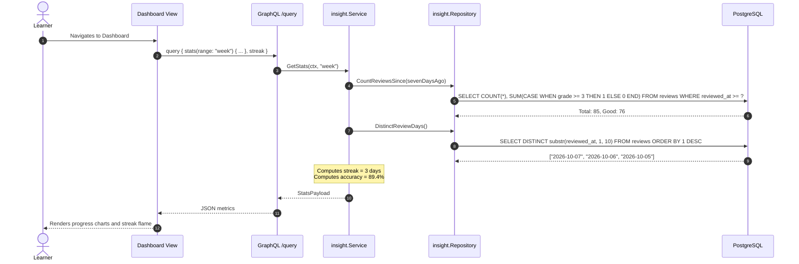

# Learning Insights & Analytics

> Aggregated learning metrics, review performance over time windows, consecutive day streak tracking, and mistake frequency analytics.

## 1. Purpose & Scope

| Category | Specification |
| --- | --- |
| **Responsibility** | Generates dashboard statistics, retention accuracy rates, study streaks, and aggregated mistake frequencies |
| **In scope** | Weekly and monthly review counts, accuracy percentage (grades >= 3), UTC consecutive day streak calculation, error ranking |
| **Out of scope** | Writing new reviews (owned by `srs`), managing individual error notes (owned by `practice`) |
| **Primary actors** | Learner (via Dashboard UI screen) |

## 2. Responsibilities & Capabilities

- **Time-Window Dashboard Stats** — Aggregates review totals, successful review ratios, and current due card counts over `week` (7-day) or `month` (30-day) windows ([entity.go](file:///home/hung1/personal/roadmap-learning/api/internal/domain/insight/entity.go)).
- **Consecutive Day Streak Calculation** — Computes uninterrupted daily review streaks based on UTC review dates (`substr(reviewed_at, 1, 10)`). A streak is preserved if today has no reviews yet but yesterday did.
- **Accuracy Ratio** — Calculates percentage of reviews rated `GradeGood` (3) or `GradeEasy` (4) within the selected window.
- **Top Error Aggregation** — Parses structured error logs across all notes to rank the most common mistake words with deterministic tie-breaking.
- **Roadmap Progression Tracking** — Counts curriculum topic nodes marked complete since a given date.

## 3. Domain Model



| Entity / DTO | Purpose |
| --- | --- |
| `Stats` | Aggregated dashboard metrics for a specified time range |
| `ReviewCount` | Raw count of total reviews vs. successful reviews (grade >= 3) |
| `TopError` | Normalized error term with historical occurrence count |

## 4. Persistence

The insight context is read-only and queries `reviews`, `cards`, `notes`, and `roadmap_topics` using specialized indexes:

Indexes & performance optimizations:
- `idx_reviews_reviewed_at` (`reviewed_at`) — Powers time-bounded count aggregations without sequential table scans ([00005_insight_index.sql](file:///home/hung1/personal/roadmap-learning/api/migrations/00005_insight_index.sql#L14)).
- `idx_reviews_reviewed_day` (`substr(reviewed_at, 1, 10)`) — Expression index enabling index-only scans for streak determination ([00005_insight_index.sql](file:///home/hung1/personal/roadmap-learning/api/migrations/00005_insight_index.sql#L21)).
- `idx_roadmap_topics_completed` (`completed_at`) — Accelerates curriculum progress queries ([00003_roadmap_a1.sql](file:///home/hung1/personal/roadmap-learning/api/migrations/00003_roadmap_a1.sql#L21)).

## 5. API Surface

Exposed via GraphQL at `/query`:

### Queries
- `stats(range: String): StatsPayload!` — Computes study statistics for `"week"` (default) or `"month"`.
- `streak: Int!` — Returns the current consecutive day study streak.
- `insightTopErrors(limit: Int): TopErrorsPayload!` — Ranks most frequent error patterns.
- `progressOverRange(since: String!): ProgressResultPayload!` — Returns count of roadmap topics completed since a given UTC date.

## 6. Key Flows



## 7. Lifecycle & State

The Insight domain computes derived, read-only analytics and maintains no independent state machine.

## 8. Permissions & Security

- Single-user local scope.

## 9. Validation & Error Taxonomy

| Error Code | HTTP Status | Condition |
| --- | --- | --- |
| `BAD_REQUEST` | 400 | Invalid range parameter (must be `"week"`, `"month"`, or empty) or invalid date string |

## 10. Configuration

- Window Definitions: Configured in [entity.go](file:///home/hung1/personal/roadmap-learning/api/internal/domain/insight/entity.go) (`RangeWeek = 7` days, `RangeMonth = 30` days).

## 11. Observability

- Aggregation performance is tracked via query execution duration logs.

## 12. Dependencies & Coupling

```mermaid
flowchart LR
    INSIGHT[Insight Context] --> DB[PostgreSQL (reviews, cards, notes, topics)]
```

## 13. Testing

- Domain policy tests: [api/internal/domain/insight/policy_test.go](file:///home/hung1/personal/roadmap-learning/api/internal/domain/insight/policy_test.go).
- Service tests: [api/internal/application/insight/service_test.go](file:///home/hung1/personal/roadmap-learning/api/internal/application/insight/service_test.go).

## 14. Known Limitations & Edge Cases

- **Timezone Normalization:** Streaks are calculated using UTC dates (`YYYY-MM-DD`). Users studying near local midnight across timezones may observe streak boundary shifts aligned with UTC 00:00.

## 15. References

- Domain rules: [api/internal/domain/insight](file:///home/hung1/personal/roadmap-learning/api/internal/domain/insight)
- Schema definitions: [api/graph/schema/insight.graphqls](file:///home/hung1/personal/roadmap-learning/api/graph/schema/insight.graphqls)
