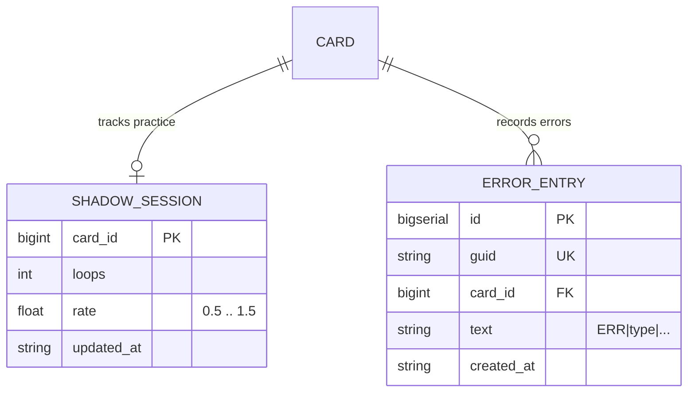
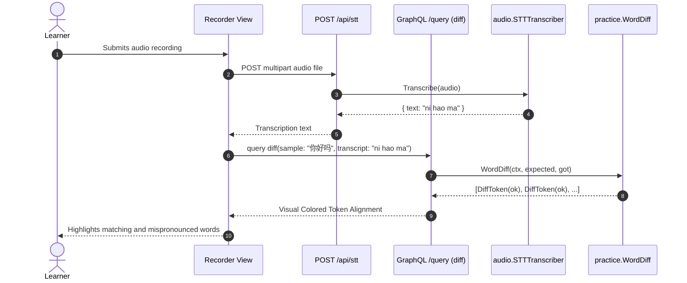
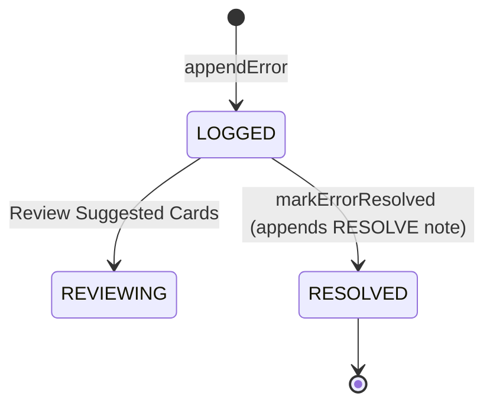

# Practice & Error Book

> Pronunciation shadowing player, audio recording analysis, token-level transcription diffing, and personal error book notebook.

## 1. Purpose & Scope

| Category | Specification |
| --- | --- |
| **Responsibility** | Manages shadowing practice loop sessions, audio comparison diffs, and error note tracking |
| **In scope** | Variable rate audio loop tracking (0.5x–1.5x), LCS word alignment diffing, error book entries, error resolution, card error suggestions |
| **Out of scope** | Low-level neural TTS/STT model inference (owned by `audio`), SRS memory scheduling (owned by `srs`) |
| **Primary actors** | Learner (via Shadow Player, Recorder, and Error Book UI screens) |

## 2. Responsibilities & Capabilities

- **Shadowing Session Tracking** — Tracks repetition loop counts and playback speeds (0.5x to 1.5x) for individual cards ([shadow.go](file:///home/hung1/personal/roadmap-learning/api/internal/domain/practice/shadow.go)).
- **Token-Level Word Alignment (LCS Diff)** — Compares learner speech transcripts against target text using Longest Common Subsequence (LCS), classifying tokens as `ok`, `wrong`, `missing`, or `extra` ([diff.go](file:///home/hung1/personal/roadmap-learning/api/internal/domain/practice/diff.go)).
- **Chinese Simplified Normalization** — Converts Traditional characters to Simplified characters before diff comparison to prevent false positive errors.
- **Error Book Logging** — Stores structured error records in the `notes` table using `ERR|<type>|<detail>` format.
- **Error Resolution Tracking** — Resolves errors in an append-only fashion by writing resolution audit notes, preserving distributed sync consistency.

## 3. Domain Model



| Entity | Storage | Purpose |
| --- | --- | --- |
| `ShadowSession` | In-memory / DB | Tracks completed shadowing loops and preferred playback rate for a card |
| `DiffToken` | In-memory | Word diff result containing token text and alignment status (`ok`, `wrong`, `missing`, `extra`) |
| `ErrorEntry` | `notes` | Log of a pronunciation or linguistic error associated with a card |

## 4. Persistence

Errors and shadowing sessions utilize the `notes` table with dedicated indexing:

| Column | Type | Nullable | Notes |
| --- | --- | --- | --- |
| `notes.card_id` | `BIGINT` | Yes | Foreign key to `cards.id` |
| `notes.text` | `TEXT` | No | Encodes error payload: `ERR|<category>|<detail>` |
| `notes.created_at` | `TEXT` | No | Creation timestamp (UTC RFC3339) |

Indexes:
- `idx_notes_err` (`id DESC`) `WHERE text LIKE 'ERR|%'` — Fast retrieval of recent error records ([00005_insight_index.sql](file:///home/hung1/personal/roadmap-learning/api/migrations/00005_insight_index.sql#L31)).
- `idx_notes_err_card` (`card_id`, `id DESC`) `WHERE text LIKE 'ERR|%'` — Fast retrieval of errors for a specific card.

## 5. API Surface

Exposed via GraphQL at `/query`:

### Queries
- `shadowProgress(cardId: ID!): ShadowProgress!` — Returns loops completed and current playback rate.
- `errors(cardId: ID, limit: Int): [ErrorEntry!]!` — Returns error book entries (newest first).
- `topErrors(limit: Int): [TopErrorCount!]!` — Returns the most frequent error terms.
- `errorSuggestions(limit: Int): [CardErrorCount!]!` — Recommends cards with high error frequency for review.
- `diff(sample: String!, transcript: String!): DiffPayload!` — Compares spoken transcript against sample text.

### Mutations
- `recordShadowProgress(input: ShadowProgressInput!): ShadowProgressPayload!` — Advances loop count.
- `appendError(input: AppendErrorInput!): AppendErrorPayload!` — Records a new error into the notebook.
- `markErrorResolved(errorId: ID!): MarkErrorResolvedPayload!` — Appends resolution note for an error.

## 6. Key Flows



## 7. Lifecycle & State

Errors follow an append-only lifecycle to maintain compatibility with decentralized sync:



## 8. Permissions & Security

- Single-user local application context.

## 9. Validation & Error Taxonomy

| Error Code | HTTP Status | Condition |
| --- | --- | --- |
| `BAD_REQUEST` | 400 | Playback rate outside allowable range `[0.5, 1.5]` or negative loop count |
| `NOT_FOUND` | 404 | Target card ID or error note ID does not exist |

## 10. Configuration

- Playback Rate Limits: Defined in [shadow.go](file:///home/hung1/personal/roadmap-learning/api/internal/domain/practice/shadow.go) (`MinRate = 0.5`, `MaxRate = 1.5`, `DefaultRate = 1.0`).

## 11. Observability

- LCS execution time and error note creation frequencies are monitored.

## 12. Dependencies & Coupling

```mermaid
flowchart LR
    PRACTICE[Practice Context] --> AUDIO[Audio Context (via sttPort/ttsPort)]
    PRACTICE --> CONTENT[Content Context (Chinese Normalization)]
    PRACTICE --> DB[PostgreSQL (notes table)]
```

## 13. Testing

- Unit tests: [api/internal/domain/practice/diff_test.go](file:///home/hung1/personal/roadmap-learning/api/internal/domain/practice/diff_test.go).
- Service tests: [api/internal/application/practice/service_test.go](file:///home/hung1/personal/roadmap-learning/api/internal/application/practice/service_test.go).
- Repository tests: [api/internal/infrastructure/practice/repository_test.go](file:///home/hung1/personal/roadmap-learning/api/internal/infrastructure/practice/repository_test.go).

## 14. Known Limitations & Edge Cases

- **Non-destructive Resolution:** Resolving an error does not issue a SQL `DELETE` or `UPDATE` on the original error row; instead, it writes a reference record so peer devices can merge resolution status without tombstone race conditions.

## 15. References

- Domain rules: [api/internal/domain/practice](file:///home/hung1/personal/roadmap-learning/api/internal/domain/practice)
- Schema definitions: [api/graph/schema/practice.graphqls](file:///home/hung1/personal/roadmap-learning/api/graph/schema/practice.graphqls)
