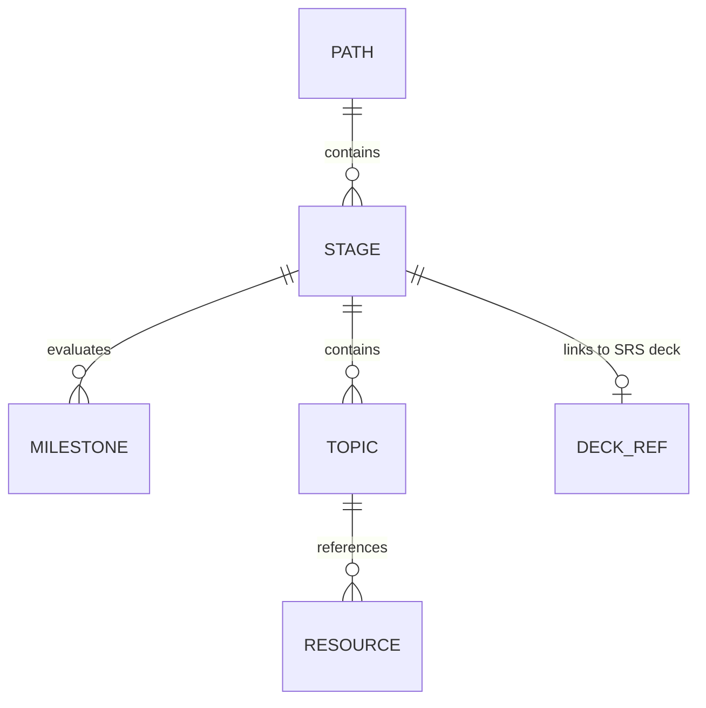
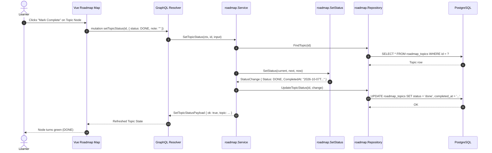
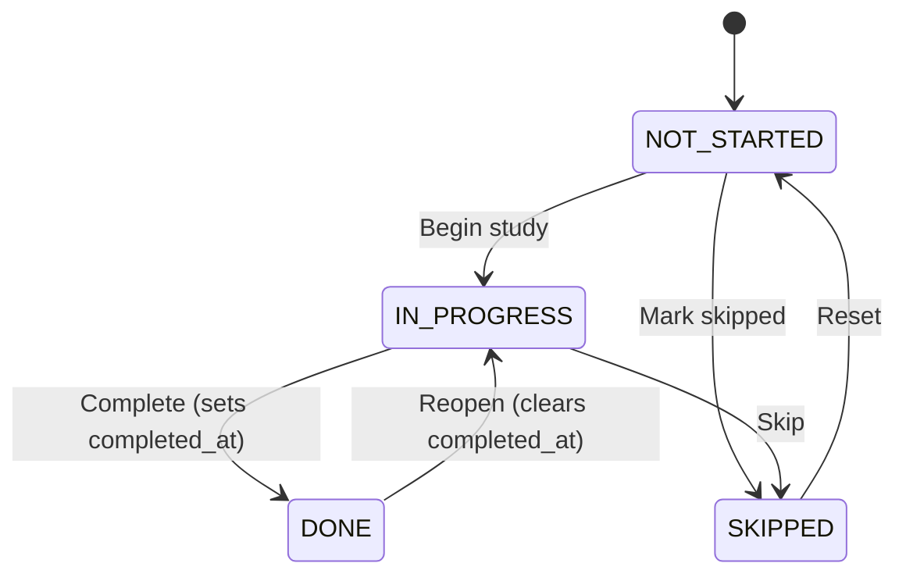

# Roadmap & Interactive Map

> Hierarchical 5-level language curriculum trees, gamified horizontal world map canvas, and personal learning bookmark management.

## 1. Purpose & Scope

| Category | Specification |
| --- | --- |
| **Responsibility** | Manages learning paths, stages, milestones, topics, resources, visual map layout points, and independent bookmarks |
| **In scope** | 5-level curriculum structure, automated geometric canvas coordinates, stage status transitions, deck linking, and web link bookmarks |
| **Out of scope** | Direct flashcard creation (owned by `srs`), vocabulary content definition (owned by `content`) |
| **Primary actors** | Learner (via Vue 3 Roadmap Map and Bookmarks screens) |

## 2. Responsibilities & Capabilities

- **Hierarchical Path Trees** — Organizes curriculum into `Path` -> `Stage` -> `Milestones` and `Topics` -> `Resources`.
- **Automated Landscape Map Layout** — Computes sinusoidal landscape game-like coordinates (`map_x`, `map_y`) on a fixed 900px canvas height ([map_layout.go](file:///home/hung1/personal/roadmap-learning/api/internal/domain/roadmap/map_layout.go)).
- **Level State Progression** — Computes visual progression states (`DONE`, `CURRENT`, `LOCKED`) across sequential topic nodes.
- **Deck Navigation Coupling** — Stages optionally reference an SRS deck ID (`ON DELETE SET NULL`), providing a direct "Practice in Review" button.
- **Independent Bookmarks** — Manages reference web links with tags, note annotations, and reading statuses.

## 3. Domain Model



| Entity | Table | Purpose |
| --- | --- | --- |
| `Path` | `roadmap_paths` | Top-level curriculum course (e.g. Chinese HSK 1–4, English Communication) |
| `Stage` | `roadmap_stages` | High-level curriculum stage with terrain theme and time duration in weeks |
| `Milestone` | `roadmap_milestones` | Qualitative evaluation checkpoints for a stage |
| `Topic` | `roadmap_topics` | Actionable learning lessons with activities and visual map coordinates |
| `Resource` | `roadmap_resources` | Curated articles, videos, podcasts, and tools for a topic |
| `Bookmark` | `roadmap_bookmarks` | Personal reading list links with status and tag filtering |

## 4. Persistence

Key tables: `roadmap_paths`, `roadmap_stages`, `roadmap_milestones`, `roadmap_topics`, `roadmap_resources`, `roadmap_bookmarks`.

| Column | Type | Nullable | Notes |
| --- | --- | --- | --- |
| `roadmap_paths.slug` | `TEXT` | No | Unique natural identifier, used in URL routes (`/roadmap/:slug`) |
| `roadmap_stages.terrain` | `TEXT` | No | Visual map biome: `meadow`, `desert`, `snow`, `volcano`, `ocean`, `city` |
| `roadmap_stages.direction` | `TEXT` | No | Map scroll orientation, defaults to `'right'` |
| `roadmap_stages.completed_at` | `TEXT` | Yes | Set when status enters `done`; cleared when leaving `done` |
| `roadmap_topics.map_x`, `map_y` | `REAL` | Yes | Custom visual canvas coordinates; calculated dynamically if `NULL` |
| `roadmap_topics.is_optional` | `INTEGER` | No | `1` = optional reference, omitted from progress completion denominator |

Indexes & constraints:
- `ux_roadmap_paths_slug` (`slug`) — Unique index enforcing distinct path slugs.
- `ux_roadmap_stages_path_slug` (`path_id`, `slug`) — Scopes stage slugs within paths.
- `idx_roadmap_stages_path` (`path_id`, `position`, `id`) — Fast stage retrieval in display order.
- `idx_roadmap_topics_stage` (`stage_id`, `position`, `id`) — Fast topic retrieval in display order.

## 5. API Surface

Exposed via GraphQL at `/query`:

### Queries
- `paths: [PathSummary!]!` — Lists active paths with summary progress percentages.
- `path(slug: String!): Path` — Full 5-level hierarchical tree with computed map coordinates and topic unlock states.
- `pathProgress(slug: String!, since: String): PathProgressPayload!` — Historical completion metrics.
- `bookmarks(status: BookmarkStatus, tag: String): [Bookmark!]!` — Filterable bookmarks list.

### Mutations
- `createPath`, `updatePath`, `deletePath(slug: String!)` — Manages learning tracks.
- `createStage`, `updateStage`, `deleteStage`, `setStageStatus(id: ID!, input: StatusInput!)` — Stage management and progress transitions.
- `createTopic`, `updateTopic`, `deleteTopic`, `setTopicStatus(id: ID!, input: StatusInput!)` — Topic lifecycle.
- `createResource`, `updateResource`, `deleteResource` — Resource links.
- `createMilestone`, `updateMilestone`, `deleteMilestone` — Milestones.
- `createBookmark`, `updateBookmark`, `deleteBookmark`, `setBookmarkStatus` — Bookmarks management.

## 6. Key Flows



## 7. Lifecycle & State

Topic and stage nodes transition between four distinct states governed by [status_policy.go](file:///home/hung1/personal/roadmap-learning/api/internal/domain/roadmap/status_policy.go):



## 8. Permissions & Security

- **Single-User Scope** — Operations are restricted to local web access.
- **Built-in Path Protection** — Built-in curriculum seeds (`is_builtin = 1`) cannot be deleted via API.

## 9. Validation & Error Taxonomy

| Error Code | HTTP Status | Condition |
| --- | --- | --- |
| `BAD_REQUEST` | 400 | Invalid slug format, negative position, or out-of-range map coordinate |
| `NOT_FOUND` | 404 | Target path, stage, topic, or bookmark does not exist |
| `CONFLICT` | 409 | Duplicate path slug or duplicate stage slug within path |

## 10. Configuration

- Embedded Curriculum: Automatically loaded on server boot from [api/roadmap_seed](file:///home/hung1/personal/roadmap-learning/api/roadmap_seed).
- Map Geometry: Defined in [api/internal/domain/roadmap/map_layout.go](file:///home/hung1/personal/roadmap-learning/api/internal/domain/roadmap/map_layout.go) (`MapCanvasHeight = 900.0`, `MapNodeSpacing = 440.0`).

## 11. Observability

- Boot Seeding: Logged at startup (`"seed roadmap"`) with success status or failure warning.
- Dataloading: Batch execution logged under debug levels for dataloader batches.

## 12. Dependencies & Coupling

```mermaid
flowchart LR
    ROADMAP[Roadmap Context] --> SRS[SRS Context (via roadmapDeckReader)]
    ROADMAP --> TXTX[txtx Unit of Work]
    ROADMAP --> GORM[GORM / PostgreSQL]
```

## 13. Testing

- Unit tests: [api/internal/domain/roadmap/map_layout_test.go](file:///home/hung1/personal/roadmap-learning/api/internal/domain/roadmap/map_layout_test.go), [api/internal/domain/roadmap/status_policy_test.go](file:///home/hung1/personal/roadmap-learning/api/internal/domain/roadmap/policy_test.go).
- Integration tests: [api/internal/infrastructure/roadmap/repository_test.go](file:///home/hung1/personal/roadmap-learning/api/internal/infrastructure/roadmap/repository_test.go).
- GraphQL tree response tests: [api/internal/transport/graphql/roadmap_tree_test.go](file:///home/hung1/personal/roadmap-learning/api/internal/transport/graphql/roadmap_tree_test.go).

## 14. Known Limitations & Edge Cases

- **Tombstone Slugs:** When a path is soft-deleted, its slug is retained as a tombstone to support sync propagation. Attempting to create a new path with the same slug returns `409 Conflict`.

## 15. References

- Domain rules: [api/internal/domain/roadmap](file:///home/hung1/personal/roadmap-learning/api/internal/domain/roadmap)
- Schema definitions: [api/graph/schema/roadmap.graphqls](file:///home/hung1/personal/roadmap-learning/api/graph/schema/roadmap.graphqls)
- Seed data: [api/roadmap_seed](file:///home/hung1/personal/roadmap-learning/api/roadmap_seed)
