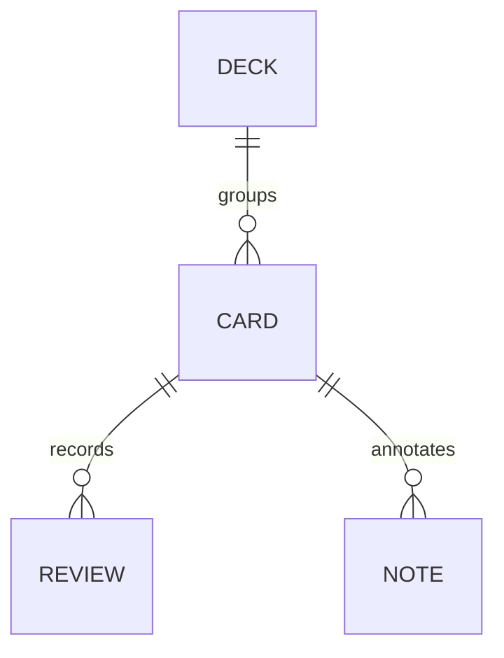
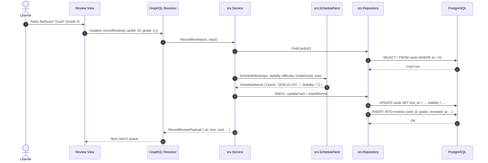
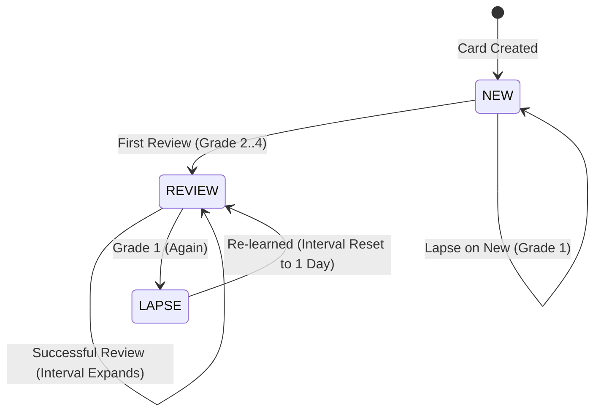
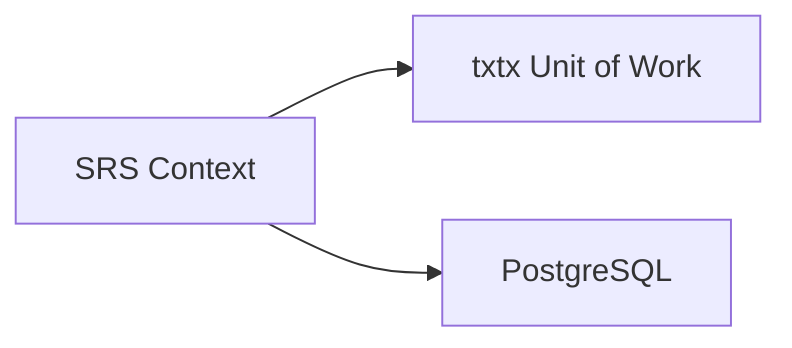

# Spaced Repetition System (SRS)

> Memory retention engine providing flashcard management, review scheduling via FSRS with interval fallbacks, and review session persistence.

## 1. Purpose & Scope

| Category | Specification |
| --- | --- |
| **Responsibility** | Manages flashcard decks, cards, review history logs, notes, and spaced repetition intervals |
| **In scope** | FSRS memory retention scheduling, 1-3-7-14-30 fallback intervals, due queue filtering, review recordings, card notes |
| **Out of scope** | Pronunciation audio recording (owned by `practice`), dictionary lookups (owned by `content`) |
| **Primary actors** | Learner (via Review and Flashcard Study UI screens) |

## 2. Responsibilities & Capabilities

- **FSRS & Fallback Scheduling** — Computes future review intervals using stability and difficulty parameters, with fixed 1-3-7-14-30 day intervals during initial card reviews ([policy.go](file:///home/hung1/personal/roadmap-learning/api/internal/domain/srs/policy.go)).
- **Atomic Review Logging** — Atomically updates card memory metrics and records review audit logs within a single database transaction.
- **Due Queue Resolution** — Filters cards that are either overdue (`due_at <= now`) or newly created (`state = 'new'`).
- **Deck Scoping** — Groups cards by target language (`zh` or `en`) and subject deck.
- **Card Notes Attachment** — Supports attaching markdown or error annotations to individual flashcards.

## 3. Domain Model

| Entity | Table | Purpose |
| --- | --- | --- |
| `Deck` | `decks` | Flashcard collection scoped to a language (`zh` or `en`) |
| `Card` | `cards` | Flashcard item containing front/back prompts, phonetic info, and FSRS parameters |
| `Review` | `reviews` | Historical log of a review evaluation (grade 1..4) |
| `Note` | `notes` | Freeform text or structured error note attached to a card |

## 4. Persistence

Key tables: `decks`, `cards`, `reviews`, `notes`.

| Column | Type | Nullable | Notes |
| --- | --- | --- | --- |
| `cards.stability` | `DOUBLE PRECISION` | No | FSRS memory stability in days |
| `cards.difficulty` | `DOUBLE PRECISION` | No | FSRS difficulty scale (1.0 to 10.0) |
| `cards.reps` | `INTEGER` | No | Total count of reviews completed |
| `cards.lapses` | `INTEGER` | No | Total count of memory lapses (grade 1 Again) |
| `cards.due_at` | `TEXT` | No | Next review due timestamp (UTC RFC3339) |
| `reviews.grade` | `INTEGER` | No | User rating: 1 (Again), 2 (Hard), 3 (Good), 4 (Easy) |

Indexes & constraints:
- `ux_cards_deck_front` (`deck_id`, `front`) `WHERE deleted = 0` — Prevents duplicate cards within active decks.
- `idx_cards_deck_due` (`deck_id`, `due_at`) — Optimizes due queue retrieval.
- `idx_reviews_card` (`card_id`) — Speeds up card review history queries.

## 5. API Surface

Exposed via GraphQL at `/query`:

### Queries
- `decks: [Deck!]!` — Retrieves all active decks.
- `deck(id: ID!): Deck` — Retrieves single deck.
- `cards(deckId: ID!): [Card!]!` — Lists all cards in a deck.
- `dueCards(deckId: ID!): [Card!]!` — Returns cards currently due for review or in `new` state.

### Mutations
- `createDeck(name: String!, lang: String): CreateDeckPayload!`
- `deleteDeck(id: ID!): DeleteDeckPayload!`
- `createCard(deckId: ID!, input: CardInput!): CreateCardPayload!`
- `updateCard(id: ID!, patch: CardPatch!): UpdateCardPayload!`
- `deleteCard(id: ID!): DeleteCardPayload!` (soft delete)
- `recordReview(input: ReviewInput!): RecordReviewPayload!` — Schedules next interval and saves review.
- `setCardTone(id: ID!, tone: String): SetCardTonePayload!` — Updates card tone tags.

## 6. Key Flows

## 7. Lifecycle & State

Cards progress through memory states:

## 8. Permissions & Security

- Single-user local application context. All active cards and decks are readable and mutable.

## 9. Validation & Error Taxonomy

| Error Code | HTTP Status | Condition |
| --- | --- | --- |
| `BAD_REQUEST` | 400 | Invalid rating grade (outside 1..4), invalid language, or empty card front |
| `NOT_FOUND` | 404 | Target deck or card does not exist |
| `CONFLICT` | 409 | Duplicate active card with the same front text in the same deck |

## 10. Configuration

- Algorithm parameters: [api/internal/domain/srs/policy.go](file:///home/hung1/personal/roadmap-learning/api/internal/domain/srs/policy.go).
- Fallback intervals: `[1, 3, 7, 14, 30]` days for reviews where `reps < 3`.

## 11. Observability

- Review counts and memory stability logged at debug level.
- Aggregate metrics surfaced via the `insight` module dashboard.

## 12. Dependencies & Coupling

## 13. Testing

- Unit tests: [api/internal/domain/srs/policy_test.go](file:///home/hung1/personal/roadmap-learning/api/internal/domain/srs/policy_test.go).
- Integration tests: [api/internal/infrastructure/srs/repository_test.go](file:///home/hung1/personal/roadmap-learning/api/internal/infrastructure/srs/repository_test.go).
- Service tests: [api/internal/application/srs/service_test.go](file:///home/hung1/personal/roadmap-learning/api/internal/application/srs/service_test.go).

## 14. Known Limitations & Edge Cases

- **Historical Replay:** In the event of clock drift or review discrepancies, [policy.go Replay](file:///home/hung1/personal/roadmap-learning/api/internal/domain/srs/policy.go#L86) recalculates true card stability by replaying the chronological review log.

## 15. References

- Domain rules: [api/internal/domain/srs](file:///home/hung1/personal/roadmap-learning/api/internal/domain/srs)
- GraphQL schema: [api/graph/schema/srs.graphqls](file:///home/hung1/personal/roadmap-learning/api/graph/schema/srs.graphqls)
