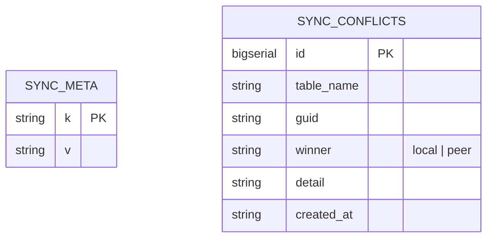
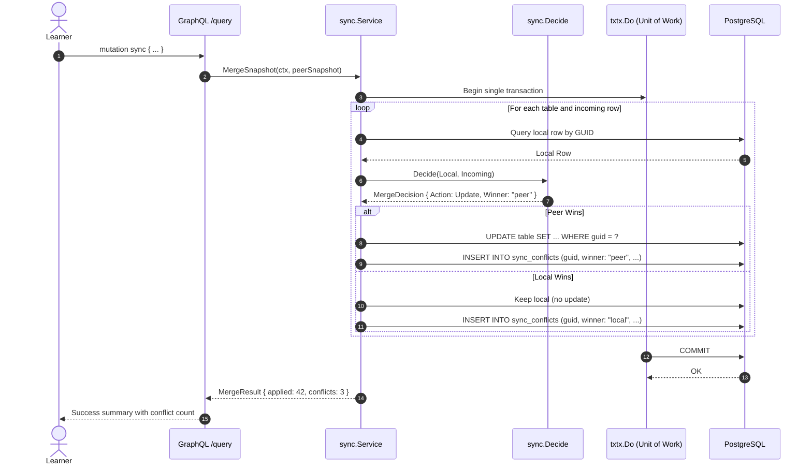
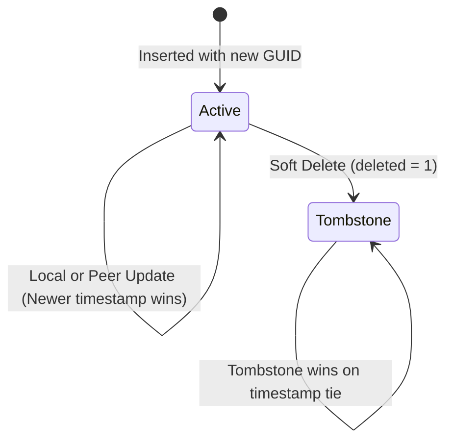
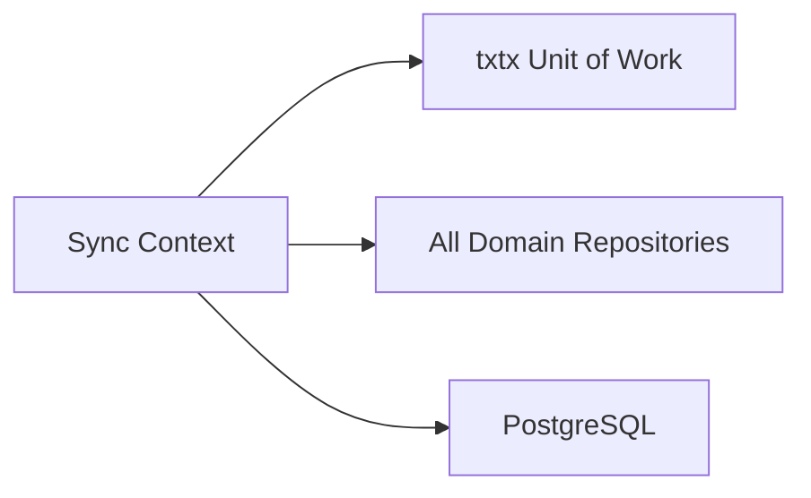

# Offline Peer Synchronization

> Decentralized peer-to-peer synchronization engine utilizing snapshot payloads, Last-Write-Wins (LWW) conflict resolution, and tombstone soft-delete propagation.

## 1. Purpose & Scope

| Category | Specification |
| --- | --- |
| **Responsibility** | Manages cross-device study state synchronization without requiring a centralized cloud server |
| **In scope** | Full database snapshot export, peer snapshot ingestion, LWW conflict resolution, tombstone propagation, conflict audit logging |
| **Out of scope** | Live real-time WebSocket syncing, user authentication or credential exchange |
| **Primary actors** | Learner (via manual file export/import or peer HTTP trigger) |

## 2. Responsibilities & Capabilities

- **Snapshot Packaging** — Serializes all user-mutable entities across all tables (`decks`, `cards`, `reviews`, `notes`, `roadmap_*`, `bookmarks`) into a portable JSON document.
- **Last-Write-Wins (LWW) Merge Engine** — Evaluates collisions on matching entity `guid` values using UTC timestamps (`updated_at`), electing the newest version as winner ([merge_policy.go](file:///home/hung1/personal/roadmap-learning/api/internal/domain/sync/merge_policy.go)).
- **Tombstone Tie-Breaking** — When identical timestamps collide, a soft-deleted tombstone (`deleted = 1`) always wins over an active record to prevent resurrecting deleted cards.
- **Conflict Audit Trail** — Writes historical conflict records into the `sync_conflicts` table whenever an incoming row overwrites or is rejected by local state.
- **Single-Transaction Merge Execution** — Executes all table merges within a single database transaction via `txtx.Do`, ensuring that a malformed snapshot rolls back cleanly without leaving partial records.

## 3. Domain Model

| Entity / DTO | Table | Purpose |
| --- | --- | --- |
| `Snapshot` | Memory / JSON | Complete export package containing all user data tables |
| `Conflict` | `sync_conflicts` | Audit log of an overwritten or rejected conflicting entity |
| `SyncMeta` | `sync_meta` | Stores local peer ID and last synchronization timestamp |

## 4. Persistence

Key tables: `sync_meta`, `sync_conflicts`, `schema_migrations`.

| Column | Type | Nullable | Notes |
| --- | --- | --- | --- |
| `sync_conflicts.table_name` | `TEXT` | No | Target table where collision occurred |
| `sync_conflicts.guid` | `TEXT` | No | Entity global unique identifier |
| `sync_conflicts.winner` | `TEXT` | No | Winning version (`"local"` or `"peer"`) |
| `sync_conflicts.detail` | `TEXT` | No | Human-readable explanation of why winner was selected |

Indexes:
- `idx_sync_conflicts_table` (`table_name`) — Accelerates conflict review by table.

## 5. API Surface

Exposed via GraphQL at `/query`:

### Queries
- `syncStatus: SyncStatusPayload!` — Returns local peer identifier and last sync timestamp.
- `syncConflicts(limit: Int): SyncConflictsPayload!` — Returns conflict history log (newest first).

### Mutations
- `sync: MergeResult!` — Merges an incoming peer snapshot into the local database within a single transaction.

## 6. Key Flows

## 7. Lifecycle & State

Entity records transition through active and tombstone states:

## 8. Permissions & Security

- Single-user local application context.
- Snapshots do not contain private network keys or environment passwords.

## 9. Validation & Error Taxonomy

| Error Code | HTTP Status | Condition |
| --- | --- | --- |
| `BAD_REQUEST` | 400 | Corrupted or unparseable snapshot JSON |
| `CONFLICT` | 409 | Schema migration version mismatch between peer devices |
| `NOT_IMPLEMENTED` | 501 | Remote sync endpoint invoked when peer URL is unset |

## 10. Configuration

- Schema Compatibility: Governed by `schema_migrations` version (currently version `4`).

## 11. Observability

- Merged row counts, skipped records, and conflict details are logged at `info` level.

## 12. Dependencies & Coupling

## 13. Testing

- Unit tests: [api/internal/domain/sync/merge_policy_test.go](file:///home/hung1/personal/roadmap-learning/api/internal/domain/sync/merge_policy_test.go).
- Service tests: [api/internal/application/sync/merge_test.go](file:///home/hung1/personal/roadmap-learning/api/internal/application/sync/merge_test.go).
- Remediation tests: [api/internal/application/sync/remediation_test.go](file:///home/hung1/personal/roadmap-learning/api/internal/application/sync/remediation_test.go).

## 14. Known Limitations & Edge Cases

- **Schema Locking:** Both peers must operate on the same database schema version. If one device runs an older migration version, sync is rejected to prevent data truncation.

## 15. References

- Domain rules: [api/internal/domain/sync](file:///home/hung1/personal/roadmap-learning/api/internal/domain/sync)
- Schema definitions: [api/graph/schema/sync.graphqls](file:///home/hung1/personal/roadmap-learning/api/graph/schema/sync.graphqls)
