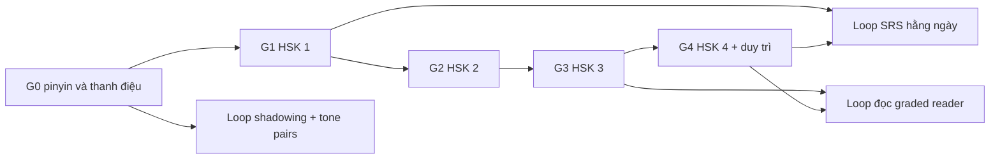

# 01 — Lộ trình tổng quan

> Roadmap 5 giai đoạn G0–G4 cho người Việt từ số 0, tự học không giáo viên, chữ giản thể. Mọi thời lượng là **ước lượng tự học**, không phải lịch trình cố định và không phải yêu cầu của nguồn nào.

## Quy ước nhãn

- Dòng có **[Nguồn: \<tên\> + \<URL\> + trích "…"]** là dữ kiện rút từ 3 file nguồn đóng băng.
- Dòng có **[Suy luận self-learn + giả định: ...]** là cách tự học / tiêu chí ra / ước lượng thời gian do người viết suy ra.
- **[Tham khảo thêm]** (link ngoài): định nghĩa ở [00](./00-gioi-han-du-lieu-va-gia-dinh.md), danh mục ở [06](./06-tai-lieu-tham-khao.md).

## Thông số vận hành

- [Suy luận self-learn + giả định: nhịp 30–45 phút/ngày] Mọi "tuần" bên dưới quy đổi ở nhịp này; giảm nhịp thì tăng tuần, không bỏ giai đoạn.
- Số liệu từ vựng/chữ Hán dùng bảng HSK 2.0 duy nhất ở [README](./README.md) (F1: số chữ suy từ wordlist). Ngữ pháp theo cấp là ước tính AllSet, chưa từng công bố chính thức (F7). Timeline HSK 3.0 "theo CTI 2026, kiểm lại trước khi đăng ký", không làm mốc cứng (F6).

## Roadmap 5 giai đoạn

### Giai đoạn 0 — Pinyin & thanh điệu

- Mục tiêu [Suy luận]: đọc đúng mọi âm tiết pinyin; phân biệt 4 thanh + thanh nhẹ; áp dụng được 3 quy tắc biến điệu (3+3, 不, 一) — 3 quy tắc này là dữ kiện [Nguồn: AllSet + https://resources.allsetlearning.com/chinese/pronunciation/Tone_change_rules + trích "When a 3rd tone ... is followed by another 3rd tone in a group, the first 3rd tone changes to a 2nd tone"].
- Điều kiện vào [Suy luận]: chưa cần gì ngoài 30–45 phút mỗi ngày; không cần biết trước chữ Hán.
- Điều kiện ra [Suy luận]: tự kiểm bằng minimal pair/tone pair (mỗi lần chỉ 1 hàng/cột [Nguồn: Hacking Chinese + https://www.hackingchinese.com/a-smart-method-to-discover-problems-with-tones/ + trích "with only one row or column at a time!"]), không còn nhầm T1–T4 khi nghe và phát âm được zh/ch/sh phân biệt z/c/s.
- Vì sao G0 nặng với người Việt: 1 nghiên cứu n=42 ghi 40,6% lỗi thanh (trong tổng 384 lỗi) [Nguồn: ICA + http://ica.org.vn/anh-huong-cua-chuyen-di-tieu-cuc-tu-tieng-me-de-den-phat-am-tieng-trung-cua-nguoi-hoc-viet-nam-bang-chung-tu-khao-sat-va-can-thiep-ngu-am/ + trích "Thanh điệu: 156 lỗi (40,6%)"] — kèm lỗi cuốn lưỡi→không cuốn lưỡi (zh/ch/sh → z/c/s) cùng trích đó; lỗi nhận thanh T1↔T4 nổi bật [Nguồn: ICPhS 2023 + https://www.internationalphoneticassociation.org/icphs-proceedings/ICPhS2023/full_papers/48.pdf + trích "Errors involved a major confusion between Tone 1 and Tone 4"].
- Thời lượng gợi ý [Suy luận self-learn + giả định: 30–45 phút/ngày]: ~4–6 tuần, suy từ khuyến nghị của ChinesePod "khoảng 50 bài Newbie trước khi lên Elementary" [Nguồn: ChinesePod + https://www.chinesepod.com/start-learning-mandarin + trích "We recommend studying around fifty lessons before progressing onwards to the Elementary level."].
- Chi tiết kỹ thuật: [02](./02-nghe-noi-thanh-dieu-backbone.md).

### Giai đoạn 1 — HSK 1

- Mục tiêu [Suy luận]: chốt 150 từ / 174 chữ (bảng README, F1 — số chữ suy từ wordlist), nói được câu tự giới thiệu, nghe được phần Listening của đề HSK 1.
- Điều kiện vào [Suy luận]: đã qua G0 (đọc pinyin thành thạo trước khi gắn chữ).
- Điều kiện ra [Suy luận]: tự làm trọn đề HSK 1 — 40 câu (Listening 20 + Reading 20), ~40 phút [Nguồn: chinesetest.cn + https://www.chinesetest.cn/HSK/1 + trích "The HSK (Level 1) exam … has a total of 40 questions, divided into listening and reading sections. The entire exam takes about 40 minutes …"] — tự chấm, không cần người khác.
- Thời lượng gợi ý [Suy luận self-learn + giả định: 30–45 phút/ngày]: ~15 tuần, suy từ 15 bài HSK Standard Course 1 [Nguồn: HSK Standard Course + https://www.hskstandardcourse.com/hsk-standard-course-level-1/hsk-standard-course-1-textbook + trích "15 lessons and covers 150 words and 45 language points required by the HSK Level 1 test."] + nhịp "một chương mỗi tuần" [Nguồn: DeckDuck + https://deckduck.com/blog/best-chinese-textbooks + trích "one textbook chapter weekly + [...] daily + graded reader at bedtime + one exchange session"].
- Liên kết: nền pinyin/thanh [02](./02-nghe-noi-thanh-dieu-backbone.md) · từ vựng + SRS [03](./03-chu-han-tu-vung-srs.md) · 54 điểm ngữ pháp = ước tính AllSet, chưa từng công bố chính thức (F7) [04](./04-ngu-phap-doc-viet.md).

### Giai đoạn 2 — HSK 2

- Mục tiêu [Suy luận]: nâng tích lũy lên 300 từ / 347 chữ (F1), giao tiếp được các tình huống thường ngày và công việc đơn giản.
- Điều kiện vào [Suy luận]: qua G0 hoàn toàn + G1 đạt chuẩn tự kiểm.
- Điều kiện ra [Suy luận]: tự làm trọn đề HSK 2 — 60 câu (Listening 35 + Reading 25), ~55 phút [Nguồn: GraphChinese + https://graphchinese.com/hsk-test-format + trích "HSK 2 | 60 | Listening 35, Reading 25 | ~55 min | 200 | 120"]; vẫn chưa có phần viết (HSK 1–2 không có writing, cùng nguồn: "HSK 1 and HSK 2 have no writing section").
- Thời lượng gợi ý [Suy luận self-learn + giả định: 30–45 phút/ngày]: ~12–16 tuần cùng nhịp 1 chương/tuần. **Gap:** số bài của HSK Standard Course 2 không trích được (chỉ có "15 lessons" cho cấp 1) → ước lượng này là suy luận thuần, hiệu chỉnh khi dùng thật.
- Liên kết: [02](./02-nghe-noi-thanh-dieu-backbone.md) (giữ loop shadowing/tone pairs) · [03](./03-chu-han-tu-vung-srs.md) (SRS 300 từ) · [04](./04-ngu-phap-doc-viet.md) (79 điểm ngữ pháp — ước tính AllSet, F7).

### Giai đoạn 3 — HSK 3

- Mục tiêu [Suy luận]: tích lũy 600 từ / 617 chữ (F1); bắt đầu đọc graded reader và viết câu (từ HSK 3 mới có phần viết).
- Điều kiện vào [Suy luận]: qua G2; đã có "tone ears" và loop SRS chạy ổn định.
- Điều kiện ra [Suy luận]: tự làm trọn đề HSK 3 — 80 câu (Listening 40 + Reading 30 + Writing 10), ~90 phút [Nguồn: GraphChinese + https://graphchinese.com/hsk-test-format + trích "HSK 3 | 80 | Listening 40, Reading 30, Writing 10 | ~90 min | 300 | 180"]; ĐỀ KHÔNG CÒN IN PINYIN, có phần viết [Nguồn: GraphChinese + cùng URL + trích "From HSK 3 the writing section appears, the paper scores out of 300"].
- Thời lượng gợi ý [Suy luận self-learn + giả định: 30–45 phút/ngày]: ~15–20 tuần (suy từ volume "L1–3 mỗi cấp 1 cuốn" [Nguồn: HSK Standard Course + https://www.hskstandardcourse.com/ + trích "The whole series is divided into six levels matching the HSK test … totaling nine volumes"] + 1 chương/tuần; gap số bài như G2).
- Liên kết: [03](./03-chu-han-tu-vung-srs.md) (quy tắc 1-3-7-14-30 = quy tắc thực hành phổ biến, F8) · [04](./04-ngu-phap-doc-viet.md) (graded reader, viết tay vs gõ IME; 87 điểm ngữ pháp — ước tính AllSet, F7) · [02](./02-nghe-noi-thanh-dieu-backbone.md) (nếu thi nói thì HSKK — mốc ≈900 từ là "gợi ý, chưa kiểm", F4, xem [05](./05-loop-dai-han-va-tai-lieu.md)).

### Giai đoạn 4 — HSK 4 + duy trì

- Mục tiêu [Suy luận]: chốt 1.200 từ / 1.064 chữ (F1, số chữ suy từ wordlist); trò chuyện đa chủ đề; duy trì input hằng ngày lâu dài.
- Điều kiện vào [Suy luận]: qua G3, có graded reader đọc được ở mức không tra pinyin liên tục.
- Điều kiện ra [Suy luận]: tự làm trọn đề HSK 4 — 100 câu (Listening 45 + Reading 40, Writing 15 gồm 10 câu sắp chữ + 5 câu viết theo tranh/từ), ~105 phút, Writing 25 phút [Nguồn: DigMandarin + https://www.digmandarin.com/hsk-level-4 + trích "there are three sections in total, Listening comprehension, Reading comprehension, and Wring … Writing (15 items / 25 mins)"]. Điểm đạt 180/300 và hiệu lực 2 năm: nguồn community → **hạ tin cậy, ưu tiên handbook, chưa đối chiếu handbook trong 3 file** (F5).
- Thời lượng gợi ý [Suy luận self-learn + giả định: 30–45 phút/ngày]: ~20–25 tuần (HSK 4 = 2 volume theo "L4–6 mỗi cấp 2 cuốn", cùng nguồn chín volume ở trên; gap số bài) + duy trì không có hạn chót.
- Ghi chú HSKK (nếu mục tiêu có thi nói): HSKK Intermediate ≈900 từ là **gợi ý, chưa kiểm** (F4, [05](./05-loop-dai-han-va-tai-lieu.md)); điểm đạt/hiệu lực 2 năm ở trên áp dụng F5.
- Ghi chú HSK 3.0: timeline (ra mắt 13/12/2026…) chỉ để tham khảo — **theo CTI 2026, kiểm lại trước khi đăng ký**, không dùng làm giả định cứng cho lộ trình này (F6).
- Liên kết: [03](./03-chu-han-tu-vung-srs.md) (SRS + deck Anki) · [04](./04-ngu-phap-doc-viet.md) (115 điểm ngữ pháp — ước tính AllSet, F7) · [02](./02-nghe-noi-thanh-dieu-backbone.md) (loop shadowing/tone pairs giữ từ G0).

## Sơ đồ tổng

Sơ đồ mang tính cấu trúc; tên kỹ thuật (shadowing, tone pairs, SRS, graded reader) giải thích ở [02](./02-nghe-noi-thanh-dieu-backbone.md)/[03](./03-chu-han-tu-vung-srs.md)/[04](./04-ngu-phap-doc-viet.md).

## Tài liệu tham khảo thêm

- Link ngoài và giải thích kỹ thuật: [06](./06-tai-lieu-tham-khao.md) ([Tham khảo thêm]). Gap và quy tắc số liệu: [00](./00-gioi-han-du-lieu-va-gia-dinh.md).

Về [README](./README.md) | Trước: [00](./00-gioi-han-du-lieu-va-gia-dinh.md) | Tiếp: [02](./02-nghe-noi-thanh-dieu-backbone.md).
