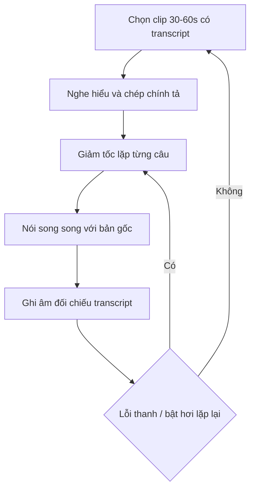
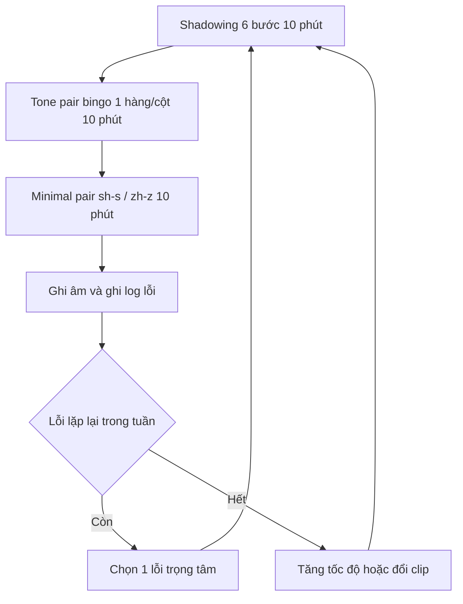

# 02 — Nghe nói & thanh điệu backbone

> Trục phát âm cho người mới số 0: pinyin → 4 thanh + thanh nhẹ → biến điệu → drills (tone pairs / minimal pairs / shadowing) → loop nghe-nói → HSKK. Dữ kiện chỉ lấy từ `references/11-pinyin-thanh-dieu-nghe-noi.md` (chính), `references/10-chuan-hsk-chuong-trinh.md` và `references/12-chu-han-tu-vung-ngu-phap.md` (phụ). Thiếu dữ kiện ghi gap, không bịa.

## Quy ước nhãn

- `[Nguồn: <tên> + <URL> + trích "<nguyên văn ngắn>"]` — dữ kiện chép từ file references, kèm trích.
- `[Suy luận self-learn + giả định: ...]` — routine/thời lượng tự dựng cho người tự học; không có trong nguồn.
- `[Tham khảo thêm: <tên> + <URL> + loại]` — giải thích nền hoặc nguồn phụ, không phải chuẩn bắt buộc.
- Không có lịch trình theo tuần/tháng, không học phí, không logistics (đăng ký/địa điểm thi) trong doc này. Thời lượng là ước lượng tự học và luôn gắn `[Suy luận]`.

---

## Bảng pinyin: thành phần âm tiết + quy tắc chính tả

- Pinyin là hệ La-tinh hóa để viết tiếng Trung; người mới học pinyin trước khi học chữ. [Nguồn: Chinese Grammar Wiki — Beginner Guide + https://resources.allsetlearning.com/chinese/grammar/Beginner_Guide_to_Chinese_Grammar + trích "All beginners should learn pinyin first."]
- Âm tiết = initial + final + tone: initial = thanh mẫu (声母 shēngmǔ), final = vần (韵母); âm tiết không có initial ký hiệu ∅-. [Nguồn: Chinese Pronunciation Wiki — Initial + https://resources.allsetlearning.com/chinese/pronunciation/Initial + trích "Most Mandarin Chinese syllables have an initial, but not all."]
- Bảng tra chuẩn cho beginner: AllSet Pinyin chart (giao cắt initial × final, audio từng âm 4 thanh) và bảng pinyin đầy đủ mọi âm tiết trên Wikipedia. [Nguồn: Chinese Pronunciation Wiki — Pinyin chart + https://resources.allsetlearning.com/chinese/pronunciation/Pinyin_chart + trích "Pinyin chart ... Tone: 1 2 3 4 1234"] [Nguồn: Wikipedia — Pinyin table + https://en.wikipedia.org/wiki/Pinyin_table + trích "This pinyin table is a complete listing of all Hanyu Pinyin syllables used in Standard Chinese."]

| Quy tắc | Nội dung | Ví dụ / ghi chú | Nguồn |
|---|---|---|---|
| ü sau j/q/x | Bỏ dấu hai chấm, vẫn đọc /y/ | ju/qu/xu; "If and only if 'ü' follows 'j', 'q', 'x', the umlaut is dropped." | [Nguồn: MIT — Hanyu Pinyin spelling rules + https://web.mit.edu/jinzhang/www/pinyin/spellingrules/index.html + trích "If and only if 'ü' follows 'j', 'q', 'x', the umlaut is dropped."] |
| ü khi đơn lẻ | Viết "yu" | "Replace 'ü' with 'yu'." | [Nguồn: MIT — Hanyu Pinyin spelling rules + https://web.mit.edu/jinzhang/www/pinyin/spellingrules/index.html + trích "Replace 'ü' with 'yu'."] |
| ü sau n/l | Giữ dấu | nü, lü (suy từ bảng âm AllSet/Wikipedia — không trích được câu điều khoản dạng quy tắc) | [Nguồn: Wikipedia — Pinyin table + https://en.wikipedia.org/wiki/Pinyin_table + trích "Group ü Finals \| ü \| yu \| ... \| nü \| lü" — suy từ bảng âm, không có câu điều khoản] |
| Vị trí dấu thanh | Ưu tiên a > o > e > i > u > ü; riêng "ou" đặt trên o | "the tone mark is placed on the vowel according to this order of priority: 'a', 'o', 'e', 'i', 'u', 'ü'" | [Nguồn: PolyU BEPTH — Spelling Rules in Pinyin + https://www.polyu.edu.hk/bepth/introduction-to-phonetics/spelling-rules-in-pinyin/ + trích "the tone mark is placed on the vowel according to this order of priority: 'a', 'o', 'e', 'i', 'u', 'ü'"] |
| "iu" / "ui" | Đánh dấu trên nguyên âm **thứ hai** | "If there is 'iu' or 'ui' in a syllable, the tone mark should be placed on the second vowel" | [Nguồn: PolyU BEPTH — Spelling Rules in Pinyin + https://www.polyu.edu.hk/bepth/introduction-to-phonetics/spelling-rules-in-pinyin/ + trích "If there is 'iu' or 'ui' in a syllable, the tone mark should be placed on the second vowel"] |
| Dấu trên i | Bỏ chấm của i | File 11 ghi cùng mục "vị trí dấu thanh"; **không trích được** nguyên văn câu riêng cho quy tắc này | [Nguồn: PolyU BEPTH — Spelling Rules in Pinyin + https://www.polyu.edu.hk/bepth/introduction-to-phonetics/spelling-rules-in-pinyin/ + trích "the tone mark is placed on the vowel according to this order of priority: 'a', 'o', 'e', 'i', 'u', 'ü'"] |

- Thứ tự ưu tiên dấu có bản tương đương tiếng Anh: "A and e trump all other vowels and always take the tone mark. ... In the combination ou, o takes the mark. In all other cases, the final vowel takes the mark." [Nguồn: pinyin.info — Where do the tone marks go? + https://pinyin.info/rules/where.html + trích câu trên]
- Doc này **không** đưa bảng so sánh hệ Yale ↔ pinyin — thừa cho mục tiêu zero → HSK 4 (quyết định self-learn, không phải dữ kiện nguồn).

## 4 thanh + thanh nhẹ

- Định nghĩa: thanh = thay đổi ca độ để phân biệt từ; Mandarin có 4 thanh (cao, lên, thấp, xuống) + thanh nhẹ không có ca độ riêng. [Nguồn: Hacking Chinese — Guide to Mandarin tones + https://www.hackingchinese.com/the-hacking-chinese-guide-to-mandarin-tones/ + trích "Tones are changes in pitch (tone height) that are used to differentiate words in Mandarin" ; "Mandarin has four tones: high, rising, low, and falling" ; "The neutral tone lacks a pitch of its own"]

| Thanh | Đặc tả (mức A1) | Trích |
|---|---|---|
| T1 | Cao và bằng | "The first tone is high and flat." |
| T2 | Lên | "The second tone is rising." |
| T3 | Thấp — quan trọng là **thấp**, không phải "hạ–hồi" | "it's more important that the tone be super low than that it rises" |
| T4 | Xuống, ngắn hơn 3 thanh kia | "The fourth tone is falling." |
| Thanh nhẹ (轻声) | Ngắn, nhẹ, ca độ phụ thuộc thanh trước; từ **không** bắt đầu bằng thanh nhẹ; điển hình 吗/吧/呢/的 | "its exact pitch depends on the tone that came before it" ; "words do not start with the neutral tone." |

[Nguồn: Chinese Pronunciation Wiki — Four tones + https://resources.allsetlearning.com/chinese/pronunciation/Four_tones + trích các câu T1–T4 ở trên]
[Nguồn: Chinese Pronunciation Wiki — Neutral tone + https://resources.allsetlearning.com/chinese/pronunciation/Neutral_tone + trích câu thanh nhẹ ở trên]

- **Thanh 3 trong câu = half-third:** dạng tròn đầy (hạ–hồi) chỉ khi đứng một mình hoặc cuối cụm; trước thanh khác chỉ đi xuống thấp, không lên lại. [Nguồn: Chinese Pronunciation Wiki — Four tones + https://resources.allsetlearning.com/chinese/pronunciation/Four_tones + trích "3rd tone is normally only pronounced in its full 'rising and falling' form when it is pronounced in isolation ... is pronounced as a 'half-third tone' which doesn't rise again after it goes low."]

## Biến điệu (tone sandhi) — bắt buộc

| # | Quy tắc | Ví dụ | Trích |
|---|---|---|---|
| 1 | T3 + T3 → đọc T3 đầu thành T2 | 你好 vẫn viết nǐ hǎo, đọc ní hǎo | "the first 3rd tone changes to a 2nd tone" ; "Normally the tone changes above are not written in the pinyin" |
| 2 | 不 trước T4 → bú | bù → bú | "When followed by a 4th tone, 不 (bù) changes to 2nd tone (bú)." |
| 3 | 一: trước T4 → yí; trước các thanh khác → yì | yī → yí / yì | "When followed by a 4th tone, 一 (yī) changes to 2nd tone (yí). When followed by any other tone, 一 (yī) changes to 4th tone (yì)." |

[Nguồn: Chinese Pronunciation Wiki — Tone change rules + https://resources.allsetlearning.com/chinese/pronunciation/Tone_change_rules + trích "When a 3rd tone ... is followed by another 3rd tone in a group, the first 3rd tone changes to a 2nd tone (such as 'yé')." ; "When followed by a 4th tone, 不 (bù) changes to 2nd tone (bú)." ; "When followed by a 4th tone, 一 (yī) changes to 2nd tone (yí). When followed by any other tone, 一 (yī) changes to 4th tone (yì)." ; "Normally the tone changes above are not written in the pinyin; you are supposed to just know the rule and apply it"]
[Nguồn: pinyin.info — 拼音正詞法基本規則 (GB/T 16159-2012 text) + https://pinyin.info/rules/pinyinrules.html + trích "聲調一律標原調，不標變調 ... 但在語音教學時可以根據需要按變調標寫" — 标原调不标变调]

- **Biến điệu KHÔNG đánh dấu trong pinyin** — chuẩn quốc gia: "声调一律标原调，不标变调" (đánh thanh gốc, không đánh biến điệu); riêng khi dạy phát âm (語音教學) được phép đánh theo biến điệu. [Nguồn: pinyin.info — 拼音正詞法基本規則 (GB/T 16159-2012 text) + https://pinyin.info/rules/pinyinrules.html + trích "聲調一律標原調，不標變調 ... 但在語音教學時可以根據需要按變調標寫"] [Nguồn: 国家标准馆 — GB/T 16159-2012 + https://ndls.cnis.ac.cn/standard/detail/51c2f77c5e3c01c75a147ae41bff75a8 + trích "GB/T 16159-2012 汉语拼音正词法基本规则 ... 内容包括分词连写规则、人名地名拼写规则、大写规则、标调规则、移行规则"]
- Không ghi nhớ 3 quy tắc này thì nói bị under-apply (xem mục lỗi người Việt dưới đây).

## Chuẩn hóa lỗi: T4 khó nhất cả nghe lẫn nói

> Mục này chốt để không đọc nhầm các nghiên cứu khác chiều.

- **Chuẩn: T4 khó nhất cả nghe lẫn nói** (gộp 3 nghiên cứu):
  - Nói/sản sinh — ICPhS 2023, 30 người Việt, 80 từ 2 âm tiết: "The overall results showed that Tone 4 was the most difficult". [Nguồn: ICPhS 2023 — Disyllabic tones by Vietnamese speakers + https://www.internationalphoneticassociation.org/icphs-proceedings/ICPhS2023/full_papers/48.pdf + trích câu trên]
  - Nghe — Airiti, 7 người mới học, 5 giai đoạn: "Tone 3 and Tone 2 were identified more accurately than Tone 4 and Tone 1" , lỗi lớn "a major confusion between Tone 1 and Tone 4". [Nguồn: Airiti — 越南受試者的華語聲調聽辨研究 + https://www.airitilibrary.com/Article/Detail/22211624-202012-202107080029-202107080029-3-37 + trích câu trên]
  - Cả hai chiều — ĐH Đà Nẵng, 45 SV: nhận thanh đôi T4 > T1 > T2 > T3, sản sinh T4 > T1 > T3 > T2, "The main error pattern was the confusion between T1 and T4." [Nguồn: Tran T.A.N. 2024 — 越南籍學習者華語聲調偏誤 + https://doi.org/10.5281/zenodo.15549790 + trích câu trên]
- **Cách đọc ký hiệu "T3/T2 > T4/T1" trong file 11:** ký hiệu đó **chỉ là thứ tự khó bên chiều NGHE** (T3–T2 được nghe nhận chính xác hơn, nên T4–T1 là cặp khó nghe hơn; nghiên cứu Airiti không đo chiều nói). Không trộn hai chiều: chiều nói do ICPhS + ĐH Đà Nẵng chốt T4 là thanh khó nhất → hai dữ kiện nhất quán với chuẩn "T4 khó nhất cả nghe lẫn nói".
- **Không tổng quát quần thể về tỉ lệ lỗi:** 1 nghiên cứu (ICA) n=42 SV Việt Nam, Praat, 384 lỗi → **40,6% lỗi là lỗi thanh** (156/384). Con số này là của 42 người trong nghiên cứu đó, **không** phải "người Việt mắc 40,6% lỗi thanh". [Nguồn: ICA — Chuyển di tiêu cực, lỗi phát âm người Việt + http://ica.org.vn/anh-huong-cua-chuyen-di-tieu-cuc-tu-tieng-me-de-den-phat-am-tieng-trung-cua-nguoi-hoc-viet-nam-bang-chung-tu-khao-sat-va-can-thiep-ngu-am/ + trích "Nghiên cứu ghi nhận 384 lỗi ... Thanh điệu: 156 lỗi (40,6%)"]

## Lỗi người Việt khi học phát âm Trung

| Lỗi | Bản chất | Nguồn |
|---|---|---|
| zh/ch/sh → z/c/s | Cuốn lưỡi → không cuốn lưỡi; lỗi nổi bật nhất trong 384 lỗi (n=42) | ICA (trích ở trên); GlobeThesis: "they usually use the pronunciation of z [ts],c[ts' ],s [s] to replace zh [t?],ch [t?' ],sh [?]" — [Nguồn: GlobeThesis — Pronunciation of zh/ch/sh of Vietnamese students + https://www.globethesis.com/?t=2335330512481726 + trích câu trên] |
| Bật hơi yếu / quá đà | Tiếng Việt có đối lập hữu–vô thanh nhưng **không** có đối lập bật hơi và không có塞擦音 → "overemphasize or underemphasize the degree of aspiration" | [Nguồn: Nguyen & Nguyen 2026 — Aspirated/unaspirated, Vietnamese learners + https://doi.org/10.17977/um073v5i12026p1-11 + trích "Vietnamese initial consonants exhibit a clear voiced-voiceless distinction but lack an aspiration contrast." ; "...often not reaching..."] |
| T1 ↔ T4 | Lỗi nhận/sản sinh chính ở cả 3 nghiên cứu; "the participants tend to mispronounce Tone 4 as Tone 1" | ICPhS 2023 + ĐH Đà Nẵng (đã trích ở trên) |
| Under-apply biến điệu 3-3 | "Vietnamese speakers tend to underapply Mandarin third tone sandhi." | [Nguồn: ICPhS 2023 + https://www.internationalphoneticassociation.org/icphs-proceedings/ICPhS2023/full_papers/48.pdf + trích câu trên] |
| Under-apply biến điệu 一 | "the primary error for '一' tone sandhi was 'under application'" | [Nguồn: Tran T.A.N. 2024 + https://doi.org/10.5281/zenodo.15549790 + trích câu trên] |
| "Làm phẳng" T3 (nhóm Nam) | Biên độ F0 nhỏ + thời lượng ngắn hơn | [Nguồn: ICA + http://ica.org.vn/anh-huong-cua-chuyen-di-tieu-cuc-tu-tieng-me-de-den-phat-am-tieng-trung-cua-nguoi-hoc-viet-nam-bang-chung-tu-khao-sat-va-can-thiep-ngu-am/ + trích "Nhóm Nam có biên độ F0 nhỏ hơn và thời lượng ngắn hơn, làm tăng nguy cơ 'làm phẳng' thanh điệu khi nói liền."] |
| T1 không đạt đủ cao | Cao độ nền tiếng Việt thấp hơn → khó chạm thanh 1 kiểu 55 | [Nguồn: Jin 2023 — Vietnamese adult learners' phonological biases + https://doi.org/10.2991/978-2-38476-062-6_37 + trích "Vietnamese students generally have a lower pitch, often not reaching the 55 tones Chinese heavy yinping."] |
| Sai thanh 3 khi nói liền (Nhắc hěn → hèn) | Lỗi điển hình Part I HSKK | [Nguồn: Groningen Confucius Institute — HSKK Primary guide + https://www.confuciusgroningen.nl/news/your-step-by-step-guide-to-hskk-primary-success + trích "Tone error: Mispronunced 很 (hěn) as (hèn)."] — *nguồn institute, không phải rubric chính thức* |

- Đối lập âm khó với người mới (AllSet A2, khớp lỗi người Việt ở zh/ch/sh và r): "Tough sounds s-sh-, c-ch-, z-zh- ... Tough sounds r-". [Nguồn: Chinese Pronunciation Wiki — A2 pronunciation points + https://resources.allsetlearning.com/chinese/pronunciation/A2_pronunciation_points + trích câu trên]

---

## Drills

### Tone pairs — 20 tổ hợp

- Lý do: dạy thanh đơn âm quá nhiều; "move to words consisting of two syllables as soon as possible". Có **20 tổ hợp** (4 thanh + thanh nhẹ, thanh nhẹ chỉ đứng cuối). [Nguồn: Hacking Chinese — Tone pairs + https://www.hackingchinese.com/focusing-on-tone-pairs-to-improve-your-mandarin-pronunciation/ + trích "the best way of practising tones in Chinese is to move to words consisting of two syllables as soon as possible"] [Nguồn: Hacking Chinese — Guide to Mandarin tones + https://www.hackingchinese.com/the-hacking-chinese-guide-to-mandarin-tones/ + trích "there are 20 possible combinations of tones ... and therefore 20 tone pairs to learn."]
- Cách dùng: học 1 từ cho mỗi tổ hợp, tập tới khi nói đúng mọi lúc, rồi "chép" pattern sang từ khác; kèm 1.000 tone pairs sắp theo level HSK/TOCFL (cùng nguồn Guide). Bảng 20 tone pair có audio/video: "It's not enough to know the tones; you need to PRACTICE them in each combination, until it becomes second nature." [Nguồn: Chinese Pronunciation Wiki — Tone pairs + https://resources.allsetlearning.com/chinese/pronunciation/Tone_pairs + trích câu trên]
- Thứ tự khó theo kinh nghiệm (dẫn từ Sinosplice trên AllSet): "1-1 ←easiest ... 3-2 ←hardest". [Nguồn: Chinese Pronunciation Wiki — Four tones + https://resources.allsetlearning.com/chinese/pronunciation/Four_tones + trích câu trên]
- Beginner chỉ test **1 hàng/cột mỗi lần**: "If you are a beginner, you can use this test, but with only one row or column at a time!" [Nguồn: Hacking Chinese — Minimal pairs + https://www.hackingchinese.com/a-smart-method-to-discover-problems-with-tones/ + trích câu trên]

### Minimal pairs — bingo chẩn đoán

- Minimal pair = 2 từ chỉ khác 1 yếu tố ngữ âm; dùng chẩn đoán lỗi nghe **và** nói. VD từ nguồn: 好 hǎo / 老 lǎo; 买 mǎi / 卖 mài. [Nguồn: Hacking Chinese — Minimal pairs + https://www.hackingchinese.com/a-smart-method-to-discover-problems-with-tones/ + trích "In phonology, a minimal pair consists of two words that only differ in one single regard" ; "1. Diagnose your pronunciation ... 2. Diagnose your sound perception"]
- Bắt buộc ghép cặp thanh (bingo 20 tone pair) + cặp âm cuốn lưỡi sh–s / zh–z cho lỗi người Việt: "dùng khẩu hình, gương và bài cặp tối thiểu để tạo đối lập rõ (sh–s, zh–z…)". [Nguồn: ICA + http://ica.org.vn/anh-huong-cua-chuyen-di-tieu-cuc-tu-tieng-me-de-den-phat-am-tieng-trung-cua-nguoi-hoc-viet-nam-bang-chung-tu-khao-sat-va-can-thiep-ngu-am/ + trích câu trên]

### Shadowing — 6 bước

- Định nghĩa chuẩn: "repeating a native speaker word-for-word, almost simultaneously, while also referring to texts or transcripts of the audio". [Nguồn: FluentU — Shadowing Chinese in steps + https://www.fluentu.com/blog/chinese/shadowing-chinese/ + trích câu trên]
- Bằng chứng: beginner 4 tuần, cả nhóm shadowing giáo trình và shadowing video authentic đều cải thiện độ chính xác thanh ở câu nói tự phát. [Nguồn: Lu & Su 2024 — Shadowing & Mandarin tones (JSLP) + https://doi.org/10.1075/jslp.22033.lu + trích "both groups significantly improved tone accuracy in sentence-level spontaneous speech"]
- Biến thể mimicking: "Mimicking native speakers is the single most powerful way of improving your pronunciation in Mandarin" ; "Practise until you can match tones, pace and intonation". [Nguồn: Hacking Chinese — Mimicking native speakers + https://www.hackingchinese.com/mimicking-native-speakers-way-learning-chinese/ + trích câu trên]

[Suy luận self-learn + giả định: không có giáo viên chấm — tự sắp 6 bước từ các bước có sẵn trong nguồn FluentU ("nghe → giảm tốc → lặp từng câu → nói song song → thêm transcript") + mimicking Hacking Chinese ("hiểu + chép chính tả → bắt chước → nói song song"), không phải quy trình gốc của một nguồn]

1. Chọn clip 30–60 giây **có transcript**, nghe hiểu + chép chính tả (bắt chước).
2. Giảm tốc, lặp lại từng câu cho đúng thanh từng âm tiết.
3. Nói song song (overlay) với bản gốc, đuổi theo từng chữ, không pause giữa câu.
4. Ghi âm bản của mình, đối chiếu transcript gốc — đánh dấu câu lệch thanh.
5. Tách ra 2–3 câu lỗi lớn nhất (ưu tiên T4, cặp 3-3, 一/不, zh/ch/sh), lặp riêng.
6. Ghi log lỗi (kiểu lỗi + câu), nghe lại bản cũ mỗi tuần và chọn 1 lỗi lặp nhiều nhất để sửa.

## Loop nghe-nói hàng ngày

[Suy luận self-learn + giả định: thời lượng là ước lượng tự học, không phải khuyến nghị chính thức]

- Hàng ngày ~30 phút: 10 phút shadowing 6 bước (bước 1–4), 10 phút tone pair bingo (1 hàng/cột), 10 phút minimal pair sh–s / zh–z + ghi log.
- Hàng tuần 1 lần [Suy luận]: nghe lại toàn bộ bản ghi âm tuần, đếm lỗi lặp, chọn 1 lỗi (ví dụ "T4 thành T1" hoặc "under-apply 3-3") làm trọng tâm tuần sau.

---

## Tài nguyên nghe beginner

| Tài nguyên | Nội dung | Nhãn |
|---|---|---|
| Mandarin Corner | YouTube + web: beginner/intermediate, subtitle tiếng mẹ đẻ, audio podcast, HSK flashcards, HSK 1–6, slow conversation | [Nguồn: Mandarin Corner + https://mandarincorner.org/ + trích "Beginner \| Intermediate ... Vocabulary Chinese Characters Audio Podcast HSK Flashcards HSK 1 to 6 Slow Chinese Conversation"] |
| Slow Chinese Podcast (慢速汉语) | "short stories/news/articles in different levels are told in very slow and clear Mandarin Chinese"; script PDF pinyin/Anh/Trung | [Nguồn: Slow Chinese Podcast 慢速汉语 (Apple Podcasts) + https://podcasts.apple.com/us/podcast/slow-chinese-podcast-%E6%85%A2%E9%80%9F%E6%B1%89%E8%AF%AD-learn-chinese-%E5%AD%A6%E4%B8%AD%E6%96%87/id1562798369 + trích câu trên] |
| 慢速中文 Slow Chinese (slow-chinese.com) | **Dự án RIÊNG, khác dự án 慢速汉语 ở trên** — đừng lẫn tên | [Tham khảo thêm: 慢速中文 Slow Chinese (Apple Podcasts) + https://podcasts.apple.com/us/podcast/%E6%85%A2%E9%80%9F%E4%B8%AD%E6%96%87-slow-chinese/id1482243873 + resource] — *không trích được mô tả chính thức từ trang chủ* |
| ChinesePod Newbie | 6 level, 4.000+ bài; Newbie "Start from Zero" **297 bài**: "read pinyin, recognize tones, introduce yourself..."; khuyến nghị ~50 bài Newbie trước Elementary; khóa "Say It Right" 22 bài (pinyin, tones, tone combinations, tone change rules) | [Nguồn: ChinesePod — Home + https://www.chinesepod.com/ + trích "Newbie ... Start from Zero 297 Lessons YOU CAN: read pinyin, recognize tones, introduce yourself, ask simple questions"] [Nguồn: ChinesePod — Start learning + https://www.chinesepod.com/start-learning-mandarin + trích "We recommend studying around fifty lessons before progressing onwards to the Elementary level."] |
| FluentU | Video authentic thành bài caption tương tác — dùng cho shadowing | [Tham khảo thêm: FluentU — Shadowing Chinese + https://www.fluentu.com/blog/chinese/shadowing-chinese/ + method] |

---

## HSKK — thi nói, 3 cấp

- 3 cấp 初级/中级/高级, thi bằng thu âm tại chỗ; **6 kiểu bài**: 听后重复, 听后回答, 听后复述, 朗读, 看图说话, 回答问题. [Nguồn: 汉考国际 — HSKK评分说明（自测用） + https://admin.chinesetest.cn/gonewcontent.do?id=5709888 + trích "HSKK分初级、中级、高级三个等级，包含听后重复、听后回答、听后复述、朗读、看图说话和回答问题6种题型。"]
- Cấu trúc 初级: 27 câu = Part I 15 nghe-lặp lại + Part II 10 nghe-trả lời ngắn + Part III 2 trả lời (có pinyin, mỗi câu ≥5 câu nói);满分 100, đạt 60 (mirror lỗi 000 lúc kiểm 2026-09-23, xem cột Trạng thái trong 06; đã hạ tin cậy ở 05:60). [Nguồn: HSK/HSKK Handbook (PDF mirror) + https://lllc.uiowa.edu/sites/lllc.uiowa.edu/files/2025-05/hsk_manual_chinese_and_english.pdf + trích "HSKK（初级）共27题，分三部分。 ... 每题至少说5句话。" ; "满分100分，总分60分为合格。"]
- Mức từ vựng 初级 ~200 từ (aligned HSK1): "the primary-level HSKK, 200 words is the minimum criterion". [Nguồn: Sage — Review of HSKK + https://sage.cnpereading.com/doi/10.1177/02655322231163470 + trích câu trên]
- Bắt buộc thi nói kèm từ HSK 3: "HSKK3-6级需与对应级别口语同时报名。" [Nguồn: chinesetest.cn — Thông báo + https://www.chinesetest.cn/notice + trích câu trên] — *đề bài/đăng ký không đi sâu ở đây (logistics ngoài phạm vi doc)*.

### Rubric — chỉ 3 mức 高 / 中 / 低, không công bố % phát âm

Thang chấm 自测用 (汉考国际 2012) chấm **3 mức mỗi kiểu bài**; trích liên quan phát âm:

- 听后重复 — 高: "考生能准确地重复听到的句子。" / 中: "考生不能完整地重复听到的句子。" / 低: "考生重复内容与播放的句子相关性很差。"
- 朗读 (cấp cao, tiêu chí语音/语调 rõ nhất) — 高: "考生朗读流利，能很好地把握语音、语调等，有少量错读、重复、停顿等。"
- 回答问题 — 高: "考生能就问题做出回答，内容丰富，表达流利，有少量停顿、重复、语法错误。 ... 注：考生不作答，按0分计。"

[Nguồn: 汉考国际 — HSKK评分说明（自测用） + https://admin.chinesetest.cn/gonewcontent.do?id=5709888 + trích các câu 高/中/低 trên]

- **Không có % trọng số phát âm trong rubric chính thức.** Hanban (2010) công bố rubric theo nhiệm vụ nhưng "no information has been provided and no study appears to have validated the design of the rubric". [Nguồn: Sage — Review of HSKK + https://sage.cnpereading.com/doi/10.1177/02655322231163470 + trích câu trên]
- Số % do một Viện Khổng Tử nêu (Accuracy 60% / Pronunciation-Intonation 30% / Speed 10%) **không tìm thấy** trong văn bản HSKK chính thức → gap, không dùng làm chuẩn. [Tham khảo thêm: Groningen Confucius Institute — HSKK Primary guide + https://www.confuciusgroningen.nl/news/your-step-by-step-guide-to-hskk-primary-success + resource (institute, cộng đồng)]

---

## Khoảng trống (ghi nhận trung thực)

- **Thiếu nghiên cứu riêng về lỗi ü và r của người Việt** — file 11 ghi "không tìm được" (chỉ có dữ kiện gián tiếp: bảng âm + đối lập chung người L2); phần ü/r trong doc này không có số liệu lỗi riêng.
- **Thiếu chuẩn audio bản ngữ để tự đối chiếu** — file 11 không chỉ ra một bộ "reference recording" chuẩn; audio trong wiki/tài nguyên do từng nguồn tự công bố. Kèm gap đã ghi sẵn: Mandarin Corner không trích được mô tả text chính thức và không xác minh được cấp phép/tốc độ từng playlist.
- Rubric HSKK chưa được nghiên cứu validate (Sage, đã trích) → không diễn giải 3 mức thành thang % tự chế.

Về [README](./README.md) | Trước: [01](./01-lo-trinh-tong-quan.md) | Tiếp: [03](./03-chu-han-tu-vung-srs.md).
