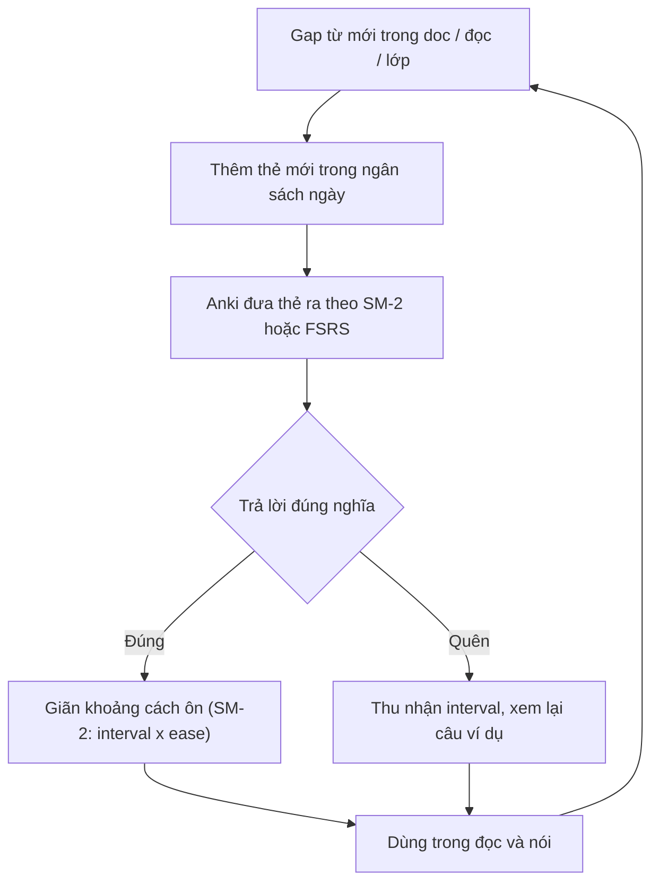

# 03 — Chữ Hán, từ vựng & SRS

> Trục chữ Hán – từ vựng cho người mới số 0: quy tắc nét → bộ thủ → phương pháp nhớ chữ (Heisig-style) → viết tay vs gõ IME → deck Anki HSK 1–4 → loop SRS → từ điển. Dữ kiện chỉ lấy từ `references/12-chu-han-tu-vung-ngu-phap.md` (chính cho mục này), `references/10-chuan-hsk-chuong-trinh.md` và `references/11-pinyin-thanh-dieu-nghe-noi.md` (phụ). Thiếu dữ kiện ghi gap, không bịa.

## Quy ước nhãn

- `[Nguồn: <tên> + <URL> + trích "<nguyên văn ngắn>"]` — dữ kiện chép từ file references, kèm trích.
- `[Suy luận self-learn + giả định: ...]` — routine/ngân sách tự dựng cho người tự học; không có trong nguồn.
- `[Tham khảo thêm: <tên> + <URL> + loại]` — giải thích nền hoặc nguồn phụ, không phải chuẩn bắt buộc.
- Không lịch trình theo tuần/tháng, không học phí, không logistics. Thời lượng / ngân sách thẻ là ước lượng tự học, luôn gắn `[Suy luận]`.

---

## Quy tắc nét viết

### 8 nét cơ bản

| # | Nét | Pinyin |
|---|---|---|
| 1 | 横 | héng |
| 2 | 竖 | shù |
| 3 | 撇 | piě |
| 4 | 捺 | nà |
| 5 | 点 | diǎn |
| 6 | 提 | tí |
| 7 | 折 | zhé |
| 8 | 钩 | gōu |

[Nguồn: Wikipedia — Chinese character strokes + https://en.wikipedia.org/wiki/Chinese_character_strokes + trích mục "Eight basic strokes" liệt kê "the Diǎn 點 / 点… the Héng 横…"; đối chiếu Unicode L2: "8 基本笔画 (fundamental strokes, i.e. \"点横竖撇捺挑折勾\")" — https://www.unicode.org/L2/L2014/14011-cjk-strokes-add.pdf]
[Nguồn: Chinestudy — eight essential strokes + https://www.chinestudy.com/blog/mastering-strokes-of-chinese-characters + trích "There are 8 basic strokes from which the characters can be constructed."]

### Thứ tự nét (stroke order)

- Bộ GD Đài Loan tổng hợp **17 quy tắc cơ bản** theo *Handbook of Standard Form of Frequently Used Chinese Characters*. [Nguồn: MOE Taiwan — Basic Rules of Stroke Order + https://stroke-order.learningweb.moe.edu.tw/page.jsp?ID=46&la=1 + trích "There are a total of 17 basic rules as shown in Handbook of Standard Form of Frequently Used Chinese Characters, published by the Ministry of Education." ; ví dụ "1. From left to right…: 川、仁、街、湖", "2. From top to bottom…: 三、字、星、意", "4. Horizontal before vertical…: 十、干、士、甘、聿"]
- Vì sao phải đúng nét: muscle memory, chữ cân đối, viết nhanh, đúng chuẩn thi. [Nguồn: HanziStroke — why stroke order matters + https://www.hanzistroke.com/ + trích "Following the proper Chinese stroke order sequence builds muscle memory… Correct stroke order ensures balanced character structure and beautiful form… it also adheres to standard rules required for HSK and school exams."]
- [Suy luận self-learn + giả định: 17 quy tắc là tài liệu chuẩn của Đài Loan (phồn thể)] — áp dụng cho khung **giản thể** của bộ plan này vì các quy tắc lớn (trái–phải, trên–dưới, ngang trước sổ) vẫn dùng chung; khi gặp bản chữ khác khung thì ghi lại chỗ sai thay vì đoán.

### 214 bộ Khang Hy = phồn thể → framing của doc này

- Bảng 214 bộ thủ đầy đủ là bảng cho **chữ phồn thể**: "The Chinese Radical Table lists all 214 radicals for traditional Chinese characters… They are also the building blocks of Chinese characters and often reflect some common semantics or phonetic characteristics." [Nguồn: Arch Chinese — Chinese Radicals + https://archchinese.com/traditional_chinese_radicals.html + trích câu trên]
- **Framing: bộ plan học tiếng Trung GIẢN THỂ** (deck/cụm từ trong bộ references đều là giản thể, ví dụ 出租车 chūzūchē, 你好). 214 bộ Khang Hy chỉ dùng làm **mục tra general reference**, không bắt buộc học thuộc trước, và có chỗ bộ phận của chữ phồn thể khác chữ giản thể — khi tra chữ giản thể thì tra theo hình dạng thật của chữ đó.
- Không bắt buộc học hết bộ thủ trước khi học chữ: "There is no need to learn all the radicals first before learning characters." — dùng bảng bộ thủ để tra nghĩa khi gặp chữ mới. [Nguồn: Oxford CTCFL — Chinese Characters and Radicals + https://www.ctcfl.ox.ac.uk/materials_radical-index + trích câu trên]

## Số chữ cho HSK 1–4 (khung HSK 2.0 mà bộ plan đang chạy)

| Cấp | Từ | Chữ |
|---|---|---|
| HSK 1 | 150 | 174 |
| HSK 2 | 300 | 347 |
| HSK 3 | 600 | 617 |
| HSK 4 | **1.200** | **1.064** |

- [Nguồn: HSK Guide — curriculum + https://www.hsk.guide/curriculum + trích "HSK 1 … words 150 characters 174 … HSK 2 … words 300 characters 347 … HSK 3 … words 600 characters 617"]
- Số chữ HSK 4: [Nguồn: HSK Academy — characters HSK 1–4 + https://hsk.academy/en/blog/chinese-characters-for-hsk-1-to-4 + trích "1,064 characters to know for the required 1,200 words"]
- Danh sách chữ **không có bảng chính thức riêng** — "No character lists are provided separately, therefore the characters presented on this page were derived from these word lists." (link gốc 404 lúc kiểm 2026-09-23; trích giữ trong references/10, xem cột Trạng thái trong 06) → **1.064 chữ là suy từ wordlist**, không phải bảng chữ quốc gia phát hành riêng. [Nguồn: hanzidb — HSK character list + http://hanzidb.org/character-list/hsk + trích câu trên]
- Lưu ý có khung HSK 3.0 khác (HSK1 300 chữ … HSK4 ~1.200 chữ) — bộ plan hiện theo HSK 2.0; hai khung không trộn. [Nguồn: CLI — What is the HSK + https://studycli.org/hsk/what-is-the-hsk + trích "HSK 1 | 300 words | 300 characters … HSK 4 | Approximately 2,000 words | 1,200 characters"]

## Phương pháp nhớ chữ (Heisig-style)

- *Remembering Simplified Hanzi* (Heisig & Richardson): dùng **"imaginative memory"** gắn phần tử cơ bản ("primitive elements") với từ khóa + một câu chuyện; sách Book 1 "covers the writing and meaning of the 1,000 most commonly used characters … plus another 500", và sắp chữ theo thứ tự tối ưu cho ghi nhớ. [Nguồn: UH Press — Remembering Simplified Hanzi 1 + https://uhpress.hawaii.edu/title/remembering-simplified-hanzi-1-how-not-to-forget-the-meaning-and-writing-of-chinese-characters + trích "Students are taught to employ \"imaginative memory\" to associate each character's component parts, or \"primitive elements,\" … through the creation of a \"story\""]
- Deck Anki theo phương pháp này có sẵn: "Heisig - Remembering Simplified Hanzi 1 & 2". [Nguồn: AnkiWeb — search "chinese" + https://ankiweb.net/shared/decks?search=chinese + trích dòng listing "Heisig - Remembering Simplified Hanzi 1 & 2 | 51 | 2018-12-10 | 3225 | 0 | 76"] — *không trích được mô tả chi tiết deck*.
- Học theo chữ (character → các từ chứa chữ đó) rồi drill flashcard theo cấp: "1. Review the characters, one after the other … 2. Practice the words: go to the study board available for each HSK level". [Nguồn: HSK Academy — characters HSK 1–4 + https://hsk.academy/en/blog/chinese-characters-for-hsk-1-to-4 + trích câu trên]
- [Suy luận self-learn + giả định: tự học không có ai kể chuyện thay] Mỗi chữ Heisig-style ghi 1 ô: bộ phận đã biết + từ khóa + 1 câu chuyện tự đặt ≤1 câu; ô nào chỉ nhớ nghĩa mà không viết được thì đánh dấu ôn lại phần viết.

## Viết tay vs gõ IME

| Hình thức | Điểm mạnh (theo nghiên cứu) | Nguồn |
|---|---|---|
| Gõ (pinyin IME) | Tốt hơn cho nhận thức âm & ánh xạ phonology–orthography | Tổng quan 27 thực nghiệm: "typing has a greater effect on Chinese learners' phonology recognition and phonology-orthography mapping than handwriting" |
| Viết tay | Tốt hơn cho orthography–semantics cả ở mức chữ lẫn mức từ | Cùng nguồn: "handwriting had positive effects on Chinese learners' orthography recognition and orthographic-semantic mapping at both the character and lexical levels" |

- [Nguồn: ScienceDirect — typing vs handwriting review + https://www.sciencedirect.com/science/article/abs/pii/S0883035521000100 + trích 2 câu trên]
- Thực nghiệm học sinh lớp 6: viết tay cải thiện **viết** tốt hơn gõ pinyin ở nhóm chưa thành thạo; nhận diện thì tương đương; "the positive effects from the two practice methods were similar in recognition, but the writing performance after the handwriting practice was significantly better than that after the Pinyin keyboarding practice." [Nguồn: Acta Psych Sinica — handwriting vs pinyin keyboarding + https://journal.psych.ac.cn/acps/EN/10.3724/SP.J.1041.2016.01258 + trích câu trên]
- Khuyến nghị thực hành: người mới viết tay để hiểu chữ vận hành + học đúng nét, nhưng không cần viết tay hàng nghìn chữ về sau: "I mainly recommend learning to write characters to beginners …"; "Yes, you should learn stroke order." [Nguồn: Hacking Chinese — learn characters best advice + https://www.hackingchinese.com/my-best-advice-on-how-to-learn-chinese-characters + trích 2 câu trên]
- Lưu ý IME: "neither encourages memorising whole character representations, especially when a fuzzy matching technique is embedded in the input system" → **gõ không ép nhớ hình chữ**. [Nguồn: DCU — handwriting or type + https://www.dcu.ie/humanitiesandsocialsciences/news/2020/01/handwriting-or-type-whats-the-future-of-learning-chinese + trích câu trên]
- [Suy luận self-learn + giả định: tự học không có ai chấm bài viết] Mỗi ngày viết tay tối đa 10 chữ mới theo đúng nét (dùng app vẽ nét để đối chiếu), phần còn lại ôn bằng **nhận diện khi gõ** — vì mục tiêu HSK 4 chủ yếu là đọc/nghe, phần viết HSK 3–4 chỉ 10–15 câu theo format đề.

---

## Deck Anki HSK 1–4

| Deck | Nội dung | [Nguồn] (file 12) |
|---|---|---|
| Chinese Vocabulary (HSK 1-4) | Toàn bộ từ vựng giáo trình HSK 1→HSK 4, mỗi từ có câu ví dụ + audio | [Nguồn: AnkiWeb — Chinese Vocabulary (HSK 1-4) + https://ankiweb.net/shared/info/1352957654 + trích "This deck contains all the vocabulary for the HSK textbook series in order from HSK 1 to HSK 4. Each word comes with an example sentence and audio to help you build familiarity and recall words more easily."] |
| HSK - Word list [EN / CH] | ~6.947 note; sắp theo level → số chữ → tần suất; stroke order (makemeahanzi) + audio | [Nguồn: AnkiWeb — HSK Word list [EN/CH] + https://ankiweb.net/shared/info/1152538376 + trích "The words have been sorted by : HSK level then, number of characters, then frequency of appartion." ; "Stroke order : makemeahanzi"] |
| HSK Level 1 | Hanzi + sound + màu tone | [Nguồn: AnkiWeb — HSK Level 1 + https://ankiweb.net/shared/info/2125589644 + trích "HSK Level 1 cards, including both Hanzi, sound and colour coding of the tones."] |
| Heisig - Remembering Simplified Hanzi 1 & 2 | Deck theo phương pháp Heisig (mục trên) | [Nguồn: AnkiWeb — search "chinese" + https://ankiweb.net/shared/decks?search=chinese + trích dòng listing "Heisig - Remembering Simplified Hanzi 1 & 2 \| 51 \| 2018-12-10 \| 3225 \| 0 \| 76"] — *không trích được mô tả chi tiết deck* |
| HSK 3.0 drawing strokes | Vẽ nét theo HSK 3.0 (nếu muốn đổi khung) | [Nguồn: AnkiWeb — search "chinese" + https://ankiweb.net/shared/decks?search=chinese + trích dòng listing "HSK 3.0: Learn Mandarin Chinese by drawing strokes [HSK 1-9] \| 39 \| 2022-09-30 \| 11042"] — *không trích được mô tả chi tiết* |
| HSK Core decks 1–6 | Bộ .apkg có "native Mandarin recording — not text-to-speech", không cần đăng ký | [Nguồn: HSK Core — HSK Anki decks 1–6 + https://hskcore.com/hsk-anki-decks + trích "Six.apkg decks for HSK 1–6 with native audio. No signup." ; "Every word includes a native Mandarin recording — not text-to-speech."] |

- [Tham khảo thêm: AnkiWeb + https://ankiweb.net/shared/info/1352957654 + app] — deck cộng đồng: audio/stroke order do người đăng tự công bố, chưa được chuẩn hóa độc lập (xem gap "thiếu chuẩn audio bản ngữ" ở cuối).

## SRS — quy tắc ôn + ngân sách thẻ mới/ngày + loop

- **1-3-7-14-30 ngày = quy tắc thực hành phổ biến** (không phải định luật): "The spaced repetition schedule that works for most material: review 1 day after learning, then 3 days, then 7, then 14, then 30." [Nguồn: Lexie — 1-3-7-14-30 schedule + https://www.lexielearn.com/guides/spaced-repetition-study-method + trích câu trên]
  - Giải thích thêm từng mốc: "Day 1: The first review occurs 24 hours after initial learning to stop the steepest part of the Forgetting Curve. … Day 30: The final review in this cycle pushes the information into long-term storage." — trang này cũng ghi "dynamic intervals … (like those in Anki) are generally more efficient than a fixed schedule". [Tham khảo thêm: StudyCards AI — 1-3-7-14-30 explained + https://studycardsai.com/blog/spaced-repetition-schedule-day-1-day-3-day-7-day + method]
- **SM-2 (thuật toán gốc của Anki):** "1. If repetitions is 0 (first review), set interval to 1 day. 2. If repetitions is 1 (second review), set interval to 6 days. 3. If repetitions is greater than 1 … set interval to previous interval * previous ease factor." [Nguồn: SM-2 implementation reference + https://github.com/cnnrhill/sm-2 + trích câu trên]
- **FSRS:** Anki từ 23.10 có 2 thuật toán: "The first one is based on the SuperMemo 2 algorithm, and the second one is called FSRS." và "With FSRS, users have to do fewer reviews than with Anki's default algorithm to achieve the same retention level." [Nguồn: Anki FAQ — algorithm (SM-2/FSRS) + https://faqs.ankiweb.net/what-spaced-repetition-algorithm.html + trích 2 câu trên]
  - FSRS mô hình DSR (Difficulty, Stability, Retrievability), retention mặc định 90%: "R(t,S) = 0.9 when t = S". [Nguồn: Awesome FSRS — The Algorithm + https://github.com/open-spaced-repetition/awesome-fsrs/wiki/The-Algorithm + trích câu trên]
- [Suy luận self-learn + giả định: ngân sách thẻ mới] Chọn **1 trong 2**: (a) neo thủ công theo 1-3-7-14-30 rồi để app giãn ra; (b) bật FSRS và để thuật toán quyết định khoảng cách. Ngân sách **thẻ mới/ngày** tự đặt theo mức tổng review còn làm được trong buổi tự học (ước lượng 15–30 phút ôn [Suy luận]); vượt ngân sách thì dừng thêm thẻ mới, không dồn nợ ôn.
- [Suy luận self-learn + giả định] Không cộng hai lịch: 1-3-7-14-30 là lịch tay khi tự lập deck; SM-2/FSRS là lịch của app — đã bật app thì đừng ghi ngày ôn tay đè lên app.

## Từ vựng — nguyên tắc học

- **Từ đơn vs cụm từ:** từ điển phân biệt "từ điển chữ" (single characters) và "từ điển từ" (words gồm 1+ chữ): "The character dictionary gives detailed information about single Chinese characters; the word dictionary contains words consisting of 1 or more Chinese characters." Danh sách HSK gồm cả hai loại (VD HSK1: 大 dà, 多 duō bên cạnh 高兴 gāoxìng, 出租车 chūzūchē). [Nguồn: MDBG — character dictionary + https://www.mdbg.net/chinese/dictionary?page=chardict + trích câu trên; ví dụ từ: [Nguồn: AllSet Vocabulary Wiki — HSK 1 Vocabulary + https://resources.allsetlearning.com/chinese/vocabulary/HSK_1_Vocabulary + trích "高兴 | gāoxìng | happy | HSK 1"; "出租车 | chūzūchē | taxi | HSK 1"]]
- Học **câu/cụm** chứ không học từ rời: "Study sentences, not just vocabulary : Learn words in context". [Nguồn: Reddit r/ChineseLanguage — so sánh textbook + https://www.reddit.com/r/ChineseLanguage/comments/jai9h1/comparison_practical_chinese_reader_vs_hsk_books + trích câu trên]
- **Claim của Mandarin Companion về "10–30 lần gặp"** (không phải phát biểu tổng quát của khoa học): "Full of repetition – you need 10 – 30 encounters with a word to connect it to its meaning". Cùng trang còn chốt: "Graded readers are not: … Books with pinyin over the characters. If you can't read something without pinyin – it's too hard for you right now". [Nguồn: Mandarin Companion — Why graded readers + https://mandarincompanion.com/why-graded-readers + trích 2 câu trên]
- Graded reader để tích lũy encounter: Mandarin Companion 3 level (Breakthrough / Level I / Level II); Chinese Breeze 4 level theo số từ 300 / 500 / 750 / 1.100; DuChinese "3000+ Readings in our Library". [Nguồn: Mandarin Companion + https://mandarincompanion.com/ + trích "We offer three levels of graded readers…"] [Nguồn: HSKStory — Chinese Breeze review + https://hskstory.com/guides/chinese-breeze-graded-readers + trích "Chinese Breeze labels its levels by controlled words rather than HSK bands." — *nguồn thứ cấp, không trích được catalog NXB*] [Nguồn: DuChinese + https://duchinese.net/ + trích "3000+ Readings in our Library"]
- [Suy luận self-learn + giả định] Gặp từ 1 lần trong doc/graded reader → vẫn chưa tính; đánh dấu từ vào Anki để biến "lần gặp" thành lịch ôn (mục SRS ở trên).

## Từ điển: Pleco / MDBG / CC-CEDICT

| Công cụ | Vai trò | Dữ kiện chính (claim của hãng) |
|---|---|---|
| theo hãng: Pleco (app) | Từ điển + document reader + flashcard SRS + handwriting input + OCR camera | "an integrated Chinese English dictionary / document reader / flashcard system with fullscreen handwriting input and live camera-based character lookups"; dict free gồm CC-CEDICT + PLC "cover 130,000 Chinese words and include 20,000 example sentences with Pinyin"; SRS built-in; "Stroke Order Diagrams: … 500 in free app, 28,000 in paid add-on"; audio "recordings available for over 34,000 words"; vẽ nét "tolerant of stroke order mistakes" |
| theo hãng: MDBG (web/app) | Word dict + character dict (bộ thủ/số nét/pinyin), tra bộ thủ–số nét, tra câu, flashcard, gõ tiếng Trung | "Dictionary content from CC-CEDICT"; "Radical/strokes lookup (笔划检字表)" |
| theo hãng: CC-CEDICT | Kho dữ liệu open Trung–Anh, Creative Commons, team MDBG duy trì | "CC-CEDICT is a continuation of the CEDICT project the aim to provide a complete downloadable Chinese to English dictionary with pronunciation" |

- [Nguồn: Pleco — Google Play listing + https://play.google.com/store/apps/details?id=com.pleco.chinesesystem + trích các câu Pleco ở trên] [Nguồn: Pleco — official site + https://www.pleco.com/ + trích "Handwriting Look up words by drawing them on the screen. Very accurate, tolerant of stroke order mistakes."]
- [Nguồn: MDBG — main + https://www.mdbg.net/chinese/dictionary + trích "Dictionary content from CC-CEDICT"] [Nguồn: MDBG — help + https://www.mdbg.net/chinese/dictionary?page=help&popup=1 + trích "Radical/strokes lookup (笔划检字表)", "Chinese Character Flashcards (汉字闪卡)"]
- [Nguồn: CC-CEDICT — MDBG page + https://www.mdbg.net/chinese/dictionary?page=cc-cedict + trích "CC-CEDICT is a continuation of the CEDICT project ..."]
- Phân loại: Pleco = app freemium; MDBG = web/app dùng data CC-CEDICT; CC-CEDICT = kho open data (**không** phải "từ điển chính thức nhà nước"); word list HSK chính thức do CLEC/Hanban phát hành — *không trích được URL trực tiếp từ trang chính thức* trong lần research (gap ghi sẵn trong file 12).
- [Suy luận self-learn + giả định] Stack tối giản: Pleco (điện thoại, SRS + vẽ nét) + MDBG (tra bộ thủ/số nét khi cần) + 1 deck Anki ở mục trên; không cần cài song song nhiều từ điển.

## Khoảng trống (ghi nhận trung thực)

- **Thiếu chuẩn audio bản ngữ:** audio trong deck/resources do từng nguồn tự công bố (vd HSK Core "not text-to-speech", Pleco "recordings ... 34,000 words") — không có bộ audio chuẩn để tự đối chiếu phát âm, nên ôn phần nghe vẫn phải bám audio giáo trình/tài nguyên chính (xem [02](./02-nghe-noi-thanh-dieu-backbone.md)).
- *Khoảng trống còn lại của file 12:* không trích được catalog NXB của Chinese Breeze (chỉ có nguồn thứ cấp); không trích được mô tả chi tiết của deck Heisig và deck vẽ nét HSK 3.0 (chỉ thấy dòng listing); không trích được URL wordlist HSK chính thức từ CLEC/Hanban.
- Lỗi **ü/r** của người Việt: không có nghiên cứu riêng (gap ghi ở [02](./02-nghe-noi-thanh-dieu-backbone.md)) — phần chữ/từ này không suy diễn thêm.

Về [README](./README.md) | Trước: [02](./02-nghe-noi-thanh-dieu-backbone.md) | Tiếp: [04](./04-ngu-phap-doc-viet.md).
