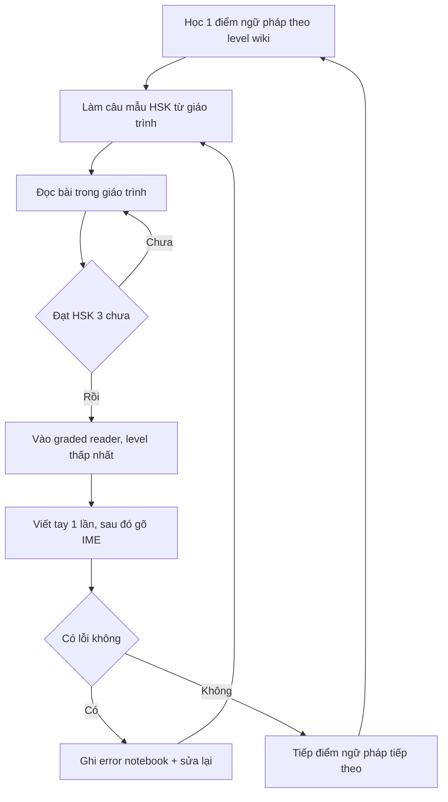

# 04 — Ngữ pháp, đọc và viết tiếng Trung

> Khung ngữ pháp–đọc–viết cho người mới số 0, mục tiêu HSK 1–4. Tổng hợp từ 3 file research `references/10-chuan-hsk-chuong-trinh.md`, `11-pinyin-thanh-dieu-nghe-noi.md`, `12-chu-han-tu-vung-ngu-phap.md` (ngày research 2026-09-23). Không đánh số buổi học.

## Quy ước nhãn

- **[Nguồn: tên + URL + trích "nguyên văn ngắn"]** — dữ kiện trích trực tiếp từ 3 file research, giữ nguyên văn. `[Nguồn: file 10/11/12]` = tóm từ file research khi nội dung là tổng hợp của chính file đó.
- **[Suy luận self-learn + giả định: ...]** — thứ tự, checklist, cách vận hành do người tự học suy ra, không phải phát ngôn của nguồn.
- **[Tham khảo thêm: tên + URL + loại]** — nguồn ngoài; danh mục đầy đủ ở [06](./06-tai-lieu-tham-khao.md).
- Không trích được từ nguồn → ghi **gap**. File này không chứa lịch thi, học phí, logistics.

## Ngữ pháp theo level — Chinese Grammar Wiki A1→B2

Mapping CEFR ↔ HSK do chính wiki đặt ra [Nguồn: AllSet Learning — Grammar points by level + https://resources.allsetlearning.com/chinese/grammar/Grammar_points_by_level + trích "A1 Grammar Points ( Beginner / HSK 1-2 ): for absolute beginners … A2 Grammar Points ( Elementary / HSK 2-3 ) … B1 Grammar Points ( Intermediate / HSK 3-4 ) … B2 Grammar Points ( Upper Intermediate / HSK 4-5 ) … C1 Grammar Points ( Advanced / HSK 5-6 )"]:

| Mức wiki | Nhóm theo mapping wiki | Số điểm ngữ pháp |
|---|---|---|
| A1 | Beginner / HSK 1–2 | 40 |
| A2 | Elementary / HSK 2–3 | 99 |
| B1 | Intermediate / HSK 3–4 | 143 |
| B2 | Upper Intermediate / HSK 4–5 | 154 |
| C1 | Advanced / HSK 5–6 | 69 (mức C1, wiki ghi "so far") |

Số điểm mỗi mức lấy từ trang Main [Nguồn: AllSet — Chinese Grammar Wiki Main + https://resources.allsetlearning.com/chinese/grammar/Main_Page + trích "2,125 articles and growing! Jump to: A1, A2, B1, B2, C1. Or: HSK 1, HSK 2 [...] HSK 3." + "40 A1 grammar points", "99 A2 grammar points", "143 B1 grammar points", "154 B2 grammar points", C1 "69 so far"].

Danh sách điểm ngữ pháp xếp theo cấp HSK trực tiếp:

| Danh sách | Số điểm ngữ pháp |
|---|---|
| HSK 1 | 54 |
| HSK 2 | 79 |
| HSK 3 | 87 |
| HSK 4 | 115 |

**Bắt buộc kèm mọi khi nêu bộ số 54/79/87/115: đây là ước tính AllSet, 2012 HSK chưa từng công bố chuẩn chính thức.** [Nguồn: AllSet — 2012 HSK grammar points + http://resources.allsetlearning.com/chinese/grammar/2012_HSK_grammar_points + trích "NOTE: These HSK levels are estimates, since the 2012 HSK standard never officially released a clear standard for grammar points."] Số điểm từng cấp lấy từ [Nguồn: AllSet — HSK 1 grammar points + https://resources.allsetlearning.com/chinese/grammar/HSK_1_grammar_points + trích "There are 54 total HSK 1 grammar points"]; [Nguồn: AllSet — HSK 2 grammar points + https://resources.allsetlearning.com/chinese/grammar/HSK_2_grammar_points + trích "There are 79 total HSK 2 grammar points"]; [Nguồn: AllSet — HSK 3 grammar points + https://resources.allsetlearning.com/chinese/grammar/HSK_3_grammar_points + trích "There are 87 total HSK 3 grammar points"]; [Nguồn: AllSet — HSK 4 grammar points + https://resources.allsetlearning.com/chinese/grammar/HSK_4_grammar_points + trích "There are 115 total HSK 4 grammar points"].

## Mẫu câu trọng tâm HSK 1–4

| Cấp | Điểm ngữ pháp tiêu biểu (mapping file 12) — xem giải thích 04:49 | Cấu trúc / ví dụ mẫu |
|---|---|---|
| HSK 1 | 了 (hoàn thành), mức A2/HSK1 | `Subj. + Verb + 了`; "The simplest way to use 了 (le) is to just put it after a verb." |
| HSK 1–2 | Lượng từ (measure words) | `Number + Measure Word + Noun`; "一个人。一杯水。" |
| HSK 2 | 是…的 | "我是来上海旅游的。" / "你是哪个学校的？" |
| HSK 3 (B1) | 把, 被, ⋯了 đổi trạng thái | `Subj. + 把 + Obj. + [Verb Phrase]`; `Subj. + 被 + Doer + Verb Phrase` |
| HSK 4 | — | **gap:** file 12 chỉ trích được tổng số 115 điểm, không trích được mẫu câu riêng cho HSK 4 |

Chi tiết nguồn từng dòng:

- [Nguồn: AllSet — Expressing completion with "le" + https://resources.allsetlearning.com/chinese/grammar/Expressing_completion_with_%22le%22 + trích "Level A2 / HSK1"; "One of the most common is to express the completion of an action. This is called aspect, which is not the same as tense."; "The simplest way to use 了 (le) is to just put it after a verb."] — 了 nằm ở HSK 1 dù wiki gắn nhãn A2.
- [Nguồn: AllSet — HSK 2 grammar points + https://resources.allsetlearning.com/chinese/grammar/HSK_2_grammar_points + trích "Measure words for counting | Number + Measure Word + Noun | 一个人。一杯水。"] — lượng từ tính theo cấu trúc nằm trong danh sách HSK 2; từ vựng lượng từ riêng đã có ở HSK 1 [Nguồn: AllSet Vocabulary Wiki — HSK 1 Vocabulary + https://resources.allsetlearning.com/chinese/vocabulary/HSK_1_Vocabulary + trích "本 | běn | [measure word for books] | HSK 1", "个 | gè | [measure word for people] | HSK 1"]. → Quy ước Gate: lượng từ HSK1–2 (cấu trúc HSK2, từ vựng HSK1).
- [Nguồn: AllSet — HSK 2 grammar points + https://resources.allsetlearning.com/chinese/grammar/HSK_2_grammar_points + trích "The \"shi... de\" construction for indicating purpose | 是⋯⋯ 的 | 我 是 来 上海 旅游 的。" và "The \"shi... de\" patterns: an overview | 是⋯…… 的 | 你 是 哪个 学校 的 ？"] — 是…的 = HSK 2.
- [Nguồn: AllSet — Using "ba" sentences + https://resources.allsetlearning.com/chinese/grammar/%22Ba%22_sentence + trích "Level B1 / HSK3"; "A 把 sentence shakes things up a bit, and you get this structure: Subj. + 把 + Obj. + [Verb Phrase]"; "The object should be known. So it has already been mentioned or discussed previously."] — 把 = B1/HSK3.
- [Nguồn: AllSet — HSK 3 grammar points + https://resources.allsetlearning.com/chinese/grammar/HSK_3_grammar_points + trích "Using \"bei\" sentences | Subj. + 被 + Doer + Verb Phrase", "Change of state with \"le\" | ⋯⋯了"] và [Nguồn: AllSet — B1 grammar points with HSK + https://resources.allsetlearning.com/chinese/grammar/B1_grammar_points_with_HSK + trích "+ 把 + Obj.+ Verb Phrase | HSK3", "There are 143 total grammar points in the list below."]

## Giáo trình bù cho phần ngữ pháp (không xếp hạng "tốt nhất tuyệt đối")

- **HSK Standard Course 1–4** — hợp tự học nhất trong 3 sách: series tự nhận phù hợp "self-taught learners" [Nguồn: HSK Standard Course (site chính thức series) + https://www.hskstandardcourse.com/ + trích "Authorized by Hanban, HSK Standard Course is developed under the joint efforts of Beijing Language and Culture University Press and Chinese Testing International (CTI) … suitable for … other Chinese teaching institutions and self-taught learners"]; cấu trúc một bài = từ vựng + ngữ pháp + luyện thi, có Teacher's Book + đáp án + audio [Nguồn: file 10 (tóm, không trích nguyên văn) + references/10-chuan-hsk-chuong-trinh.md + ghi "có Teacher's Book + đáp án PDF + audio; cấu trúc \"một bài = từ vựng + ngữ pháp + luyện thi\""]. Nhược điểm review cộng đồng: dialogue cứng [Nguồn: Zhong Chinese + https://www.zhongchinese.com/articles/guides/best-mandarin-textbooks + trích "HSK Standard Course teaches HSK Chinese, not living Chinese. The dialogues are functional but stilted."].
- **Integrated Chinese** — cần giáo viên: [Nguồn: Zhong Chinese + https://www.zhongchinese.com/articles/guides/best-mandarin-textbooks + trích "designed for classroom use with a teacher. The pacing assumes 3-4 hours of class per week … Self-studiers often find the explanations too sparse—the book leaves a lot to the instructor."] — không phải lựa chọn tối ưu cho người học hoàn toàn một mình (file 10, cùng nguồn).
- **New Practical Chinese Reader (NPCR)** — mạnh viết/phonetics, ngữ pháp yếu, bù bằng Grammar Wiki: [Nguồn: All Language Resources + https://www.alllanguageresources.com/new-practical-chinese-reader + trích "the New Practical Chinese Reader has a stronger focus on writing and pronunciation than Integrated Chinese, but the grammar explanations may not be as strong. Luckily, Chinese Grammar Wiki can be used to supplement"].
- [Suy luận self-learn + giả định: tự học không giáo viên, mục tiêu HSK 1–4] Dùng HSK Standard Course làm trục, mở trang Grammar Wiki theo cấp (A1→B2 ở trên) mỗi khi sách giải thích chưa đủ; chọn NPCR nếu muốn luyện viết/phonetics sâu hơn. Không sách nào là "tốt nhất tuyệt đối" — mọi đánh giá textbooks trên là review cộng đồng, **hạ tin cậy, chưa kiểm độc lập**.

## Đọc — graded readers và thứ tự vào

[Suy luận self-learn + giả định: theo thứ tự chốt trong file 10 — "phonetics/tones → HSK 1–2 từ vựng + chữ (SRS) → nghe input đơn giản hằng ngày → nói sớm từ tháng 2 → đọc graded reader từ HSK 3 → writing ôn theo format đề từ HSK 3"]:

1. **Trước HSK 3:** đọc bài/dialogue trong giáo trình + câu trên deck SRS; chưa vào graded reader.
2. **Từ HSK 3:** vào graded reader, bắt đầu level thấp nhất rồi lên.
3. **Nguyên tắc chọn sách dễ hơn mức thấy khó** [Nguồn: Mandarin Companion — Why graded readers + https://mandarincompanion.com/why-graded-readers + trích "Graded readers are not: … Books with pinyin over the characters. If you can't read something without pinyin – it's too hard for you right now"].

Ba series có trong research:

- **Mandarin Companion** — 3 level Breakthrough / Level I / Level II [Nguồn: Mandarin Companion — homepage + https://mandarincompanion.com/ + trích "We offer three levels of graded readers to help you learn Chinese confidently."; "Our Graded Readers use language that is controlled and simplified that makes them easy for learners to read."]. Lý do đọc lặp — **claim của trang Mandarin Companion, chỉ là quy tắc thực hành phổ biến, không thành chuẩn khoa học (F8)** [Nguồn: Mandarin Companion — Why graded readers + https://mandarincompanion.com/why-graded-readers + trích "Full of repetition – you need 10 – 30 encounters with a word to connect it to its meaning"].
- **Chinese Breeze (汉语风)** — 4 level theo số từ kiểm soát 300 / 500 / 750 / 1.100. **Catalog chính thức của NXB không trích được** — dữ kiện hiện có chỉ qua review bên thứ ba [Nguồn: HSKStory — Chinese Breeze review (2nd.) + https://hskstory.com/guides/chinese-breeze-graded-readers + trích "Chinese Breeze labels its levels by controlled words rather than HSK bands."; "Level 1 | 300 … Level 2 | 500 … Level 3 | 750 … Level 4 | 1,100"] và listing sách lẻ [Nguồn: Purple Culture + https://www.purpleculture.net/reading-materials-c-1_101 + trích "Chinese Breeze Graded Reader Series (2nd Edition): Level 1 300 Words Level: Two Children Seeking the Joy Bridge"].
- **DuChinese** — app đọc phân level [Nguồn: DuChinese — homepage + https://duchinese.net/ + trích "3000+ Readings in our Library"; "80+ Graded stories"; "Read at Any Level FROM BEGINNER TO MASTER"].

## Viết — tay hay gõ IME

Bằng chứng trong research (đối chiếu 2 hướng, không có kết luận "chỉ dùng một cách"):

- Tổng quan 27 thực nghiệm: [Nguồn: ScienceDirect — typing vs handwriting review + https://www.sciencedirect.com/science/article/abs/pii/S0883035521000100 + trích "typing has a greater effect on Chinese learners' phonology recognition and phonology-orthography mapping than handwriting"; "handwriting had positive effects on Chinese learners' orthography recognition and orthographic-semantic mapping at both the character and lexical levels"] — gõ giỏi hơn cho nhận diện âm, viết tay giỏi hơn cho nối hình–nghĩa.
- Thực nghiệm học sinh lớp 6 [Nguồn: Acta Psych Sinica + https://journal.psych.ac.cn/acps/EN/10.3724/SP.J.1041.2016.01258 + trích "the positive effects from the two practice methods were similar in recognition, but the writing performance after the handwriting practice was significantly better than that after the Pinyin keyboarding practice."] — viết tay cải thiện phần *viết* rõ hơn.
- Khuyến nghị thực hành [Nguồn: Hacking Chinese + https://www.hackingchinese.com/my-best-advice-on-how-to-learn-chinese-characters + trích "I mainly recommend learning to write characters to beginners, not because they will write tons of Chinese by hand, but because I believe it's very difficult to understand how characters work without actually writing them."; "Yes, you should learn stroke order."].
- Lưu ý IME [Nguồn: DCU + https://www.dcu.ie/humanitiesandsocialsciences/news/2020/01/handwriting-or-type-whats-the-future-of-learning-chinese + trích "neither encourages memorising whole character representations, especially when a fuzzy matching technique is embedded in the input system"] — gõ pinyin không buộc nhớ toàn bộ hình chữ.

[Suy luận self-learn + giả định: người mới số 0, tự học] Giai đoạn đầu viết tay để hiểu chữ vận hành; sau đó gõ IME cho khối lượng ôn lớn. Bắt đầu quen format viết từ HSK 3 vì từ HSK 3 mới có phần thi viết [Nguồn: GraphChinese + https://graphchinese.com/hsk-test-format + trích "From HSK 3 the writing section appears, the paper scores out of 300"] — HSK 4 có 15 câu viết (10 sắp chữ + 5 viết câu theo tranh/từ) [Nguồn: DigMandarin + https://www.digmandarin.com/hsk-level-4 + trích "Writing (15 items / 25 mins)"].

### Checklist viết chữ [Suy luận self-learn + giả định: tự chấm, không giáo viên]

- Chưa viết chữ thì học 8 nét cơ bản trước [Nguồn: Wikipedia — Chinese character strokes + https://en.wikipedia.org/wiki/Chinese_character_strokes + trích mục "Eight basic strokes" liệt kê "the Diǎn 點 / 点… the Héng 横…"; đối chiếu tài liệu Unicode "8 基本笔画 (fundamental strokes, i.e. \"点横竖撇捺挑折勾\")" — https://www.unicode.org/L2/L2014/14011-cjk-strokes-add.pdf].
- Viết đúng thứ tự nét theo 17 quy tắc của Bộ GD Đài Loan [Nguồn: MOE Taiwan — Basic Rules of Stroke Order + https://stroke-order.learningweb.moe.edu.tw/page.jsp?ID=46&la=1 + trích "There are a total of 17 basic rules as shown in Handbook of Standard Form of Frequently Used Chinese Characters, published by the Ministry of Education."; ví dụ "1. From left to right…: 川、仁、街、湖", "2. From top to bottom…: 三、字、星、意", "4. Horizontal before vertical…: 十、干、士、甘、聿"] — không bắt buộc học hết bộ thủ trước khi viết [Nguồn: Oxford CTCFL + https://www.ctcfl.ox.ac.uk/materials_radical-index + trích "There is no need to learn all the radicals first before learning characters."], tra bộ thủ khi cần [Nguồn: Arch Chinese + https://archchinese.com/traditional_chinese_radicals.html + trích "They are also the building blocks of Chinese characters and often reflect some common semantics or phonetic characteristics."].
- So từng chữ với stroke order diagram (Pleco: 500 diagram miễn phí trong app free [Nguồn: Pleco — Google Play listing + https://play.google.com/store/apps/details?id=com.pleco.chinesesystem + trích "Stroke Order Diagrams: animations … 500 in free app, 28,000 in paid add-on."]).
- Deck vẽ nét theo HSK 3.0 chỉ link được listing, mô tả không trích được [Nguồn: AnkiWeb — search "chinese" + https://ankiweb.net/shared/decks?search=chinese + trích dòng listing "HSK 3.0: Learn Mandarin Chinese by drawing strokes [HSK 1-9] | 39 | 2022-09-30 | 11042"] — **gap:** chưa có mô tả chính thức của deck.
- Lỗi viết lặp lại ghi ngay vào error notebook bên dưới.

## Error notebook [Suy luận self-learn + giả định: không có giáo viên chấm]

Không có người sửa bài trực tiếp → tự lập sổ lỗi, mỗi lỗi 1 dòng:

- **Cột ghi:** ngày; cấu trúc/chữ sai; câu sai gốc; phiên bản đúng; bối cảnh sai (đọc / viết tay / gõ IME / nói / nghe); link trang Grammar Wiki hoặc trang nguồn tương ứng (vd trang 了, 把 ở trên).
- **Cách dùng:** mỗi tuần đọc lại toàn sổ một lần, lỗi nào lặp lại ≥2 lần thì làm lại bài tập riêng cho cấu trúc đó và ghi thêm 1 dòng đối chiếu.
- Ghi theo lỗi thật, không ghi chung chung: "sai 了" vô ích — phải ghi đúng câu đã nói/viết ra.
- Chữ viết sai (thiếu nét, sai thứ tự nét) ghi cùng trang với lỗi ngữ pháp, tách cột bối cảnh.

**Gap:** 3 file research không có mẫu error notebook sẵn — format trên là suy luận, chưa có nguồn đối chiếu.

Về [README](./README.md) | Trước: [03](./03-chu-han-tu-vung-srs.md) | Tiếp: [05](./05-loop-dai-han-va-tai-lieu.md) | Danh mục nguồn: [06](./06-tai-lieu-tham-khao.md).
