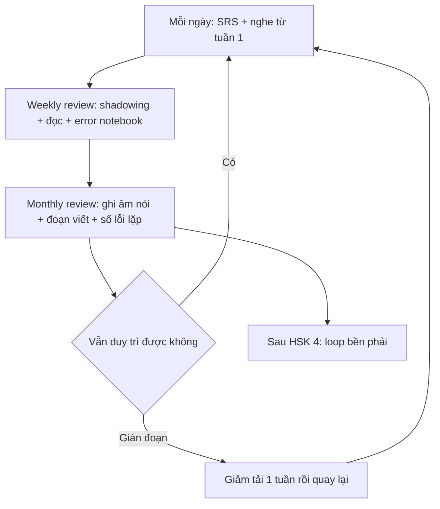
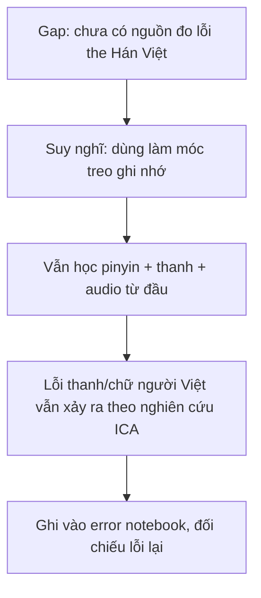

# 05 — Loop dài hạn và duy trì

> Vòng học dài hạn cho người mới số 0, từ thói quen tuần–tháng tới duy trì sau HSK 4. Dữ kiện lấy từ 3 file research `references/10`, `11`, `12` (ngày research 2026-09-23). Không chứa lịch thi, học phí, logistics.

## Quy ước nhãn

- **[Nguồn: tên + URL + trích "nguyên văn ngắn"]** — dữ kiện trích từ 3 file research.
- **[Suy luận self-learn + giả định: ...]** — cấu trúc loop, cách đo và mọi khuyến nghị tổng hợp không trích được một nguồn gốc.
- **[Tham khảo thêm: tên + URL + loại]** — nguồn ngoài; danh mục đầy đủ ở [06](./06-tai-lieu-tham-khao.md).
- Không trích được → ghi **gap**.

## Thói quen nền theo lộ trình research

Theo file 10, thứ tự chốt cho người mới số 0 là **tổng hợp biên tập của file nguồn, không phải trích nguyên văn** (theo quy ước file 00) — nội dung: phonetics/tones → HSK 1–2 từ vựng + chữ (SRS) → nghe input đơn giản hằng ngày → nói sớm từ tháng 2 (tutor/đổi ngôn ngữ) → đọc graded reader từ HSK 3 → writing ôn theo format đề từ HSK 3 [`references/10-chuan-hsk-chuong-trinh.md`, mục "Thứ tự chốt"]. Ba mốc thói quen quan trọng nhất:

- **Nghe từ tuần 1** [Nguồn: DeckDuck — Best Chinese Textbooks 2026 + https://deckduck.com/blog/best-chinese-textbooks + trích "2. Tone ears. … the listening ladder run alongside from week one."] — nghe xếp ngay từ tuần đầu, không chờ "đủ ngữ pháp".
- **Nói từ tháng 2** [Nguồn: DeckDuck + https://deckduck.com/blog/best-chinese-textbooks + trích "3. Speaking. Humans, weekly, from month two."] — tuần với người thật, từ tháng thứ hai.
- **Graded reader ở HSK 3** — theo thứ tự chốt của file 10 ở trên; dữ kiện nền về graded reader và cảnh báo "không đọc sách gắn pinyin" nằm ở [04](./04-ngu-phap-doc-viet.md).
- **SRS hằng ngày + học câu chứ không học từ rời** [Nguồn: Reddit r/ChineseLanguage + https://www.reddit.com/r/ChineseLanguage/comments/jai9h1/comparison_practical_chinese_reader_vs_hsk_books + trích "Master tones : Focus on pinyin and tones early, as they are crucial for pronunciation and understanding. … Study sentences, not just vocabulary : Learn words in context"] + [Nguồn: DeckDuck + https://deckduck.com/blog/best-chinese-textbooks + trích "1. Vocabulary scheduling. Books introduce; SRS retains."]. Khoảng cách ôn gợi ý trong research: 1-3-7-14-30 ngày [Nguồn: Lexie + https://www.lexielearn.com/guides/spaced-repetition-study-method + trích "review 1 day after learning, then 3 days, then 7, then 14, then 30."]; Anki từ 23.10 có SM-2 và FSRS [Nguồn: Anki FAQ + https://faqs.ankiweb.net/what-spaced-repetition-algorithm.html + trích "As of Anki 23.10, Anki has two available algorithms."].
- Khối lượng gợi ý của nguồn cộng đồng (không phải yêu cầu) [Nguồn: DeckDuck + https://deckduck.com/blog/best-chinese-textbooks + trích "one textbook chapter weekly + [...] daily + graded reader at bedtime + one exchange session"].

## Loop weekly và monthly [Suy luận self-learn + giả định: người tự học tự chấm, dựa trên cấu trúc việc research chỉ ra nhưng research không ấn định nhịp]

Nhịp dưới đây là suy luận, không phải khuyến nghị của bất kỳ nguồn nào trong 3 file:

- **Weekly review (~30 phút):** ôn thẻ SRS tới hạn; nghe lại 1 đoạn đã shadowing trong tuần; đọc tiếp graded reader (hoặc bài giáo trình nếu chưa tới HSK 3); so error notebook, đếm lỗi lặp lại.
- **Monthly review (~90 phút):** ghi âm nói tự do 1–3 phút; viết 1 đoạn ngắn (tay hoặc IME theo mục 04); đọc lại toàn bộ error notebook tháng, chọn 3 lỗi lặp nhiều nhất thành mục ôn tháng sau; đối chiếu chỉ số với tháng trước.
- **Đo lường [Suy luận]:** số ngày duy trì SRS liên tục; số thẻ qua đủ vòng ôn; số trang/bài graded reader đã đọc; số lỗi mới và số lỗi lặp trong error notebook; số buổi nói đã thực sự nói (không chỉ nghe).

## Duy trì sau HSK 4 [Suy luận self-learn + giả định]

Mốc nền (không phải lịch thi): **theo UWI (community, mapping CEFR chưa từng official)**, HSK 4 tương ứng B2, 1.200 từ [Nguồn: UWI Confucius + https://sta.uwi.edu/confucius/chinese-proficiency-test-hsk + trích "HSK (Level 4) | 1,200 words | B2"]; đề HSK 4 gồm Nghe 45 + Đọc 40 + Viết 15 [Nguồn: DigMandarin + https://www.digmandarin.com/hsk-level-4 + trích "there are three sections in total, Listening comprehension, Reading comprehension, and Writing … Writing (15 items / 25 mins)"].

- Giữ nguyên daily SRS nhưng ưu tiên thẻ từ lỗi error notebook và từ gặp khi đọc, giảm thẻ "học vẹt từ list".
- Chuyển input lên mức khó hơn: graded reader level cao trong 3 series ở mục 04; nghe chậm có script → nghe tốc độ thật [Nguồn: Slow Chinese Podcast 慢速汉语 + https://podcasts.apple.com/us/podcast/slow-chinese-podcast-%E6%85%A2%E9%80%9F%E6%B1%89%E8%AF%AD-learn-chinese-%E5%AD%A6%E4%B8%AD%E6%96%87/id1562798369 + trích "short stories/news/articles in different levels are told in very slow and clear Mandarin Chinese. Video and Script PDF with Pinyin/English/Chinese/Thai are available."] và video beginner/intermediate có subtitle tiếng mẹ đẻ [Nguồn: Mandarin Corner + https://mandarincorner.org/ + trích "Beginner | Intermediate ... Vocabulary Chinese Characters Audio Podcast HSK Flashcards HSK 1 to 6 Slow Chinese Conversation"].
- Giữ nói hằng tháng [Suy luận self-learn + giả định: research chỉ nói "weekly, from month two", không ấn định nhịp sau này] (nhịp "weekly, from month two" ở trên tự chuyển thành nhịp giữ phong độ).
- Nếu muốn thi tiếp: mọi mốc HSK 3.0 dưới đây — **theo CTI 2026, kiểm lại trước khi đăng ký**:

| Mốc HSK 3.0 (research file 10) | Nguồn |
|---|---|
| Sách hướng dẫn công bố 11/2025, hiệu lực 7/2026 | **Gap — không phải [Nguồn]:** file 10 chỉ ghi tóm tắt mốc này, không có trích nguyên văn kèm; cần đối chiếu lại văn bản CTI trước khi dùng |
| Thử toàn cầu lần 1: 31/01/2026 | **Gap — không phải [Nguồn]:** file 10 có ghi mốc này nhưng trích dẫn kèm chỉ phủ lần 2 (20/09/2026, "第二轮试行考试") → không có nguyên văn cho lần 1; đối chiếu lại trang thông báo trước khi dùng |
| Thử toàn cầu lần 2: 20/09/2026 | [Nguồn: chinesetest.cn — Thông báo + https://www.chinesetest.cn/notice + trích "定于 2026年9月20日 面向全球开展第二轮试行考试 … 考生可通过 www.chinesetest.cn 中文考试服务网在线报名。"] |
| Ra mắt chính thức toàn cầu: 13/12/2026 | [Nguồn: chinesetest.cn (admin) + https://admin.chinesetest.cn/gonewcontent.do?id=51336883 + trích "HSK 3.0 will be officially launched worldwide on December 13, 2026!"] |
| HSK 1–6 thường trong 2026 vẫn chạy HSK 2.0 tới khi CTI công bố ngày khởi động HSK 3.0 | [Nguồn: HSKStory — What is HSK 3.0 + https://hskstory.com/guides/what-is-hsk-30 + trích "CTI says regular 2026 HSK 1–6 sessions still use HSK 2.0 until the formal HSK 3.0 start is announced separately." — nguồn community] |

Áp dụng cho **mọi mốc HSK 3.0 nói trên: theo CTI 2026, kiểm lại trước khi đăng ký.**

**HSKK — số liệu hạ tin cậy:** mốc từ vựng HSKK trung cấp ≈ 900 từ là mức **gợi ý, chưa kiểm** [Nguồn: iysc + http://www.iysc.org/the-overall-hskk-guide.html + diễn giải theo file 10 (file 10 không có nguyên văn câu này, nguồn community): trung cấp ≈ HSK 3–4 (~900 từ)]. Điểm đạt HSKK 60 xác nhận được từ handbook mirror [Nguồn: HSK/HSKK Handbook mirror + https://lllc.uiowa.edu/sites/lllc.uiowa.edu/files/2025-05/hsk_manual_chinese_and_english.pdf + trích "HSKK（初级）满分100分，总分60分为合格。"], nhưng cách dẫn ban đầu và hiệu lực điểm 2 năm lấy từ nguồn cộng đồng/trung tâm [Nguồn: India China Academy + https://www.indiachinaacademy.com/hsk-yct-exams + trích "The HSK scores are valid for two years"] → **hạ tin cậy (F5), cần xác minh lại ở nguồn chính thức trước khi dựa vào.** [Suy luận self-learn + giả định: 3 file research không trích được văn bản chính thức cho hiệu lực điểm.]

## Lợi thế Hán-Việt của người Việt [Suy luận self-learn + giả định]

**Đây là suy luận của người tự học, không có nguồn trong 3 file research nào đo trực tiếp lợi thế này — gap.**

- [Suy luận self-learn + giả định: chưa có nguồn đo] Nhiều từ Hán–Việt trùng hình/khớp nghĩa với từ Trung giản thể (vd nhóm từ vựng học thuật/sinh hoạt gốc Hán) có thể rút ngắn thời gian đoán nghĩa khi đọc và nhớ từ vựng HSK — giả định dựa trên nhận thức chung về quan hệ Việt–Hán, **chưa được 3 file research kiểm chứng**.
- [Suy luận self-learn + giả định: ranh giới của lợi thế] Lợi thế này (nếu có) chỉ hỗ trợ phần *nhận nghĩa khi đọc* — theo 1 nghiên cứu n=42 người Việt, tổng 384 lỗi gồm thanh điệu 156 (40,6%) + thanh mẫu 132 (34,4%) + vận mẫu 96 (25,0%), lỗi nổi bật nhất zh/ch/sh thành z/c/s [Nguồn: ICA + http://ica.org.vn/anh-huong-cua-chuyen-di-tieu-cuc-tu-tieng-me-de-den-phat-am-tieng-trung-cua-nguoi-hoc-viet-nam-bang-chung-tu-khao-sat-va-can-thiep-ngu-am/ + trích "Nghiên cứu ghi nhận 384 lỗi ... Thanh điệu: 156 lỗi (40,6%) ... Lỗi phổ biến nhất là âm cuốn lưỡi → không cuốn lưỡi (ví dụ zh/ch/sh bị đọc thành z/c/s)"]. → Vẫn phải học pinyin/thanh điệu từ đầu như người khác.
- [Suy luận self-learn + giả định: cách dùng chưa ai kiểm chứng] Dùng Hán–Việt làm "móc treo" gợi nhớ nghĩa khi học từ mới, nhưng luôn ghép với pinyin + audio + câu mẫu, không suy nghĩa từ chữ Hán–Việt bằng cách "đọc ngược" khi chưa chắc âm.

Về [README](./README.md) | Trước: [04](./04-ngu-phap-doc-viet.md) | Tiếp: [06](./06-tai-lieu-tham-khao.md).
