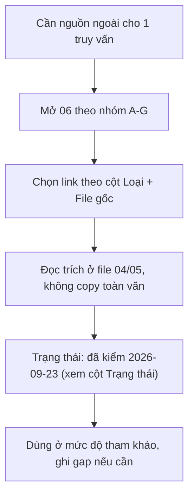

# 06 — Tài liệu tham khảo

> Index toàn bộ link ngoài nằm trong 3 file research của bộ plan: `references/10-chuan-hsk-chuong-trinh.md`, `references/11-pinyin-thanh-dieu-nghe-noi.md`, `references/12-chu-han-tu-vung-ngu-phap.md` (research ngày 2026-09-23). Trạng thái truy cập: **đã kiểm ngày 2026-09-23** bằng curl (`-L --max-time 15`, UA trình duyệt, retry tới khi ổn định) trên đủ 142 URL; kết quả ghi ở cột **Trạng thái** từng dòng, tổng hợp ở `references/22-link-status.md`. Các file 04/05 chỉ link nội bộ sang file này, không dump danh mục.

## Quy ước đọc

- Mọi dòng bảng = **[Tham khảo thêm]**, chưa dùng để claim dữ kiện, trạng thái xem cột **Trạng thái**; nhãn **[Nguồn]** chỉ nằm ở các file research và file 04/05.
- Cột **Loại** giữ nguyên giá trị trong manifest gốc. **Nhóm** (tiêu đề mục A–G, không phải cột) chuẩn hóa về 7 nhóm official / textbook / method / app / dict / reader / community theo quy tắc: `official*` → official (kể cả `official-method`, `official (academic)`…), `textbook` → textbook, `method` → method, `app` → app, `dict` → dict, `reader` → reader, `community` / `resource*` / `reference*` → community.
- Cột **File** = file research chứa manifest gốc (10 / 11 / 12); URL trùng lặp giữa các file đã gộp, hiện 142 URL duy nhất.
- Cột **Trạng thái** = kết quả kiểm link ngày 2026-09-23, dạng `sống (200, kiểm 2026-09-23)` / `bot-block (403, kiểm 2026-09-23)` / `404 (kiểm 2026-09-23)` / `lỗi (000, kiểm 2026-09-23)`; chi tiết từng URL ở `references/22-link-status.md`.
- Không copy toàn văn nguồn.

## A. Official (30)

| Tên | URL | Loại | File | Trạng thái |
|---|---|---|---|---|
| chinesetest.cn — HSK (trang chính thức CTI) | https://www.chinesetest.cn/HSK | official | 10 | sống (200, kiểm 2026-09-23) |
| chinesetest.cn — HSK Level 1 structure | https://www.chinesetest.cn/HSK/1 | official | 10 | sống (200, kiểm 2026-09-23) |
| chinesetest.cn — HSK Speaking Test (HSKK) | https://www.chinesetest.cn/HSKK | official | 10 | sống (200, kiểm 2026-09-23) |
| chinesetest.cn — Thông báo (thử nghiệm HSK 3.0 20/09/2026) | https://www.chinesetest.cn/notice | official | 10 | sống (200, kiểm 2026-09-23) |
| chinesetest.cn (admin) — ra mắt HSK 3.0 13/12/2026 | https://admin.chinesetest.cn/gonewcontent.do?id=51336883 | official | 10 | sống (200, kiểm 2026-09-23) |
| New HSK Test Syllabus (mobile) | https://m.chinesetest.cn/syllabus | official | 10 | sống (200, kiểm 2026-09-23) |
| Beijing.gov — Registration opens for HSK 3.0 | https://english.beijing.gov.cn/studyinginbeijing/news/202512/t20251222_4355931.html | official | 10 | sống (200, kiểm 2026-09-23) |
| Chinese Pronunciation Wiki — Pinyin chart (AllSet) | https://resources.allsetlearning.com/chinese/pronunciation/Pinyin_chart | official-method (reference wiki) | 11 | sống (200, kiểm 2026-09-23) |
| Chinese Pronunciation Wiki — Main Page (AllSet) | https://resources.allsetlearning.com/chinese/pronunciation/Main_Page | official-method | 11 | sống (200, kiểm 2026-09-23) |
| Chinese Grammar Wiki — Beginner Guide | https://resources.allsetlearning.com/chinese/grammar/Beginner_Guide_to_Chinese_Grammar | official-method | 11 | sống (200, kiểm 2026-09-23) |
| MIT — Hanyu Pinyin spelling rules | https://web.mit.edu/jinzhang/www/pinyin/spellingrules/index.html | official (academic) | 11 | sống (200, kiểm 2026-09-23) |
| PolyU BEPTH — Spelling Rules in Pinyin | https://www.polyu.edu.hk/bepth/introduction-to-phonetics/spelling-rules-in-pinyin/ | official (academic) | 11 | sống (200, kiểm 2026-09-23) |
| pinyin.info — Where do the tone marks go? (Mark Swofford) | https://pinyin.info/rules/where.html | official (reference) | 11 | sống (200, kiểm 2026-09-23) |
| pinyin.info — 拼音正詞法基本規則 (GB/T text) | https://pinyin.info/rules/pinyinrules.html | official (national standard text) | 11 | sống (200, kiểm 2026-09-23) |
| 国家标准馆 — GB/T 16159-2012 | https://ndls.cnis.ac.cn/standard/detail/51c2f77c5e3c01c75a147ae41bff75a8 | official (standard) | 11 | sống (200, kiểm 2026-09-23) |
| 洛阳师范 — GB/T 16159 text | https://sites.lynu.edu.cn/yywz/info/1003/1041.htm | official (standard text) | 11 | 404 (kiểm 2026-09-23) |
| pinyin.info — Yale romanization system | https://pinyin.info/romanization/yale/index.html | official (reference) | 11 | sống (200, kiểm 2026-09-23) |
| ScholarSpace Hawaii — Yale↔Pinyin self-study guide | https://scholarspace.manoa.hawaii.edu/bitstreams/9dab002f-d40f-4544-a675-61c7c1178f26/download | official (academic) | 11 | sống (200, kiểm 2026-09-23) |
| Lu & Su 2024 — Shadowing & Mandarin tones (JSLP) | https://doi.org/10.1075/jslp.22033.lu | official (peer-reviewed) | 11 | bot-block (403, kiểm 2026-09-23) |
| ICPhS 2023 — Disyllabic tones by Vietnamese speakers | https://www.internationalphoneticassociation.org/icphs-proceedings/ICPhS2023/full_papers/48.pdf | official (conference paper) | 11 | sống (200, kiểm 2026-09-23) |
| ICA — Chuyển di tiêu cực, lỗi phát âm người Việt | http://ica.org.vn/anh-huong-cua-chuyen-di-tieu-cuc-tu-tieng-me-de-den-phat-am-tieng-trung-cua-nguoi-hoc-viet-nam-bang-chung-tu-khao-sat-va-can-thiep-ngu-am/ | official (research, tiếng Việt) | 11 | lỗi (000, kiểm 2026-09-23) |
| Tran T.A.N. 2024 — 越南籍學習者華語聲調偏誤 (Zenodo) | https://doi.org/10.5281/zenodo.15549790 | official (thesis) | 11 | bot-block (403, kiểm 2026-09-23) |
| Airiti — 越南受試者的華語聲調聽辨研究 | https://www.airitilibrary.com/Article/Detail/22211624-202012-202107080029-202107080029-3-37 | official (thesis) | 11 | sống (200, kiểm 2026-09-23) |
| Nguyen & Nguyen 2026 — Aspirated/unaspirated, Vietnamese learners | https://doi.org/10.17977/um073v5i12026p1-11 | official (journal) | 11 | sống (200, kiểm 2026-09-23) |
| Jin 2023 — Vietnamese adult learners' phonological biases | https://doi.org/10.2991/978-2-38476-062-6_37 | official (proceedings) | 11 | sống (200, kiểm 2026-09-23) |
| 汉考国际 — HSKK评分说明（自测用） | https://admin.chinesetest.cn/gonewcontent.do?id=5709888 | official (test provider) | 11 | sống (200, kiểm 2026-09-23) |
| HSK/HSKK Handbook (Chinese-English, PDF mirror) | https://lllc.uiowa.edu/sites/lllc.uiowa.edu/files/2025-05/hsk_manual_chinese_and_english.pdf | official (handbook mirror) | 11 | lỗi (000, kiểm 2026-09-23) |
| HSK complete guide (PDF, Konfucius Olomouc) | https://konfucius.upol.cz/fileadmin/userdata/cm/Konfucius/HSK_complete.pdf | official (test info mirror) | 11 | sống (200, kiểm 2026-09-23) |
| Sage — Review of HSKK (Assessing speaking proficiency) | https://sage.cnpereading.com/doi/10.1177/02655322231163470 | official (peer-reviewed) | 11 | sống (200, kiểm 2026-09-23) |
| Review of Chinese Proficiency Grading Standards (syllable chart) | https://doi.org/10.25236/fer.2021.040619 | official (paper) | 11 | sống (200, kiểm 2026-09-23) |

## B. Textbook (3)

| Tên | URL | Loại | File | Trạng thái |
|---|---|---|---|---|
| HSK Standard Course (site chính thức series) | https://www.hskstandardcourse.com/ | textbook | 10 | sống (200, kiểm 2026-09-23) |
| HSK Standard Course 1 Textbook | https://www.hskstandardcourse.com/hsk-standard-course-level-1/hsk-standard-course-1-textbook | textbook | 10 | sống (200, kiểm 2026-09-23) |
| FLTRP — New HSK Course (HSK 3.0 official series) | https://www.fltrp.com/en/hsk | textbook | 10 | sống (200, kiểm 2026-09-23) |

Footnote (số liệu tách khỏi tên dòng ở trên): HSK Standard Course 1 có **15 bài / 150 từ / 45 điểm ngôn ngữ** — [Nguồn: HSK Standard Course 1 Textbook + https://www.hskstandardcourse.com/hsk-standard-course-level-1/hsk-standard-course-1-textbook + trích "15 lessons and covers 150 words and 45 language points required by the HSK Level 1 test."] (file 10).

## C. Method (42)

| Tên | URL | Loại | File | Trạng thái |
|---|---|---|---|---|
| Chinese Pronunciation Wiki — Initial | https://resources.allsetlearning.com/chinese/pronunciation/Initial | method | 11 | sống (200, kiểm 2026-09-23) |
| Chinese Pronunciation Wiki — Four tones | https://resources.allsetlearning.com/chinese/pronunciation/Four_tones | method | 11 | sống (200, kiểm 2026-09-23) |
| Chinese Pronunciation Wiki — Neutral tone | https://resources.allsetlearning.com/chinese/pronunciation/Neutral_tone | method | 11 | sống (200, kiểm 2026-09-23) |
| Chinese Pronunciation Wiki — Tone change rules | https://resources.allsetlearning.com/chinese/pronunciation/Tone_change_rules | method | 11 | sống (200, kiểm 2026-09-23) |
| Chinese Pronunciation Wiki — Tone pairs | https://resources.allsetlearning.com/chinese/pronunciation/Tone_pairs | method | 11 | sống (200, kiểm 2026-09-23) |
| Chinese Pronunciation Wiki — A2 pronunciation points | https://resources.allsetlearning.com/chinese/pronunciation/A2_pronunciation_points | method | 11 | sống (200, kiểm 2026-09-23) |
| Hacking Chinese — Guide to Mandarin tones | https://www.hackingchinese.com/the-hacking-chinese-guide-to-mandarin-tones/ | method | 11 | sống (200, kiểm 2026-09-23) |
| Hacking Chinese — Tone pairs | https://www.hackingchinese.com/focusing-on-tone-pairs-to-improve-your-mandarin-pronunciation/ | method | 11 | sống (200, kiểm 2026-09-23) |
| Hacking Chinese — Minimal pairs / tone problems | https://www.hackingchinese.com/a-smart-method-to-discover-problems-with-tones/ | method | 11 | sống (200, kiểm 2026-09-23) |
| Hacking Chinese — Mimicking native speakers | https://www.hackingchinese.com/mimicking-native-speakers-way-learning-chinese/ | method | 11 | sống (200, kiểm 2026-09-23) |
| FluentU — Shadowing Chinese in steps | https://www.fluentu.com/blog/chinese/shadowing-chinese/ | method | 11 | sống (200, kiểm 2026-09-23) |
| StudyCLI — Tone changes in Mandarin | https://studycli.org/learn-chinese/tone-changes-in-mandarin/ | method (community) | 11 | sống (200, kiểm 2026-09-23) |
| Arch Chinese — Chinese Radicals | https://archchinese.com/traditional_chinese_radicals.html | method | 12 | sống (200, kiểm 2026-09-23) |
| Oxford CTCFL — Chinese Characters and Radicals | https://www.ctcfl.ox.ac.uk/materials_radical-index | method | 12 | sống (200, kiểm 2026-09-23) |
| Wikipedia — Chinese character strokes | https://en.wikipedia.org/wiki/Chinese_character_strokes | method | 12 | sống (200, kiểm 2026-09-23) |
| Unicode L2 — 8 basic strokes (baike ref) | https://www.unicode.org/L2/L2014/14011-cjk-strokes-add.pdf | method | 12 | sống (200, kiểm 2026-09-23) |
| Chinestudy — eight essential strokes | https://www.chinestudy.com/blog/mastering-strokes-of-chinese-characters | method | 12 | sống (200, kiểm 2026-09-23) |
| MOE Taiwan — Basic Rules of Stroke Order | https://stroke-order.learningweb.moe.edu.tw/page.jsp?ID=46&la=1 | method | 12 | sống (200, kiểm 2026-09-23) |
| HanziStroke — why stroke order matters | https://www.hanzistroke.com/ | method | 12 | sống (200, kiểm 2026-09-23) |
| Chill Chinese — HSK chars/words table | https://chill-chinese.com/blog/old-hsk | method | 12 | sống (200, kiểm 2026-09-23) |
| UZH — HSK requirements | https://www.aoi.uzh.ch/en/sinologie/fremdsprache/hsk.html | method | 12 | sống (200, kiểm 2026-09-23) |
| CLI — What is the HSK (3.0 counts) | https://studycli.org/hsk/what-is-the-hsk | method | 12 | sống (200, kiểm 2026-09-23) |
| HanziFeed — characters by HSK 3.0 level | https://hanzifeed.com/characters | method | 12 | sống (200, kiểm 2026-09-23) |
| UH Press — Remembering Simplified Hanzi 1 | https://uhpress.hawaii.edu/title/remembering-simplified-hanzi-1-how-not-to-forget-the-meaning-and-writing-of-chinese-characters | method | 12 | sống (200, kiểm 2026-09-23) |
| Lexie — 1-3-7-14-30 schedule | https://www.lexielearn.com/guides/spaced-repetition-study-method | method | 12 | sống (200, kiểm 2026-09-23) |
| StudyCards AI — 1-3-7-14-30 explained | https://studycardsai.com/blog/spaced-repetition-schedule-day-1-day-3-day-7-day | method | 12 | sống (200, kiểm 2026-09-23) |
| SM-2 implementation reference | https://github.com/cnnrhill/sm-2 | method | 12 | sống (200, kiểm 2026-09-23) |
| Anki FAQ — algorithm (SM-2/FSRS) | https://faqs.ankiweb.net/what-spaced-repetition-algorithm.html | method | 12 | sống (200, kiểm 2026-09-23) |
| Awesome FSRS — The Algorithm | https://github.com/open-spaced-repetition/awesome-fsrs/wiki/The-Algorithm | method | 12 | sống (200, kiểm 2026-09-23) |
| AllSet — 2012 HSK grammar points | http://resources.allsetlearning.com/chinese/grammar/2012_HSK_grammar_points | method | 12 | sống (200, kiểm 2026-09-23) |
| AllSet — HSK 1 grammar points | https://resources.allsetlearning.com/chinese/grammar/HSK_1_grammar_points | method | 12 | sống (200, kiểm 2026-09-23) |
| AllSet — HSK 2 grammar points | https://resources.allsetlearning.com/chinese/grammar/HSK_2_grammar_points | method | 12 | sống (200, kiểm 2026-09-23) |
| AllSet — HSK 3 grammar points | https://resources.allsetlearning.com/chinese/grammar/HSK_3_grammar_points | method | 12 | sống (200, kiểm 2026-09-23) |
| AllSet — HSK 4 grammar points | https://resources.allsetlearning.com/chinese/grammar/HSK_4_grammar_points | method | 12 | sống (200, kiểm 2026-09-23) |
| AllSet — Expressing completion with "le" | https://resources.allsetlearning.com/chinese/grammar/Expressing_completion_with_%22le%22 | method | 12 | sống (200, kiểm 2026-09-23) |
| AllSet — Using "ba" sentences | https://resources.allsetlearning.com/chinese/grammar/%22Ba%22_sentence | method | 12 | sống (200, kiểm 2026-09-23) |
| AllSet — B1 grammar points with HSK | https://resources.allsetlearning.com/chinese/grammar/B1_grammar_points_with_HSK | method | 12 | sống (200, kiểm 2026-09-23) |
| AllSet Vocabulary Wiki — HSK 1 Vocabulary | https://resources.allsetlearning.com/chinese/vocabulary/HSK_1_Vocabulary | method | 12 | sống (200, kiểm 2026-09-23) |
| ScienceDirect — typing vs handwriting review | https://www.sciencedirect.com/science/article/abs/pii/S0883035521000100 | method | 12 | bot-block (403, kiểm 2026-09-23) |
| Acta Psych Sinica — handwriting vs pinyin keyboarding | https://journal.psych.ac.cn/acps/EN/10.3724/SP.J.1041.2016.01258 | method | 12 | sống (200, kiểm 2026-09-23) |
| Hacking Chinese — learn characters best advice | https://www.hackingchinese.com/my-best-advice-on-how-to-learn-chinese-characters | method | 12 | sống (200, kiểm 2026-09-23) |
| DCU — handwriting or type | https://www.dcu.ie/humanitiesandsocialsciences/news/2020/01/handwriting-or-type-whats-the-future-of-learning-chinese | method | 12 | sống (200, kiểm 2026-09-23) |

## D. App (7)

| Tên | URL | Loại | File | Trạng thái |
|---|---|---|---|---|
| AnkiWeb — Chinese Vocabulary (HSK 1-4) | https://ankiweb.net/shared/info/1352957654 | app | 12 | sống (200, kiểm 2026-09-23) |
| AnkiWeb — HSK Word list [EN/CH] | https://ankiweb.net/shared/info/1152538376 | app | 12 | sống (200, kiểm 2026-09-23) |
| AnkiWeb — HSK Level 1 | https://ankiweb.net/shared/info/2125589644 | app | 12 | sống (200, kiểm 2026-09-23) |
| AnkiWeb — search "chinese" (Heisig deck…) | https://ankiweb.net/shared/decks?search=chinese | app | 12 | sống (200, kiểm 2026-09-23) |
| HSK Core — HSK Anki decks 1–6 | https://hskcore.com/hsk-anki-decks | app | 12 | sống (200, kiểm 2026-09-23) |
| Pleco — Google Play listing | https://play.google.com/store/apps/details?id=com.pleco.chinesesystem | app | 12 | sống (200, kiểm 2026-09-23) |
| Pleco — official site | https://www.pleco.com/ | app | 12 | sống (200, kiểm 2026-09-23) |

## E. Dict (6)

| Tên | URL | Loại | File | Trạng thái |
|---|---|---|---|---|
| MDBG — main | https://www.mdbg.net/chinese/dictionary | dict | 12 | sống (200, kiểm 2026-09-23) |
| MDBG — character dictionary | https://www.mdbg.net/chinese/dictionary?page=chardict | dict | 12 | sống (200, kiểm 2026-09-23) |
| MDBG — help | https://www.mdbg.net/chinese/dictionary?page=help&popup=1 | dict | 12 | sống (200, kiểm 2026-09-23) |
| MDBG — CC-CEDICT download | https://www.mdbg.net/chinese/dictionary?page=cc-cedict | dict | 12 | sống (200, kiểm 2026-09-23) |
| CC-CEDICT — editor site | https://cc-cedict.org/ | dict | 12 | sống (200, kiểm 2026-09-23) |
| CEDICT (wiki tổng hợp, 2nd) | https://informasilengkap.com/en/CEDICT | dict | 12 | bot-block (403, kiểm 2026-09-23) |

## F. Reader (5)

| Tên | URL | Loại | File | Trạng thái |
|---|---|---|---|---|
| Mandarin Companion — homepage | https://mandarincompanion.com/ | reader | 12 | sống (200, kiểm 2026-09-23) |
| Mandarin Companion — Why graded readers | https://mandarincompanion.com/why-graded-readers | reader | 12 | sống (200, kiểm 2026-09-23) |
| HSKStory — Chinese Breeze review (2nd.) | https://hskstory.com/guides/chinese-breeze-graded-readers | reader | 12 | sống (200, kiểm 2026-09-23) |
| Purple Culture — Chinese Breeze listings | https://www.purpleculture.net/reading-materials-c-1_101 | reader | 12 | sống (200, kiểm 2026-09-23) |
| DuChinese — homepage | https://duchinese.net/ | reader | 12 | sống (200, kiểm 2026-09-23) |

## G. Community (49)

| Tên | URL | Loại | File | Trạng thái |
|---|---|---|---|---|
| HSK Guide — curriculum tracks | https://www.hsk.guide/curriculum | community | 10 | sống (200, kiểm 2026-09-23) |
| HSK Academy — chữ Hán HSK 1–4 | https://hsk.academy/en/blog/chinese-characters-for-hsk-1-to-4 | community | 10,12 | sống (200, kiểm 2026-09-23) |
| HSK Academy — HSK 4 word list | https://www.hsk.academy/en/hsk_4 | community | 10 | sống (200, kiểm 2026-09-23) |
| MandarinBean — HSK 1 vocab list | https://mandarinbean.com/hsk-1-vocabulary-list | community | 10 | sống (200, kiểm 2026-09-23) |
| MandarinBean — HSK 4 Vocabulary PDF | https://mandarinbean.com/wp-content/uploads/2021/12/HSK-4-Vocabulary.pdf | community | 10 | sống (200, kiểm 2026-09-23) |
| MandarinBean — New HSK vocab (3.0) | https://mandarinbean.com/new-hsk-vocabulary | community | 10 | sống (200, kiểm 2026-09-23) |
| HSK Online / SuperTest | http://hskonline.com/index.html | community | 10 | sống (200, kiểm 2026-09-23) |
| GitHub sawcordwell/HSK-Vocab (CSV HSK 2.0) | https://github.com/sawcordwell/HSK-Vocab | community | 10 | sống (200, kiểm 2026-09-23) |
| GitHub krmanik/HSK-3.0 | https://github.com/krmanik/HSK-3.0 | community | 10 | sống (200, kiểm 2026-09-23) |
| GitHub drkameleon/complete-hsk-vocabulary | https://github.com/drkameleon/complete-hsk-vocabulary | community | 10 | sống (200, kiểm 2026-09-23) |
| GitHub haidinhtuan/hsk-word-list (có tiếng Việt) | https://github.com/haidinhtuan/hsk-word-list | community | 10 | sống (200, kiểm 2026-09-23) |
| AllSet Vocabulary Wiki | http://resources.allsetlearning.com/chinese/vocabulary | community | 10 | sống (200, kiểm 2026-09-23) |
| AllSet Chinese Grammar Wiki — Main | https://resources.allsetlearning.com/chinese/grammar/Main_Page | community | 10,12 | sống (200, kiểm 2026-09-23) |
| AllSet — Grammar points by level (CEFR↔HSK) | https://resources.allsetlearning.com/chinese/grammar/Grammar_points_by_level | community | 10 | sống (200, kiểm 2026-09-23) |
| hanzidb — HSK character list | http://hanzidb.org/character-list/hsk | community | 10 | 404 (kiểm 2026-09-23) |
| GraphChinese — HSK test format | https://graphchinese.com/hsk-test-format | community | 10 | sống (200, kiểm 2026-09-23) |
| DigMandarin — HSK Level 4 guide | https://www.digmandarin.com/hsk-level-4 | community | 10 | sống (200, kiểm 2026-09-23) |
| India China Academy — HSK & YCT (điểm/phí hiệu lực) | https://www.indiachinaacademy.com/hsk-yct-exams | community | 10 | sống (200, kiểm 2026-09-23) |
| UWI Confucius — HSK levels & CEFR | https://sta.uwi.edu/confucius/chinese-proficiency-test-hsk | community | 10 | sống (200, kiểm 2026-09-23) |
| Zhong Chinese — so sánh 3 textbook (2026) | https://www.zhongchinese.com/articles/guides/best-mandarin-textbooks | community | 10 | sống (200, kiểm 2026-09-23) |
| All Language Resources — NPCR mini-review | https://www.alllanguageresources.com/new-practical-chinese-reader | community | 10 | sống (200, kiểm 2026-09-23) |
| Wikipedia — Practical Chinese Reader / NPCR | https://en.wikipedia.org/wiki/Practical_Chinese_Reader | community | 10 | sống (200, kiểm 2026-09-23) |
| DeckDuck — Best Chinese Textbooks 2026 (3 việc textbook không làm) | https://deckduck.com/blog/best-chinese-textbooks | community | 10 | sống (200, kiểm 2026-09-23) |
| Chinese Zero to Hero — Ultimate Bundle (3 pha lộ trình) | https://www.chinesezerotohero.com/ultimate-bundle | community | 10 | sống (200, kiểm 2026-09-23) |
| Chinese Zero to Hero — trang chủ | https://www.chinesezerotohero.com/ | community | 10 | sống (200, kiểm 2026-09-23) |
| Chinese Zero to Hero — HSK 1 course (dùng HSK Standard Course) | https://chinesezerotohero.teachable.com/p/hsk-1-course | community | 10 | sống (200, kiểm 2026-09-23) |
| Chinese Zero to Hero — Intro (pre-HSK1) | https://chinesezerotohero.teachable.com/p/introduction-to-chinese | community | 10 | sống (200, kiểm 2026-09-23) |
| Chinese Zero to Hero — HSK study materials | https://www.chinesezerotohero.com/hsk-study-materials | community | 10 | sống (200, kiểm 2026-09-23) |
| Reddit r/ChineseLanguage — so sánh textbook (tone/sentence study) | https://www.reddit.com/r/ChineseLanguage/comments/jai9h1/comparison_practical_chinese_reader_vs_hsk_books | community | 10 | sống (200, kiểm 2026-09-23) |
| Steplearn — HSK 3.0 9-level guide (số từ bản nháp 2021) | https://steplearnchinese.com/hsk-3 | community | 10 | sống (200, kiểm 2026-09-23) |
| MandarinZone — New HSK 3.0 changes (số chữ nhận diện/viết) | https://www.mandarinzone.com/new-hsk-test | community | 10 | sống (200, kiểm 2026-09-23) |
| MandarinZone — New HSK 3 Vocabulary List 2026 PDF | https://media.mandarinzone.com/hsk3-vocabulary-list-2026.pdf | community | 10 | sống (200, kiểm 2026-09-23) |
| HSKStory — What is HSK 3.0 (trạng thái 2026) | https://hskstory.com/guides/what-is-hsk-30 | community | 10 | sống (200, kiểm 2026-09-23) |
| HSKStory — Complete HSK 3.0 vocabulary list | https://hskstory.com/guides/hsk-30-vocabulary-complete | community | 10 | sống (200, kiểm 2026-09-23) |
| HSKMock — HSK 3.0 trial guide 20/09/2026 | https://hskmock.com/en/blog/335.html | community | 10 | sống (200, kiểm 2026-09-23) |
| iysc — Overall HSKK guide (format 3 cấp) | http://www.iysc.org/the-overall-hskk-guide.html | community | 10 | sống (200, kiểm 2026-09-23) |
| GAPSK — HSK/HSKK (bắt buộc HSKK từ HSK 3) | https://www.gapsk.org/hsk | community | 10 | sống (200, kiểm 2026-09-23) |
| NUIST — phí thi HSK/HSKK tại điểm thi | https://gjy.nuist.edu.cn/english/HSK/listm.htm | community | 10 | sống (200, kiểm 2026-09-23) |
| Nottingham Malaysia — HSK & HSKK exam structure | https://www.nottingham.edu.my/Education/Programmes/hsk-hskk-chinese-test.aspx | community | 10 | sống (200, kiểm 2026-09-23) |
| Wikipedia — Pinyin table | https://en.wikipedia.org/wiki/Pinyin_table | reference (community) | 11 | sống (200, kiểm 2026-09-23) |
| Wikipedia — Tone sandhi | https://en.wikipedia.org/wiki/Tone_sandhi | reference (community) | 11 | sống (200, kiểm 2026-09-23) |
| GlobeThesis — Pronunciation of zh/ch/sh of Vietnamese students | https://www.globethesis.com/?t=2335330512481726 | resource (thesis repo) | 11 | sống (200, kiểm 2026-09-23) |
| Groningen Confucius Institute — HSKK Primary guide | https://www.confuciusgroningen.nl/news/your-step-by-step-guide-to-hskk-primary-success | resource (institute, community) | 11 | sống (200, kiểm 2026-09-23) |
| Mandarin Corner (web) | https://mandarincorner.org/ | resource | 11 | sống (200, kiểm 2026-09-23) |
| Mandarin Corner — HSK 1 playlist (YouTube) | https://www.youtube.com/playlist?list=PL7VdqFXO0Lzdu2U1q-_vZxcuWyqJEitZV | resource | 11 | sống (200, kiểm 2026-09-23) |
| Slow Chinese Podcast 慢速汉语 (Apple Podcasts) | https://podcasts.apple.com/us/podcast/slow-chinese-podcast-%E6%85%A2%E9%80%9F%E6%B1%89%E8%AF%AD-learn-chinese-%E5%AD%A6%E4%B8%AD%E6%96%87/id1562798369 | resource | 11 | sống (200, kiểm 2026-09-23) |
| 慢速中文 Slow Chinese (Apple Podcasts) | https://podcasts.apple.com/us/podcast/%E6%85%A2%E9%80%9F%E4%B8%AD%E6%96%87-slow-chinese/id1482243873 | resource | 11 | sống (200, kiểm 2026-09-23) |
| ChinesePod — Home (levels) | https://www.chinesepod.com/ | resource | 11 | sống (200, kiểm 2026-09-23) |
| ChinesePod — Start learning (Newbie path) | https://www.chinesepod.com/start-learning-mandarin | resource | 11 | sống (200, kiểm 2026-09-23) |

## Khoảng trống của index này

- **Gap Phase 3 (đã đóng):** lần kiểm link 2026-09-23 chạy curl trên đủ 142 URL — không còn dòng nào "chờ kiểm". Trạng thái từng dòng ở cột **Trạng thái**; bảng tổng hợp + danh sách URL lỗi ở `references/22-link-status.md`.
- **Gap kiểm link phát sinh (2026-09-23):** 4 URL bot-block (403), 2 URL trả 404 (`http://hanzidb.org/character-list/hsk`, `https://sites.lynu.edu.cn/yywz/info/1003/1041.htm`), 2 URL lỗi kết nối (000: `http://ica.org.vn/...`, `https://lllc.uiowa.edu/.../hsk_manual_chinese_and_english.pdf`) — 404/000 cần tra lại bằng trình duyệt trước khi dựa vào; không có URL redirect vòng (tối đa 3 hop).
- Gap từ manifest gốc: HSK word list chính thức (CLEC/Hanban) không trích được URL trực tiếp từ trang chính thức trong lần research của file 12; catalog chính thức Chinese Breeze không trích được (chỉ có review/listing bên thứ ba); mô tả deck Heisig và deck vẽ nét HSK 3.0 không trích được (chỉ có dòng listing); format đề HSK 3.0 chi tiết không trích được từ chinesetest.cn.

Về [README](./README.md) | Trước: [04](./04-ngu-phap-doc-viet.md) · [05](./05-loop-dai-han-va-tai-lieu.md).
