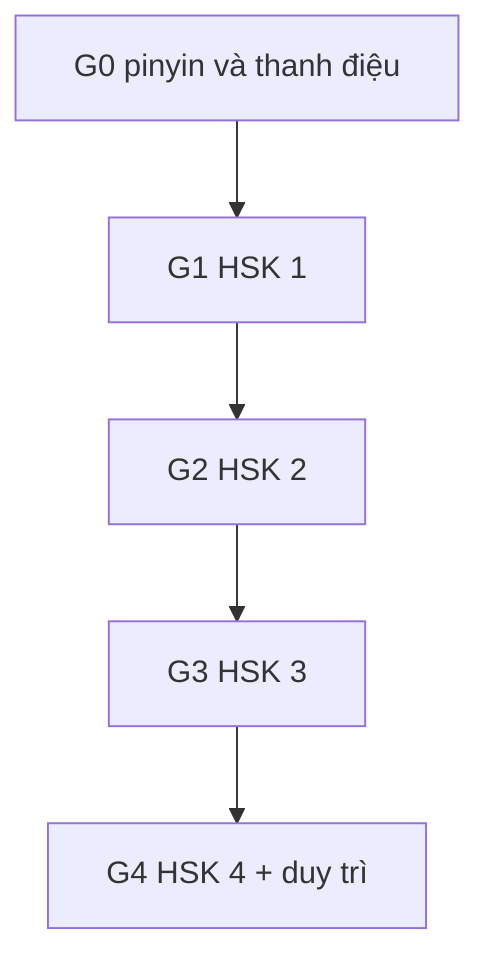

# Tự học tiếng Trung giản thể từ số 0 → HSK 4

Bộ tài liệu tự học cho **người Việt bắt đầu từ số 0**, **tự học không giáo viên**, học **chữ giản thể**, mục tiêu: giao tiếp thường nhật + nền tảng HSK 1–4. Không lịch trình cố định, không học phí, không logistics lớp học — mọi thời lượng chỉ là ước lượng tự học gắn nhãn [Suy luận].

> **Quy ước nhãn dùng xuyên suốt (mutually exclusive — mỗi claim chỉ mang đúng một nhãn):**
>
> - **[Nguồn: \<tên\> + \<URL\> + trích "\<nguyên văn ngắn\>"]** — dữ kiện có trong đúng 3 file nguồn đóng băng ngày 2026-09-23 (liệt kê cuối README). Không thêm URL mới cho nhãn này.
> - **[Suy luận self-learn + giả định: ...]** — cách tự học và mọi ước lượng thời lượng, do người viết suy ra; không phải lời của nguồn.
> - **[Tham khảo thêm: \<tên\> + \<URL\> + \<loại\>]** — link ngoài để tự tra cứu, không phải endorsement.
>
> Định nghĩa đầy đủ, quy tắc số liệu F1–F8 và danh sách gap: [00](./00-gioi-han-du-lieu-va-gia-dinh.md).

## Sơ đồ tổng quan zero → HSK 4

Mục tiêu, điều kiện vào/ra và ước lượng thời gian từng giai đoạn: [01](./01-lo-trinh-tong-quan.md).

## Số liệu chốt

### HSK 2.0 — bảng duy nhất dùng trong bộ tài liệu (F1)

| Cấp | Từ vựng (tích lũy) | Chữ Hán (tích lũy) |
|---|---|---|
| HSK 1 | 150 | 174 |
| HSK 2 | 300 | 347 |
| HSK 3 | 600 | 617 |
| HSK 4 | 1.200 | 1.064 |

- Từ vựng HSK 1–3 + chữ HSK 1–3: [Nguồn: HSK Guide + https://www.hsk.guide/curriculum + trích "HSK 1 … words 150 characters 174 … HSK 2 … words 300 characters 347 … HSK 3 … words 600 characters 617"].
- Chữ HSK 4: [Nguồn: HSK Academy + https://hsk.academy/en/blog/chinese-characters-for-hsk-1-to-4 + trích "1,064 characters to know for the required 1,200 words"].
- **Số chữ suy từ wordlist** — không có bảng chữ chính thức riêng: [Nguồn: hanzidb + http://hanzidb.org/character-list/hsk + trích "No character lists are provided separately, therefore the characters presented on this page were derived from these word lists." (link gốc 404 lúc kiểm 2026-09-23; trích giữ trong references/10, xem cột Trạng thái trong 06)].
- Footnote (variant, không dùng làm chuẩn): bảng chill-chinese được file nguồn 12 ghi là 174 / **348** / **618** / 1.064 chữ: [Nguồn: chill-chinese + https://chill-chinese.com/blog/old-hsk + trích "1 | 174 / 174 | 150 / 150 … 4 | 446 / 1064 | 600 / 1200"]. Bộ số 347/617 ở bảng trên là chuẩn duy nhất của bộ tài liệu.

### HSK 3.0 — chỉ dùng bộ chính thức 2025 (F2)

- Bộ chính thức (sách hướng dẫn công bố 11/2025, dạng **tích lũy**): L1 300 / L2 500 / L3 1.000 / L4 2.000 / L5 3.600 / L6 5.400 / L7–9 11.000 mục: [Nguồn: HSKStory + https://hskstory.com/guides/hsk-30-vocabulary-complete + trích "The official final HSK 3.0 syllabus contains 11,000 numbered vocabulary entries across nine levels."]. Đối chiếu tích lũy L1–3: [Nguồn: MandarinZone + https://media.mandarinzone.com/hsk3-vocabulary-list-2026.pdf + trích "HSK 3 candidates under the new HSK 3.0 are expected to know 1,000 words cumulative across HSK 1, 2, and 3."].
- **Tích lũy ≠ chữ mới mỗi cấp:** chữ **mới** theo cấp (HSK 3.0) = HSK 1: 246 / HSK 2: 125 / HSK 3: 284 / HSK 4: 441: [Nguồn: HanziFeed + https://hanzifeed.com/characters + trích "HSK 1 246 characters HSK 2 125 characters HSK 3 284 characters HSK 4 441 characters"]. Phân tách nhận diện/viết: [Nguồn: MandarinZone + https://www.mandarinzone.com/new-hsk-test + trích "HSK 1 | 246 | 246 | 101 total for HSK 1-2 combined | Very light writing."].
- Footnote (bản nháp 2021 — **không** dùng làm chuẩn): L1 500 / L2 1.272 / L3 2.245 / L4 3.245, tổng 11.000+: [Nguồn: Steplearn + https://steplearnchinese.com/hsk-3 + trích "HSK 1 … 300 characters 500 words … HSK 4 … 1,200 characters 3,245 words"].

### Thời điểm HSK 3.0 (F6)

- Ra mắt chính thức toàn cầu 13/12/2026: [Nguồn: admin.chinesetest.cn + https://admin.chinesetest.cn/gonewcontent.do?id=51336883 + trích "HSK 3.0 will be officially launched worldwide on December 13, 2026!"] — **theo CTI 2026, kiểm lại trước khi đăng ký**; mốc này không dùng làm giả định cứng cho lộ trình G0–G4.
- Trong 2026, kỳ thi HSK 1–6 thường lệ vẫn theo HSK 2.0 cho tới khi CTI công bố ngày khởi động: [Nguồn: HSKStory + https://hskstory.com/guides/what-is-hsk-30 + trích "CTI says regular 2026 HSK 1–6 sessions still use HSK 2.0 until the formal HSK 3.0 start is announced separately."].

## Danh sách tài liệu (7 file)

1. [00 — Giới hạn dữ liệu và giả định](./00-gioi-han-du-lieu-va-gia-dinh.md) — đọc trước tiên: 3 nhãn, quy tắc số liệu F1–F8, gap đã biết. **Đã viết.**
2. [01 — Lộ trình tổng quan](./01-lo-trinh-tong-quan.md) — roadmap G0–G4, điều kiện vào/ra, ước lượng thời gian [Suy luận]. **Đã viết.**
3. [02 — Nghe nói & thanh điệu backbone](./02-nghe-noi-thanh-dieu-backbone.md) — nền G0: pinyin, 4 thanh + thanh nhẹ, biến điệu, drills (tone pairs / minimal pairs / shadowing), loop nghe-nói, HSKK. **Đã viết.**
4. [03 — Chữ Hán, từ vựng & SRS](./03-chu-han-tu-vung-srs.md) — quy tắc nét, bộ thủ, phương pháp nhớ chữ, viết tay vs gõ IME, deck Anki, loop SRS, từ điển. **Đã viết.**
5. [04 — Ngữ pháp, đọc và viết](./04-ngu-phap-doc-viet.md) — điểm ngữ pháp theo cấp (ước tính AllSet, F7), graded readers, viết tay vs gõ IME. **Đã viết.**
6. [05 — Loop dài hạn và duy trì](./05-loop-dai-han-va-tai-lieu.md) — thói quen tuần–tháng, duy trì sau HSK 4, ghi chú HSKK (F4) và HSK 3.0 (F6). **Đã viết.**
7. [06 — Tài liệu tham khảo](./06-tai-lieu-tham-khao.md) — index toàn bộ link ngoài gắn nhãn [Tham khảo thêm]; trạng thái link: đã kiểm 142/142 ngày 2026-09-23 (134 sống / 4 bot-block / 2 404 / 2 lỗi 000 — xem cột Trạng thái và `references/22-link-status.md`). **Đã viết.**

Các file 02/03/04/05 chỉ link nội bộ sang [06](./06-tai-lieu-tham-khao.md) cho link ngoài, không dump danh mục.

## Nguồn đóng băng (3 file, research 2026-09-23)

1. `references/10-chuan-hsk-chuong-trinh.md` — chuẩn HSK 1–4, HSK 3.0, bảng từ, textbook, lộ trình cộng đồng, thi HSK/HSKK.
2. `references/11-pinyin-thanh-dieu-nghe-noi.md` — pinyin, thanh điệu, lỗi phát âm người Việt, nghe-nói, HSKK.
3. `references/12-chu-han-tu-vung-ngu-phap.md` — chữ Hán, từ vựng + SRS, ngữ pháp, đọc-viết, từ điển.

Nhãn [Nguồn] trong mọi file docs chỉ trích lại 3 file trên; nhãn [Tham khảo thêm] là link ngoài không dùng để claim dữ kiện.
