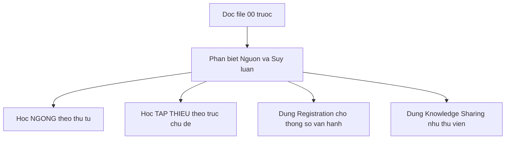

# 00 — Giới hạn dữ liệu và giả định

> Mục bắt buộc theo Oracle Gate 1. Đọc file này trước khi dùng bất kỳ file nào khác trong `docs/`.

## Quy ước nhãn

- **[Nguồn: URL + trích ngắn]** — thông tin trích từ 1 trong 5 bài VuEnglish liệt kê ở [README](./README.md). Mỗi claim loại này kèm URL và trích ngắn trong ngoặc kép.
- **[Suy luận self-learn + giả định]** — cách tự học do người viết plan đề xuất để lấp khoảng trống khi tự học một mình. Không phải phát ngôn của VuEnglish. Luôn kèm giả định đi cùng.

## Bổ sung nhãn [Tham khảo thêm] — ngoại lệ có kiểm soát từ 2026-09-23

- **[Tham khảo thêm: tên + URL + loại]** — kiến thức giải thích và tài liệu ngoài VuEnglish, dùng để hiểu sâu kỹ thuật đã nêu trong plan. Ba nhãn **[Nguồn]**, **[Suy luận self-learn + giả định]**, **[Tham khảo thêm]** là mutually exclusive: một claim chỉ mang đúng một nhãn. Tài liệu loại này không phải phát ngôn của VuEnglish và không phải endorsement của VuEnglish.
- **[Nguồn: URL + trích ngắn] đóng băng ở 5 URLs VuEnglish** liệt kê trong [README](./README.md) (THIEU 2023, TAP I 2024, NGONG registration 2026, NGONG syllabus 2026, Knowledge-Sharing index 2026). Không thêm URL mới vào nhãn [Nguồn]. Mọi dòng [Nguồn]/[Suy luận] cũ trong backbone giữ nguyên, chỉ chèn sections mới.
- **Ngoại lệ có kiểm soát từ 2026-09-23:** theo yêu cầu mở rộng chi tiết của người học, plan được phép bổ sung giải thích kỹ thuật từ `references/20-background-nghe-noi.md` và `references/21-background-tap-thieu-sharing.md`, kèm danh mục links ngoài trong [06](./06-tai-lieu-tham-khao.md). Mọi nội dung bổ sung mang nhãn [Tham khảo thêm] kèm disclaimer trạng thái truy cập theo `references/22-link-status.md` (kiểm tra 2026-09-23, có thể đổi sau). Không dùng cụm từ khẳng định tuyệt đối về trạng thái sống của link.

## Giới hạn dữ liệu

1. **2 ảnh syllabus tổng thể bị thiếu.** [Nguồn: ghi nhận từ Phase 1] Syllabus THIEU 2023 dạng ảnh gồm 38 sessions và syllabus TAP I 2024 dạng ảnh gồm 24 sessions không trích được thứ tự từng buổi. Hệ quả: mọi mô tả THIEU và TAP trong bộ plan này chỉ ở mức trục chủ đề và kỹ thuật đã trích, kèm nhãn **"Thứ tự gốc trong ảnh — chưa khôi phục được"**. Cấm đọc bất kỳ danh sách buổi THIEU hay TAP nào trong bộ plan này như thứ tự gốc. (Ghi chú version 2026-09-23: lesson-plan text NGONG S01–S24 đã crawl và audit trong `references/12-crawl-chi-tiet-5-links.md`, nên file 02 được chi tiết tới từng buổi; giới hạn ảnh này chỉ còn đúng cho THIEU và TAP.)
2. **Registration không phải syllabus.** [Nguồn: https://vuenglishclass.blogspot.com/2026/08/vuenglish-registration-ngong.html] Bài registration NGONG 2026 chỉ cung cấp bối cảnh tham khảo gồm điều kiện METHODS và lời khuyên học xong TAP trước khi sang NGONG. Bài này không mô tả nội dung bài học từng buổi nên **[Suy luận]** cấm dùng nó để suy ra bài học hay kỹ năng cụ thể.
3. **Triết lý 3 câu chỉ từ 1 bài TAP S1, dạng giả thuyết.** [Nguồn: https://vuenglishclass.blogspot.com/2024/01/syllabus-lesson-plan-cua-tap-i.html] Cách diễn đạt phân biệt ba lớp như bắt âm, tư duy tuyến tính, cảm nhận ngôn từ chỉ xuất hiện trong 1 bài TAP S1, chưa kiểm chứng chéo với bài THIEU hay NGONG. Vì vậy bộ plan này hạ cấp mọi diễn đạt loại đó thành **giả thuyết làm việc**, không dùng làm slogan hay tiêu đề phase. Tên các giai đoạn trong [01](./01-lo-trinh-tong-quan.md) chỉ là tên chức năng như nghe-nói, từ vựng, viết.
4. **Không crawl thêm cho nhãn [Nguồn].** Nhãn [Nguồn] đóng băng ở 5 URLs và các trích đã có từ Phase 1. Mọi nội dung bổ sung từ web sau 2026-09-23 (giải thích kỹ thuật, links ngoài) mang nhãn [Tham khảo thêm] theo ngoại lệ có kiểm soát ở mục trên, không gắn nhãn [Nguồn].
5. **Gap đã biết, hoãn lại (không chặn).** Link `vuenglish-faq.html` và lỗi chính tả gốc `chuyến sang NGỌNG` chưa đưa vào `docs/` (file 01 đóng băng nội dung vận hành); tra cứu trong `references/10-crawl-batch-a.md` và raw HTML khi cần.

## Phân loại nguồn áp dụng cho toàn bộ plan

| Nhóm | Vai trò | Ví dụ dùng đúng |
|---|---|---|
| NGONG syllabus S01-S24 | Backbone có thứ tự duy nhất | Học theo đúng 4 cụm từ S01 tới S24 trong file 02 |
| THIEU 38 sessions | Khung định hướng chủ đề viết | Học theo trục linearity tới scholarship trong file 04, không đánh số buổi |
| TAP I 24 sessions | Khung định hướng chủ đề từ vựng | Học theo khung TMRND và PVO trong file 03, không đánh số buổi |
| Registration NGONG 2026 | Bối cảnh tham khảo — chi tiết hành chính đã lược khỏi docs/ theo yêu cầu user, xem references/10 + raw HTML khi cần | — |
| Knowledge-Sharing 21 cộng 1 | Thư viện tham khảo | Đọc khi cần theo nhóm chủ đề trong file 05, cấm đánh số thứ tự học |

## Cách đọc plan đúng

- Khi thấy trích trong ngoặc kép, đó là [Nguồn]. Khi thấy chữ thời lượng gợi ý, lịch mẫu, routine hàng ngày, đó là [Suy luận self-learn + giả định].
- Nếu một câu không gắn nhãn, mặc định hiểu là [Suy luận self-learn + giả định] và cần đối chiếu lại với bài gốc trước khi tin.
- Mọi lịch buổi chi tiết cho THIEU hay TAP trong bộ plan này đều không tồn tại. Nếu phát hiện chỗ nào liệt kê buổi chi tiết, coi đó là lỗi và báo lại.

Về [README](./README.md) | Tiếp: [01 Lộ trình tổng quan](./01-lo-trinh-tong-quan.md).
