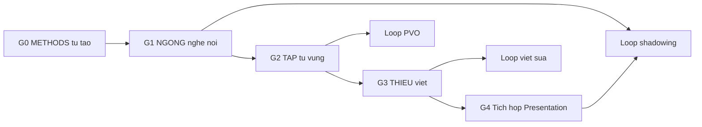

# 01 — Lộ trình tổng quan

> Tên các giai đoạn dưới đây là tên chức năng trung tính. Không dùng bất kỳ slogan triết lý nào cho NGONG, THIEU hay TAP vì chưa có evidence chéo theo [00](./00-gioi-han-du-lieu-va-gia-dinh.md).

## Quy ước nhãn

- Dòng có **[Nguồn: URL]** là thông tin từ bài gốc. Dòng có **[Suy luận self-learn + giả định: ...]** là đề xuất tự học.
- **[Tham khảo thêm]** (giải thích kỹ thuật, tài liệu ngoài): xem định nghĩa đầy đủ ở [00](./00-gioi-han-du-lieu-va-gia-dinh.md) và danh mục ở [06](./06-tai-lieu-tham-khao.md).

## Thông số vận hành (đã lược hành chính — chỉ giữ nguyên tắc tự học)

- [Suy luận self-learn + giả định: người tự học không có lớp và giáo viên sửa] Mọi thời lượng gợi ý bên dưới chỉ là khung tham khảo để duy trì đều đặn, không phải yêu cầu của VuEnglish.
- [Nguồn: cùng bài registration] Lời khuyên "học xong TAP trước khi sang NGONG" đi kèm lời nhắc "Dục tốc bất đạt". Đây là khuyên lộ trình, không phải nội dung bài học.

## Roadmap 5 giai đoạn

### Giai đoạn 0 — METHODS tự tạo

- Mục tiêu [Suy luận]: có sổ ghi chép, khung giờ cố định, thói quen nghe và đọc hàng ngày trước khi vào backbone.
- Điều kiện vào [Suy luận]: chưa cần gì ngoài 30 phút mỗi ngày.
- Điều kiện ra [Suy luận]: duy trì được 2 tuần liên tục có log.
- Thời lượng gợi ý [Suy luận self-learn + giả định: nhịp 30 phút mỗi ngày]: 2 tuần.

### Giai đoạn 1 — NGONG nghe nói

- Mục tiêu [Suy luận]: phát âm rõ, nghe được chuỗi nói nhanh, nói theo cụm.
- Điều kiện vào [Nguồn: registration]: đã có METHODS tự tạo; TAP hay THIEU không bắt buộc.
- Điều kiện ra [Suy luận]: tự ghi âm 2 phút ít lỗi nuốt âm cơ bản, nghe được ý chính của đoạn hội thoại quen thuộc.
- Thời lượng gợi ý [Suy luận self-learn + giả định: tự học 30–45 phút/ngày]: gợi ý ~12 tuần ở 30–45 phút/ngày, điều chỉnh theo chuẩn ra. Chi tiết theo [02](./02-ngong-nghe-noi-backbone.md).

### Giai đoạn 2 — TAP từ vựng và chuyển ý

- Mục tiêu [Suy luận]: có sổ PVO cá nhân, phân biệt được từ gần nghĩa, chuyển ý Việt-Anh tự nhiên.
- Điều kiện vào [Suy luận]: đã qua cụm phát âm nền của NGONG để đọc to từ mới.
- Điều kiện ra [Suy luận]: có 300 tới 500 mục PVO có ví dụ và qua 5 mốc ôn 1-3-7-14-30.
- Thời lượng gợi ý [Suy luận self-learn + giả định: 45 phút mỗi ngày]: 8 tới 12 tuần. Khung chủ đề xem [03](./03-tap-tu-vung-chuyen-y.md). Thứ tự gốc trong ảnh — chưa khôi phục được.

### Giai đoạn 3 — THIEU viết học thuật

- Mục tiêu [Suy luận]: viết đoạn văn tuyến tính, liên kết rõ, lập luận có cấu trúc.
- Điều kiện vào [Suy luận]: đã có vốn cụm từ từ Giai đoạn 2 để viết câu đỡ gượng.
- Điều kiện ra [Suy luận]: có 6 tới 8 bài viết đã qua 2 vòng sửa và checklist tự review.
- Thời lượng gợi ý [Suy luận self-learn + giả định: 3 buổi viết mỗi tuần]: 10 tới 12 tuần. Khung chủ đề xem [04](./04-thieu-viet-hoc-thuat.md). Thứ tự gốc trong ảnh — chưa khôi phục được.

### Giai đoạn 4 — Tích hợp và Presentation

- Mục tiêu [Suy luận]: gom nghe, nói, từ vựng, viết vào một bài thuyết trình cá nhân.
- Điều kiện vào [Suy luận]: đã xong Giai đoạn 1 và có ít nhất một nửa Giai đoạn 2 và 3.
- Điều kiện ra [Suy luận]: có 1 video presentation 5 tới 7 phút và 1 bản viết đi kèm đã sửa.
- Thời lượng gợi ý [Suy luận self-learn + giả định: tự học 30–45 phút/ngày]: gợi ý ~4 tuần ở 30–45 phút/ngày, điều chỉnh theo chuẩn ra. Tham khảo thư viện trong [05](./05-knowledge-sharing-va-loop-dai-han.md).

## Tài liệu tham khảo thêm

- Giải thích kỹ thuật và links ngoài cho từng giai đoạn xem [06](./06-tai-lieu-tham-khao.md) ([Tham khảo thêm], trạng thái kiểm tra 2026-09-23, có thể đổi sau). File này ngoài các dòng trên được đóng băng theo Gate 2.

Về [README](./README.md) | Trước: [00](./00-gioi-han-du-lieu-va-gia-dinh.md) | Tiếp: [02](./02-ngong-nghe-noi-backbone.md).
