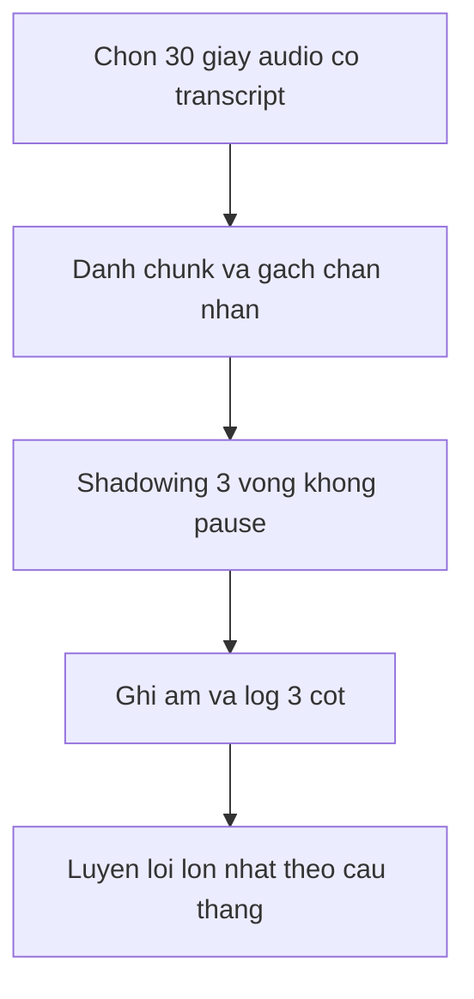
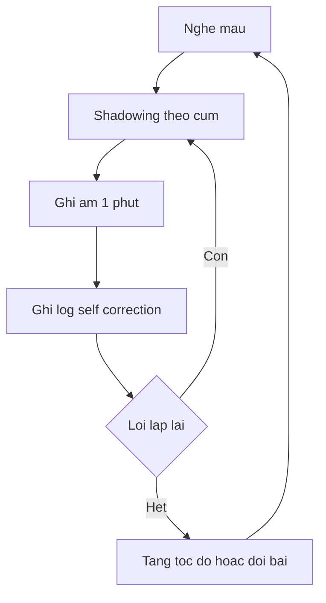

# 02 — NGONG nghe nói backbone

> Backbone có thứ tự duy nhất trong bộ plan. Học đúng từ cụm 1 tới cụm 4. [Nguồn: https://vuenglishclass.blogspot.com/2026/06/vuenglish-ngong-syllabus.html]

## Quy ước nhãn

- Tên kỹ thuật và Main Shows có **[Nguồn]**. Routine hàng ngày và cách đo tiến bộ là **[Suy luận self-learn + giả định]**.
- **[Tham khảo thêm]** (giải thích kỹ thuật, tài liệu ngoài): xem định nghĩa đầy đủ ở [00](./00-gioi-han-du-lieu-va-gia-dinh.md) và danh mục ở [06](./06-tai-lieu-tham-khao.md).

## Cụm 1 — Nền phát âm S01 tới S05

- [Nguồn: NGONG syllabus] S01 gồm spoken vocab, nguyên tắc Listening và Speaking, Main Show American Idol. S02 tới S05 gồm Learning Theory P1 và P2, Schwa, Intonation, Strong và Weak forms, Phrase reduction, Main Show Moment of Truth.
- [Suy luận self-learn + giả định: không có giáo viên sửa] Mỗi buổi tự học gồm 15 phút nghe Schwa, 15 phút đọc to theo Intonation, ghi âm 1 phút để so với hôm trước.

## Cụm 2 — Kỹ thuật nói S06 tới S12

- [Nguồn: NGONG syllabus] Gồm Self-correction, Redundancy, Staircase và Chunking, Elision, Homonyms, Assimilation và Liaison. Main Shows gồm Biggest Loser và So You Think You Can Dance.
- [Suy luận self-learn + giả định: cần biến kỹ thuật thành phản xạ] Tập chunking bằng cách ngắt câu dài thành cụm 3 tới 5 từ rồi nối lại, tập elision và liaison bằng shadowing tốc độ chậm rồi tăng dần.

## Cụm 3 — Mở rộng và Presentation S13 tới S18

- [Nguồn: NGONG syllabus] Gồm spoken vocab, Interjections, Contraction, đăng ký Presentation, chia team, chọn show. Main Shows gồm Sharks, Miss USA, X-Factor, Amazing Race.
- [Suy luận self-learn + giả định: tự học không có team] Thay team bằng 1 bạn học hoặc tự đóng 2 vai, chốt 1 chủ đề presentation từ sớm để gom từ vựng.

## Cụm 4 — Tự học và tổng kết S19 tới S24

- [Nguồn: NGONG syllabus] Gồm additional sounds, công cụ tự học cá nhân, theo cặp và theo nhóm, Final Review, Award. Main Shows gồm Friends, Project Runway, Americas Next Top Model.
- [Suy luận self-learn + giả định: sau khóa học không còn deadline] Chuyển sang loop duy trì 3 buổi mỗi tuần với 1 buổi ôn âm, 1 buổi shadowing, 1 buổi ghi âm tự do.

## Chi tiết từng buổi S01–S24 [Nguồn + Suy luận + Tham khảo thêm]

> Thứ tự S01–S24 dưới đây là thứ tự gốc của NGONG syllabus [Nguồn: https://vuenglishclass.blogspot.com/2026/06/vuenglish-ngong-syllabus.html]. Chi tiết hoạt động từng buổi tóm từ crawl lesson-plan S01–S24 trong `references/12-crawl-chi-tiet-5-links.md` (đã audit, khớp syllabus). Mỗi buổi giữ 1 dòng backbone [Nguồn] + 1 dòng gợi ý tự học [Suy luận] hoặc giải thích [Tham khảo thêm]. Tài liệu ngoài xem [06](./06-tai-lieu-tham-khao.md), không dump ở đây.

### S01 — Spoken vocab, Listening samples, Speaking principles (Main Show: American Idol)

- [Nguồn: NGONG syllabus (mô tả buổi) + lesson-plan chi tiết trong references/12-crawl-chi-tiet-5-links.md] "Spoken vocab / Listening samples / Speaking principles" — Main Show "American Idol". Lesson-plan S01 đặt nguyên tắc "neutral accent with a clear diction: nói để ai cũng hiểu" và "Giảm processing load" khi chọn show nghe.
- [Suy luận self-learn + giả định: không có lớp] Nghe sample American Idol 2 phần theo thứ tự dễ trước khó sau, ghi lại 5 idioms nghe được thay vì dịch vocab trong giờ. Công cụ đối chiếu idioms xem [06](./06-tai-lieu-tham-khao.md) ([Tham khảo thêm]).

### S02 — Learning Theory P1, Schwa

- [Nguồn: NGONG syllabus (mô tả buổi) + lesson-plan chi tiết trong references/12-crawl-chi-tiet-5-links.md] "Listening: Learning Theory (P1) / Speaking: Schwa". Lesson-plan S02 bàn "Acquisition vs Learning, Monitoring" và luyện Schwa thay vì ép Stress cho người Việt.
- [Suy luận self-learn + giả định: tự học] Đọc 1 tip nghe, nộp Idiom Summary + phần American Idol còn dở trước khi sang S03.
- [Tham khảo thêm: kiến thức nền references/20] Schwa /ə/ là nguyên âm yếu ở âm tiết không nhấn, miệng thả lỏng. Ví dụ: `about /əˈbaʊt/`.

### S03 — Learning Theory P2, Intonation, Reading (Main Show: Moment of Truth)

- [Nguồn: NGONG syllabus (mô tả buổi) + lesson-plan chi tiết trong references/12-crawl-chi-tiet-5-links.md] "Listening Theory P2, Speaking: Intonation, Reading" — Main Show "Moment of Truth".
- [Suy luận self-learn + giả định: tự học] Luyện intonation theo cặp câu trần đi xuống và câu hỏi Yes/No đi lên, đọc Moment of Truth ở 2 tốc độ chậm và thường.
- [Tham khảo thêm: kiến thức nền references/20] Intonation là giai điệu lên–xuống của cả cụm. Ví dụ: `You're coming? ↗` khác `You're coming. ↘`.

### S04 — Strong vs Weak forms (Main Show: Moment of Truth)

- [Nguồn: NGONG syllabus (mô tả buổi) + lesson-plan chi tiết trong references/12-crawl-chi-tiet-5-links.md] "Speaking: Strong vs Weak, Listening" — Main Show "Moment of Truth". Lesson-plan S04 nhấn "một sai lầm cơ bản và phổ cập thường khiến tiếng Anh nói của học viên Việt nghe rất không tự nhiên".
- [Suy luận self-learn + giả định: tự học] Luyện theo nhóm article, pronoun, preposition, auxiliary, mỗi nhóm 10 câu đọc to dạng yếu.
- [Tham khảo thêm: kiến thức nền references/20] Từ chức năng có dạng mạnh khi nhấn và dạng yếu khi lướt. Ví dụ: `I can swim /aɪ kən swɪm/`.

### S05 — Phrase reduction, Schwa social nuances (Main Show: Moment of Truth)

- [Nguồn: NGONG syllabus (mô tả buổi) + lesson-plan chi tiết trong references/12-crawl-chi-tiet-5-links.md] "Speaking: Phrase reduction & Schwa social nuances" — Main Show "Moment of Truth". Lesson-plan S05 đặt câu hỏi "I'm talkin' to ya babe khác thế nào với I'm talking to you, baby?".
- [Suy luận self-learn + giả định: tự học] Nghe kết Case1 rồi sang Case2, ghi lại 3 cụm reduction nghe được.
- [Tham khảo thêm: kiến thức nền references/20] Phrase reduction là cụm quen bị nén khi nói nhanh. Ví dụ: `going to → gonna /ˈɡʌnə/`.

### S06 — Self-correction (Main Shows: Moment of Truth, Biggest Loser)

- [Nguồn: NGONG syllabus (mô tả buổi) + lesson-plan chi tiết trong references/12-crawl-chi-tiet-5-links.md] "Speaking: Self-correction, Listening, Reading" — Main Shows "Moment of Truth, Biggest Loser".
- [Suy luận self-learn + giả định: tự học] Làm mini-test đọc đúng phiên âm 2 chiều (nhìn chữ phát âm, nghe đoán từ), lập log 50 từ hay sai Anh–Mỹ.
- [Tham khảo thêm: kiến thức nền references/20] Self-correction là tự bắt lỗi khi đang nói và sửa trôi chảy. Ví dụ: `He go — he goes...`.

### S07 — Redundancy (Main Show: Biggest Loser)

- [Nguồn: NGONG syllabus (mô tả buổi) + lesson-plan chi tiết trong references/12-crawl-chi-tiet-5-links.md] "Speaking: Redundancy" — Main Show "Biggest Loser".
- [Suy luận self-learn + giả định: tự học] Tập nói thừa có chủ đích 30 giây cho 1 ý, thay vì nói cụt 1 câu rồi im.
- [Tham khảo thêm: kiến thức nền references/20] Redundancy là lặp lại, diễn đạt lại, đệm để giữ lượt lời. Ví dụ: `It's, you know, kind of expensive...`.

### S08 — Spoken vocab WELL (Main Show: Biggest Loser)

- [Nguồn: NGONG syllabus (mô tả buổi) + lesson-plan chi tiết trong references/12-crawl-chi-tiet-5-links.md] "Spoken vocab" — Main Show "Biggest Loser". Lesson-plan S08 tổng kết "WELL" với "11 nghĩa".
- [Suy luận self-learn + giả định: tự học] Học 11 nghĩa WELL qua clips, viết 1 status dùng 2 nghĩa vừa học.

### S09 — Reading & Listening (Main Show: So You Think You Can Dance)

- [Nguồn: NGONG syllabus (mô tả buổi) + lesson-plan chi tiết trong references/12-crawl-chi-tiet-5-links.md] "Reading & Listening" — Main Show "So You Think You Can Dance".
- [Suy luận self-learn + giả định: tự học] Xem intro show + xác định điệu nhảy trước khi nghe nhận xét giám khảo.

### S10 — Staircase & Chunking (Main Shows: So You Think You Can Dance, Biggest Loser)

- [Nguồn: NGONG syllabus (mô tả buổi) + lesson-plan chi tiết trong references/12-crawl-chi-tiet-5-links.md] "Speaking: Staircase & Chunking" — Main Shows "SYTYCD, Biggest Loser".
- [Suy luận self-learn + giả định: cần biến kỹ thuật thành phản xạ] Luyện chunk ngắn rồi gắn dần theo cầu thang từ đuôi câu lên đầu câu.
- [Tham khảo thêm: kiến thức nền references/20] Chunking là cắt câu dài thành cụm nghĩa 2–4 từ. Ví dụ: `I've been living / in New York / for five years`.

### S11 — Elision (Main Show: Biggest Loser)

- [Nguồn: NGONG syllabus (mô tả buổi) + lesson-plan chi tiết trong references/12-crawl-chi-tiet-5-links.md] "Speaking: Elision" — Main Show "Biggest Loser".
- [Suy luận self-learn + giả định: tự học] Tự luyện Staircase cụm ngắn trước khi vào buổi, nghe Part3 rồi mới học lý thuyết nuốt âm.
- [Tham khảo thêm: kiến thức nền references/20] Elision là bỏ âm có hệ thống khi nói nhanh. Ví dụ: `next day /neks deɪ/`.

### S12 — Homonyms, Assimilation & Liaison (Main Show: Biggest Loser)

- [Nguồn: NGONG syllabus (mô tả buổi) + lesson-plan chi tiết trong references/12-crawl-chi-tiet-5-links.md] "Homonyms, Assimilation & Liaison" — Main Show "Biggest Loser". Lesson-plan S12 ghi nửa đầu xong "connected speech đủ xài".
- [Suy luận self-learn + giả định: tự học] Muốn đào sâu xem thêm phần technical discussion, không bắt buộc.
- [Tham khảo thêm: kiến thức nền references/20] Homonyms là phát âm giống nhau khác nghĩa. Ví dụ: `right/write/rite /raɪt/`.
- [Tham khảo thêm: kiến thức nền references/20] Liaison là nối liền giữa các từ, assimilation là âm cuối biến theo âm đầu từ sau. Ví dụ: `ten bikes /tem baɪks/`.

### S13 — Spoken vocab OH, Reading (Main Shows: American Idol, Biggest Loser Finale)

- [Nguồn: NGONG syllabus (mô tả buổi) + lesson-plan chi tiết trong references/12-crawl-chi-tiet-5-links.md] "Spoken vocab, Reading" — Main Shows "American Idol, Biggest Loser Finale". Lesson-plan S13 tổng kết "OH 6 nghĩa".
- [Suy luận self-learn + giả định: tự học] Luyện OH theo cảm xúc khác nhau, nghe kỹ American Idol Case2.

### S14 — Interjections, Presentation registration (Main Show: Biggest Loser Finale)

- [Nguồn: NGONG syllabus (mô tả buổi) + lesson-plan chi tiết trong references/12-crawl-chi-tiet-5-links.md] "Spoken vocab: Interjections, Presentation registration" — Main Show "Biggest Loser Finale". Interjections gồm "WHOA, ARGH, TA-DA, YIKES, PHEW, DUH".
- [Suy luận self-learn + giả định: tự học không có team] Đăng ký nhóm là tùy chọn, thay bằng chốt 1 chủ đề presentation cá nhân.

### S15 — State name challenge (Main Shows: Sharks, Miss USA)

- [Nguồn: NGONG syllabus (mô tả buổi) + lesson-plan chi tiết trong references/12-crawl-chi-tiet-5-links.md] "Listening, State name challenge" — Main Shows "Sharks, Miss USA".
- [Suy luận self-learn + giả định: tự học] Nghe Sharks Part1 kèm glossary, luyện phát âm tên bang Mỹ như 1 listening challenge.

### S16 — Contraction, Presentation team (Main Shows: Sharks, Hidden Kingdoms)

- [Nguồn: NGONG syllabus (mô tả buổi) + lesson-plan chi tiết trong references/12-crawl-chi-tiet-5-links.md] "Speaking: Contraction, Presentation team" — Main Shows "Sharks, Hidden Kingdoms". Contractions gồm "they'll, would've, couldn't've".
- [Suy luận self-learn + giả định: tự học] Họp nhóm là hoạt động lớp, tự học thay bằng xem đáp án State Name challenge.
- [Tham khảo thêm: kiến thức nền references/20] Contraction là nén chủ ngữ + trợ/be/not. Ví dụ: `won't /woʊnt/`.

### S17 — Conspiracy theories (Main Shows: X-Factor US, Idol, Bachelor)

- [Nguồn: NGONG syllabus (mô tả buổi) + lesson-plan chi tiết trong references/12-crawl-chi-tiet-5-links.md] "Conspiracy theories" — Main Shows "X-Factor US, Idol, Bachelor" với 3 cases Astro, Vanessa, Jason.
- [Suy luận self-learn + giả định: tự học] Xem trước 2 extra Amazing Race để nắm cấu trúc trước S18.

### S18 — Self-teaching individuals, Presentation show choice (Main Show: Amazing Race)

- [Nguồn: NGONG syllabus (mô tả buổi) + lesson-plan chi tiết trong references/12-crawl-chi-tiet-5-links.md] "Speaking: Self-teaching (individual), Presentation show choice" — Main Show "Amazing Race".
- [Suy luận self-learn + giả định: tự học] Thực hành self-speaking theo sample clips, chốt tên show presentation trước hạn.

### S19 — Additional sounds (Main Show: Loch Ness Monster)

- [Nguồn: NGONG syllabus (mô tả buổi) + lesson-plan chi tiết trong references/12-crawl-chi-tiet-5-links.md] "Speaking: Additional sounds" — Main Show "Loch Ness Monster".
- [Suy luận self-learn + giả định: tự học] Nghe Loch Ness Part1 ở tốc độ giảm, tự kiểm handout phần match câu hỏi–đáp.
- [Tham khảo thêm: kiến thức nền references/20] Additional sounds là âm chen vào khi nối cho miệng lướt êm. Ví dụ: `he‿is /hiːjɪz/`.

### S20 — Listening Challenge, Reading (Main Shows: Loch Ness, Friends, Project Runway)

- [Nguồn: NGONG syllabus (mô tả buổi) + lesson-plan chi tiết trong references/12-crawl-chi-tiet-5-links.md] "Listening Challenge, Reading" — Main Shows "Loch Ness, Friends, Project Runway".
- [Suy luận self-learn + giả định: tự học] Thực hành self-speaking silent comedy, đọc trước Project Runway.

### S21 — Self-teaching tools (Main Show: Project Runway)

- [Nguồn: NGONG syllabus (mô tả buổi) + lesson-plan chi tiết trong references/12-crawl-chi-tiet-5-links.md] "Self-teaching tools" — Main Show "Project Runway". Lesson-plan S21 bàn "giả lập môi trường tự luyện" khi thiếu bản xứ.
- [Suy luận self-learn + giả định: tự học] Dùng bộ công cụ tối giản nghe–nói, xem nốt Finale khi rảnh.

### S22 — Reading & Listening (Main Show: America's Next Top Model)

- [Nguồn: NGONG syllabus (mô tả buổi) + lesson-plan chi tiết trong references/12-crawl-chi-tiet-5-links.md] "Reading & Listening" — Main Show "America's Next Top Model", được ghi là "một trong những show khó nghe nhất" nên xếp cuối khóa.
- [Suy luận self-learn + giả định: tự học] Chơi warm-up speaking trước khi nghe.

### S23 — Self-teaching pair & group, Team performance, Final Review P1

- [Nguồn: NGONG syllabus (mô tả buổi) + lesson-plan chi tiết trong references/12-crawl-chi-tiet-5-links.md] "Speaking: Self-teaching (pair & group), Team performance" — "Presentation, Final Review P1". Hai nhóm "Group A pitches fictional show, Group B pitches non-fiction".
- [Suy luận self-learn + giả định: tự học] Thay team bằng thực hành theo pair lấy ý tưởng, làm Final Review 300 câu phần I.

### S24 — Result, Feedback & Award, Final Review P2

- [Nguồn: NGONG syllabus (mô tả buổi) + lesson-plan chi tiết trong references/12-crawl-chi-tiet-5-links.md] "Result, Feedback & Award" — "Presentation, Final Review P2".
- [Suy luận self-learn + giả định: tự học] Làm Final Review part1&2, giữ 2 bản nháp và 1 bản cuối để tự lưu tài liệu.

## Giải thích kỹ thuật bổ sung [Tham khảo thêm]

> Mỗi khái niệm dưới đây tóm từ `references/20-background-nghe-noi.md`, tối đa 1 ví dụ. Links công cụ xem [06](./06-tai-lieu-tham-khao.md).

- [Tham khảo thêm: kiến thức nền references/20] Quy trình shadowing solo 6 bước: chọn 30–60 giây audio có transcript; nghe mù nắm ý rồi đánh chunk; nhại đuổi 0,5–1 giây 3–5 vòng; ghi âm và ghi log 3 cột (phút:giây, lỗi, cách sửa); tách luyện 2–3 lỗi lớn nhất theo staircase; ghi âm lại so với chính mình hôm trước.
- [Tham khảo thêm: kiến thức nền references/20] Self-correction log 3 cột giữ hàng ngày, mỗi tuần nghe lại 3 bản cũ và chọn 1 lỗi lặp nhiều nhất để sửa tuần sau.
- [Tham khảo thêm: kiến thức nền references/20] Nguyên tắc 3 vòng phụ đề khi luyện show thay thế (tương đương, không phải Main Show gốc): vòng 1 xem EN sub đánh chunk; vòng 2 shadowing 1–2 câu ở 0,75x; vòng 3 tắt sub nhại lại và ghi âm 30 giây.
- [Tham khảo thêm: danh sách show thay thế references/20 — tương đương, không phải Main Show gốc] Modern Family (câu ngắn, chunking), The Office US (small talk, weak forms), Shark Tank US (cấu trúc lặp, thuyết trình), How I Met Your Mother (contraction, nối âm kể chuyện), MasterChef US (mệnh lệnh ngắn, staircase). Không phải Main Show gốc của NGONG, chỉ dùng khi thiếu tư liệu lớp.

## Loop nghe nói hàng ngày và hàng tuần

- Hàng ngày 30 phút [Suy luận]: 10 phút shadowing, 10 phút chunking câu mới, 10 phút ghi âm và ghi self-correction log gồm lỗi nuốt âm, lỗi trọng âm, lỗi ngắt nghỉ.
- Hàng tuần 1 buổi [Suy luận]: nghe lại 3 bản ghi âm cũ, đếm số lỗi lặp lại, chọn 1 lỗi nhiều nhất để sửa tuần sau.

Về [README](./README.md) | Trước: [01](./01-lo-trinh-tong-quan.md) | Tiếp: [03](./03-tap-tu-vung-chuyen-y.md). Thông số vận hành xem [00](./00-gioi-han-du-lieu-va-gia-dinh.md).
