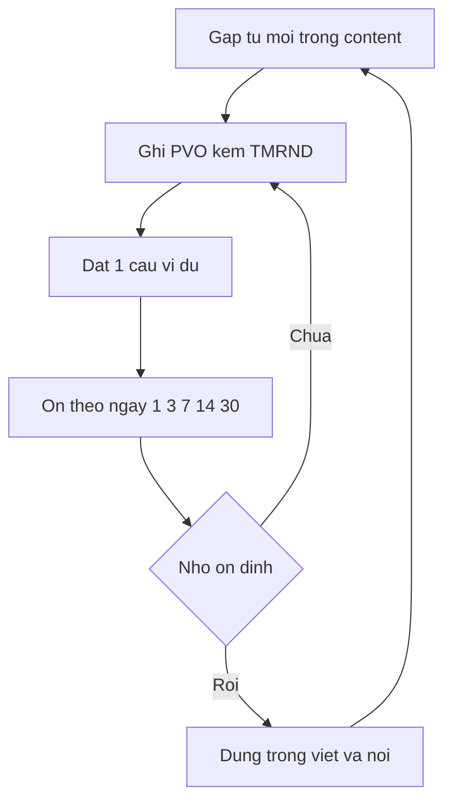
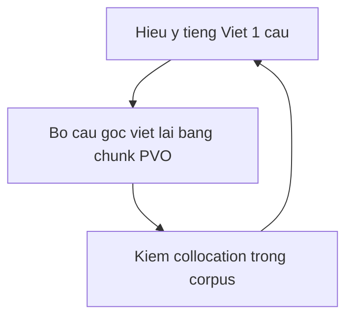

# 03 — TAP từ vựng và chuyển ý

> Khung định hướng chủ đề. **Thứ tự gốc trong ảnh — chưa khôi phục được.** Không đánh số buổi học. [Nguồn: https://vuenglishclass.blogspot.com/2024/01/syllabus-lesson-plan-cua-tap-i.html]

## Quy ước nhãn

- Khung TMRND, PVO, nguyên tắc chuyển ý và các cụm ví dụ có **[Nguồn]**. Cách lập sổ, routine ôn và lịch mẫu là **[Suy luận self-learn + giả định]**.
- **[Tham khảo thêm]** (giải thích kỹ thuật, tài liệu ngoài): xem định nghĩa đầy đủ ở [00](./00-gioi-han-du-lieu-va-gia-dinh.md) và danh mục ở [06](./06-tai-lieu-tham-khao.md).

## Khung TMRND

- [Nguồn: TAP I 2024] Từ vựng được xét theo 5 chiều tone, mode, register, nuance, dialect, gọi tắt TMRND.
- [Nguồn: cùng bài] Ví dụ cụm gần nghĩa gồm HOLD, HUG, EMBRACE và các cặp từ TMRND khác được phân biệt theo sắc thái và ngữ cảnh.
- [Nguồn: cùng bài] Kỹ thuật gồm synecdoche, metonymy, metaphor dùng để cảm nhận nghĩa bóng và mở rộng cụm từ.
- [Suy luận self-learn + giả định: tự học không có đáp án sẵn] Mỗi từ mới ghi đủ 5 ô TMRND, nếu ô nào chưa rõ thì để trống và ghi nguồn cần tra thêm thay vì đoán.

## Khung PVO và trí nhớ

- [Nguồn: TAP I 2024] PVO là sổ từ vựng cá nhân làm top-down kết hợp External memory và đường cong quên Ebbinghaus.
- [Suy luận self-learn + giả định: áp Ebbinghaus thủ công] Mỗi mục PVO gồm từ, phiên âm, 1 câu ví dụ tự đặt, 1 cụm TMRND đối chiếu, ngày ôn 1, 3, 7, 14, 30. Ôn bằng cách che nghĩa và đọc to.
- [Nguồn: cùng bài] Nội dung học theo các mảng Language, Politics, Travel, Sociology, Humor, TimeTravel, Skincare. Đây là danh sách chủ đề, không phải thứ tự buổi.

## Nguyên tắc chuyển ý

- [Nguồn: TAP I 2024] Nguyên tắc "TRANSLATE the WRITE WAY" và nhận định "TẠP không phải là lớp DỊCH và không chú trọng TRUNG THÀNH với bản gốc".
- [Nguồn: cùng bài] Mục tiêu là "chuyển sang ngôn ngữ đích tự nhiên (TMRND compatible) và dễ hiểu (culturally appropriate)".
- [Suy luận self-learn + giả định: tránh dịch từng chữ] Routine gồm 3 bước: tóm ý Việt trong 1 câu, chuyển sang Anh bằng cụm đã có trong PVO, đọc to kiểm tra có tự nhiên không.

## Chi tiết trục chủ đề đã fix audit [Nguồn + Suy luận]

> **Thứ tự gốc trong ảnh — chưa khôi phục được.** Các mục dưới đây chỉ ở mức trục chủ đề, không đánh số buổi học. Cấm đọc như thứ tự gốc.

- [Nguồn: https://vuenglishclass.blogspot.com/2024/01/syllabus-lesson-plan-cua-tap-i.html] Trục LANGUAGE–POLITICS–TRAVEL gồm bài chính "Can I put you on hold", "No internet helps NK craft new cult of Kim Jong-un", "Can you trust your travel guidebook" và bài phụ về dementia, North Korea escape, Vietnam travel. [Suy luận] Tra từ trước khi đọc, chỉ tra từ chưa biết, chưa cần đọc hiểu hết.
- [Nguồn: cùng bài] Trục PVO chuyên sâu gồm Ebbinghaus Forgetting Curve, Vocabulary Tree (CONCEPTS & Examples), quan hệ CONCEPT–CONCEPT và Example–CONCEPT. [Suy luận] Demo nhập và tổ chức PVO theo cây, lưu dần suốt khóa.
- [Nguồn: cùng bài] Trục SOCIOLOGY gồm bài chính "Men are Mars women are Venus" và bài phụ về Status vs Support, Independence vs Intimacy, Advice vs Understanding. Bài "Khởi Động Bảo Hiểm Thất Nghiệp" bắt đầu ở S18 và hoàn thành ở S23 thuộc nhóm HUMOR (hiệu đính audit, không thuộc Sociology).
- [Nguồn: cùng bài] Trục HUMOR–TIME TRAVEL–SKINCARE (content-based): S23 HUMOR gồm bài phụ "The Locked Room" + hoàn thành "Khởi Động Bảo Hiểm Thất Nghiệp" + câu nói nổi tiếng văn học Việt Nam trích từ Final Review; TIME TRAVEL gồm glossary sao/thiên hà, Doppler, Dark Energy/Matter, Big Bang, worm-hole, Grandfather paradox, black hole/event horizon, Warp Drive; SKINCARE S24 gồm "Intrinsic vs Extrinsic aging" + routine "Cleansing, Toning, Sun protection, Exfoliation, Anti-oxidation, Topical prebiotic/probiotic, Moisturizing, Acne treatment, Skin lightening, Tech-based treatment" + 3 tên bài phụ grep thấy ("Exactly how your skin changes in your 40s, 50s, and 60s", "Does drinking collagen supplements actually do anything for your skin?", "How fake science sells wellness"), 7 bài còn lại ghi "không trích được từ raw".
- [Nguồn: cùng bài] Chuỗi cặp TMRND dễ lẫn gồm "HOLD vs HUG vs EMBRACE", "INTOXICATED vs INEBRIATED", "HARD vs DIFFICULT" và các cặp khác, phân biệt bằng mutually exclusive examples và spatial configurations.

## Giải thích kỹ thuật bổ sung [Tham khảo thêm]

> Tóm từ `references/21-background-tap-thieu-sharing.md`, mỗi khái niệm ngắn gọn + tối đa 1 ví dụ. Links tra cứu xem [06](./06-tai-lieu-tham-khao.md).

- [Tham khảo thêm: kiến thức nền references/21] TMRND là checklist 5 chiều Tone–Mode–Register–Nuance–Dialect để chọn từ đúng ngữ cảnh. Ví dụ: `kid (informal, spoken)` khác `child (neutral)` khác `offspring (formal)`; `brat` mang tone tiêu cực pejorative, bắt buộc cảnh báo ngữ dụng, cấm dùng như synonym trung tính.
- [Tham khảo thêm: kiến thức nền references/21] PVO là sổ từ do chính bạn curated kèm collocation, câu tự đặt và lỗi từng mắc; External memory là dùng sổ/app/corpus làm bộ nhớ ngoài. Ví dụ PVO: `accomplish + feat/task/mission (không dùng *accomplish homework)`.
- [Tham khảo thêm: kiến thức nền references/21] Trí nhớ làm việc chỉ giữ khoảng 7±2 đơn vị, cập nhật Cowan 4±1 ở mức gợi ý, cấm tuyệt đối hóa; từ chỉ vào dài hạn khi gặp–dùng–ôn giãn cách.
- [Tham khảo thêm: kiến thức nền references/21] Mốc ôn 1-3-7-14-30 ngày là heuristic thực hành cho tự học, không phải định luật cứng; nhớ thì giãn ra, quên thì thu ngắn lại như Anki/Leitner/FSRS. Cấm vẽ đường cong Ebbinghaus như fact sinh học.
- [Tham khảo thêm: kiến thức nền references/21] Synecdoche là lấy bộ phận chỉ toàn thể. Ví dụ: `all hands on deck`.
- [Tham khảo thêm: kiến thức nền references/21] Metonymy là lấy cái liên quan gần để chỉ. Ví dụ: `The White House announced...`.
- [Tham khảo thêm: kiến thức nền references/21] Metaphor là ánh xạ từ miền cụ thể sang trừu tượng. Ví dụ: `Time is money → spend/save/waste time`.
- [Tham khảo thêm: kiến thức nền references/21] Dịch ý sense-for-sense (từ St. Jerome tới Nida) là hiểu chức năng rồi diễn đạt lại bằng cụm tự nhiên của L2. Ví dụ: `Cô ấy có kinh nghiệm dày dặn` dịch ý thành `She has extensive experience in...` thay vì `*thick experience`.

Về [README](./README.md) | Trước: [02](./02-ngong-nghe-noi-backbone.md) | Tiếp: [04](./04-thieu-viet-hoc-thuat.md). Giới hạn dữ liệu xem [00](./00-gioi-han-du-lieu-va-gia-dinh.md).
