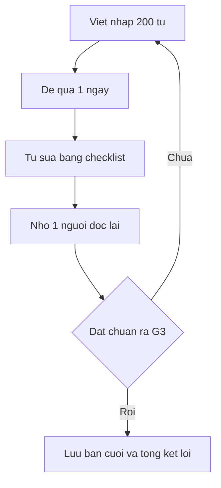

# 04 — THIEU viết học thuật

> Khung định hướng chủ đề. **Thứ tự gốc trong ảnh — chưa khôi phục được.** Không đánh số buổi học. [Nguồn: https://vuenglishclass.blogspot.com/2023/07/syllabus-lesson-plan-cua-thieu.html]

## Quy ước nhãn

- Tên trục kỹ thuật và trích ngắn có **[Nguồn]**. Thứ tự trình bày các trục, checklist và loop viết là **[Suy luận self-learn + giả định]** sắp theo độ khó tăng dần cho người tự học.
- **[Tham khảo thêm]** (giải thích kỹ thuật, tài liệu ngoài): xem định nghĩa đầy đủ ở [00](./00-gioi-han-du-lieu-va-gia-dinh.md) và danh mục ở [06](./06-tai-lieu-tham-khao.md).

## Khung 8 trục chủ đề

- **Trục A — Linearity** [Nguồn: THIEU 2023] — khung Kaplan về viết tuyến tính. [Suy luận] Học trước tiên để đoạn văn đi thẳng một ý chính.
- **Trục B — Thematic progression Halliday** [Nguồn: cùng bài] — gồm RT, ERT, TT, ETT, N và U. [Suy luận] Dùng để nối câu chủ đề qua các câu sau.
- **Trục C — Cohesive devices** [Nguồn: cùng bài] — gồm Reference, Substitution và Ellipsis, Conjunction, Lexical. [Suy luận] Học sau thematic để thay thế lặp từ.
- **Trục D — Dependency** [Nguồn: cùng bài] — quan hệ phụ thuộc giữa các thành phần câu. [Suy luận] Dùng để cắt câu dài rườm rà.
- **Trục E — Syntax Tree và Modality** [Nguồn: cùng bài] — cây cú pháp và modality force-based gồm WILL, WOULD, SHOULD, COULD, MAY, MUST. [Suy luận] Dùng để kiểm tra cấu trúc câu và mức độ chắc chắn.
- **Trục F — Argumentation** [Nguồn: cùng bài] — gồm Toulmin, Appraisal, Engagement. [Suy luận] Dùng để dựng luận điểm và phản biện.
- **Trục G — Fallacy và Economy** [Nguồn: cùng bài] — lỗi ngụy biện và 9 nguyên tắc economy. [Suy luận] Dùng ở vòng sửa để gọt câu.
- **Trục H — Scholarship track** [Nguồn: cùng bài] — gồm CV, SOP, LOR, interview. [Suy luận] Để cuối cùng, viết 1 bộ hồ sơ mẫu.

Ba trích định hướng giữ nguyên văn:

- [Nguồn: THIEU 2023] "đập đi xây lại toàn bộ nền móng luyện viết".
- [Nguồn: cùng bài] "Học viết dựa trên linking và văn hóa linking".
- [Nguồn: cùng bài] "Vocabulary là yếu tố dễ quan sát nhưng lại nông nhất".

## Chi tiết trục đã fix audit [Nguồn + Suy luận]

> **Thứ tự gốc trong ảnh — chưa khôi phục được.** Các trục A–H sắp theo độ khó tăng dần cho người tự học [Suy luận], không phải thứ tự buổi gốc.

- [Nguồn: https://vuenglishclass.blogspot.com/2023/07/syllabus-lesson-plan-cua-thieu.html] Trục A Linearity gồm Kaplan diagrams, 11 đoạn handout xếp tuyến tính, branching, subgrouping. [Suy luận] Học trước tiên để đoạn văn đi thẳng một ý chính.
- [Nguồn: cùng bài] Trục B Thematic progression (Halliday cải biên) gồm Theme–Rheme, Marked vs Unmarked, Topical/Textual/Interpersonal, 6 patterns RT, ERT, TT, ETT, N và U + 3 repetition types L, R và T. [Suy luận] Dùng để nối câu chủ đề qua các câu sau.
- [Nguồn: cùng bài] Trục C Cohesive devices gồm Reference, Substitution và Ellipsis, Conjunction, Lexical cohesion + 10 conjunctive relations và khoảng 160 linking words. Hiệu đính audit S13: Homework 2 điền linking words gồm 40 câu, tiếp tục giải ở S16; S16 bổ sung measurement modifiers, yếu tố dialect, quan hệ lồng cấp PURPOSE thuộc CAUSE/EFFECT và EXCEPTION thuộc EXCLUSION.
- [Nguồn: cùng bài] Trục D Dependency gồm 3 cơ chế Semantic, Grammatical, Positional và tương tác với Cohesive devices. [Suy luận] Dùng để cắt câu dài rườm rà.
- [Nguồn: cùng bài] Trục E Syntax Tree và Modality gồm clause types, Moods, Syntax Tree (NP, PP, VP, CP, TP), Head, Bottom-up/Top-down. Hiệu đính audit S24: warm-up quảng cáo/rao vặt lỗi linking scope + sai lầm linking distance và giải đề GMAT. Modality force-based gồm WILL, WOULD, SHOULD, COULD, MAY, MUST với 3 thành tố force contributor, force receiver và force coordinator.
- [Nguồn: cùng bài] Trục F Argumentation gồm Appraisal/Engagement (Martin, thích nghi đơn giản hóa; Monogloss vs Heterogloss: Entertain/Attribute/Disclaim/Proclaim) và Toulmin mở rộng (Claim/Warrant/Rebuttal/Qualifier). Hiệu đính audit: S34 Engagement lead-in; S35 chữa Engagement + Toulmin; S36 Issue essays so sánh TOEFL/IELTS vs GRE/LSAT/GMAT + Idea Map + Peer Review/Review Partner.
- [Nguồn: cùng bài] Trục G Fallacy và Economy gồm 9 nguyên tắc economy. Hiệu đính audit S37: Fallacy part 2 + ví dụ scandal từ thiện VN + Homework xác định fallacy và đề Argument essay GRE mẫu. Hiệu đính audit S32: spoken qualifying structures, qualification trong văn luật, qualification khi nói vs khi viết, mở rộng/thu hẹp phạm vi, multi-element qualification.
- [Nguồn: cùng bài] Trục H Scholarship track gồm self-assessment, Résumé vs CV, SOP vs PS, LOR, Professor Contact, Interview, ráp hồ sơ. Hiệu đính audit S38: dữ liệu multimedia bổ sung + quy tắc bản dịch/công chứng tài liệu Việt + Grade Explanation.

## Giải thích kỹ thuật bổ sung [Tham khảo thêm]

> Tóm từ `references/21-background-tap-thieu-sharing.md`, mỗi khái niệm ngắn gọn + tối đa 1 ví dụ. Links tra cứu xem [06](./06-tai-lieu-tham-khao.md).

- [Tham khảo thêm: kiến thức nền references/21] Linearity và Kaplan (1966, Cultural Thought Patterns): văn Anh học thuật kỳ vọng tuyến tính topic → subdivisions → ví dụ. Bắt buộc giữ phê bình Connor, Severino và Kaplan 1987 tự đính chính: đây là xu hướng tần suất, không phải bản chất dân tộc; cấm mọi diễn đạt essentialist kiểu gán người Việt viết vòng vo. Ví dụ sửa linear: `Remote work improves retention. First,... Second,... Therefore...`.
- [Tham khảo thêm: kiến thức nền references/21] Thematic progression Halliday: mỗi clause có Theme (xuất phát) và Rheme (triển khai mới); 3 patterns Daneš là constant, linear/zigzag, split/multiple; giữ đúng thuật ngữ gốc RT/ERT/TT/ETT/N/U. Ví dụ linear: `Vietnam invested in expressways. These investments cut costs.`.
- [Tham khảo thêm: kiến thức nền references/21] Cohesive devices 5 loại (Halliday & Hasan 1976): reference, substitution, ellipsis, conjunction, lexical cohesion; phân biệt cohesion bề mặt với coherence logic sâu. Ví dụ: `Solar costs fell. This decline enabled...`.
- [Tham khảo thêm: kiến thức nền references/21] Dependency xem câu là mạng head–dependent với động từ chính là trung tâm. Ví dụ: `Although funding was cut, the team published the results` với head là `published`.
- [Tham khảo thêm: kiến thức nền references/21] Syntax Tree vẽ phân cấp S → NP + VP để unpack câu khó và kiểm tra mỗi câu có S–V chính. Ví dụ: `The claim that funding drives innovation is overstated` với chủ ngữ thật là `claim`.
- [Tham khảo thêm: kiến thức nền references/21] Modality theo lực force-based: epistemic (may/might), deontic (must/should), dynamic (can/could); học theo chức năng hedge/recommend/obligate/predict. Ví dụ: `This suggests X may improve Y` (hedge) khác `X must improve Y` (mệnh lệnh).
- [Tham khảo thêm: kiến thức nền references/21] Toulmin 6 phần Claim/Data/Warrant/Backing/Qualifier/Rebuttal; bài yếu thường thiếu Warrant nên người đọc hỏi "thì sao?". Ví dụ: Claim `Bus lanes cut commute time` + Data `Hanoi pilot: -18%` + Warrant xe buýt tách khỏi ùn tắc.
- [Tham khảo thêm: kiến thức nền references/21] Appraisal (Martin & White) và stance (Hyland): attitude, graduation, engagement; hedges, boosters, self-mention. Ví dụ: `These results suggest the policy is partially effective, though Li (2020) argues...`.
- [Tham khảo thêm: kiến thức nền references/21] 5 fallacies phổ biến: strawman, ad hominem, false dilemma, slippery slope, hasty generalization. Ví dụ: false dilemma là ép chỉ còn 2 lựa chọn.
- [Tham khảo thêm: kiến thức nền references/21] Economy: đạt ý tối đa với từ tối thiểu, 1 động từ mạnh thay cụm danh từ dài. Ví dụ: `Due to the fact that...` thành `Because many...`.
- [Tham khảo thêm: kiến thức nền references/21] Bộ hồ sơ CV/SOP/LOR/interview: CV 1–2 trang đảo ngược thời gian; SOP 800–1000 từ tránh mở đầu sáo rỗng; LOR chọn người giám sát trực tiếp kèm ví dụ cụ thể; interview chuẩn bị pitch 2 phút theo STAR.

## Checklist tự review bài viết

[Suy luận self-learn + giả định: không có giáo viên chấm] Trước khi nhờ người khác đọc, tự kiểm:

- Mỗi đoạn có 1 câu chủ đề và mọi câu còn lại hướng về nó.
- Mỗi câu mới nhắc lại hoặc phát triển theme của câu trước.
- Không lặp từ khóa quá 3 lần trong 1 đoạn nếu chưa dùng cohesive device.
- Mỗi câu dài trên 25 từ đã thử tách đôi.
- Mỗi modal như MUST hay SHOULD đã kiểm tra mức độ khẳng định có chủ ý.
- Mỗi luận điểm có bằng chứng và 1 câu xét phản biện.
- Bài đã cắt ít nhất 10 phần trăm số từ ở bản nháp đầu.

## Loop viết sửa đọc lại

- Viết nháp 200 tới 300 từ [Suy luận], để qua 1 ngày, tự sửa bằng checklist, rồi mới nhờ 1 người đọc.
- Mỗi bài giữ 2 bản nháp và 1 bản cuối trong cùng thư mục để so tiến bộ.

Về [README](./README.md) | Trước: [03](./03-tap-tu-vung-chuyen-y.md) | Tiếp: [05](./05-knowledge-sharing-va-loop-dai-han.md). Giới hạn xem [00](./00-gioi-han-du-lieu-va-gia-dinh.md).
