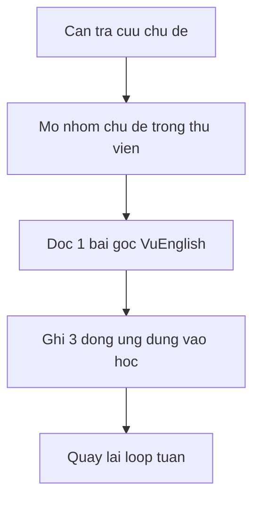
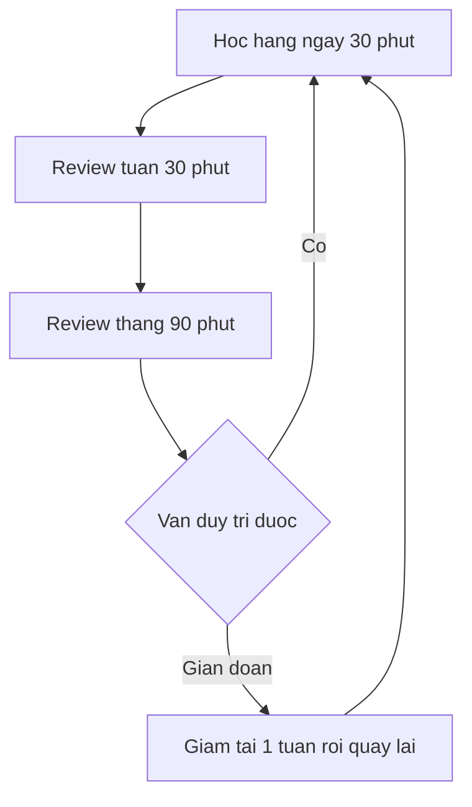

# 05 — Knowledge-Sharing và loop dài hạn

> Thư viện tham khảo. Liệt kê theo nhóm chủ đề, **không đánh số thứ tự học**. [Nguồn: https://vuenglishclass.blogspot.com/2026/06/vuenglish-knowledge-sharing-index.html]

## Quy ước nhãn

- Tên nhóm chủ đề và trích ngắn có **[Nguồn]**. Lịch mẫu và cách đo lường là **[Suy luận self-learn + giả định]**.
- **[Tham khảo thêm]** (giải thích kỹ thuật, tài liệu ngoài): xem định nghĩa đầy đủ ở [00](./00-gioi-han-du-lieu-va-gia-dinh.md) và danh mục ở [06](./06-tai-lieu-tham-khao.md).

## Thư viện 21 cộng 1 theo nhóm chủ đề

[Nguồn: Knowledge-Sharing index] Toàn kho gồm 21 bài sư phạm và ngôn ngữ cộng 1 bài fitness. Mô tả gốc của kho là "Chia sẻ kiến thức, kinh nghiệm giảng dạy với giáo viên TA...". Các nhóm dưới đây do người viết plan gom lại để tra cứu, không phải thứ tự học:

- **Động lực và phối hợp kỹ năng** [Nguồn]: sense of purpose, phối hợp các kỹ năng, lớp học như đại lý du lịch.
- **Nghe nói và ngữ pháp** [Nguồn]: dạy nghe-nói, grammar hệ thống và đa trường phái, quy tắc so với rote.
- **Từ vựng và dịch** [Nguồn]: SOP Việt-Anh, synonym và Cognitive, Synecdoche, TMRND, content-based vocab, translation.
- **Định hướng nghề và kỳ thi** [Nguồn]: TESOL so với Linguistics, giáo viên hướng nội, IELTS.
- **Thể chất** [Nguồn]: 1 bài fitness, đọc khi cần giữ nhịp học dài hạn.

## Chi tiết thư viện đã fix audit [Nguồn + Suy luận + Tham khảo thêm]

> Thư viện sắp theo nhóm chủ đề để tra cứu, **không đánh số thứ tự học**.

- [Nguồn: https://vuenglishclass.blogspot.com/2026/06/vuenglish-knowledge-sharing-index.html] Kho gồm 21 bài sư phạm và ngôn ngữ cộng 1 bài fitness, mô tả gốc "Chia sẻ kiến thức, kinh nghiệm giảng dạy với giáo viên TA...". Ngày trang index là June 15, 2026. Phân bố tháng theo slug: 18 bài tháng 06, 3 bài tháng 07 (essay, tmrnd, knowledge-sharing-ielts), 1 bài tháng 08 (class-mo).
- [Nguồn: cùng bài] Toàn văn 22 slugs theo thứ tự trang: sense-of, why, combined, by-rote-or, oral-skills, systematic, thieu, essay (07), synonym, cogling, synonym_01833627631 (bài Synecdoche có hậu tố số, khác bài synonym.html phương pháp chung), question, linguistic, tmrnd (07), content, translation, tesol-or, teacher, ielts-test-taker-notes (06, khác bài knowledge-sharing-ielts.html (07)), knowledge-sharing-ielts (07), class-mo (08), vu-fitness-earlier-better (06, nhóm Skincare & Fitness). Chi tiết slugs xem crawl audit trong `references/11-crawl-batch-b.md`.
- [Suy luận self-learn + giả định: raw không có mô tả] Mọi tóm 2–3 dòng mỗi bài suy từ tiêu đề đều là suy diễn, raw chỉ có tên bài + link; đọc toàn văn khi cần, không dùng tóm tắt thay nguồn.
- [Tham khảo thêm: kiến thức nền references/21] 8 trục đọc thêm gợi ý theo chủ đề thư viện: TESOL vs Linguistics; IELTS và ngữ cảnh dùng; content-based vocab (CLIL/CBI); contrastive rhetoric và phê bình Kaplan; genre-based writing (Swales CARS); corpus-based vocab; spaced repetition; World Englishes và stance. Nguồn công khai cụ thể cho từng trục xem [06](./06-tai-lieu-tham-khao.md).

## Loop duy trì dài hạn

- Weekly review 30 phút [Suy luận self-learn + giả định: giữ nhịp mà không kiệt sức]: nghe lại 1 bản ghi âm, ôn 20 mục PVO tới hạn, đọc lại 1 bài viết cũ.
- Monthly review 90 phút [Suy luận]: ghi 1 video nói 3 phút, viết 1 đoạn 200 từ, đối chiếu với tháng trước bằng checklist file 04.
- Đo lường [Suy luận]: đếm số ngày duy trì, số mục PVO qua đủ 5 vòng ôn, số bài viết đạt checklist, số lỗi lặp lại trong self-correction log.

## Lịch mẫu 12 tuần và 24 tuần

Lịch dưới đây là [Suy luận self-learn + giả định: người đi làm có 30 tới 45 phút mỗi ngày], không phải yêu cầu của VuEnglish:

- **Mẫu 12 tuần** [Suy luận]: tuần 1 tới 6 theo cụm 1 và 2 của file 02, tuần 7 tới 10 theo khung PVO file 03, tuần 11 tới 12 viết 2 bài theo checklist file 04 và ghi 1 presentation thử.
- **Mẫu 24 tuần** [Suy luận]: tuần 1 tới 12 như mẫu 12 tuần, tuần 13 tới 18 xong 4 trục đầu file 04, tuần 19 tới 22 xong 4 trục sau file 04, tuần 23 tới 24 làm presentation 5 phút và 1 bản viết đi kèm.

Về [README](./README.md) | Trước: [04](./04-thieu-viet-hoc-thuat.md) | Tổng quan: [01](./01-lo-trinh-tong-quan.md). Giới hạn xem [00](./00-gioi-han-du-lieu-va-gia-dinh.md).
