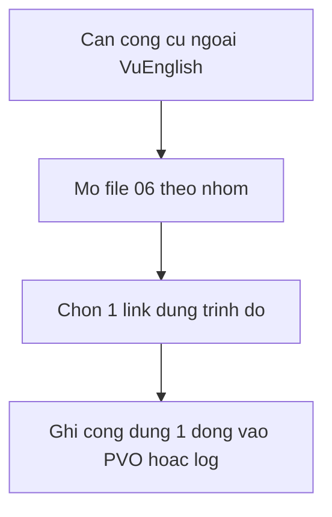

# 06 — Tài liệu tham khảo thêm

> Toàn bộ links ngoài VuEnglish trong bộ plan nằm ở file này. Mỗi mục mang nhãn **[Tham khảo thêm: tên + URL + loại]**, không phải phát ngôn của VuEnglish và không phải endorsement của VuEnglish. Trạng thái truy cập kiểm tra bằng curl ngày 2026-09-23 theo `references/22-link-status.md` (mã 200 = truy cập được lúc kiểm tra; mã 403 = site chặn bot nhưng mở trình duyệt dùng bình thường; mã 000 = không kết nối lúc kiểm tra, thử lại bằng trình duyệt). Trạng thái có thể đổi sau thời điểm kiểm tra. Các file 02/03/04 chỉ link nội bộ sang file này, không dump danh mục.

## Quy ước đọc

- Dòng có **[Nguồn]** chỉ nằm ở các file 00–05 và đóng băng ở 5 bài VuEnglish. Mọi link, mốc thời gian và ví dụ ngoài VuEnglish trong file này đều mang **[Tham khảo thêm]**.
- Mỗi link gồm 1–2 dòng công dụng + trình độ gợi ý. Không copy toàn văn nguồn.

## A. Nghe–nói và phát âm

- [Tham khảo thêm: BBC Learning English — https://www.bbc.co.uk/learningenglish — loại web học tiếng Anh] Luyện intonation, stress, redundancy qua 6 Minute English. Trình độ A1–C1. Truy cập được lúc kiểm tra 2026-09-23.
- [Tham khảo thêm: BBC Learning English YouTube — https://www.youtube.com/@bbclearningenglish — loại kênh YouTube] Schwa, elision, assimilation qua Tim's Pronunciation Workshop. Trình độ A2–B2. Truy cập được lúc kiểm tra 2026-09-23.
- [Tham khảo thêm: VOA Learning English — https://learningenglish.voanews.com — loại web học tiếng Anh Mỹ] Shadowing chậm, chunking, intonation Mỹ. Trình độ A1–B1. Truy cập được lúc kiểm tra 2026-09-23.
- [Tham khảo thêm: VOA Learning English YouTube — https://www.youtube.com/@voalearningenglish — loại kênh YouTube] Shadowing và phrase reduction qua English in a Minute. Trình độ A1–B1. Truy cập được lúc kiểm tra 2026-09-23.
- [Tham khảo thêm: VOA Learning English Podcast — https://learningenglish.voanews.com/z/1689 — loại podcast] Shadowing audio và ghi self-correction log. Trình độ A2–B1. Truy cập được lúc kiểm tra 2026-09-23.
- [Tham khảo thêm: Rachel's English web — https://www.rachelsenglish.com — loại web phát âm Mỹ] Schwa, intonation Mỹ, strong/weak, reduction, liaison. Trình độ A2–C1. Truy cập được lúc kiểm tra 2026-09-23.
- [Tham khảo thêm: Rachel's English YouTube — https://www.youtube.com/@RachelsEnglish — loại kênh YouTube] Backbone giọng Mỹ và additional sounds. Trình độ A2–C1. Truy cập được lúc kiểm tra 2026-09-23.
- [Tham khảo thêm: Cambridge Dictionary — https://dictionary.cambridge.org — loại từ điển] Phiên âm US/UK kèm audio, tra homonyms và contraction. Mọi trình độ. Mã 403 lúc kiểm tra: site chặn bot nhưng mở trình duyệt dùng bình thường.
- [Tham khảo thêm: YouGlish — https://youglish.com — loại công cụ tra phát âm theo video thật] Nghe reduction, liaison, intonation trong video thật. Trình độ B1–C1. Truy cập được lúc kiểm tra 2026-09-23.
- [Tham khảo thêm: Forvo — https://forvo.com — loại kho phát âm bản xứ] Nghe người bản xứ đọc từ rút gọn và homonyms. Mọi trình độ. Mã 403 lúc kiểm tra: site chặn bot nhưng mở trình duyệt dùng bình thường.
- [Tham khảo thêm: kênh JenniferESL trên YouTube — tìm kênh JenniferESL trên YouTube — loại kênh YouTube] Weak forms, elision, intonation chậm. Trình độ A1–B1. Không dùng URL handle @ cũ (truy cập báo không tồn tại lúc kiểm tra 2026-09-23), tìm tên kênh trực tiếp trên YouTube.
- [Tham khảo thêm: Speechling — https://speechling.com — loại công cụ luyện nói] Ghi âm so sánh mẫu và tự sửa, bản miễn phí giới hạn. Trình độ A1–B2. Truy cập được lúc kiểm tra 2026-09-23.
- [Tham khảo thêm: Luke's English Podcast — https://teacherluke.co.uk — loại podcast] Redundancy và self-correction, lưu ý giọng Anh. Trình độ B1–C1. Truy cập được lúc kiểm tra 2026-09-23.

## B. Từ vựng, collocation và corpus

- [Tham khảo thêm: Oxford Learner's Dictionaries — https://www.oxfordlearnersdictionaries.com/ — loại từ điển] Nghĩa, collocation, phát âm BrE/AmE. Trình độ A1–C2. Truy cập được lúc kiểm tra 2026-09-23.
- [Tham khảo thêm: OZDIC — https://ozdic.com/ — loại từ điển collocation] Collocation chuyên sâu cho viết. Trình độ B1–C2. Truy cập được lúc kiểm tra 2026-09-23.
- [Tham khảo thêm: Just The Word — http://www.just-the-word.com/ — loại công cụ collocation] Collocation từ kho BNC. Trình độ B2–C2. Truy cập được lúc kiểm tra 2026-09-23.
- [Tham khảo thêm: Online Etymology Dictionary — https://www.etymonline.com/ — loại từ điển gốc từ] Tra gốc từ để nhớ họ từ. Trình độ B2–C2. Truy cập được lúc kiểm tra 2026-09-23.
- [Tham khảo thêm: COCA — https://www.english-corpora.org/coca/ — loại corpus] Kho văn bản 1 tỉ từ, bản miễn phí giới hạn lượt tra mỗi ngày. Trình độ B1–C2. Mã 403 lúc kiểm tra: site chặn bot nhưng mở trình duyệt dùng bình thường.
- [Tham khảo thêm: SkELL — https://skell.sketchengine.eu/ — loại corpus cho người học] Corpus đơn giản, ví dụ ngắn cho learner. Trình độ A2–B1+. Truy cập được lúc kiểm tra 2026-09-23.
- [Tham khảo thêm: SketchEngine student guide — https://www.sketchengine.eu/user-guide/students/ — loại hướng dẫn] Hướng dẫn dùng corpus cho sinh viên. Trình độ B1–C2. Truy cập được lúc kiểm tra 2026-09-23.
- [Tham khảo thêm: Ludwig — https://ludwig.guru/ — loại công cụ kiểm câu viết] Kiểm câu viết có tự nhiên không qua ví dụ báo chí. Trình độ B2–C2. Mã 403 lúc kiểm tra: site chặn bot nhưng mở trình duyệt dùng bình thường.
- [Tham khảo thêm: Thesaurus.com — https://www.thesaurus.com/ — loại từ điển đồng nghĩa] Tra synonym, cần kiểm lại nuance trước khi dùng. Trình độ A2–C2. Truy cập được lúc kiểm tra 2026-09-23.
- [Tham khảo thêm: Power Thesaurus — https://www.powerthesaurus.org/ — loại từ điển đồng nghĩa cộng đồng] Synonym crowdsourced, cần kiểm lại ngữ cảnh. Trình độ B1–C2. Truy cập được lúc kiểm tra 2026-09-23.

## C. Viết học thuật

- [Tham khảo thêm: Purdue OWL — https://owl.purdue.edu/ — loại trung tâm viết trực tuyến] Viết học thuật toàn diện từ đoạn văn tới trích dẫn. Trình độ B1–C2. Truy cập được lúc kiểm tra 2026-09-23.
- [Tham khảo thêm: Purdue OWL Toulmin — https://owl.purdue.edu/owl/general_writing/academic_writing/historical_perspectives_on_argumentation/toulmin_argument.html — loại bài hướng dẫn] Claim, Warrant, Rebuttal theo Toulmin. Trình độ B2–C2. Truy cập được lúc kiểm tra 2026-09-23.
- [Tham khảo thêm: Academic Phrasebank Manchester — https://www.phrasebank.manchester.ac.uk/ — loại ngân hàng cụm từ] Cụm học thuật theo chức năng (giới thiệu, so sánh, phản biện). Trình độ B2–C2. Truy cập được lúc kiểm tra 2026-09-23.
- [Tham khảo thêm: UNC Writing Center — https://writingcenter.unc.edu/tips-and-tools/ — loại handouts viết] Handouts ngắn để thực hành từng lỗi. Trình độ B1–C2. Truy cập được lúc kiểm tra 2026-09-23.
- [Tham khảo thêm: UEFAP — http://www.uefap.com/ — loại giáo trình EAP] Tiếng Anh học thuật hệ thống. Trình độ B2–C2. Truy cập được lúc kiểm tra 2026-09-23.

## D. Ghi nhớ, thi cử và đọc thêm

- [Tham khảo thêm: Anki — https://apps.ankiweb.net — loại app flashcard SRS] Flashcard ôn giãn cách cho PVO, homonyms và minimal pairs. Mọi trình độ. Truy cập được lúc kiểm tra 2026-09-23.
- [Tham khảo thêm: Anki background manual — https://docs.ankiweb.net/background.html — loại tài liệu hướng dẫn] Giải thích nguyên tắc ôn giãn cách của Anki. Mọi trình độ. Truy cập được lúc kiểm tra 2026-09-23.
- [Tham khảo thêm: Quizlet — https://quizlet.com/ — loại app flashcard] Flashcard game hóa cho từ mới. Trình độ A1–B2. Mã 403 lúc kiểm tra: site chặn bot nhưng mở trình duyệt dùng bình thường.
- [Tham khảo thêm: British Council LearnEnglish — https://learnenglish.britishcouncil.org/ — loại web học tiếng Anh] Nền ngữ pháp, viết và đọc. Trình độ A1–B2. Mã 000 lúc kiểm tra: không kết nối được, thử lại bằng trình duyệt.
- [Tham khảo thêm: TeachingEnglish — https://www.teachingenglish.org.uk/ — loại web sư phạm] Tài liệu dạy học và CLIL. Dành cho giáo viên và tự học nâng cao. Mã 000 lúc kiểm tra: không kết nối được, thử lại bằng trình duyệt.
- [Tham khảo thêm: TESOL International — https://www.tesol.org/ — loại hiệp hội nghề] Định hướng TESOL vs Linguistics. Dành cho giáo viên và tự học nâng cao. Truy cập được lúc kiểm tra 2026-09-23.
- [Tham khảo thêm: IELTS official — https://www.ielts.org/ — loại web kỳ thi] Thông tin kỳ thi và band descriptors công khai. Mọi trình độ thi IELTS. Truy cập được lúc kiểm tra 2026-09-23.
- [Tham khảo thêm: Cambridge blog spaced repetition — https://www.cambridge.org/elt/blog/2019/08/12/learning-learn-flash-cards-spaced-repetition-example-sentences/ — loại bài blog] Ví dụ flashcard và ôn giãn cách với câu mẫu. Trình độ B1–C2. Truy cập được lúc kiểm tra 2026-09-23.
- [Tham khảo thêm: Kaplan 1966 PDF — https://www.colby.edu/wp-content/uploads/2024/10/Kaplan_CR_1965.pdf — loại PDF bài báo] Bản scan bài Cultural Thought Patterns, đọc kèm phê bình Connor, Severino và Kaplan 1987, cấm diễn đạt essentialist. Trình độ B2–C2. Truy cập được lúc kiểm tra 2026-09-23.
- [Tham khảo thêm: PLOS ONE Murre và Dros 2015 — https://journals.plos.org/plosone/article?id=10.1371/journal.pone.0120644 — loại bài tạp chí mở] Replicate đường cong quên Ebbinghaus, đọc ở mức tham khảo, mốc 1-3-7-14-30 chỉ là heuristic. Trình độ B2–C2. Truy cập được lúc kiểm tra 2026-09-23.
- [Tham khảo thêm: EducationUSA — https://educationusa.state.gov/ — loại web học bổng] Thông tin du học Mỹ và chuẩn bị hồ sơ. Dành cho người làm hồ sơ scholarship. Truy cập được lúc kiểm tra 2026-09-23.

Về [README](./README.md) | Trước: [05](./05-knowledge-sharing-va-loop-dai-han.md). Giới hạn nhãn xem [00](./00-gioi-han-du-lieu-va-gia-dinh.md).
