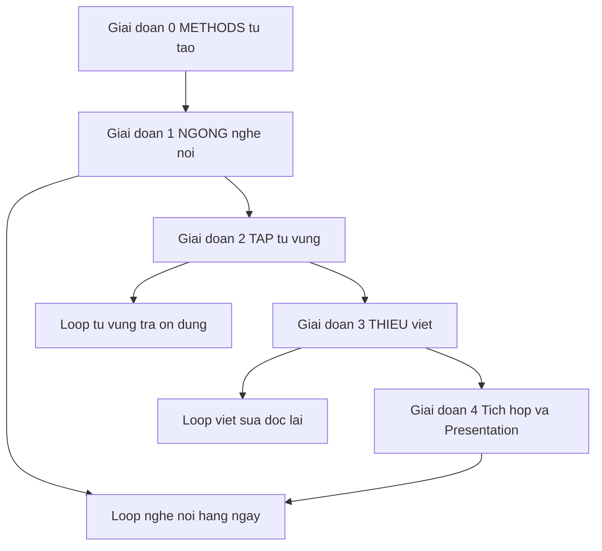

# Plan tự học tiếng Anh từ nguồn VuEnglish

> Quy ước nhãn dùng xuyên suốt bộ tài liệu: **[Nguồn: URL + trích ngắn]** là thông tin lấy từ 1 trong 5 bài VuEnglish dưới đây (đóng băng, không thêm URL mới); **[Suy luận self-learn + giả định]** là đề xuất cách tự học do người viết plan suy ra, không phải lời của VuEnglish; **[Tham khảo thêm: tên + URL + loại]** là kiến thức giải thích và tài liệu ngoài VuEnglish, không phải phát ngôn hay endorsement của VuEnglish. Ba nhãn mutually exclusive — một claim chỉ mang đúng một nhãn. Không copy toàn văn nguồn, chỉ trích ngắn trong ngoặc kép.

> Ngoại lệ có kiểm soát từ 2026-09-23: các sections mới gắn nhãn [Tham khảo thêm] bổ sung giải thích kỹ thuật (từ `references/20`, `references/21`) và links ngoài (tổng hợp ở [06](./06-tai-lieu-tham-khao.md), trạng thái theo `references/22-link-status.md` kiểm tra 2026-09-23, có thể đổi sau). Chi tiết định nghĩa xem [00](./00-gioi-han-du-lieu-va-gia-dinh.md).

## Ba trụ của plan

- **NGONG — backbone có thứ tự duy nhất** [Nguồn: NGONG syllabus 2026]. Khung Nghe-Nói 24 buổi S01-S24, học theo đúng thứ tự gốc. Chi tiết xem `02-ngong-nghe-noi-backbone.md`.
- **THIEU — khung định hướng chủ đề viết học thuật** [Nguồn: THIEU 2023]. Không có thứ tự buổi đã khôi phục. Chỉ học theo trục chủ đề. Chi tiết xem `04-thieu-viet-hoc-thuat.md`.
- **TAP — khung định hướng chủ đề từ vựng và chuyển ý** [Nguồn: TAP I 2024]. Không có thứ tự buổi đã khôi phục. Chỉ học theo trục chủ đề. Chi tiết xem `03-tap-tu-vung-chuyen-y.md`.

Vòng lặp luyện tập chung: nghe-nói hàng ngày, từ vựng theo vòng tra–ôn–dùng, viết theo vòng viết–sửa–nhờ đọc lại, và thư viện tham khảo đọc khi cần. Chi tiết xem `05-knowledge-sharing-va-loop-dai-han.md`.

## Danh sách tài liệu

1. [00 — Giới hạn dữ liệu và giả định](./00-gioi-han-du-lieu-va-gia-dinh.md) — đọc trước tiên. Mục bắt buộc theo Oracle Gate 1.
2. [01 — Lộ trình tổng quan](./01-lo-trinh-tong-quan.md) — roadmap 5 giai đoạn, điều kiện vào ra, thời lượng gợi ý.
3. [02 — NGONG nghe nói backbone](./02-ngong-nghe-noi-backbone.md) — 4 cụm NGONG S01-S24 và loop nghe-nói.
4. [03 — TAP từ vựng và chuyển ý](./03-tap-tu-vung-chuyen-y.md) — khung TMRND và PVO, không đánh số buổi.
5. [04 — THIEU viết học thuật](./04-thieu-viet-hoc-thuat.md) — khung viết theo trục chủ đề, không đánh số buổi.
6. [05 — Knowledge-Sharing và loop dài hạn](./05-knowledge-sharing-va-loop-dai-han.md) — thư viện tham khảo và lịch mẫu.
7. [06 — Tài liệu tham khảo thêm](./06-tai-lieu-tham-khao.md) — toàn bộ links ngoài VuEnglish ([Tham khảo thêm], trạng thái kiểm tra 2026-09-23). Các file 02/03/04 chỉ link nội bộ sang file này, không dump danh mục.

## Nguồn tham khảo

1. THIEU syllabus 2023 — https://vuenglishclass.blogspot.com/2023/07/syllabus-lesson-plan-cua-thieu.html
2. TAP I syllabus 2024 — https://vuenglishclass.blogspot.com/2024/01/syllabus-lesson-plan-cua-tap-i.html
3. NGONG registration 2026 — https://vuenglishclass.blogspot.com/2026/08/vuenglish-registration-ngong.html
4. NGONG syllabus 2026 — https://vuenglishclass.blogspot.com/2026/06/vuenglish-ngong-syllabus.html
5. Knowledge-Sharing index 2026 — https://vuenglishclass.blogspot.com/2026/06/vuenglish-knowledge-sharing-index.html
