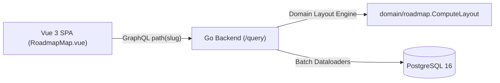
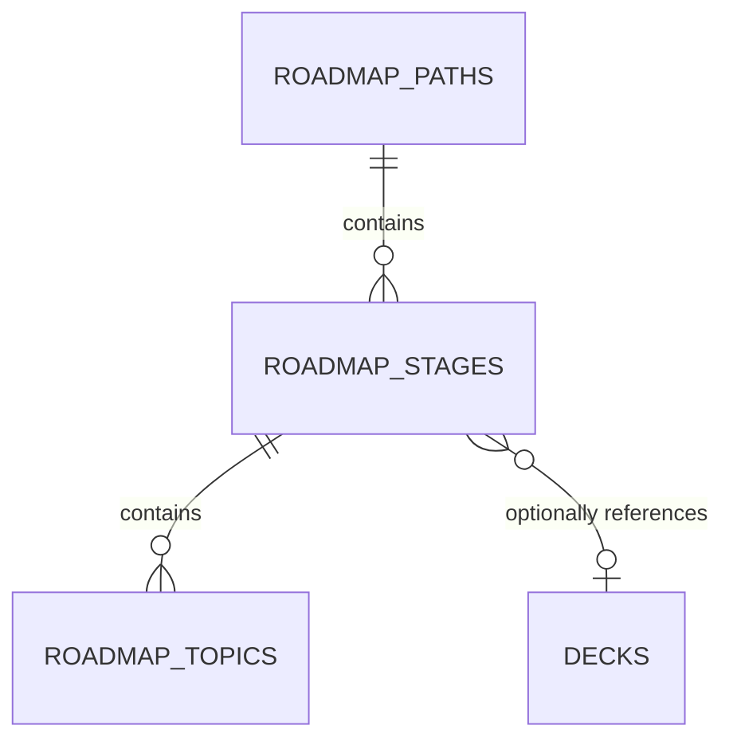
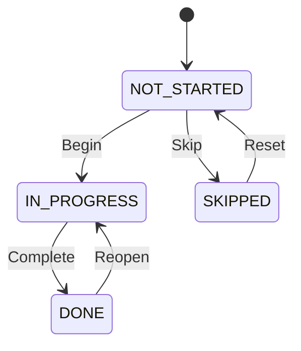

# 01. Requirements — Interactive Gamified Roadmap Map

> **Navigation:** [← Requirements Index](README.md)
>
> _Status: Implemented & Active — Architectural requirements for the horizontal interactive learning roadmap map._

The Interactive Gamified Roadmap Map delivers a visual, journey-based learning interface inspired by roadmap.sh and game level progression maps. It allows language learners to navigate sequential topics, track milestone achievements, jump into targeted flashcard reviews, and view their unlock status on an SVG landscape canvas.

## 1. Goals

1. **Horizontal Visual Progression** — Render learning stages and topics as a horizontal winding progression path across an SVG canvas.
2. **Deterministic Layout Calculation** — Calculate canvas coordinates server-side in the domain layer, ensuring client and server map representations remain synchronized without client-side coordinate drift.
3. **Sequential Unlock Rules** — Reflect topic progression states (`DONE`, `CURRENT`, `LOCKED`) based on prerequisites and completed items.
4. **Direct Review Navigation** — Link stages directly to corresponding SRS decks without hard relational coupling.

## 2. Scope

### 2.1 In-scope
- 5-level curriculum structure (`Path` -> `Stage` -> `Milestones`/`Topics` -> `Resources`).
- Winding landscape layout geometry with configurable amplitudes and spacing.
- Visual biomes (`meadow`, `desert`, `snow`, `volcano`, `ocean`, `city`).
- Stage and topic status updates (`not_started`, `in_progress`, `done`, `skipped`).
- Stage-to-deck navigation button integration.

### 2.2 Out-of-scope
- Real-time multiplayer co-learning (system is single-user).
- Client-side drag-and-drop node coordinate repositioning.

## 3. Glossary / Terminology

| Term | Definition |
| --- | --- |
| **Path** | Top-level language course track (e.g. Chinese HSK 1–4, English Communication). |
| **Stage** | Curriculum phase corresponding to a visual biome/level with duration in weeks. |
| **Topic** | Actionable study lesson node rendered on the map path. |
| **Level State** | Derived visual state for a node: `DONE` (completed), `CURRENT` (active target), or `LOCKED` (unreachable). |
| **Biome / Terrain** | The visual aesthetic theme of a stage on the map canvas. |

## 4. Architecture & Data Model





### Key Schema Columns

| Column | Type | Nullable | Default | Notes |
| --- | --- | --- | --- | --- |
| `roadmap_stages.terrain` | `TEXT` | No | `'meadow'` | Check constraint: meadow, desert, snow, volcano, ocean, city |
| `roadmap_stages.direction` | `TEXT` | No | `'right'` | Orientation: `'right'` (horizontal landscape) or `'up'` |
| `roadmap_stages.deck_id` | `BIGINT` | Yes | `NULL` | References `decks(id) ON DELETE SET NULL` |
| `roadmap_topics.map_x` | `REAL` | Yes | `NULL` | X-coordinate on 900px canvas height (calculated if null) |
| `roadmap_topics.map_y` | `REAL` | Yes | `NULL` | Y-coordinate on 900px canvas height (calculated if null) |
| `roadmap_topics.is_optional` | `INTEGER` | No | `0` | Check constraint: `0` or `1` |

## 5. Domain Behavior & Coordinate Mathematics

Calculated in [api/internal/domain/roadmap/map_layout.go](file:///home/hung1/personal/roadmap-learning/api/internal/domain/roadmap/map_layout.go):
- **Canvas Height:** Fixed at `900.0` units.
- **Node Spacing:** Consecutive topics are spaced by `440.0` units along the horizontal main axis.
- **Wave Amplitude:** Sine wave oscillation across the secondary axis uses an amplitude ratio of `0.30` (30% of canvas height).
- **Sorted Consistency:** Topics are stably sorted by `(position, id)` before coordinate assignment.

## 6. State Machine

Nodes transition between four persistent states:

| State | Meaning |
| --- | --- |
| `NOT_STARTED` | Initial untouched status |
| `IN_PROGRESS` | Currently active study topic |
| `DONE` | Completed lesson; sets `completed_at` timestamp |
| `SKIPPED` | Bypassed item; omitted from progress penalty |



## 7. Operation Specification

| Operation | Behavior |
| --- | --- |
| `path(slug)` | Resolves path, loads tree via batch dataloaders, calculates missing coordinates, and returns topic level states |
| `setTopicStatus(id, input)` | Evaluates status policy, updates `completed_at`, touches `updated_at`, and returns updated topic |
| `setStageStatus(id, input)` | Updates stage completion state and updates `completed_at` |

## 8. API Contract

### Endpoints (GraphQL)
```graphql
query GetPathMap($slug: String!) {
  path(slug: $slug) {
    id
    slug
    title
    stages {
      id
      title
      terrain
      direction
      deck { id name lang }
      topics {
        id
        title
        level
        point { x y }
        status
      }
    }
  }
}
```

## 9. Permissions & Security

- Single-user local application context.
- Schema introspection disabled when `GIN_MODE=release`.

## 10. Audit

- Every stage and topic mutation updates `updated_at` via database trigger `trg_roadmap_*_touch_updated` to feed peer sync.

## 11. Non-Functional Requirements

| Group | Requirement |
| --- | --- |
| **Performance** | Tree queries must resolve via dataloaders in <= 3 SQL queries regardless of node count. |
| **Responsiveness** | Horizontal canvas must support smooth panning and zooming on desktop and touch devices. |
| **Reliability** | Deleting an SRS deck must not cascade delete connected roadmap stages (`ON DELETE SET NULL`). |

## 12. Acceptance Criteria

1. Navigating to `/roadmap/:slug` displays a horizontal winding path connecting all topics in sequential order.
2. Clicking a topic allows changing its status between `not_started`, `in_progress`, `done`, and `skipped`.
3. Marking a topic `DONE` dynamically sets `completed_at` and unlocks the subsequent topic node to `CURRENT`.
4. Stages linked to a deck display a "Review Deck" button navigating directly to `#/review?deck=:id`.

## 13. Testing Mandates

- Layout math tests: [map_layout_test.go](file:///home/hung1/personal/roadmap-learning/api/internal/domain/roadmap/map_layout_test.go).
- GraphQL tree resolution tests: [roadmap_tree_test.go](file:///home/hung1/personal/roadmap-learning/api/internal/transport/graphql/roadmap_tree_test.go).
- Migration schema checks: [00006_roadmap_map_horizontal.sql](file:///home/hung1/personal/roadmap-learning/api/migrations/00006_roadmap_map_horizontal.sql).

## 14. References

- Design rationale: [00006_roadmap_map_horizontal.sql](file:///home/hung1/personal/roadmap-learning/api/migrations/00006_roadmap_map_horizontal.sql)
- Layout engine: [api/internal/domain/roadmap/map_layout.go](file:///home/hung1/personal/roadmap-learning/api/internal/domain/roadmap/map_layout.go)
