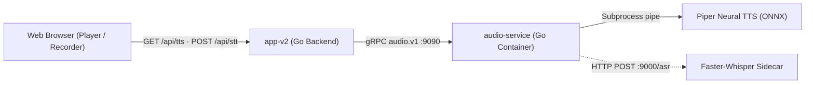
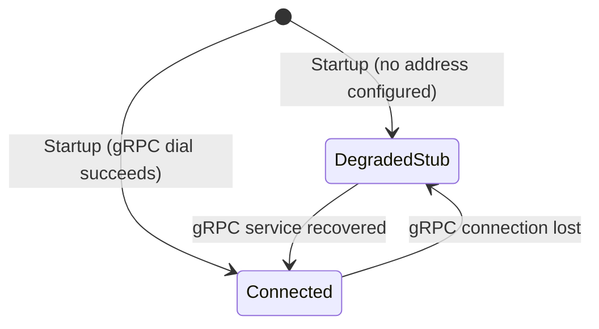

# 02. Requirements — Audio Pipeline & Sidecar Isolation

> **Navigation:** [← Requirements Index](README.md)
>
> _Status: Implemented & Active — Requirements for neural speech synthesis, speech recognition forwarding, and out-of-process isolation._

The Audio Pipeline provides neural text-to-speech synthesis and speech-to-text recognition capabilities for language pronunciation drills, shadowing practice, and phonetics training. Heavy neural model runtimes and dependencies (Piper TTS and Faster-Whisper) are isolated out of process to ensure web application resilience.

## 1. Goals

1. **Process Isolation** — Isolate native neural TTS libraries and Whisper network clients into a separate service process so crashes never terminate the core HTTP/GraphQL server.
2. **Standardized Communication** — Establish a typed, versioned, and contract-tested gRPC interface (`audio.v1.Audio`) between the application and audio runtime.
3. **Graceful Degradation** — If the audio process is unreachable or unstarted, the web application must operate in degraded mode with synthesized sine-wave audio stubs rather than crashing or throwing 500 errors.
4. **Binary Audio Streaming** — Stream generated audio directly to the browser over standard HTTP to avoid Base64 memory overhead.

## 2. Scope

### 2.1 In-scope
- Dedicated gRPC service running on port `:9090`.
- Local neural speech synthesis using Piper ONNX voice models (Chinese and English).
- Speech-to-text proxying to Faster-Whisper server sidecars.
- Healthcheck reporting via `grpc_health_v1` using a lightweight Go probe.
- Streaming HTTP binary endpoint (`GET /api/tts`) and multipart upload endpoint (`POST /api/stt`).

### 2.2 Out-of-scope
- In-browser WebAssembly TTS synthesis.
- Cloud vendor speech API integrations (system operates fully offline/local-first).

## 3. Glossary / Terminology

| Term | Definition |
| --- | --- |
| **Piper TTS** | Fast, local neural text-to-speech engine running ONNX models via native CLI. |
| **Faster-Whisper** | High-performance CTranslate2 implementation of OpenAI Whisper automatic speech recognition. |
| **Degraded Mode** | Operating state where PostgreSQL is healthy but audio synthesis runs on an in-memory sine wave generator. |
| **Audio Health Probe** | Standalone static Go binary (<2MB) checking gRPC health without adding external Python or curl dependencies. |

## 4. Architecture & Data Model

## 5. Domain Behavior & Degradation Policy

- **Startup Detection:** On boot, [client.go](file:///home/hung1/personal/roadmap-learning/api/internal/infrastructure/audio/client.go) dials `AUDIO_GRPC_ADDR`. If dialing fails or the variable is empty, it assigns the in-memory `stub` engine.
- **Header Identification:** Responses from `/api/tts` set header `X-Engine: piper` for neural audio and `X-Engine: stub` for fallback tones.
- **Probe Semantics:** `/api/health` returns `200 OK` with `{"status":"ok"}` in real mode and `{"status":"degraded"}` in stub mode. It returns `503 Service Unavailable` only if PostgreSQL is down.

## 6. State Machine

## 7. Operation Specification

| Operation | Behavior |
| --- | --- |
| `Synthesize(text, lang)` | Generates WAV audio bytes using Piper model matching `lang` (`zh` or `en`) |
| `Transcribe(audio, filename, lang)` | Forwards audio bytes to Whisper sidecar and returns transcript with word timestamps |
| `HealthCheck()` | Reports overall service and component status via `grpc_health_v1` |

## 8. API Contract

### REST Endpoints
- `GET /api/tts?text=<text>&lang=<zh|en>` -> Streams binary `audio/wav`.
- `POST /api/stt` -> Accepts multipart `audio` file, returns JSON `{"text":"...","lang":"..."}`.
- `GET /api/health` -> Returns JSON `{"status":"ok"|"degraded"}`.

## 9. Permissions & Security

- Audio gRPC service binds exclusively to private Docker network (`:9090`).
- No sensitive user credentials or tokens are processed by audio workers.

## 10. Audit & Observability

- Synthesis durations, request byte counts, and engine states are logged via structured `slog`.
- Container health is polled every 30 seconds via `/app/audio-health-probe`.

## 11. Non-Functional Requirements

| Group | Requirement |
| --- | --- |
| **Resilience** | Audio service crashes must not propagate or terminate the main web server process. |
| **Latency** | Local neural synthesis for sentences under 30 words must complete in under 500ms on modern CPUs. |
| **Footprint** | Pre-baked neural voices must fit within container image limits (~750MB). |

## 12. Acceptance Criteria

1. Making a `GET /api/tts?text=hello&lang=en` returns a playable WAV audio stream with `Content-Type: audio/wav`.
2. Terminating the `audio-service` container does not crash `app-v2`; requests to `/api/tts` return a 440Hz sine wave tone with `X-Engine: stub`.
3. Running `/app/audio-health-probe` inside `audio-service` exits with code 0 when gRPC is serving and non-zero when stopped.
4. Uploading an audio file to `/api/stt` when Whisper is enabled returns accurate speech transcription text.

## 13. Testing Mandates

- gRPC client tests: [client_test.go](file:///home/hung1/personal/roadmap-learning/api/internal/infrastructure/audio/client_test.go).
- Audio service integration tests: [audio_test.go](file:///home/hung1/personal/roadmap-learning/api/services/audio-service/audio_test.go).
- Health engine probe tests: [health_engine_test.go](file:///home/hung1/personal/roadmap-learning/api/internal/transport/http/health_engine_test.go).

## 14. References

- Proto definition: [api/proto/audio/v1/audio.proto](file:///home/hung1/personal/roadmap-learning/api/proto/audio/v1/audio.proto)
- Audio service server: [api/services/audio-service/server.go](file:///home/hung1/personal/roadmap-learning/api/services/audio-service/server.go)
- Deployment configuration: [docker-compose.yml](file:///home/hung1/personal/roadmap-learning/docker-compose.yml)
