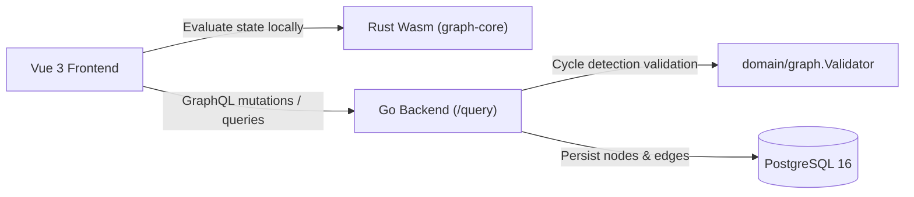
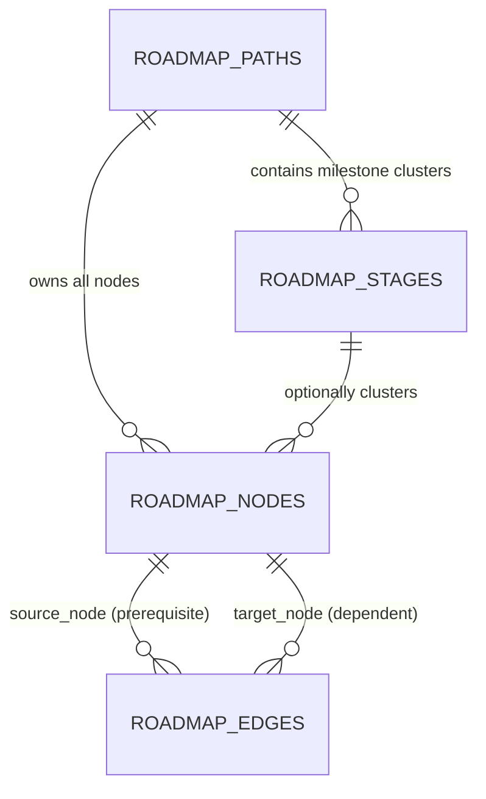
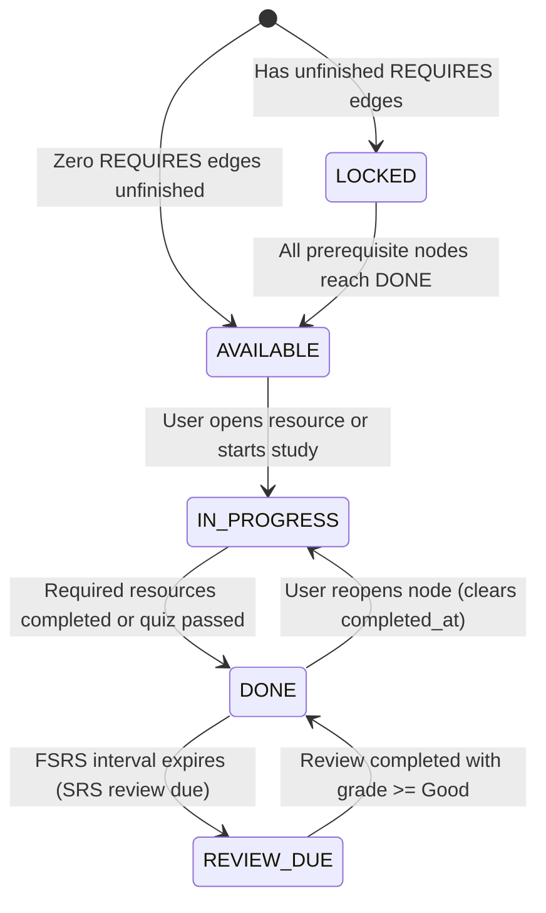

# 03. Requirements — Knowledge Graph DAG & Dependency Engine

> **Navigation:** [← Requirements Index](README.md)
>
> _Status: Draft for Review — Architectural requirements for transitioning the roadmap curriculum from a linear hierarchy to a Directed Acyclic Graph (DAG) with stage clustering and topological unlock rules._

The Knowledge Graph DAG & Dependency Engine delivers a non-linear, prerequisite-driven learning path architecture. It transforms the curriculum from a rigid single-track list into a flexible knowledge graph where topics can branch into elective tracks, require prerequisites across stages, and dynamically evaluate learner unlock states using topological graph resolution.

## 1. Goals

1. **Non-Linear Prerequisite Modeling** — Support directed prerequisite and recommendation dependencies between learning nodes across and within stages.
2. **Cycle-Free Integrity Enforcement** — Reject circular dependencies at ingestion time via cycle detection algorithms before persisting to PostgreSQL.
3. **Sub-Millisecond Client Resolution via Rust Wasm** — Offload real-time graph traversal, Kahn's topological sort, and unlock calculations to a Rust WebAssembly crate in the browser.
4. **Backward Compatibility with Linear Stages** — Preserve `roadmap_stages` as milestone cluster boundaries and map biomes while decoupling node unlocking from strict linear array indices.

## 2. Scope

### 2.1 In-scope

- Storage and retrieval of directed edges (`requires`, `recommends`, `branches_to`, `relates_to`) in PostgreSQL.
- Server-side validation rejecting self-loops and circular dependency chains (DFS cycle detection).
- Dynamic node state resolution: `LOCKED`, `AVAILABLE` (UNLOCKED), `IN_PROGRESS`, `DONE`, `REVIEW_DUE`.
- Rust Wasm core crate (`crates/graph-core`) exposing topological sorting and dependency evaluation to the Vue 3 frontend.
- Batch GraphQL queries for graph nodes and edges with dataloader optimization.

### 2.2 Out-of-scope (explicit)

- **Force-directed physics simulation and GPU rendering** — Owned by `06-webgpu-wasm-canvas.md`.
- **Resource content tracking inside nodes** — Owned by `04-multimodal-resources.md`.
- **Multi-user collaborative graph editing** — The application remains strictly single-user local-first.

## 3. Glossary / Terminology

| Term | Definition |
| --- | --- |
| **Knowledge Node** | Atomic, measurable learning unit (`roadmap_nodes`), superseding linear topics. |
| **Milestone Cluster** | Logical stage container (`roadmap_stages`) grouping related nodes without forcing linear sequence. |
| **Dependency Edge** | Directed relation (`roadmap_edges`) pointing from `source_node_id` to `target_node_id`. |
| **`REQUIRES`** | Hard prerequisite: target node remains `LOCKED` until source node is `DONE`. |
| **`RECOMMENDS`** | Soft prerequisite: suggested path, does not block unlocking target node. |
| **`BRANCHES_TO`** | Elective choice: path splits into alternative specialization tracks. |
| **Topological Sort** | Linear ordering of vertices such that for every directed edge $u \to v$, $u$ comes before $v$. |

## 4. Architecture & Data Model





| Entity | Table | Purpose |
| --- | --- | --- |
| `Node` | `roadmap_nodes` | Learning topic nodes with estimated study duration and manual/auto coordinates |
| `Edge` | `roadmap_edges` | Directed relationship links with dependency semantics and unlock rules |

### 4.1 `roadmap_nodes` columns

| Column | Type | Nullable | Default | Notes |
| --- | --- | --- | --- | --- |
| `id` | `BIGSERIAL` | No | Auto | Primary key |
| `guid` | `TEXT` | No | `''` | UUID for offline LWW sync |
| `path_id` | `BIGINT` | No | — | Foreign key `roadmap_paths(id) ON DELETE CASCADE` |
| `stage_id` | `BIGINT` | Yes | `NULL` | Foreign key `roadmap_stages(id) ON DELETE SET NULL` |
| `slug` | `TEXT` | No | — | Slug identifier within path |
| `title` | `TEXT` | No | — | Human-readable node title |
| `description`| `TEXT` | No | `''` | Summary of learning objectives |
| `status` | `TEXT` | No | `'not_started'` | Check: `not_started, in_progress, done, skipped` |
| `status_note`| `TEXT` | No | `''` | User reflections or review notes |
| `estimated_minutes` | `INTEGER` | No | `30` | Estimated study time |
| `is_optional` | `INTEGER` | No | `0` | Excluded from mandatory progress denominator |
| `map_x`, `map_y` | `REAL` | Yes | `NULL` | Coordinates for visual layouts |
| `completed_at` | `TEXT` | Yes | `NULL` | RFC3339 timestamp when marked done |

### 4.2 `roadmap_edges` columns

| Column | Type | Nullable | Default | Notes |
| --- | --- | --- | --- | --- |
| `id` | `BIGSERIAL` | No | Auto | Primary key |
| `guid` | `TEXT` | No | `''` | UUID for offline LWW sync |
| `path_id` | `BIGINT` | No | — | Foreign key `roadmap_paths(id) ON DELETE CASCADE` |
| `source_node_id` | `BIGINT` | No | — | Foreign key `roadmap_nodes(id) ON DELETE CASCADE` |
| `target_node_id` | `BIGINT` | No | — | Foreign key `roadmap_nodes(id) ON DELETE CASCADE` |
| `edge_type` | `TEXT` | No | `'requires'` | Check: `requires, recommends, branches_to, relates_to` |
| `condition_rule`| `TEXT` | No | `''` | Optional gate rule (e.g. `quiz_score >= 80`) |

Indexes & constraints:
- `ux_roadmap_nodes_path_slug` (`path_id`, `slug`) — Unique slug per path.
- `ux_roadmap_edges_nodes` (`source_node_id`, `target_node_id`, `edge_type`) — Prevents duplicate edges.
- `ck_no_self_loop` (`CHECK (source_node_id <> target_node_id)`) — Blocks immediate self-loops.
- `idx_roadmap_edges_target` (`target_node_id`) `WHERE deleted = 0` — Accelerates prerequisite lookups.
- `idx_roadmap_edges_source` (`source_node_id`) `WHERE deleted = 0` — Accelerates dependent unlock cascades.

## 5. Domain Behavior & Cycle Detection

1. **Cycle Prevention on Edge Insertion:**
   - Before inserting edge $(u, v)$, the backend executes a Depth-First Search (DFS) from $v$ to $u$.
   - If a path from $v$ to $u$ already exists, inserting $(u, v)$ would introduce a cycle. The transaction is aborted with code `GRAPH_CYCLE_DETECTED` (HTTP 422).
2. **Topological Level Ordering:**
   - The Go domain package `internal/domain/graph` computes topological generations (layers) using Kahn's algorithm to calculate layout columns and unlock hierarchies.
3. **Transitive Reduction (Display Optimization):**
   - Redundant transitive edges (e.g. $A \to B, B \to C, A \to C$) are preserved in persistence for explicit rules but collapsed during rendering to prevent visual clutter.

## 6. State Machine



| State | Meaning |
| --- | --- |
| `LOCKED` | Prerequisite condition unmet; at least one incoming `REQUIRES` edge source is not `DONE`. |
| `AVAILABLE` | Unlocked and ready to begin; all incoming `REQUIRES` prerequisites are `DONE`. |
| `IN_PROGRESS` | Currently active; study has commenced on node resources. |
| `DONE` | Completed lesson; sets `completed_at` timestamp. |
| `REVIEW_DUE` | Memory retention threshold reached according to FSRS; review recommended. |

## 7. Operation Specification

| Operation | Behavior |
| --- | --- |
| `createEdge(pathId, input)` | Validates cycle absence, persists edge, recalculates downstream unlock states. |
| `deleteEdge(id)` | Removes edge, re-evaluates downstream node unlock availability. |
| `setNodeStatus(id, input)` | Updates status, touches `completed_at`, triggers reactive unlock evaluation. |
| `evaluateGraphState(pathSlug)` | Evaluates full DAG state and returns topological order and active levels. |

- **Preconditions** — Source and target nodes must belong to the same path; no cycle induced.
- **Effects** — Edge created, `updated_at` timestamps updated via PostgreSQL trigger.
- **Errors** — `GRAPH_CYCLE_DETECTED`, `NODE_NOT_FOUND`, `DUPLICATE_EDGE`.
- **Concurrency** — Handled inside `txtx` Unit of Work with row-level locks on path version.

## 8. API Contract

### 8.1 Endpoints (GraphQL)

| Field | Type | Description | Status |
| --- | --- | --- | --- |
| `pathGraph(slug: String!)` | Query | Full graph payload including nodes, edges, and unlock states | New |
| `createEdge(input: EdgeInput!)` | Mutation | Adds a directed prerequisite or relation edge | New |
| `deleteEdge(id: ID!)` | Mutation | Soft-deletes a dependency edge | New |
| `batchUpdateNodePositions(input: [NodePositionInput!]!)` | Mutation | Updates coordinates for multiple nodes | New |

### 8.2 GraphQL Types

```graphql
enum EdgeType {
  REQUIRES
  RECOMMENDS
  BRANCHES_TO
  RELATES_TO
}

type NodeEdge {
  id: ID!
  guid: String!
  sourceNodeId: ID!
  targetNodeId: ID!
  edgeType: EdgeType!
  conditionRule: String
}

type KnowledgeNode {
  id: ID!
  guid: String!
  pathId: ID!
  stageId: ID
  slug: String!
  title: String!
  description: String!
  status: Status!
  levelState: LevelState!
  estimatedMinutes: Int!
  isOptional: Boolean!
  mapPoint: MapPoint!
  prerequisites: [NodeEdge!]!
  dependents: [NodeEdge!]!
}

type PathGraphPayload {
  path: Path!
  nodes: [KnowledgeNode!]!
  edges: [NodeEdge!]!
  topologicalOrder: [ID!]!
}
```

### 8.3 Error Catalog

| `code` | HTTP | When |
| --- | --- | --- |
| `GRAPH_CYCLE_DETECTED` | 422 | Attempting to add an edge that would create a directed loop. |
| `CROSS_PATH_EDGE_FORBIDDEN` | 400 | Source and target nodes belong to distinct paths. |
| `DUPLICATE_EDGE` | 409 | Edge with identical source, target, and edge_type already exists. |

## 9. Permissions & Security

- **Single-User Scope** — Operations are restricted to local web access.
- **Data Integrity** — Built-in seeded paths allow user customization but retain built-in identifiers for clean resets.

## 10. Audit

- Edge creations and deletions record `created_at` / `updated_at` UTC timestamps.
- Soft-deletion via `deleted = 1` retains tombstone records for offline peer synchronization.

## 11. Non-functional

| Group | Requirement |
| --- | --- |
| Performance | Local Rust Wasm graph resolution completes in $< 2\text{ms}$ for graphs up to 2,000 nodes. |
| Cycle Detection | Backend DFS cycle check terminates in $< 15\text{ms}$ on PostgreSQL transaction commit. |
| Concurrency | Atomic edge creation within `txtx` Unit of Work prevents race-condition circularity. |

## 12. Acceptance Criteria

1. Creating an edge $C \to A$ when $A \to B$ and $B \to C$ exist returns error `GRAPH_CYCLE_DETECTED` and leaves DB untouched.
2. A node with incoming `REQUIRES` edge from Node A automatically shifts from `LOCKED` to `AVAILABLE` the moment Node A status becomes `DONE`.
3. Rust Wasm crate correctly calculates topological ordering identical to backend Kahn's algorithm outputs.
4. Legacy paths without explicit edges continue rendering using stage sequence positions without breaking.

## 13. Testing Mandates

- **Unit:**
  - `api/internal/domain/graph/cycle_test.go`: Validates DFS cycle detection against diamond, tree, and loop graphs.
  - `crates/graph-core/tests/topo_test.rs`: Validates Rust Kahn's algorithm and unlock evaluator.
- **Integration:**
  - `api/internal/infrastructure/graph/repository_test.go`: Validates PostgreSQL edge persistence, cascade deletes, and unique constraints.
  - `api/internal/transport/graphql/graph_resolver_test.go`: Validates GraphQL edge creation and error serialization.

## 14. CLI / Operations requirements

None.

## 15. References

- Data model blueprint: [roadmap_evolution_blueprint.md](file:///home/hung1/.gemini/antigravity-ide/brain/5aa4a5b2-668b-4ae4-a895-63c353280a0f/roadmap_evolution_blueprint.md)
- Existing linear map specification: [01-roadmap-map.md](01-roadmap-map.md)
- Rust petgraph library: `https://docs.rs/petgraph/latest/petgraph/`
