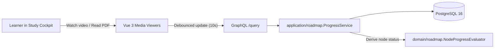
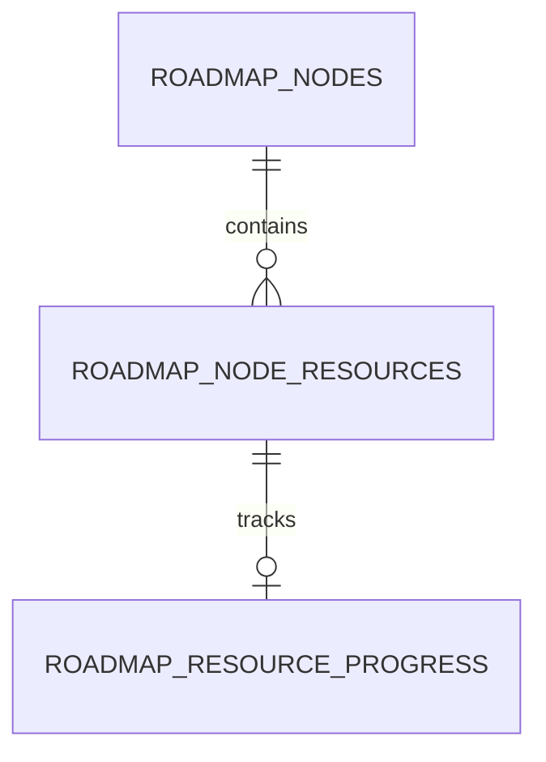
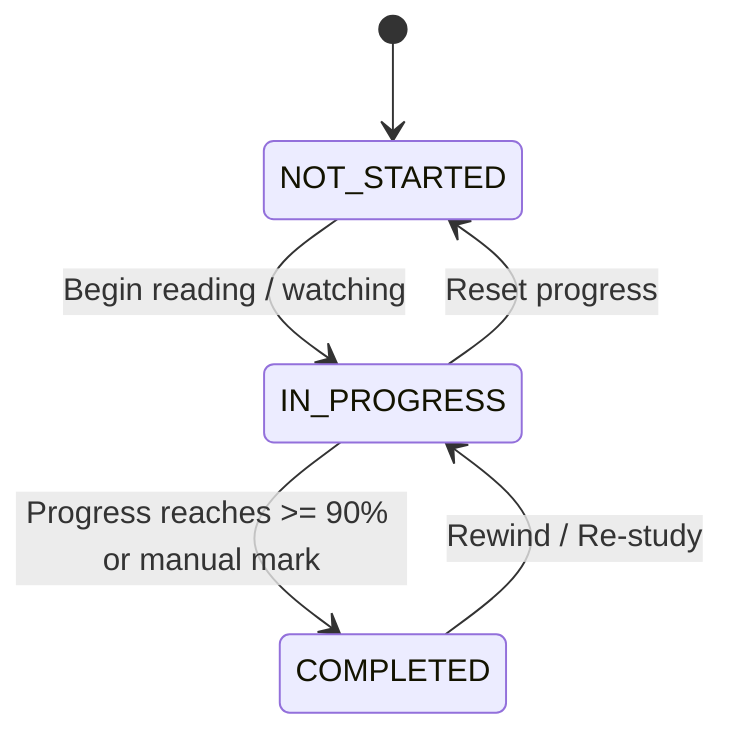

# 04. Requirements — Multi-Modal Resource Center & Granular Progress Tracking

> **Navigation:** [← Requirements Index](README.md)
>
> _Status: Draft for Review — Implementation requirements for multi-modal learning resources and granular progress tracking._

The Multi-Modal Resource Center equips each knowledge node with diverse, interactive learning media—including embedded video players with timestamp bookmarks, local/cloud PDF readers with page-level tracking, rich Markdown notebooks, code repositories, and direct flashcard review links. It enables learners to track granular engagement metrics (reading percentages, playback progress, time spent) and derives node-level completion automatically.

## 1. Goals

1. **Multi-Modal Learning Support** — Support 7 distinct resource modalities (`url`, `video`, `pdf`, `markdown`, `code_repo`, `quiz`, `srs_deck`) within knowledge nodes.
2. **Persistent Position Tracking** — Automatically store playback timestamps for video/audio and last read page numbers for PDF documents.
3. **Derived Node Completion** — Calculate node progress dynamically as a weighted sum of mandatory resource completion without forcing manual status toggling.
4. **Contextual Timestamp Note-Taking** — Allow learners to take timestamped notes linked to specific seconds of video/audio or pages of PDFs.

## 2. Scope

### 2.1 In-scope

- Storage and retrieval of heterogeneous resources in `roadmap_node_resources`.
- Independent tracking records in `roadmap_resource_progress` (progress percent, current position, page, time spent).
- Vue 3 Study Cockpit split-view components:
  - Video player with bookmark list and $1.25\times / 1.5\times$ speed controls.
  - PDF reader with page navigation and zoom via `pdfjs-dist`.
  - Markdown note editor with KaTeX math and syntax-highlighted code blocks.
- Real-time debounced progress updates over GraphQL mutation.

### 2.2 Out-of-scope (explicit)

- **Vector chunking and AI semantic embeddings** — Owned by `05-openai-ai-agent.md`.
- **Topological dependency resolution between nodes** — Owned by `03-knowledge-graph-dag.md`.
- **Cloud file storage hosting** — Local filesystem paths or external URLs only.

## 3. Glossary / Terminology

| Term | Definition |
| --- | --- |
| **Node Resource** | Individual study material item attached to a knowledge node (`roadmap_node_resources`). |
| **Progress Record** | Row in `roadmap_resource_progress` recording user interaction state and completion percentage. |
| **Timestamp Bookmark** | Note or milestone tied to an exact second ($mm:ss$) of a video or audio resource. |
| **Mandatory Resource** | Resource with `is_required = 1`, included in node completion formula. |
| **Study Cockpit** | Fullscreen or split-pane workspace designed for focused study without canvas navigation distraction. |

## 4. Architecture & Data Model





| Entity | Table | Purpose |
| --- | --- | --- |
| `NodeResource` | `roadmap_node_resources` | Stores metadata, URI, payload, and type for study materials |
| `ResourceProgress` | `roadmap_resource_progress` | Tracks reading progress, timestamps, page numbers, and status |

### 4.1 `roadmap_node_resources` columns

| Column | Type | Nullable | Default | Notes |
| --- | --- | --- | --- | --- |
| `id` | `BIGSERIAL` | No | Auto | Primary key |
| `guid` | `TEXT` | No | `''` | Sync identifier |
| `node_id` | `BIGINT` | No | — | Foreign key `roadmap_nodes(id) ON DELETE CASCADE` |
| `title` | `TEXT` | No | — | Display title |
| `resource_type` | `TEXT` | No | `'url'` | Check: `url, video, pdf, markdown, code_repo, quiz, srs_deck` |
| `uri` | `TEXT` | Yes | `NULL` | External link or relative file path |
| `content_payload`| `TEXT` | Yes | `NULL` | Raw Markdown or JSON configuration |
| `metadata` | `JSONB` | No | `'{}'` | Type-specific metadata (duration, total pages, author) |
| `is_required` | `INTEGER` | No | `1` | 1 = mandatory, 0 = optional enrichment |
| `position` | `INTEGER` | No | `0` | Sequence within node |

### 4.2 `roadmap_resource_progress` columns

| Column | Type | Nullable | Default | Notes |
| --- | --- | --- | --- | --- |
| `id` | `BIGSERIAL` | No | Auto | Primary key |
| `guid` | `TEXT` | No | `''` | Sync identifier |
| `resource_id` | `BIGINT` | No | — | Unique foreign key `roadmap_node_resources(id) ON DELETE CASCADE` |
| `status` | `TEXT` | No | `'not_started'`| Check: `not_started, in_progress, completed` |
| `progress_percent`| `REAL` | No | `0.0` | Value between 0.0 and 100.0 |
| `current_position_seconds` | `INTEGER` | No | `0` | Playback position for video/audio |
| `current_page` | `INTEGER` | No | `0` | Active page index for PDF documents |
| `time_spent_seconds` | `INTEGER` | No | `0` | Cumulative study duration |
| `completed_at` | `TEXT` | Yes | `NULL` | Timestamp when reaching completion |

Indexes & constraints:
- `ux_resource_progress_resource` (`resource_id`) — 1-to-1 relationship guarantee.
- `idx_node_resources_node` (`node_id`, `position`) `WHERE deleted = 0` — Ordered material fetching.

## 5. Domain Behavior: Completion Calculation

1. **Auto-Completion Criteria:**
   - **Video:** Reaching $\ge 90\%$ playback or manual check sets status to `completed`.
   - **PDF:** Reaching page $\ge \text{total\_pages} - 1$ sets status to `completed`.
   - **Markdown / URL / Code:** Manual toggle or reading timer ($> 180\text{s}$) marks `completed`.
2. **Node-Level Progress Derivation:**
   $$\text{Node Completion} = \frac{\sum_{i \in \text{Required}} \text{ProgressPercent}_i}{|\text{Required Resources}|}$$
   - When all required resources reach `completed` ($\text{Node Completion} = 100\%$), the node automatically transitions to `DONE`.

## 6. State Machine



## 7. Operation Specification

| Operation | Behavior |
| --- | --- |
| `updateResourceProgress(id, input)` | Updates position, increments time spent, re-evaluates node completion. |
| `attachResource(nodeId, input)` | Adds material to node, creates initial progress row. |
| `reorderResources(nodeId, ids)` | Updates display order of resources within node. |

- **Preconditions** — Resource must exist and not be soft-deleted.
- **Effects** — Touches `updated_at`, emits update payload for UI reactivity.
- **Concurrency** — Last-Write-Wins (LWW) conflict handling.

## 8. API Contract

### 8.1 GraphQL Schema

```graphql
enum ResourceType {
  URL
  VIDEO
  PDF
  MARKDOWN
  CODE_REPO
  QUIZ
  SRS_DECK
}

input UpdateResourceProgressInput {
  resourceId: ID!
  progressPercent: Float!
  currentPositionSeconds: Int
  currentPage: Int
  additionalSecondsSpent: Int
}

type NodeResource {
  id: ID!
  nodeId: ID!
  title: String!
  resourceType: ResourceType!
  uri: String
  contentPayload: String
  metadataJson: String!
  isRequired: Boolean!
  position: Int!
  progress: ResourceProgress
}

type ResourceProgress {
  id: ID!
  status: Status!
  progressPercent: Float!
  currentPositionSeconds: Int!
  currentPage: Int!
  timeSpentSeconds: Int!
  completedAt: String
}

type Mutation {
  updateResourceProgress(input: UpdateResourceProgressInput!): ResourceProgress!
  createNodeResource(nodeId: ID!, input: ResourceInput!): NodeResource!
  deleteNodeResource(id: ID!): Boolean!
}
```

### 8.2 Error Catalog

| `code` | HTTP | When |
| --- | --- | --- |
| `RESOURCE_NOT_FOUND` | 404 | Target resource does not exist. |
| `INVALID_PROGRESS_VALUE` | 400 | `progressPercent` $< 0.0$ or $> 100.0$. |
| `UNSUPPORTED_MEDIA_TYPE` | 415 | Uploaded or referenced document format unsupported. |

## 9. Permissions & Security

- Local-first single user; no remote write privilege required.
- File system paths for local PDFs and media are validated against workspace sandbox roots to prevent directory traversal.

## 10. Audit

- Every progress update touches `updated_at` for synchronization delta calculation.

## 11. Non-functional

| Group | Requirement |
| --- | --- |
| Debounce | Client debounces progress mutations to at most one request every 5 seconds during active video playback. |
| Storage | Embedded Markdown content supports up to 2MB text payloads per resource. |
| PDF Performance | PDF reader initializes first page rendering within $< 500\text{ms}$. |

## 12. Acceptance Criteria

1. Resuming a video resource loads playback from `current_position_seconds` stored in the database.
2. Opening a PDF resource jumps directly to `current_page`.
3. When all mandatory resources of a node are marked completed, the parent node status automatically transitions to `DONE`.
4. Updating progress for one resource does not trigger duplicate SQL re-queries for sibling resources.

## 13. Testing Mandates

- **Unit:** `api/internal/domain/roadmap/progress_test.go` verifies node percentage math and mandatory filtering.
- **Integration:** `api/internal/infrastructure/roadmap/resource_repo_test.go` verifies progress upsert and cascade deletion.
- **Frontend Component Tests:** `web/src/roadmap/study/PdfViewer.test.ts` and `VideoPlayer.test.ts` test debounce and state persistence.

## 14. CLI / Operations requirements

None.

## 15. References

- Existing resource schema: [api/graph/schema/roadmap.graphqls](file:///home/hung1/personal/roadmap-learning/api/graph/schema/roadmap.graphqls#L103-L115)
- Blueprint design: [roadmap_evolution_blueprint.md](file:///home/hung1/.gemini/antigravity-ide/brain/5aa4a5b2-668b-4ae4-a895-63c353280a0f/roadmap_evolution_blueprint.md#L45-L65)
