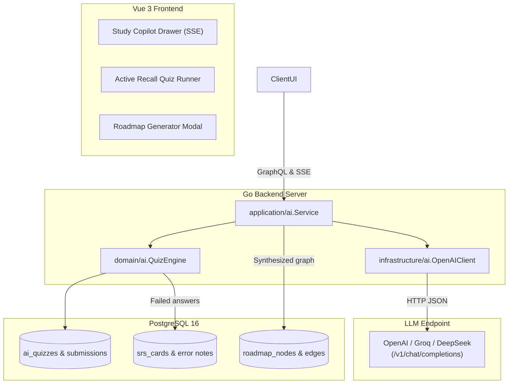
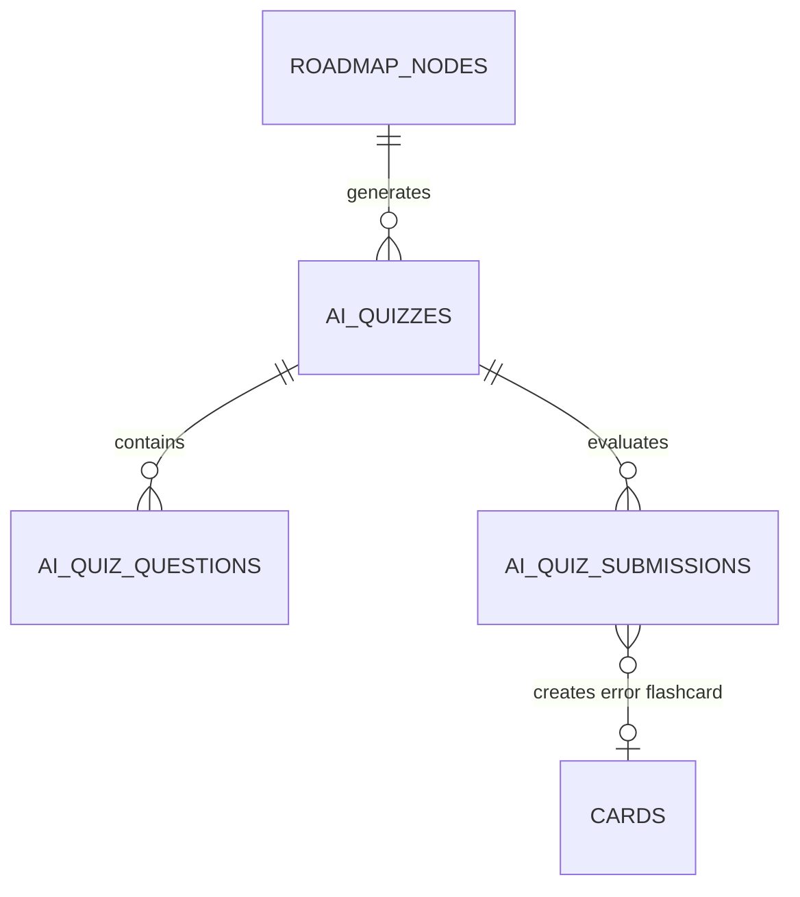
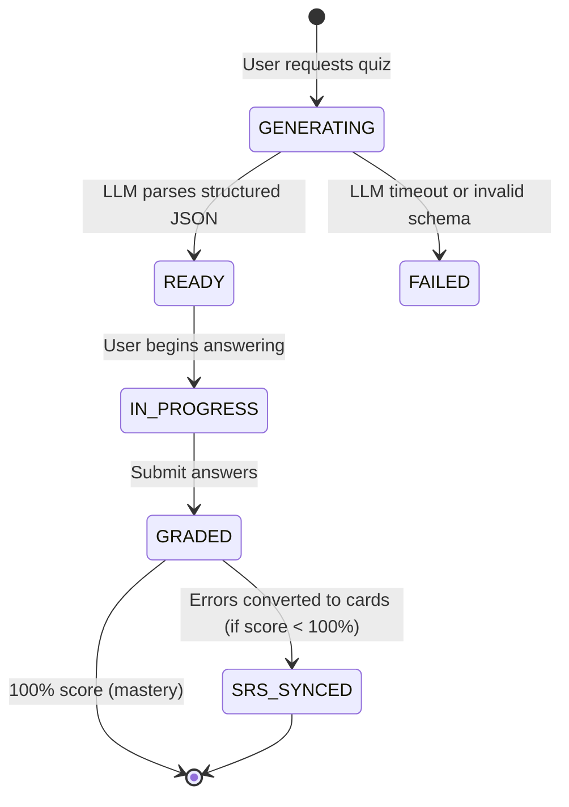

# 05. Requirements — OpenAI-Compatible AI Agent Gateway, Quiz & Copilot

> **Navigation:** [← Requirements Index](README.md)
>
> _Status: Draft for Review — Implementation requirements for the OpenAI-compatible AI Agent subsystem, roadmap generation, active recall quiz engine, and interactive learning copilot._

The AI Agent subsystem integrates modern Large Language Models into the learning workflow using an OpenAI-compatible API Gateway. It automates curriculum synthesis from user learning goals, generates active recall quizzes tailored to topic resources with automatic FSRS Error Book synchronization, and delivers a contextual Socratic learning copilot inside the study cockpit.

## 1. Goals

1. **Provider-Agnostic LLM Gateway** — Communicate with any OpenAI-compatible provider (OpenAI, Groq, DeepSeek, OpenRouter, Gemini) via standardized `/v1/chat/completions`.
2. **Automated Graph Curriculum Synthesis** — Generate structured, cycle-free knowledge graphs (nodes, stages, prerequisite edges, resources) from natural language user prompts.
3. **Active Recall Quiz Generation & SRS Bridge** — Synthesize conceptual and scenario quizzes from topic materials and automatically convert incorrect answers into FSRS flashcards in the Error Book.
4. **Streaming Socratic Copilot** — Provide a real-time Server-Sent Events (SSE) AI tutor scoped strictly to current node resources and user study notes.

## 2. Scope

### 2.1 In-scope

- Go backend infrastructure package `internal/infrastructure/ai/client.go` implementing OpenAI wire format.
- Configuration parameters (`AI_BASE_URL`, `AI_API_KEY`, `AI_MODEL`, `AI_TIMEOUT`).
- JSON Schema Structured Outputs enforcement for roadmap generation and quiz parsing.
- Streaming SSE endpoint `/api/ai/copilot/stream` for conversational tutoring.
- Bridge service converting quiz mistakes into `notes` prefixed with `ERR|` and linked to `cards` in SRS.

### 2.2 Out-of-scope (explicit)

- **Local GPU model hosting** — The Go backend acts as an API client, not an inference engine.
- **Full-scale web crawling** — AI recommends known high-quality resources without live internet scraping.
- **Speech recognition / synthesis** — Managed independently by the gRPC Audio sidecar (`02-audio-pipeline.md`).

## 3. Glossary / Terminology

| Term | Definition |
| --- | --- |
| **OpenAI-Compatible Gateway** | HTTP client connecting to endpoints conforming to the `/v1/chat/completions` REST specification. |
| **Curriculum Synthesizer** | AI agent prompt pipeline producing a valid JSON DAG with stages, nodes, and prerequisite edges. |
| **Active Recall Quiz** | Conceptual multiple-choice or short-answer assessment testing core learning objectives. |
| **Socratic Copilot** | AI tutor guiding learners through questions, analogies, and hints rather than directly giving answers. |
| **Error Book Bridge** | Domain handler that captures incorrect quiz answers and creates spaced repetition flashcards for targeted review. |

## 4. Architecture & Data Model





| Entity | Table | Purpose |
| --- | --- | --- |
| `AiQuiz` | `ai_quizzes` | Quiz instance generated for a knowledge node |
| `AiQuizQuestion` | `ai_quiz_questions` | Individual question with options, explanation, and answer key |
| `AiQuizSubmission` | `ai_quiz_submissions` | User answer log, score, and error diagnosis |

### 4.1 `ai_quizzes` & `ai_quiz_questions` schema

```sql
CREATE TABLE IF NOT EXISTS ai_quizzes (
    id BIGSERIAL PRIMARY KEY,
    guid TEXT NOT NULL UNIQUE DEFAULT '',
    node_id BIGINT NOT NULL REFERENCES roadmap_nodes(id) ON DELETE CASCADE,
    title TEXT NOT NULL,
    total_questions INTEGER NOT NULL DEFAULT 3,
    created_at TEXT NOT NULL,
    updated_at TEXT NOT NULL DEFAULT '',
    deleted INTEGER NOT NULL DEFAULT 0
);

CREATE TABLE IF NOT EXISTS ai_quiz_questions (
    id BIGSERIAL PRIMARY KEY,
    quiz_id BIGINT NOT NULL REFERENCES ai_quizzes(id) ON DELETE CASCADE,
    question TEXT NOT NULL,
    question_type TEXT NOT NULL DEFAULT 'mcq', -- 'mcq' | 'scenario'
    options JSONB NOT NULL DEFAULT '[]'::jsonb,
    correct_answer TEXT NOT NULL,
    explanation TEXT NOT NULL,
    created_at TEXT NOT NULL
);

CREATE TABLE IF NOT EXISTS ai_quiz_submissions (
    id BIGSERIAL PRIMARY KEY,
    quiz_id BIGINT NOT NULL REFERENCES ai_quizzes(id) ON DELETE CASCADE,
    answers JSONB NOT NULL,
    score REAL NOT NULL,
    feedback TEXT NOT NULL,
    error_card_id BIGINT REFERENCES cards(id) ON DELETE SET NULL,
    created_at TEXT NOT NULL
);
```

## 5. Domain Behavior: Structured Output & Error Book Bridge

1. **Structured Output Invariant:**
   - LLM requests for roadmap synthesis enforce strict JSON Schema formatting via `"response_format": { "type": "json_object" }`.
   - The Go backend decodes into a typed intermediate structure and executes graph cycle detection (`03-knowledge-graph-dag.md`) before inserting rows into PostgreSQL.
2. **Error Book Auto-Sync:**
   - When a quiz submission has $\text{score} < 100\%$:
     - For each incorrect question, the system formats an error record:
       - Front: `[Quiz Mistake] <Question Title>`
       - Back: `<Correct Answer>\n\nExplanation: <Explanation>`
     - Inserts a new card into the active stage's linked SRS deck with default FSRS parameters.
     - Adds a note `ERR|<quiz_id>|<question_id>` in `notes` for insight frequency tracking.

## 6. State Machine



## 7. Operation Specification

| Operation | Behavior |
| --- | --- |
| `generateRoadmap(input)` | Queries LLM with prompt, validates DAG, creates path, stages, nodes, and edges. |
| `generateNodeQuiz(nodeId)` | Analyzes node materials, generates 3–5 targeted questions. |
| `submitQuiz(quizId, answers)` | Evaluates answers, records score, creates FSRS flashcards for misses. |
| `streamCopilotChat(nodeId, prompt)` | Opens SSE connection streaming real-time tokens from LLM. |

## 8. API Contract

### 8.1 REST Endpoints

| Method | Path | Description |
| --- | --- | --- |
| `POST` | `/api/ai/copilot/stream` | Server-Sent Events stream for Socratic chat tutoring |

### 8.2 GraphQL Schema

```graphql
input GenerateRoadmapInput {
  domain: String!
  goalDescription: String!
  currentSkillLevel: String!
  weeklyHoursBudget: Int!
}

input QuizAnswerInput {
  questionId: ID!
  selectedAnswer: String!
}

type QuizQuestion {
  id: ID!
  question: String!
  questionType: String!
  options: [String!]!
  explanation: String!
}

type QuizEvaluationResult {
  score: Float!
  totalQuestions: Int!
  correctCount: Int!
  feedback: String!
  createdCardIds: [ID!]!
}

type Mutation {
  generateRoadmapWithAI(input: GenerateRoadmapInput!): PathGraphPayload!
  generateNodeQuiz(nodeId: ID!): [QuizQuestion!]!
  submitNodeQuiz(quizId: ID!, answers: [QuizAnswerInput!]!): QuizEvaluationResult!
}
```

### 8.3 Error Catalog

| `code` | HTTP | When |
| --- | --- | --- |
| `AI_UPSTREAM_ERROR` | 502 | LLM API returns non-200 or gateway timeout. |
| `AI_SCHEMA_DECODE_FAILED` | 422 | LLM output failed JSON validation after 2 retry attempts. |
| `AI_API_KEY_MISSING` | 503 | `AI_API_KEY` is not configured in environment. |

## 9. Permissions & Security

- **Zero Remote Leakage:** Only learning objectives, titles, and material excerpts are passed to the LLM API; no personal account data or credentials are submitted.
- **Fail-Closed Safety:** If `AI_API_KEY` is unset or invalid, the app returns a clean `503 Service Unavailable` without crashing the core learning experience.

## 10. Audit

- Quiz generation and submission events record timestamps and token counts in application logs.

## 11. Non-functional

| Group | Requirement |
| --- | --- |
| Latency | First token of SSE Copilot stream arrives within $< 1,200\text{ms}$ on fast endpoints (Groq / OpenAI). |
| Resilience | Retry up to 2 times with exponential backoff on HTTP 429 (Rate Limit) or 503 from provider. |
| Configuration | Dynamic model selection via `AI_MODEL` environment variable. |

## 12. Acceptance Criteria

1. Configuring `AI_BASE_URL=https://api.groq.com/openai/v1` and `AI_MODEL=llama-3.3-70b-versatile` successfully generates roadmaps.
2. Submitting a quiz with 2 incorrect answers generates exactly 2 new flashcards in the linked SRS deck.
3. Copilot stream terminates gracefully with `event: done` and closes HTTP connection without resource leaks.

## 13. Testing Mandates

- **Unit:**
  - `api/internal/infrastructure/ai/client_test.go`: Mocks OpenAI HTTP server; validates headers, timeout, and JSON decoding.
  - `api/internal/domain/ai/quiz_grader_test.go`: Validates scoring math and Error Book card mapping.
- **Integration:**
  - `api/internal/application/ai/service_test.go`: End-to-end quiz generation with mock LLM server.

## 14. CLI / Operations requirements

None.

## 15. References

- OpenAI Chat Completions API Spec: `https://platform.openai.com/docs/api-reference/chat`
- Spaced Repetition Requirements: [docs/features/srs.md](file:///home/hung1/personal/roadmap-learning/docs/features/srs.md)
- Architecture Blueprint: [roadmap_evolution_blueprint.md](file:///home/hung1/.gemini/antigravity-ide/brain/5aa4a5b2-668b-4ae4-a895-63c353280a0f/roadmap_evolution_blueprint.md#L111-L140)
