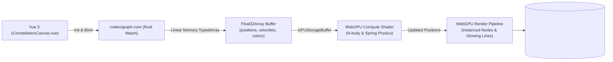
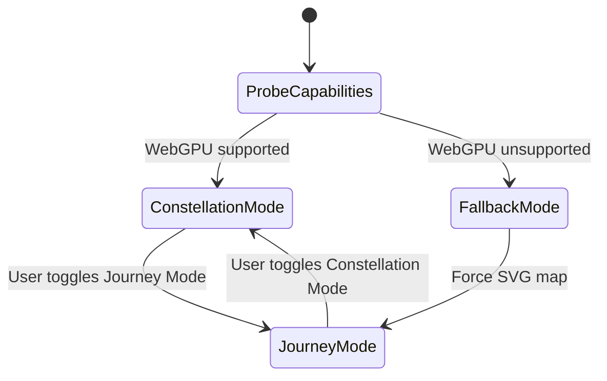

# 06. Requirements — High-Performance WebGPU & Wasm Graph Canvas

> **Navigation:** [← Requirements Index](README.md)
>
> _Status: Draft for Review — Implementation requirements for the client-side WebGPU acceleration pipeline, Rust WebAssembly graph engine, and dual-canvas visualization._

The WebGPU & Wasm Graph Canvas delivers a high-performance, responsive visual environment for exploring large-scale knowledge graphs. By pairing a Rust WebAssembly crate (`crates/graph-core`) for zero-cost topological memory management with GPU-accelerated WGSL compute and render pipelines, the system achieves 60–120 FPS force-directed graph layouts for thousands of interconnected nodes while offering smooth transitions between the gamified Journey Map and the interactive Constellation Graph.

## 1. Goals

1. **Native-Grade 60–120 FPS Graph Rendering** — Render and animate complex knowledge graphs with over 1,000 nodes and 3,000 edges without frame drops.
2. **GPU-Accelerated Force Simulation** — Execute $O(N^2)$ N-body Coulomb repulsive and Hooke spring forces entirely within WGSL compute shaders.
3. **Zero-GC Rust WebAssembly Engine** — Perform graph cycle checks, topological sorting, and dependency resolution in Rust (`petgraph`) without garbage collection pauses.
4. **Dual-Mode Canvas Exploration** — Allow seamless switching between **Journey Mode** (gamified SVG biome map) and **Constellation Mode** (WebGPU interactive universe graph).
5. **Graceful Fallback** — Automatically degrade to Canvas 2D / SVG if the client browser or hardware lacks WebGPU support.

## 2. Scope

### 2.1 In-scope

- Rust WebAssembly crate `crates/graph-core` with `wasm-bindgen` bindings.
- WebGPU WGSL Compute Shader (`force_directed.wgsl`) for node position physics simulation.
- WebGPU WGSL Render Pipeline (`graph_render.wgsl`) with instanced circles, neon glow shaders, and Bézier curves.
- Viewport interaction: smooth zoom, pan, node selection, drag-to-pin, and camera focusing.
- Fallback detector (`navigator.gpu` presence probe).

### 2.2 Out-of-scope (explicit)

- **Backend GraphQL dataloading** — Owned by `03-knowledge-graph-dag.md`.
- **Media playback inside nodes** — Owned by `04-multimodal-resources.md`.

## 3. Glossary / Terminology

| Term | Definition |
| --- | --- |
| **Constellation Mode** | The WebGPU-based 2D/3D knowledge graph view rendering nodes as celestial bodies with glowing connection lines. |
| **Journey Mode** | The existing horizontal winding SVG landscape canvas featuring terrain biomes (`01-roadmap-map.md`). |
| **WGSL** | WebGPU Shading Language, the standard shading language used for WebGPU compute and render pipelines. |
| **Instanced Rendering** | Technique rendering thousands of identical node geometries in a single GPU draw call using per-instance buffer data. |
| **Zero-Copy Memory Buffer** | Direct mapping of Rust Wasm linear memory into typed `Float32Array` buffers bound to GPU storage buffers. |

## 4. Architecture & Data Model



## 5. Domain Behavior: Physics Simulation & Memory Layout

1. **Memory Layout Contract (`Float32Array`):**
   - Each node occupies 8 floats (32 bytes):
     - `offset 0..1`: Position ($x, y$)
     - `offset 2..3`: Velocity ($v_x, v_y$)
     - `offset 4..5`: Mass and Radius ($m, r$)
     - `offset 6`: State flag (0 = Locked, 1 = Available, 2 = InProgress, 3 = Done)
     - `offset 7`: Pinned flag (0 = Free physics, 1 = Pinned)
2. **WGSL Compute Shader Mechanics:**
   - **Workgroup Size:** 64 threads per workgroup.
   - **Coulomb Repulsion:** Repulsive force $F_r = \frac{k_r}{d^2}$ computed across node pairs using shared memory tiles.
   - **Hooke Attraction:** Spring attraction $F_s = k_s \times (d - d_0)$ evaluated for edge pairs.
   - **Euler Integration:** Positions update each frame with a damping factor of $0.90$.

## 6. State Machine



## 7. Operation Specification

| Operation | Behavior |
| --- | --- |
| `initGraphCanvas(canvasEl, graphData)` | Compiles WGSL shaders, loads Rust Wasm, initializes GPU buffers. |
| `stepSimulation(deltaTime)` | Dispatches compute shader pass to advance particle physics. |
| `renderFrame()` | Executes render pass drawing instanced nodes and Bezier lines. |
| `pinNode(nodeId, x, y)` | Sets pinned flag, fixing coordinates during user dragging. |
| `unpinNode(nodeId)` | Clears pinned flag, restoring free floating behavior. |

## 8. API Contract & Shaders

### 8.1 WGSL Compute Pipeline Excerpt

```wgsl
struct Node {
    pos: vec2<f32>,
    vel: vec2<f32>,
    params: vec2<f32>, // mass, radius
    state: f32,
    pinned: f32,
};

@group(0) @binding(0) var<storage, read_write> nodes: array<Node>;
@group(0) @binding(1) var<uniform> params: SimulationParams;

@compute @workgroup_size(64)
fn simulatePhysics(@builtin(global_invocation_id) id: vec3<u32>) {
    let index = id.x;
    if (index >= arrayLength(&nodes)) { return; }
    if (nodes[index].pinned > 0.5) { return; }

    var force = vec2<f32>(0.0, 0.0);
    // Repulsion loop over nodes...
    // Spring attraction loop over edges...
    
    nodes[index].vel = (nodes[index].vel + force * params.dt) * params.damping;
    nodes[index].pos += nodes[index].vel * params.dt;
}
```

## 9. Permissions & Security

- Client-side GPU computation only; no elevated permissions or native binaries required.
- Memory safety guaranteed by Rust borrow checker in Wasm compilation.

## 10. Audit

None.

## 11. Non-functional

| Group | Requirement |
| --- | --- |
| Frame Rate | Maintain $\ge 60\text{ FPS}$ on hardware with integrated GPU (Intel Iris Xe / Apple M1) with 1,000 nodes. |
| Binary Size | Rust WebAssembly module size $\le 150\text{KB}$ after `wasm-opt -Oz`. |
| Initialization | WebGPU pipeline initialization and first frame render in $< 150\text{ms}$. |

## 12. Acceptance Criteria

1. On browsers supporting WebGPU (Chrome 113+, Edge 113+, Firefox Nightly), navigating to Constellation view renders interactive glowing nodes without WebGL warnings.
2. Dragging a node calculates real-time spring tension across connected edges smoothly.
3. If WebGPU is unsupported, the UI displays a clean banner and renders the standard SVG Journey map without crashing.

## 13. Testing Mandates

- **Rust Crate Tests:** `crates/graph-core/tests/memory_layout_test.rs` validates node byte alignment and struct packing.
- **Frontend Unit Tests:** `web/src/roadmap/graph/gpuProbe.test.ts` tests capability detection and fallback routing.
- **Headless Wasm Tests:** `wasm-pack test --headless --firefox`.

## 14. CLI / Operations requirements

Build scripts added to workspace:
- `pnpm build:wasm`: Invokes `wasm-pack build crates/graph-core --target web --release`.

## 15. References

- WebGPU Specification: `https://www.w3.org/TR/webgpu/`
- Rust WebAssembly Book: `https://rustwasm.github.io/docs/book/`
- Existing Journey Map Canvas: [web/src/roadmap/map/MapCanvas.vue](file:///home/hung1/personal/roadmap-learning/web/src/roadmap/map/MapCanvas.vue)
